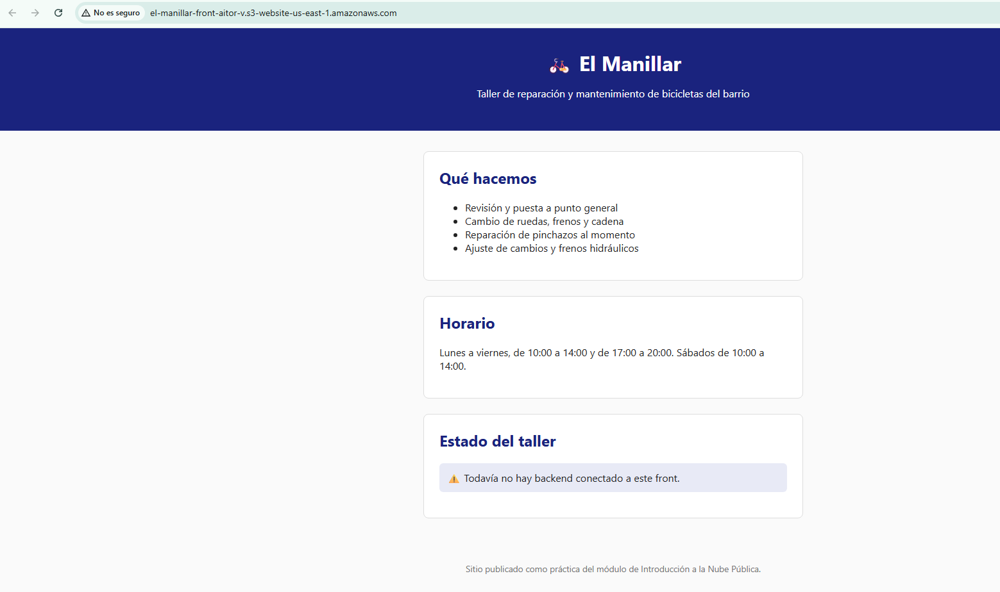

# 🧪 Actividad 1.1: Tu primer despliegue en la nube

!!! warning "Descarga la plantilla"
    📄 [Plantilla 1.1 — Tu primer despliegue en la nube](plantillas/Actividad_1_1_INU_Plantilla.docx){target="_blank" rel="noopener"}

## Contexto

**El Manillar**, un taller de bicicletas de barrio, necesita antes que cualquier otra cosa un sitio donde vivir en internet. Hoy trabajas con su parte más simple: un front estático (HTML, CSS y JavaScript, con un `config.js` de una sola línea) que publicas tal cual, sin backend detrás todavía. Tu tarea de hoy es publicarlo en internet, con una dirección propia, usando AWS por primera vez.

## Qué vas a practicar

- Comprobar tu identidad en AWS y repetir las mismas operaciones básicas por consola y por CLI.
- Publicar contenido estático en Amazon S3 con acceso público de solo lectura, primero explorando las opciones en consola y luego repitiendo el proceso por CLI.
- Comprobar dónde puedes consultar el gasto real de tu laboratorio.
- Clasificar incidentes reales según el modelo de responsabilidad compartida.

## Requisitos previos

Ninguno específico de INU — es la primera sesión del módulo. Necesitas: acceso confirmado a tu AWS Academy Learner Lab, y los ficheros estáticos del front de El Manillar, ya preparados en `recursos/tema1/actividad_1_1/front/` (`index.html`, `style.css`, `script.js`, `config.js`) — el profesor te los entrega, no los programas tú. Repasa antes la sección "⚙️ Modelo de responsabilidad compartida" del apunte de hoy — la vas a necesitar en la Parte B.

---

## Parte A — Publicar el front de El Manillar (guiada)

### Paso 1 — Comprueba tu identidad y compara consola y CLI

Antes de crear nada, confirma como quién estás actuando. Hazlo primero por CLI:

```bash
aws sts get-caller-identity
```

Anota el `Account` y el `Arn` que te devuelve.

Ahora repite el mismo recorrido, pero por consola:

1. Entra en la consola web de AWS con las credenciales de tu Learner Lab.
2. Arriba a la derecha, haz clic en el menú con tu nombre de usuario/rol.
3. Comprueba que el número de cuenta (*Account ID*) que aparece ahí coincide con el `Account` que te ha devuelto la CLI.


Haz lo mismo con una segunda operación — listar qué buckets de S3 existen ya en tu cuenta (probablemente ninguno todavía):

```bash
aws s3 ls
```

Y por consola: en el buscador de servicios de la parte superior, escribe "S3" y entra en el servicio. Comprueba que ves la misma lista (vacía) que te ha devuelto la CLI.

**Comprueba**: que el número de cuenta y el resultado del listado de buckets coinciden entre CLI y consola.
**Captura**: `img/actividad_1_1_paso1.png` (menú de identidad) y la salida de `aws sts get-caller-identity` en tu terminal.

### Paso 2 — Crea y configura el bucket desde la consola

Esta es la primera vez que tocas S3, así que hazlo desde la consola, paso a paso, sin saltarte ninguna pantalla:

1. Dentro del servicio S3, haz clic en **Crear bucket**.
2. Ponle un nombre único (los nombres de bucket son globales en todo AWS, no solo en tu cuenta) — por ejemplo `el-manillar-front-<tu-identificador>`.
3. Deja la región que te indique el Learner Lab.
4. Baja hasta el bloque **Configuración de bloqueo de acceso público a este bucket**. Por defecto viene todo marcado (bloqueado). **Desmarca la casilla superior** ("Bloquear todo el acceso público") y confirma la advertencia que te muestra AWS, escribiendo lo que te pida en el cuadro de confirmación.
5. Haz clic en **Crear bucket**.


6. Entra en el bucket recién creado → pestaña **Propiedades**.
7. Baja hasta **Alojamiento de sitio web estático** → **Editar**.
8. Activa **Habilitar**, y en **Documento de índice** escribe `index.html`.
9. Guarda los cambios.


10. Ve a la pestaña **Permisos** → **Política de bucket** → **Editar**.
11. Pega una política que permita la acción `s3:GetObject` a cualquiera (`"Principal": "*"`) sobre los objetos de tu bucket, y guarda.


!!! warning "Público a propósito, no por descuido"
    Acabas de convertir este bucket en accesible por cualquiera en internet. Es correcto — es justo lo que quieres para un front estático—, pero fíjate en que ha sido una decisión explícita tuya (desactivar un bloqueo que estaba activado por defecto, y pegar tú mismo la política), no un permiso heredado ni un olvido. Vuelve a leer el primero de los seis incidentes del apunte de hoy: un bucket público por error es, con diferencia, el fallo de configuración más repetido en la nube real.

**Documenta tu elección**: el nombre de bucket que has usado es tuyo — no lo copies de un compañero, no va a existir dos veces. Anota qué nombre e identificador has elegido y por qué, para que quien revise la actividad sepa que el despliegue es tuyo y no una copia.

### Paso 3 — Sube el contenido por CLI y verifica

Ahora que el bucket ya existe y está configurado, sube el contenido del front que te ha entregado el profesor por CLI — esta parte sí conviene automatizarla, porque la vas a repetir cada vez que cambie algo del front:

```bash
aws s3 cp recursos/tema1/actividad_1_1/front/ s3://<tu-bucket>/ --recursive
```

Obtén la URL pública del sitio: en la consola, dentro de tu bucket → pestaña **Propiedades** → baja hasta **Alojamiento de sitio web estático**, donde aparece la URL del *endpoint*. Ábrela en el navegador, en una ventana de incógnito para comprobar que no depende de tu sesión iniciada.


**Comprueba**: que la URL carga el front de El Manillar sin haber iniciado sesión en AWS. Es normal que el aviso de estado del taller diga "todavía no hay backend conectado" — no hay ningún backend detrás en esta actividad, la página es puramente estática.
**Captura**: `img/actividad_1_1_paso3.png` (front cargando en el navegador) y la salida del comando `aws s3 cp` mostrando los ficheros subidos.

### Paso 4 — Localiza dónde se controla el gasto de tu laboratorio

!!! warning "Comprueba esto antes de la sesión, no durante"
    Muchos Learner Lab **no** dan acceso a la consola nativa de AWS Budgets / Cost Management — el crédito se controla desde el panel del propio Learner Lab (por ejemplo, en Vocareum o AWS Academy), no desde dentro de la cuenta de AWS. Antes de la clase, comprueba cuál es tu caso.

Si tu laboratorio sí da acceso a Budgets:

1. Busca "Billing and Cost Management" en el buscador de servicios.
2. En el menú lateral, entra en **Budgets** → **Crear presupuesto**.
3. Elige un presupuesto de coste mensual, con un umbral bajo (por ejemplo, 5 $).
4. Añade una alerta por correo cuando se alcance el 80 % del umbral, y crea el presupuesto.

Si no te deja (verás un error de permisos al entrar en Budgets), en su lugar entra en el panel de tu Learner Lab (Vocareum o AWS Academy, fuera de la consola de AWS) y localiza dónde muestra el crédito consumido y el restante.



**Comprueba**: que sabes decir, sin dudar, dónde vas a mirar el gasto real cada vez que termines una sesión — eso es lo que vas a usar en el ritual de apagado del final de cada clase.
**Captura**: `img/actividad_1_1_paso4.png`. Anota también, en una frase, dónde exactamente vas a mirarlo (Budgets o el panel del Learner Lab, según tu caso) — te sirve de recordatorio para el resto del curso.

!!! question "Reflexiona"
    Acabas de publicar un bucket accesible por cualquiera en internet. Si mañana a las tres de la madrugada ese bucket deja de responder, ¿de quién es la responsabilidad — de AWS o tuya? ¿Y si lo que falla es que alguien más ha podido borrar tus ficheros porque la política de acceso era más permisiva de lo necesario? Responde señalando, para cada caso, qué parte exacta de lo que has hecho hoy correspondería a cada lado del reparto.

---

## Parte B — Automatiza sin receta (reto)

Ya has hecho todo el despliegue una vez, a mano, combinando consola y CLI. El reto es reproducirlo **entero por CLI, sin abrir la consola, en un único script versionado en el repositorio** — pero aquí no hay comandos dados: decides tú el orden, qué automatizas y cómo compruebas que el resultado es idéntico al de la Parte A. Un script que falla a la mitad, o que deja el bucket a medio configurar, no vale.

Antes de ejecutarlo, predice: si un compañero de otro equipo intentase crear un bucket con exactamente el mismo nombre que el tuyo, ¿qué crees que pasaría? Escribe tu predicción y compruébala tú mismo, intentando crear un bucket con un nombre que ya uses tú.

Después, retoma los seis incidentes del apunte de hoy (bucket abierto, caída de un CPD, parche sin aplicar, credencial filtrada, disco físico, contraseña débil) y repártelos, uno a uno, entre "responsabilidad de AWS" y "responsabilidad tuya", **justificando cada reparto en una frase** — no basta con la etiqueta, tiene que quedar claro el porqué.

**Comprueba**: que ejecutar tu script desde cero (contra un nombre de bucket distinto) reproduce exactamente el mismo resultado que hiciste a mano en la Parte A, sin ningún paso manual de por medio.
**Captura**: el script completo y su commit en el repositorio; tu predicción sobre el nombre de bucket duplicado y lo que ha ocurrido de verdad; la tabla de los seis incidentes con su reparto y justificación.

---

## Verificación

Para dar por válida la práctica se ejecutará:

```bash
aws s3 ls s3://<tu-bucket>
curl -I http://<tu-bucket>.s3-website-<region>.amazonaws.com
```

Y debe observarse: el bucket con los ficheros del front, y una respuesta `HTTP 200` al pedir la URL pública sin ninguna autenticación. En el repositorio debe existir el script de despliegue de la Parte B, la tabla de los seis incidentes con su justificación, y la documentación de dónde se consulta el crédito del laboratorio.

---

## Criterios de evaluación

**Parte A — hasta 7 puntos**

| Apartado | Puntos |
|---|---|
| Recorrido por consola y CLI documentado (mismas operaciones, ambos caminos) | 1 |
| Front de El Manillar publicado y accesible desde internet | 2 |
| Control del gasto del laboratorio identificado y documentado | 2 |
| Reflexión sobre responsabilidad compartida razonada | 1 |
| Documentación en el repositorio | 1 |

**Parte B — reto, hasta 3 puntos adicionales (máximo total: 10)**

| Apartado | Puntos |
|---|---|
| Script de despliegue por CLI reproduce el resultado sin ningún paso manual | 2 |
| Predicción sobre el bucket duplicado y reparto de los seis incidentes justificado | 1 |

---

## ✅ Cierre

Ya tienes algo tuyo publicado en internet, con una dirección propia, y sabes distinguir qué parte de lo que acabas de montar depende de AWS y qué parte depende de ti. La próxima sesión cambias de escenario y empiezas a diseñar redes virtuales desde cero.
