# 🧪 Actividad 1.1: Tu primer despliegue en la nube

!!! warning "Descarga la plantilla"
    📄 [Plantilla 1.1 — Tu primer despliegue en la nube](plantillas/Actividad_1_1_INU_Plantilla.docx){target="_blank" rel="noopener"}

!!! warning "Descarga los recursos"
    📦 [Recursos de la Actividad 1.1](recursos/actividad_1_1_recursos.zip){target="_blank" rel="noopener"} — lo vas a subir y descomprimir en el Paso 4 de esta actividad.

## Contexto

**El Manillar**, un taller de bicicletas de barrio, necesita antes que cualquier otra cosa un sitio donde vivir en internet. Hoy trabajas con su parte más simple: un front estático (HTML, CSS y JavaScript, con un `config.js` de una sola línea) que publicas tal cual, sin backend detrás todavía. Tu tarea de hoy es publicarlo en internet, con una dirección propia, usando AWS por primera vez.

## Qué vas a practicar

- Acceder por primera vez a tu AWS Academy Learner Lab, desde la invitación del profesor hasta la consola de AWS.
- Comprobar tu identidad en AWS y repetir las mismas operaciones básicas por consola y por CLI.
- Publicar contenido estático en Amazon S3 con acceso público de solo lectura, primero explorando las opciones en consola y luego repitiendo el proceso por CLI.
- Comprobar dónde puedes consultar el gasto real de tu laboratorio.
- Clasificar incidentes reales según el modelo de responsabilidad compartida.

## Requisitos previos

Ninguno específico de INU — es la primera sesión del módulo. Necesitas: la invitación de tu profesor al curso de AWS Academy Learner Lab, recibida por correo antes de la sesión (revísalo con antelación, no el día de clase), y los ficheros estáticos del front de El Manillar (`index.html`, `style.css`, `script.js`, `config.js`) — descárgalos del enlace de arriba, no los programas tú. Repasa antes la sección "⚙️ Modelo de responsabilidad compartida" de los apuntes de hoy — la vas a necesitar en la Parte B.

---

## Parte A — Publicar el front de El Manillar (guiada)

### Paso 1 — Entra en tu Learner Lab por primera vez

1. Espera la invitación de tu profesor al curso "AWS Academy Learner Lab" — llega por correo electrónico, con un enlace para unirte. Sin ella no puedes continuar: pídesela con antelación si no te ha llegado.
2. Entra en AWS Academy: [awsacademy.instructure.com/login/canvas](https://awsacademy.instructure.com/login/canvas).
3. Ve a **Asignaturas**, en el menú lateral, y entra en el curso **AWS Academy Learner Lab** que ha creado tu profesor.

    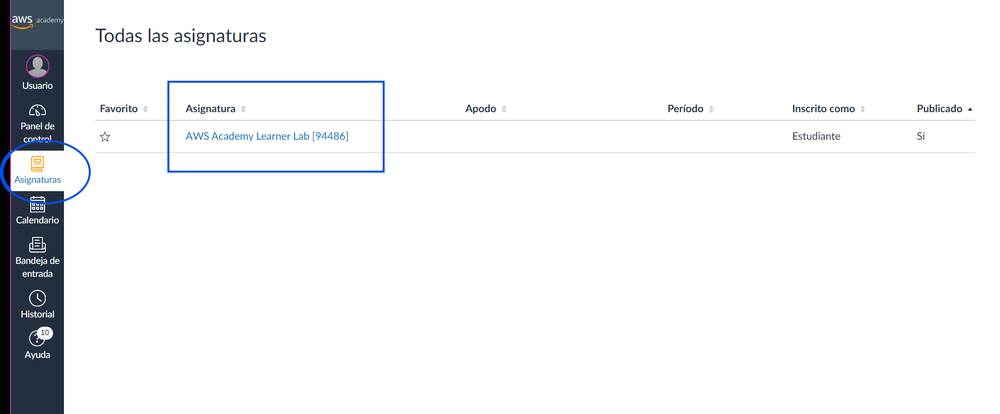

4. Dentro del curso, ve a **Contenidos** → busca **Laboratorio para el alumnado de AWS Academy** → **Lanzamiento del Laboratorio para el alumnado de AWS Academy**.

    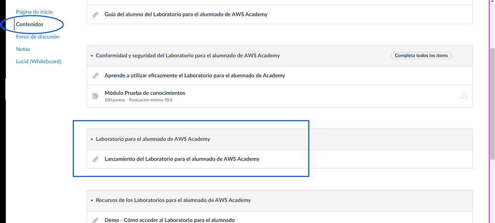

5. La primera vez que entres tendrás que aceptar los términos que te muestre. Verás una pantalla con un punto junto a "AWS" (arriba a la izquierda) en rojo, y los botones **Start Lab** / **End Lab**.

    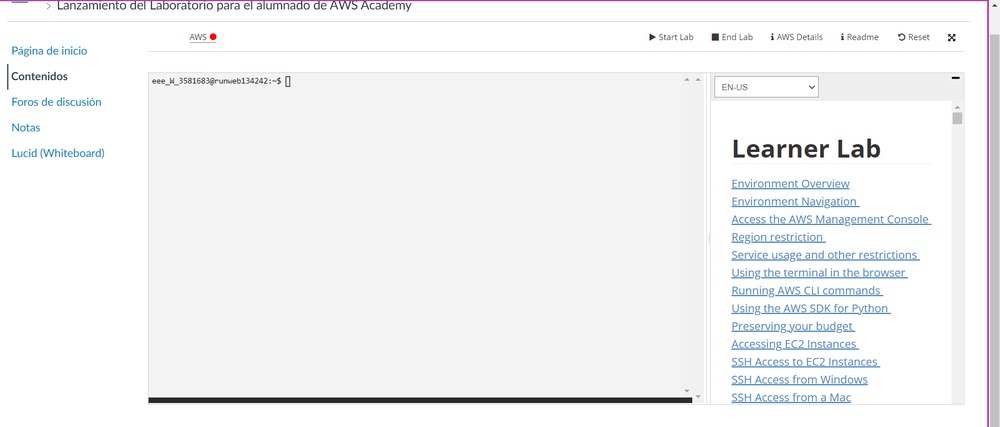

6. Haz clic en **Start Lab**, y espera: el punto pasa de rojo a amarillo mientras se enciende, y a verde cuando el laboratorio ya está listo.

    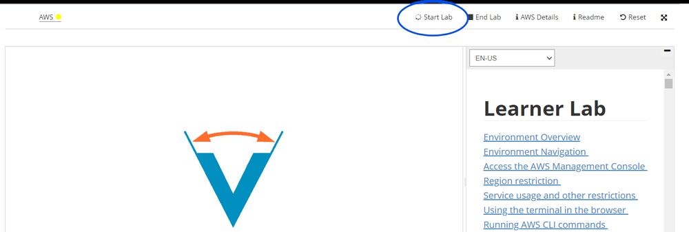

7. Cuando el punto esté en verde, fíjate en dos datos que vas a usar el resto del curso: el contador de crédito consumido (arriba, "Used $X of $50") y el tiempo restante de la sesión (a la derecha, cuenta atrás desde 4 horas). El panel de la izquierda, con un prompt tipo `usuario@runweb...:~$`, también es una terminal, pero no la vas a usar — dentro de la propia consola de AWS tienes una mejor, que ves en el paso siguiente.

    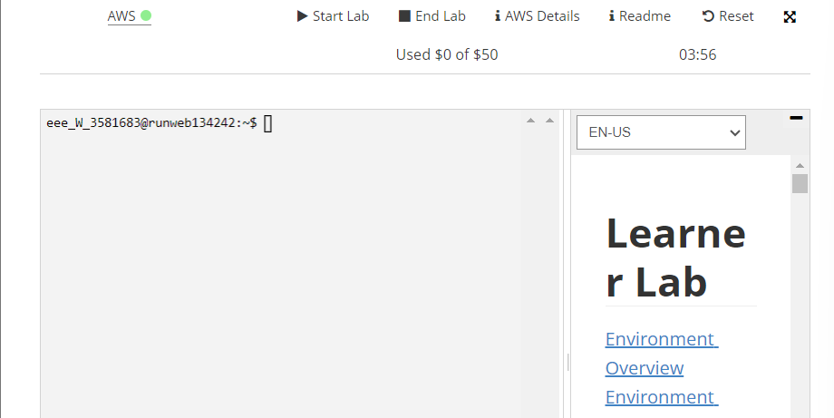

8. Haz clic en el propio enlace **AWS** (junto al punto verde) para entrar en la consola. Vas a ver la página de inicio de la Consola de AWS — desde aquí trabajas el resto de la sesión.

    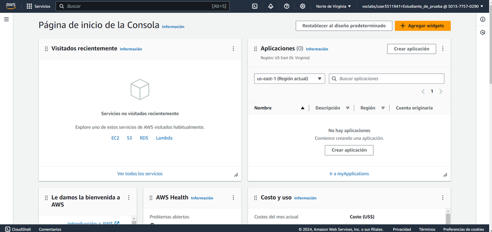

9. En la barra superior de la consola, busca el icono de terminal (`>_`) y ábrelo — es **AWS CloudShell**, una terminal que corre en la nube de AWS, con el CLI ya instalado y autenticado con tu sesión. Vas a usar esta terminal para todos los comandos CLI del módulo, sin instalar ni configurar nada en tu ordenador — importante si trabajas desde un PC del instituto donde no puedes instalar programas.

!!! warning "Comprueba esto antes de la sesión"
    No todos los Learner Lab tienen CloudShell habilitado. Ábrelo con antelación: si el icono no aparece, o da un error de permisos al abrirlo, avisa para resolverlo antes de que el grupo lo necesite.

!!! tip "Si trabajas con tu propio portátil, puedes instalar el CLI en local en vez de usar CloudShell"
    Todo este módulo está pensado para funcionar solo con CloudShell, sin instalar nada — pero si tienes tu propio equipo y prefieres una terminal local, puedes instalar el CLI de AWS tú mismo: descarga el instalador desde [aws.amazon.com/cli](https://aws.amazon.com/cli/) para tu sistema operativo, instálalo, y después ejecuta `aws configure` en tu terminal. Te pedirá `AWS Access Key ID`, `AWS Secret Access Key` y una región — los dos primeros los sacas del botón **AWS Details** de la pantalla de lanzamiento del Paso 6 (contiene también un `aws_session_token`, que tendrás que añadir a mano en `~/.aws/credentials`, porque `aws configure` no pregunta por él). Ten en cuenta que estas credenciales son temporales y caducan con la sesión del laboratorio, así que tendrías que repetir este proceso cada vez. Si no tienes claro qué opción te conviene, usa CloudShell — es la que sigue el resto de esta guía.

**Comprueba**: que el punto junto a "AWS" está en verde, que la página de inicio de la consola carga con normalidad, con tu región y tu usuario (`voclabs/user...`) visibles arriba a la derecha, y que CloudShell abre una terminal funcional.

**Captura**: la página de inicio de tu propia Consola de AWS, con tu usuario (`voclabs/user...`) visible arriba a la derecha — es lo que demuestra que has entrado tú, no una captura genérica.

!!! tip "El punto junto a 'AWS' es tu indicador de estado durante todo el curso"
    - **Rojo**: laboratorio apagado.
    - **Amarillo**: arrancando — espera, no hagas nada todavía.
    - **Verde**: listo para trabajar.

    Vas a repetir este mismo arranque al principio de cada sesión práctica del módulo: el laboratorio no se queda encendido de una clase a otra, así que este Paso 1 lo vas a hacer cada vez, no solo hoy.

### Paso 2 — Comprueba tu identidad y compara consola y CLI

Antes de crear nada, confirma como quién estás actuando. Hazlo primero por CLI:

```bash
aws sts get-caller-identity
```

Anota el `Account` y el `Arn` que te devuelve.

Ahora repite el mismo recorrido, pero por consola:

1. Entra en la consola web de AWS con las credenciales de tu Learner Lab.
2. Arriba a la derecha, haz clic en el menú con tu nombre de usuario/rol.
3. Comprueba que el número de cuenta (*Account ID*) que aparece ahí coincide con el `Account` que te ha devuelto la CLI.

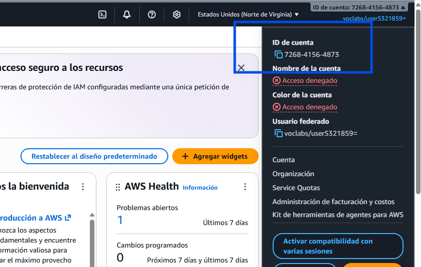

Haz lo mismo con una segunda operación — listar qué buckets de S3 existen ya en tu cuenta (probablemente ninguno todavía):

```bash
aws s3 ls
```

Y por consola: en el buscador de servicios de la parte superior, escribe "S3" y entra en el servicio. Comprueba que ves la misma lista (vacía) que te ha devuelto la CLI.

**Comprueba**: que el número de cuenta y el resultado del listado de buckets coinciden entre CLI y consola.

**Captura**: tu propio menú de identidad en la consola, con tu número de cuenta visible, y la salida de `aws sts get-caller-identity` en tu terminal.

### Paso 3 — Crea y configura el bucket desde la consola

Esta es la primera vez que tocas S3, así que hazlo desde la consola, paso a paso, sin saltarte ninguna pantalla. Esto es lo que vas a tener montado al terminar el paso:

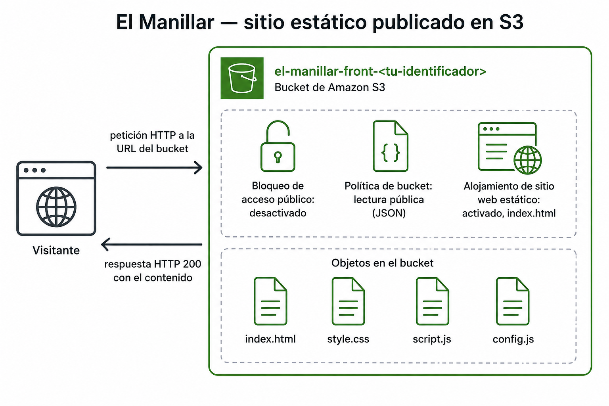

1. Dentro del servicio S3, haz clic en **Crear bucket**.
2. Deja la región que te indique el Learner Lab.
3. En **Tipo de bucket**, deja el valor por defecto (**Uso general**) — vas a trabajar S3 en profundidad, incluidas sus distintas variantes, cuando lo veas de nuevo con calma en el Tema 3.
4. Ponle un nombre único (los nombres de bucket son globales en todo AWS, no solo en tu cuenta) — por ejemplo `el-manillar-front-<tu-identificador>`, donde `<tu-identificador>` es algo tuyo que no se repita, como tu nombre y la inicial de tu apellido (por ejemplo `aitor-v`). Vas a reutilizar el mismo identificador en el resto de actividades del módulo.
5. Baja hasta el bloque **Configuración de bloqueo de acceso público a este bucket**. Por defecto viene todo marcado (bloqueado). **Desmarca la casilla superior** ("Bloquear todo el acceso público"): AWS te avisa de que esto puede hacer público el bucket y sus objetos — marca la casilla de confirmación ("Reconozco que la configuración actual puede provocar que este bucket y los objetos que contiene se vuelvan públicos") para aceptarlo.

    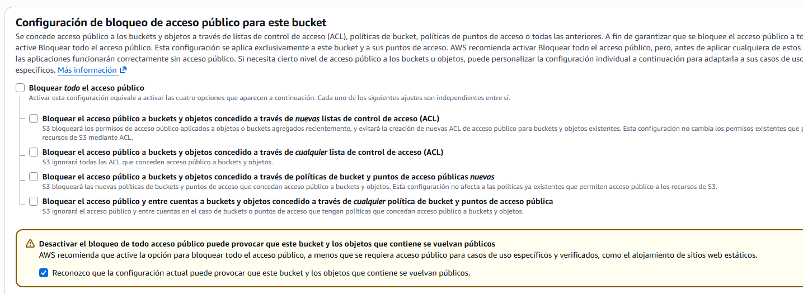

6. Haz clic en **Crear bucket**.
7. Entra en el bucket recién creado → pestaña **Propiedades**.
8. Baja hasta **Alojamiento de sitio web estático** → **Editar**.
9. Activa **Habilitar**, y en **Documento de índice** escribe `index.html`.
10. Guarda los cambios.

    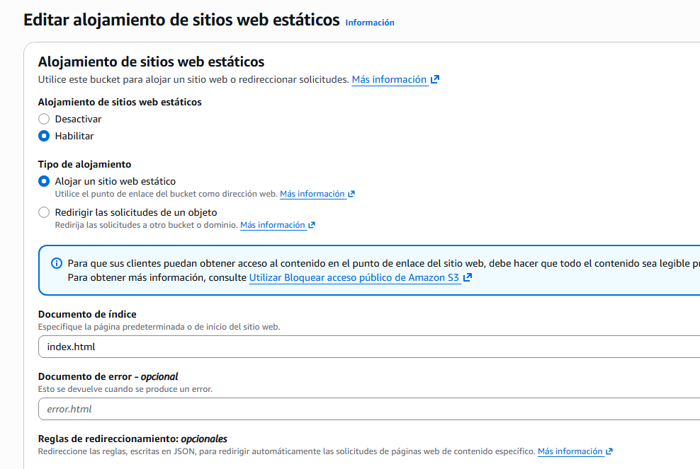

11. Ve a la pestaña **Permisos** → **Política de bucket** → **Editar**.
12. Desbloquear el acceso público (Paso 5) solo abre la puerta — todavía hace falta decir explícitamente quién puede entrar por ella. Pega esta política, sustituyendo `<tu-bucket>` por el nombre real de tu bucket (lo tienes arriba del todo de esta misma pantalla, y también en el listado de buckets de S3 — es el nombre que le pusiste en el Paso 4, por ejemplo `el-manillar-front-aitor-v`), y guarda:

    ```json
    {
      "Version": "2012-10-17",
      "Statement": [
        {
          "Effect": "Allow",
          "Principal": "*",
          "Action": "s3:GetObject",
          "Resource": "arn:aws:s3:::<tu-bucket>/*"
        }
      ]
    }
    ```

    Esto autoriza la acción `s3:GetObject` (leer un objeto) a cualquiera (`"Principal": "*"`), sobre cualquier objeto dentro de tu bucket (el comodín `/*` al final del `Resource`) — ni más permiso del necesario (solo lectura, nunca escritura ni borrado) ni menos (sin esta política, aunque hayas desactivado el bloqueo, nadie podría leer nada todavía).

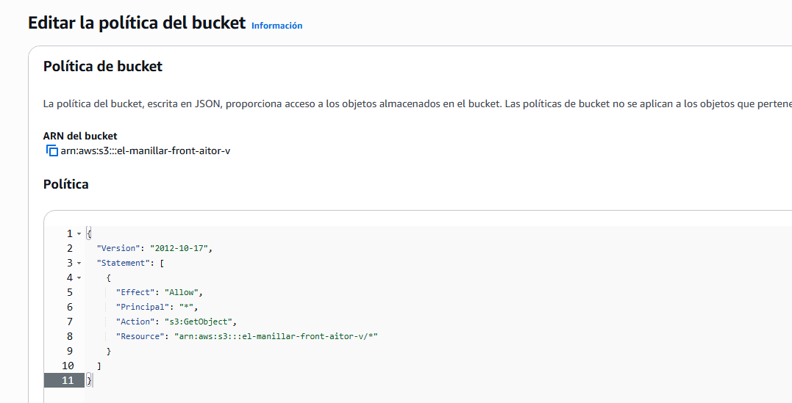

**Comprueba**: que en cada una de las tres pantallas de este paso se ve, sin recortar, algún dato que identifique que es tu propio bucket — no una copia de la imagen de referencia de arriba.

**Captura**: la pantalla de creación con el bloqueo desmarcado, **con el nombre de tu bucket visible en el campo** (no lo recortes); la configuración de alojamiento estático activada, **con el nombre de tu bucket visible en la ruta de navegación superior**; y la política de bucket, **con el `Resource` mostrando el ARN de tu propio bucket**, no el genérico `<tu-bucket>`.

!!! warning "Público a propósito, no por descuido"
    Acabas de convertir este bucket en accesible por cualquiera en internet. Es correcto — es justo lo que quieres para un front estático—, pero fíjate en que ha sido una decisión explícita tuya (desactivar un bloqueo que estaba activado por defecto, y pegar tú mismo la política), no un permiso heredado ni un olvido. Vuelve a leer el primero de los seis incidentes de los apuntes de hoy: un bucket público por error es, con diferencia, el fallo de configuración más repetido en la nube real.

**Documenta tu elección**: el nombre de bucket que has usado es tuyo — no lo copies de un compañero, no va a existir dos veces. Anota qué nombre e identificador has elegido y por qué, para que quien revise la actividad sepa que el despliegue es tuyo y no una copia.

### Paso 4 — Sube el contenido por CLI y verifica

Ahora que el bucket ya existe y está configurado, sube por CLI el contenido del front que te has descargado — esta parte sí conviene automatizarla, porque la vas a repetir cada vez que cambie algo del front.

Tu CloudShell del Paso 1 no tiene el zip que te descargaste a tu ordenador — súbelo primero: en CloudShell, **Actions → Upload file**, selecciona `actividad_1_1_recursos.zip`, y luego descomprímelo:

```bash
unzip actividad_1_1_recursos.zip
```

Esto recrea exactamente la carpeta `recursos/tema1/actividad_1_1/front/` dentro de tu CloudShell, con los mismos cuatro ficheros. Ahora sí, sube el contenido al bucket:

```bash
aws s3 cp recursos/tema1/actividad_1_1/front/ s3://<tu-bucket>/ --recursive
```

Obtén la URL pública del sitio: en la consola, dentro de tu bucket → pestaña **Propiedades** → baja hasta **Alojamiento de sitio web estático**, donde aparece la URL del *endpoint*. Ábrela en el navegador, en una ventana de incógnito para comprobar que no depende de tu sesión iniciada.


**Comprueba**: que la URL carga el front de El Manillar sin haber iniciado sesión en AWS. Es normal que el aviso de estado del taller diga "todavía no hay backend conectado" — no hay ningún backend detrás en esta actividad, la página es puramente estática.

**Captura**: tu propio front de El Manillar cargando en el navegador, **sin recortar la barra de direcciones** (para que se vea el nombre de tu bucket en la URL), y la salida del comando `aws s3 cp` mostrando los ficheros subidos con la ruta `s3://<tu-bucket>/` completa.

### Paso 5 — Localiza dónde se controla el gasto de tu laboratorio

!!! warning "Comprueba esto antes de la sesión, no durante"
    Muchos Learner Lab **no** dan acceso a la consola nativa de AWS Budgets / Cost Management — el crédito se controla desde el panel del propio Learner Lab (por ejemplo, en Vocareum o AWS Academy), no desde dentro de la cuenta de AWS. Antes de la clase, comprueba cuál es tu caso.

Si tu laboratorio sí da acceso a Budgets:

1. Busca "Administración de facturación y costos" en el buscador de servicios.
2. En el menú lateral, despliega **Presupuestos y planificación** → **Presupuestos** → **Crear presupuesto** (o, más rápido, usa el atajo **Crear un presupuesto** que aparece directamente en la página de inicio, dentro de "Acciones recomendadas").
3. En **Elegir el tipo de presupuesto**, deja **Uso de una plantilla (simplificada)** y elige la plantilla **Presupuesto de costos mensual**.
4. Dale un nombre, pon un importe bajo (por ejemplo, 5 $), e indica tu correo como destinatario. Esta plantilla no te deja elegir el umbral de la alerta — ya trae fijas tres notificaciones: al 85 % del gasto real, al 100 % del gasto real, y al 100 % del gasto previsto. Crea el presupuesto.

Si no te deja (verás un error de permisos al entrar en Budgets), en su lugar entra en el panel de tu Learner Lab (Vocareum o AWS Academy, fuera de la consola de AWS) y localiza dónde muestra el crédito consumido y el restante.

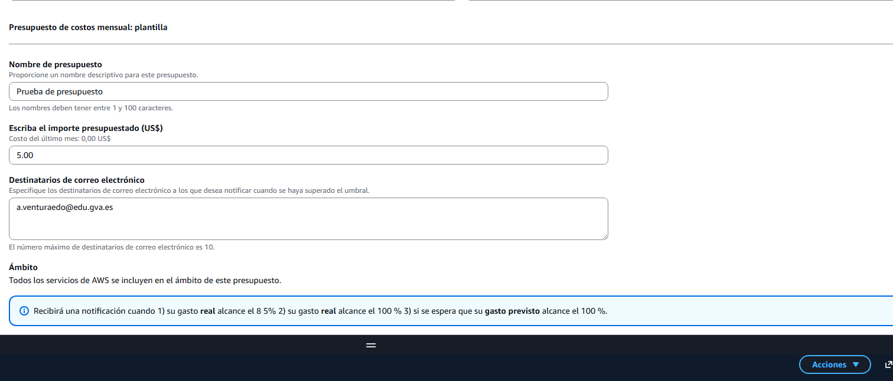

**Comprueba**: que sabes decir, sin dudar, dónde vas a mirar el gasto real cada vez que termines una sesión — eso es lo que vas a usar en el ritual de apagado del final de cada clase.

**Captura**: tu propio presupuesto con alerta configurado, o el panel de crédito del Learner Lab, según tu caso, **con tu número de cuenta o el nombre de tu laboratorio visible en la misma pantalla**. Anota también, en una frase, dónde exactamente vas a mirarlo — te sirve de recordatorio para el resto del curso.

!!! question "Reflexiona"
    Acabas de publicar un bucket accesible por cualquiera en internet. Si mañana a las tres de la madrugada ese bucket deja de responder, ¿de quién es la responsabilidad — de AWS o tuya? ¿Y si lo que falla es que alguien más ha podido borrar tus ficheros porque la política de acceso era más permisiva de lo necesario? Responde señalando, para cada caso, qué parte exacta de lo que has hecho hoy correspondería a cada lado del reparto.

---

## Parte B — Pon a prueba tu despliegue (reto)

Ya has hecho el despliegue una vez, a mano, combinando consola y CLI. Hoy el reto no es automatizarlo — es ponerlo a prueba y entenderlo mejor de lo que lo entendías al terminar la Parte A.

**Rompe tu propio despliegue, y repáralo**: vuelve a activar el bloqueo de acceso público completo sobre tu bucket (el mismo interruptor que desactivaste en el Paso 3), sin tocar nada más, y comprueba qué le pasa a tu URL pública. Anota el error exacto que ves — código y mensaje, no solo "no funciona". Después, sin borrar la política de bucket que ya tenías, desactiva de nuevo el bloqueo, y confirma que el sitio vuelve a responder exactamente igual que antes.

**Calcula cuánto cuesta mantenerlo un año entero**: con la [calculadora de precios oficial de AWS](https://calculator.aws), estima el coste mensual y anual de mantener este bucket funcionando permanentemente — el almacenamiento de los cuatro ficheros y la transferencia de salida estimada para un tráfico moderado (por ejemplo, 1000 visitas al mes). No hace falta tener nada desplegado para usar la calculadora: introduces los números y ella calcula.

Antes de probarlo, predice: si un compañero de otro equipo intentase crear un bucket con exactamente el mismo nombre que el tuyo, ¿qué crees que pasaría? Escribe tu predicción y compruébala tú mismo, intentando crear un bucket con un nombre que ya uses tú.

Después, aplica el mismo criterio a seis incidentes nuevos — distintos a los que aparecen en los apuntes de hoy, para que no puedas copiar una respuesta ya resuelta — y repártelos, uno a uno, entre "responsabilidad de AWS" y "responsabilidad tuya", **justificando cada reparto en una frase** — no basta con la etiqueta, tiene que quedar claro el porqué:

1. Un grupo de seguridad (firewall de la instancia) se configura bloqueando por error el puerto que necesita el front, y la web deja de cargar.
2. Una zona de disponibilidad entera deja de responder por un fallo de red interno del proveedor.
3. Un bucket de backups queda borrado sin remedio porque nunca se activó el versionado.
4. Una vulnerabilidad sin parchear en el hipervisor afecta a varios clientes que comparten el mismo host físico.
5. Una clave de acceso sigue activa meses después de que la persona que la usaba dejara el equipo, y alguien ajeno la utiliza para entrar.
6. Un servicio deja de responder durante un pico de tráfico porque nadie configuró el escalado automático, y la aplicación se cae por sobrecarga.

**Comprueba**: que el bucket roto muestra un error real (no una suposición) y que, tras repararlo, vuelve a responder exactamente igual que antes; que tu estimación de coste está desglosada por partida (almacenamiento y transferencia por separado), no es un número suelto.

**Captura**: el error exacto del bucket bloqueado, y la confirmación de que vuelve a funcionar tras repararlo; el desglose de coste mensual y anual de la calculadora; tu predicción sobre el nombre de bucket duplicado y lo que ha ocurrido de verdad; la tabla de los seis incidentes con su reparto y justificación.

---

## Criterios de evaluación

**Parte A — hasta 7 puntos**

| Apartado | Puntos |
|---|---|
| Recorrido por consola y CLI documentado (mismas operaciones, ambos caminos) | 1 |
| Front de El Manillar publicado y accesible desde internet | 3 |
| Control del gasto del laboratorio identificado y documentado | 2 |
| Reflexión sobre responsabilidad compartida razonada | 1 |

**Parte B — reto, hasta 3 puntos adicionales (máximo total: 10)**

| Apartado | Puntos |
|---|---|
| Bucket roto y reparado, documentado con el error real y la confirmación de que vuelve a funcionar | 1 |
| Estimación de coste mensual y anual desglosada por partida | 1 |
| Predicción sobre el bucket duplicado y reparto de los seis incidentes justificado | 1 |

---

## ✅ Cierre

Ya tienes algo tuyo publicado en internet, con una dirección propia, y sabes distinguir qué parte de lo que acabas de montar depende de AWS y qué parte depende de ti. La próxima sesión cambias de escenario y empiezas a diseñar redes virtuales desde cero.

!!! tip "Antes de salir: valora si sigues necesitando el bucket"
    Nada del resto del módulo depende de que `el-manillar-front-<tu-identificador>` siga existiendo. Su coste es prácticamente nulo (cuatro ficheros diminutos), así que no es urgente, pero es buena costumbre no dejar recursos públicos abiertos sin necesidad — si quieres borrarlo, primero tienes que vaciarlo de objetos (S3 no deja borrar un bucket con contenido dentro).
