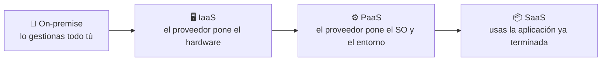
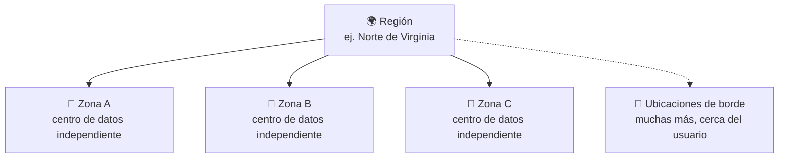

<a id="primer-contacto-aws"></a>

# 🧩 1. Primer contacto profesional con AWS

---

Llevas años usando la nube sin pensarlo: cada vez que abres el correo, ves una serie o guardas una foto en el móvil, hay máquinas de otra empresa haciendo el trabajo por ti. Lo que cambia hoy es el punto de vista — hasta ahora has sido cliente de la nube; a partir de esta sesión eres tú quien la pone en marcha para otra persona. Vas a moverte por AWS por primera vez, entender qué tipo de servicio estás usando en cada momento, y terminar la sesión con algo tuyo publicado en internet, con dirección propia y accesible para cualquiera: el sitio estático de un taller de bicicletas de barrio, una página informativa sencilla (HTML, CSS y JavaScript) que vas a alojar directamente en AWS.

---

## 🧭 Repaso de modelos de servicio y despliegue

Antes de entrar en AWS conviene tener clara una pregunta: cuando alguien dice "esto está en la nube", ¿qué es exactamente lo que se ha delegado en otro? No es una pregunta binaria — hay grados, y cada grado tiene un nombre.

| Modelo | Qué gestiona el proveedor | Qué gestionas tú | Ejemplo |
|---|---|---|---|
| **Local** (*on-premise*) | Nada | Todo: edificio, hardware, red, sistema operativo, aplicación | Un servidor propio en tu empresa |
| **IaaS** (*Infrastructure as a Service*) | Hardware, red, centro de datos | Sistema operativo, software y sus actualizaciones | Una máquina virtual alquilada |
| **PaaS** (*Platform as a Service*) | Hardware + sistema operativo + entorno de ejecución | Solo tu código | Un lugar donde subes tu app Java y arranca sola |
| **SaaS** (*Software as a Service*) | Todo, incluida la aplicación | Nada — solo la usas | Gmail |

Fíjate en la progresión: de izquierda a derecha delegas cada vez más, y de arriba abajo controlas cada vez menos. SaaS es justo el extremo del que partías como usuario antes de esta sesión.

!!! example "El mismo problema, cuatro formas de resolverlo"
    Imagina que necesitas una base de datos para un proyecto. *On-premise*: compras un servidor, instalas PostgreSQL, y si se cae un disco duro, lo cambias tú. IaaS: alquilas una máquina virtual y haces exactamente lo mismo, pero el hardware ya no es tuyo. PaaS: contratas una base de datos ya gestionada (la verás en el Tema 3) — no instalas nada, solo te conectas. SaaS: usarías directamente una aplicación que ya incluye su propia base de datos por dentro, sin que tú la veas nunca.

Cuanto más subes en esta escalera, menos controlas — pero también menos trabajo operativo cargas encima. Ese equilibrio entre control y comodidad es la primera idea que vas a manejar todo el módulo.



Los servicios de AWS que vas a usar en el módulo se reparten por toda esta escalera: una máquina virtual (EC2) es IaaS, una base de datos gestionada (RDS) es PaaS, una función que se ejecuta sola sin que tú administres ningún servidor (Lambda) empuja aún más hacia el extremo gestionado.

Pero delegar por delegar no explica por qué una empresa decide subir esta escalera. Lo hace porque el extremo *on-premise* tiene problemas concretos, no solo "más trabajo": si quieres más capacidad, tienes que comprar hardware y esperar semanas a que llegue; si compras de más para cubrir un pico puntual (la campaña de Navidad de una tienda, por ejemplo), ese hardware queda a medio usar el resto del año; y si necesitas llegar a otro continente, montar un centro de datos ahí son meses de obra, no una decisión de una tarde. La nube resuelve las tres cosas a la vez: pides capacidad y la tienes lista en minutos, pagas solo la que usas en cada momento, y puedes desplegar en otra región del planeta sin construir nada.

!!! example "El mismo negocio, dos decisiones distintas"
    Una tienda que espera un pico de tráfico solo en Navidad, si compra servidores propios, los tiene sobredimensionados y a medio usar los otros once meses del año — ha pagado por una capacidad que casi nunca necesita. En la nube, escala hacia arriba solo esas semanas y vuelve a bajar después, pagando en cada momento por lo que de verdad está usando. Vas a construir exactamente este mecanismo de escalado en el Tema 4.

No hay un modelo "mejor" en la escalera, y tampoco la nube es gratis ni sustituye el criterio técnico — lo que cambia es qué compras (capacidad bajo demanda, no hardware fijo) y cuándo pagas por ello.

---

## 🧩 Catálogo de servicios por categorías

AWS ofrece varios cientos de servicios, y la consola puede resultar abrumadora la primera vez que la abres. La buena noticia es que casi todos encajan en un puñado de categorías, y ese mapa mental te va a servir el resto del curso para no perderte:

| Categoría | Para qué sirve | Ejemplos que verás en el módulo |
|---|---|---|
| 💻 Cómputo | Ejecutar código: máquinas virtuales, contenedores, funciones | EC2 (Tema 2), Lambda (Tema 6), ECS (Tema 6) |
| 🗄️ Almacenamiento | Guardar ficheros, discos y copias | S3 (hoy mismo), EBS (Tema 3) |
| 🗃️ Bases de datos | Guardar datos estructurados, gestionados por el proveedor | RDS (Tema 3) |
| 🌐 Redes y entrega de contenido | Conectar todo lo anterior, y acercarlo al usuario | VPC (Tema 2), CloudFront, Route 53 (Tema 4) |
| 🔐 Seguridad, identidad y cumplimiento | Quién puede hacer qué | IAM (hoy y Tema 5) |
| 📊 Gestión y gobierno | Vigilar, medir y controlar el gasto | CloudWatch, Budgets (hoy mismo) |

!!! tip "No hace falta memorizar el catálogo entero"
    Con este mapa te basta por ahora: cuando en las próximas sesiones aparezca un servicio nuevo, ubícalo primero en una de estas seis categorías — te va a costar menos entender qué hace si ya sabes para qué familia de problema existe.

Piensa en él como el catálogo de un supermercado grande: no necesitas conocer cada producto de memoria, necesitas saber en qué pasillo buscar cuando te haga falta uno. Hoy vas a usar concretamente dos: **S3** (almacenamiento de objetos) para publicar el front del taller de bicicletas, e **IAM** de forma indirecta, porque el rol que ya tienes asignado en el Learner Lab es justamente lo que decide qué puedes y qué no puedes hacer en el resto de servicios.

En S3, cada fichero que subes es un **objeto**, y los objetos se agrupan dentro de un **bucket** — un contenedor con un nombre único en todo AWS (no solo en tu cuenta), algo así como una carpeta de primer nivel a la que luego le das forma: puede quedar privada, o —como vas a hacer hoy— servir contenido web público.

---

## 🔧 Regiones, zonas de disponibilidad y ubicaciones de borde

AWS no es "un centro de datos en algún sitio" — es una infraestructura repartida por el mundo entero, organizada en tres niveles que vas a encontrar constantemente en el resto del módulo:

- **Región**: una zona geográfica grande y completamente independiente de las demás (por ejemplo, *Norte de Virginia* o *Irlanda*). Cada región tiene su propio conjunto completo de servicios, y por defecto los datos de una región no salen de ella. Vas a trabajar siempre en la misma región durante todo el curso, la que indique el Learner Lab.
- **Zona de disponibilidad** (*Availability Zone*, AZ): dentro de una región hay varias zonas de disponibilidad — en la práctica, varios centros de datos físicamente separados entre sí (con su propia electricidad, refrigeración y conexión de red), pero conectados por fibra de muy baja latencia. Si una zona entera se cae por un fallo eléctrico o una catástrofe local, las demás siguen funcionando. Esta idea es la base de todo lo que vas a construir en el Tema 4 sobre alta disponibilidad: repartir tu aplicación entre dos zonas en vez de dejarla en una sola.
- **Ubicación de borde** (*Edge Location*): puntos mucho más numerosos y repartidos, pensados no para ejecutar tu aplicación entera, sino para acercar contenido al usuario final — una copia en caché cerca de donde vive, para que no tenga que viajar hasta la región. Los volverás a ver en el Tema 4, cuando publiques una aplicación detrás de una CDN.



!!! info "¿Por qué te importa esto ya, si hoy solo publicas un front estático?"
    Porque el propio bucket de S3 que vas a crear hoy vive en una región concreta, y la URL pública que te va a dar depende de esa región. No hace falta que hoy elijas nada de esto de forma consciente — el Learner Lab ya trae una región fijada —, pero vas a volver a esta idea cada sesión: "¿en qué región estoy, y qué significa eso para la disponibilidad de lo que estoy construyendo?".

---

## ⚙️ Modelo de responsabilidad compartida

Aquí llega la pregunta que de verdad importa cuando delegas infraestructura en otra empresa: si algo falla, ¿de quién es la culpa? AWS responde con un principio que vas a aplicar en incidentes reales dentro de un momento: **la seguridad y el correcto funcionamiento se reparten entre AWS y tú, y la frontera exacta depende del servicio.**

| | Responsabilidad de AWS ("seguridad *de* la nube") | Responsabilidad tuya ("seguridad *en* la nube") |
|---|---|---|
| Qué cubre | Centros de datos, hardware físico, red global, virtualización | Tus datos, tu configuración, tus permisos, tu código |
| Ejemplos | Que un disco físico no falle sin redundancia, que el edificio tenga corriente, que el hipervisor esté parcheado | Que tu bucket de S3 no sea público por error, que tus credenciales no acaben en un repositorio, que actualices el software que tú instalas dentro de una máquina virtual |
| Cambia según el servicio | — | Cuanto más gestionado es un servicio (recuerda la escalera IaaS→PaaS→SaaS), menos responsabilidad operativa cargas tú |

La frontera no es fija: en una máquina virtual (IaaS) tú respondes del sistema operativo y de todo lo que instalas dentro; en un servicio totalmente gestionado, AWS asume buena parte de eso. Pero hay una cosa que **nunca** deja de ser tuya, sea cual sea el servicio: la configuración de acceso a tus propios datos. Un bucket de S3 abierto al mundo entero no es un fallo de AWS — es una decisión de configuración, y esa decisión es tuya.

!!! example "Seis incidentes, ¿de quién es la culpa?"
    Practica el criterio antes de la actividad, sin mirar la respuesta todavía:

    1. Un bucket de almacenamiento queda accesible públicamente por un permiso mal puesto.
    2. Un centro de datos entero se cae por un corte eléctrico regional.
    3. Una aplicación no aplica un parche de seguridad conocido desde hace meses.
    4. Una credencial de acceso se filtra porque estaba escrita dentro del código subido a un repositorio público.
    5. Un disco físico del proveedor falla sin que existiera redundancia suficiente.
    6. Una cuenta se compromete porque su contraseña era `123456`.

    Fíjate en el patrón: los casos 2 y 5 son sobre infraestructura física — terreno de AWS. Los casos 1, 3, 4 y 6 son sobre configuración, código y credenciales — terreno tuyo, aunque ocurran "dentro" de la nube. Vas a repartir estos seis incidentes de verdad, con justificación, en la Parte B de la actividad de hoy.

---

## 📊 Consola frente a CLI

Hay dos formas de decirle a AWS lo que quieres: la **consola** (la interfaz web, con menús y botones) y la **CLI** (*Command Line Interface*, una herramienta de terminal que traduce comandos de texto en las mismas llamadas que usa la consola por debajo). No son dos herramientas independientes — son dos caras de la misma **API** (*Application Programming Interface*, el conjunto de operaciones que AWS expone para crear y gestionar cada servicio): todo lo que haces clicando, existe también como comando, y viceversa.

| | Consola | CLI |
|---|---|---|
| Curva de aprendizaje | Baja: ves las opciones, no hace falta recordar sintaxis | Más alta: hay que conocer el comando y sus parámetros |
| Velocidad para una operación puntual | Rápida si sabes dónde está el menú | Rápida si ya conoces el comando |
| Repetible / documentable | No de forma nativa (tendrías que fotografiar la pantalla) | Sí: un comando se puede guardar, versionar y volver a ejecutar exactamente igual |
| Ideal para | Explorar, entender qué opciones existen, primeras veces | Automatizar, repetir, integrar en scripts o pipelines |

!!! tip "Por qué vas a usar las dos, no solo una"
    La consola es donde vas a aprender qué existe la primera vez que toques un servicio nuevo — te enseña las opciones sin que tengas que memorizar nada. La CLI es la que vas a necesitar en cuanto quieras repetir ese mismo despliegue sin volver a clicar los mismos veinte botones. Hoy vas a hacer el mismo recorrido por las dos, para comparar; a partir de la Parte B de la actividad, vas a apoyarte solo en la CLI.

Antes de lanzar tu primer comando, hay una pregunta que conviene resolver: ¿como quién estás actuando? Eso lo dice tu identidad, y la puedes comprobar con un único comando:

```bash
aws sts get-caller-identity
```

```json
{
    "UserId": "AROAEXAMPLE:usuario",
    "Account": "123456789012",
    "Arn": "arn:aws:sts::123456789012:assumed-role/voclabs/usuario"
}
```

La respuesta viene en formato **JSON** (*JavaScript Object Notation*): datos organizados en pares `"clave": "valor"` entre llaves, el formato que vas a ver constantemente en el resto del módulo cada vez que AWS te devuelva información estructurada. Fíjate en el campo `Arn` (*Amazon Resource Name*, el identificador único de cualquier recurso en AWS): no dice que seas un usuario normal con su propio nombre de usuario y contraseña — dice `assumed-role`, un **rol asumido**.

!!! tip "Por qué un rol y no un usuario"
    En el Learner Lab no existen usuarios ni roles que tú crees: hay uno ya preparado de antemano, con exactamente los permisos que necesitas para el módulo, ni uno más. Es la razón por la que en este curso vas a *leer* y *corregir* políticas de permisos en vez de crear usuarios desde cero — lo verás en detalle en el Tema 5.

---

## 🌐 Funcionamiento y límites del Learner Lab

El entorno donde vas a trabajar todo el curso no es una cuenta de AWS normal — es un **AWS Academy Learner Lab**, una cuenta de laboratorio con reglas propias que conviene tener claras desde el primer día:

| Regla | Qué significa en la práctica |
|---|---|
| Sesión de 4 horas | Cuando el temporizador llega a cero, el laboratorio se apaga solo. Toda práctica del módulo está pensada para arrancar y terminar dentro de una única sesión. |
| Crédito finito y compartido | Cuesta dinero de verdad, y agotarlo antes de tiempo afecta a todo el grupo. De ahí el **ritual de costes**: los últimos cinco minutos de cada clase, revisar el gasto, apagar lo que no haga falta y anotar el recurso más caro. |
| Sin usuarios ni roles propios | El rol que tienes es preasignado, con permisos ya decididos para el módulo. Si un comando falla por permisos, casi nunca es "algo que has roto" — es una operación que el laboratorio no permite a propósito. |
| Regiones y servicios restringidos | No todo lo de AWS está disponible en el laboratorio. Antes de usar un servicio nuevo, comprueba que existe en tu región de trabajo. |

!!! danger "Apagar antes de salir no es opcional"
    Un recurso que dejas encendido "sin querer" el jueves no espera a la semana que viene para seguir consumiendo crédito — sigue gastando de fondo todo ese tiempo. El ritual de apagado de los últimos cinco minutos de cada sesión es la norma más importante del módulo, y lo vas a repetir después de cada actividad práctica.

Con esto ya tienes el terreno de juego: sabes qué tipo de servicios existen, cómo se organizan geográficamente, quién responde de qué, cómo hablarle a AWS de dos formas distintas y qué límites tiene tu laboratorio. En la Actividad 1.1 vas a aterrizar todo esto: recorrer consola y CLI en paralelo, publicar el front de un taller de bicicletas de barrio en S3 con una dirección propia accesible desde internet, y montar tu primer presupuesto con alerta.

---

## ✅ Ideas clave

??? tip "Abrir resumen"

    - La nube se mueve en una escalera de menos a más gestionado: *on-premise* → IaaS → PaaS → SaaS. Cuanto más subes, menos controlas, pero menos trabajo operativo cargas.
    - Frente a un sistema tradicional, la nube cambia inversión inicial por pago por uso, y meses de espera por minutos de aprovisionamiento — no es solo "más cómodo", es un modelo económico distinto.
    - Los servicios de AWS se agrupan en un puñado de categorías (cómputo, almacenamiento, bases de datos, redes, seguridad, gestión) — te sirve de mapa para todo el módulo, no hace falta memorizar el catálogo entero.
    - Región (zona geográfica independiente) → zona de disponibilidad (centros de datos separados dentro de una región) → ubicación de borde (mucho más numerosas, cerca del usuario). Es la base de la alta disponibilidad que verás en el Tema 4.
    - Modelo de responsabilidad compartida: AWS responde de la infraestructura física ("seguridad *de* la nube"), tú respondes de tus datos, tu configuración y tus credenciales ("seguridad *en* la nube").
    - Consola y CLI son dos caras de la misma API: la consola para explorar la primera vez, la CLI para repetir y automatizar.
    - En el Learner Lab no hay usuarios ni roles que tú crees — hay un rol preasignado (`assumed-role`), verificable con `aws sts get-caller-identity`.
    - El Learner Lab tiene sesión de 4 horas y crédito finito y compartido — de ahí nace el ritual de apagar y anotar el gasto al final de cada sesión.

Con esto ya tienes las piezas para la Actividad 1.1 — Tu primer despliegue en la nube.
