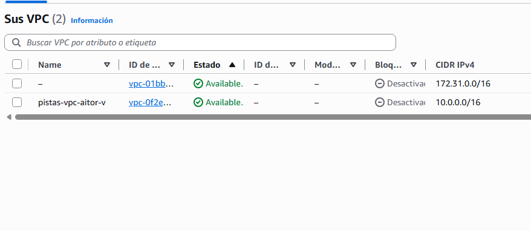
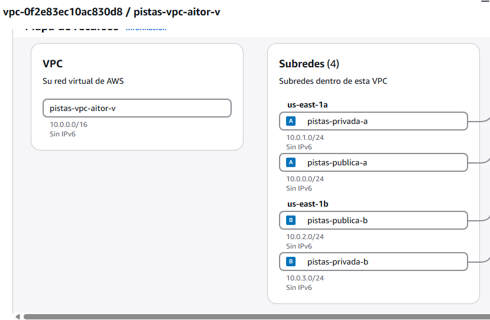
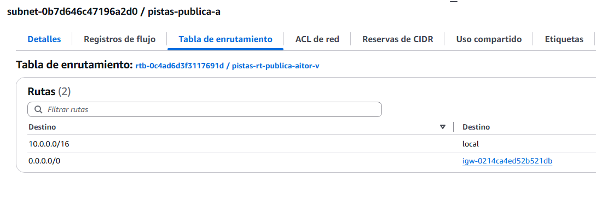
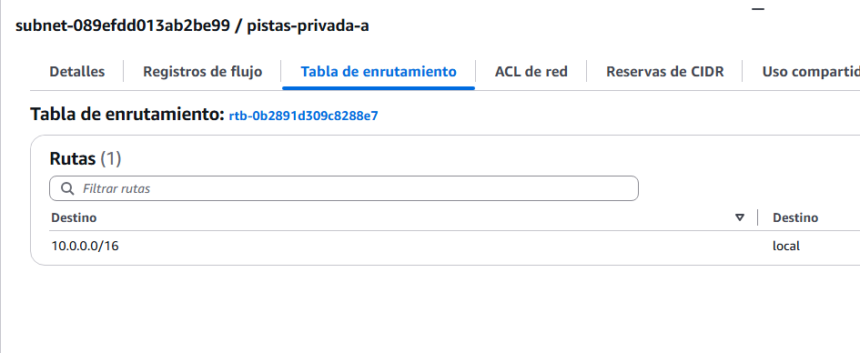

# 🧪 Actividad 2.1: Tu propia VPC en dos zonas

!!! warning "Descarga la plantilla"
    📄 [Plantilla 2.1 — Tu propia VPC en dos zonas](plantillas/Actividad_2_1_INU_Plantilla.docx){target="_blank" rel="noopener"}

## Contexto

Vas a diseñar la red que alojará una aplicación de reserva de pistas deportivas municipales — es solo el escenario de ambientación de la sesión, no hace falta que construyas esa aplicación. Necesitaría dos partes: una a la que cualquier vecino entre desde su navegador para reservar pista, y otra —con los datos de cada reserva— sin ningún motivo para ser alcanzable desde internet.

Meter ambas en una única subred pública las expondría por igual, sin necesidad. Hoy diseñas y construyes la red que las separa: dos zonas de disponibilidad, cada una con su subred pública y su subred privada.

## Qué vas a practicar

- Entender cómo se reparte un rango CIDR `/16` en subredes de tamaño fijo, públicas y privadas, para dos zonas de disponibilidad.
- Construir una VPC en consola siguiendo exactamente el reparto indicado.
- Verificar qué conectividad existe de verdad, y comprobar que la que no debería existir, efectivamente no existe.

## Requisitos previos

Los apuntes de esta sesión — [«Diseño de la red virtual»](vpc-diseno.md). No necesitas nada de sesiones anteriores: hoy construyes la red desde cero.

!!! warning "Cómo hacer las capturas"
    En cada captura tiene que verse con claridad lo que se pide (direcciones IP, CIDR, nombres de subred, salida de los comandos...) — una captura recortada, borrosa o con la información clave fuera de encuadre no sirve como evidencia. Además, tiene que verse algo que identifique que los recursos son tuyos y que la práctica la has hecho tú: tu identificador en el nombre de los recursos (`pistas-vpc-<tu-identificador>`), o la IP y el ID de instancia concretos que hayas usado — no una captura genérica que podría ser de cualquier otro alumno.

---

## Parte A — Diseñar y construir la VPC (guiada)

### Paso 1 — Entiende el reparto antes de construir

Hoy no diseñas tu propio reparto de subredes desde cero — sigues uno ya decidido, el mismo para todo el grupo, para que sea más fácil detectar errores en clase y comparar resultados. Partiendo del rango `10.0.0.0/16` de la VPC, lo divides en cuatro subredes `/24` del mismo tamaño (256 direcciones cada una, de sobra para cualquier práctica de este módulo) — una pública y una privada en cada una de las dos zonas de disponibilidad, siguiendo el método FLSM (subredes de tamaño fijo):

| Subred | CIDR | Zona | Tipo |
|---|---|---|---|
| pistas-publica-a | `10.0.0.0/24` | A | Pública |
| pistas-privada-a | `10.0.1.0/24` | A | Privada |
| pistas-publica-b | `10.0.2.0/24` | B | Pública |
| pistas-privada-b | `10.0.3.0/24` | B | Privada |

Fíjate en el patrón: cada subred ocupa un `/24` consecutivo, incrementando el tercer octeto, así que ninguna se solapa con otra y las cuatro caben sin problema dentro del `/16` de la VPC — es exactamente la comprobación que tendrías que hacer tú mismo si el reparto no viniera dado. Si quieres repasar en detalle cómo se llega a esta división, consulta esta guía del [método FLSM paso a paso](https://subnetmaster.es/guia/subredes/metodo-flsm/){target="_blank" rel="noopener"}.

**Comprueba**: que entiendes por qué estos cuatro rangos no se solapan y por qué caben dentro del `/16` de la VPC — lo necesitas para crearlos exactamente así en el Paso 2.

### Paso 2 — Crea la VPC y las subredes desde la consola

Es tu primera VPC, así que constrúyela desde la consola, paso a paso:

1. Busca "VPC" en el buscador de servicios y entra en el panel de VPC.
2. Haz clic en **Crear VPC**.
3. Elige la opción **Solo VPC** (no el asistente "VPC y más", para controlar tú cada pieza).
4. En **Bloque de dirección IPv4**, escribe `10.0.0.0/16`.
5. Dale un nombre reconocible (por ejemplo `pistas-vpc-<tu-identificador>`) y crea la VPC.

    

    !!! tip "El resto de opciones del formulario se dejan tal cual"
        Vas a ver varios campos que el enunciado no te pide tocar — no es un descuido, es que no aplican a esta actividad: **Bloque de CIDR IPv6** (este módulo trabaja solo en IPv4, no hace falta ningún bloque IPv6), **Tenencia** (Predeterminado — Dedicado reserva hardware físico en exclusiva para tu cuenta, con sobrecoste, y no lo necesitas aquí) y **Control de cifrado de VPC** (Ninguno — los otros dos modos tienen coste adicional, marcado con el propio `$` en el nombre del campo). Déjalos todos en su valor por defecto.

6. En el menú lateral, entra en **Subredes** → **Crear subred**.
7. Selecciona la VPC que acabas de crear.
8. Añade la primera subred de tu tabla del Paso 1: en **Nombre de la subred** escribe `pistas-publica-a`, en **Zona de disponibilidad** elige la primera zona de la lista (por ejemplo `us-east-1a`), y en **Bloque de CIDR de la subred IPv4** escribe `10.0.0.0/24`. Haz clic en **Agregar nueva subred** y repite el mismo proceso con los datos de cada una de las otras tres filas de la tabla — mismos campos, solo cambia el nombre, la zona y el CIDR.
9. Haz clic en **Crear subred**.
10. Vuelve a **Sus VPC**, entra en el detalle de tu VPC (clic en su nombre) y abre la pestaña **Mapa de recursos** — ahí ves en una sola pantalla el nombre y CIDR de tu VPC junto a las cuatro subredes agrupadas por zona de disponibilidad.



**Comprueba**: en el mapa de recursos de tu VPC, que ves las cuatro subredes agrupadas correctamente por zona de disponibilidad, sin ninguna de más ni de menos; y en el panel de **Subredes**, que cada una muestra el CIDR exacto de tu tabla.

**Captura**: el mapa de recursos de tu VPC (nombre y CIDR de la VPC, `10.0.0.0/16`, con las cuatro subredes agrupadas por zona), y el panel de **Subredes** mostrando el CIDR IPv4 de cada una.

### Paso 3 — Convierte en públicas solo las subredes que deben serlo

Crea la pasarela de internet, asóciala a la VPC, y añade la ruta `0.0.0.0/0` solo en la tabla de rutas de las dos subredes públicas.

1. En el menú lateral del panel de VPC, entra en **Puertas de enlace de Internet** → **Crear puerta de enlace de internet**.
2. Dale un nombre (por ejemplo `pistas-igw-<tu-identificador>`) y créala.
3. Con la puerta de enlace recién creada seleccionada, ve a **Acciones** → **Adjuntar a una VPC**, elige tu VPC y confirma.
4. Vuelve al menú lateral y entra en **Tablas de enrutamiento** → **Crear tabla de enrutamiento**.
5. Dale un nombre (por ejemplo `pistas-rt-publica-<tu-identificador>`), selecciona tu VPC, y créala.
6. Entra en la tabla recién creada → pestaña **Rutas** → **Editar rutas** → **Agregar ruta**: en **Destino** escribe `0.0.0.0/0`, y en **Destino de destino** elige tu puerta de enlace de internet. Guarda los cambios.
7. Pestaña **Asociaciones de subred** → **Editar asociaciones de subred** → marca únicamente tus dos subredes públicas (`pistas-publica-a` y `pistas-publica-b`) → guarda.

La forma más clara de comprobarlo no es mirar las tablas sueltas, es mirar cada subred: entra en **Subredes**, haz clic en una de tus subredes públicas (por ejemplo `pistas-publica-a`) y mira el campo **Tabla de enrutamiento** en su panel de detalles — debe apuntar a la tabla que acabas de crear (`pistas-rt-publica-...`). Haz lo mismo con una privada (por ejemplo `pistas-privada-a`): su **Tabla de enrutamiento** debe ser la principal, distinta de la anterior.





**Comprueba**: que el campo **Tabla de enrutamiento** de tus dos subredes públicas apunta a la tabla que has creado, y que el de tus dos subredes privadas apunta a la principal — dos tablas distintas, una por tipo.

**Captura**: el panel de detalles de una subred pública tuya, con su campo **Tabla de enrutamiento** visible, junto al de una subred privada tuya, con el suyo.

### Paso 4 — Demuestra que la conectividad es la que dices que es

El diseño de los pasos anteriores queda sobre el papel hasta que lo pones a prueba de verdad.

Para probarlo vas a lanzar dos instancias mínimas —una en tu subred pública, otra en la privada—, usándolas solo como herramienta de prueba: no hace falta que entiendas todavía cómo funcionan por dentro, eso lo ves en el próximo apunte.

Para entrar en cada una y ejecutar comandos dentro, usas **SSH** (*Secure Shell*): un protocolo que abre una terminal remota sobre la máquina, como si estuvieras sentado delante de ella. Tu instancia privada no tiene IP pública, así que nadie de fuera de la VPC puede llegar a ella directamente por SSH — ni siquiera tú, desde la consola de AWS. La única forma de entrar es la que ya conoces de la teoría: saltar primero a un recurso que sí está dentro de la VPC —tu instancia pública— y, desde ahí, alcanzar la privada. Es el mismo patrón «recepción → sala de servidores» del apunte, aplicado a SSH.

Antes de comprobar que la subred privada no sale a internet, predice por escrito qué mensaje de error o comportamiento exacto esperas ver.

1. Busca "EC2" → **Lanzar instancia**.
    - Como AMI (*Amazon Machine Image*: la plantilla de disco con el sistema operativo y el software ya instalado, el punto de partida de la instancia), elige **Amazon Linux 2023**. Como tipo de instancia (la combinación de CPU y memoria que le asignas), `t3.micro`.
    - En **Configuración de red**, elige tu VPC y la subred `pistas-publica-a`, con IP pública automática habilitada.
    - Crea un grupo de seguridad nuevo con **dos** reglas de entrada SSH (puerto 22): una con origen **Anywhere-IPv4** (`0.0.0.0/0`) y otra con origen personalizado `10.0.0.0/16`.
    - En **Par de claves (inicio de sesión)**, elige **Continuar sin un par de claves (no recomendado)** — no te hace falta ninguno, porque te vas a conectar con las claves temporales de EC2 Instance Connect, no con un par de claves fijo.
    - En **Configuración avanzada**, busca el campo **Perfil de instancia de IAM** y selecciona `LabInstanceProfile` — lo necesitas más adelante en este mismo paso, para autorizar el salto hacia la privada.
    - Lánzala.

    !!! tip "¿Por qué dos reglas de SSH distintas?"
        `0.0.0.0/0` es la que te deja entrar a ti, desde el navegador de la consola, a la instancia pública — este método de conexión no viaja desde tu propio ordenador, sino desde la infraestructura de AWS, así que abrir el puerto a "cualquier IP" no expone la instancia a tu red local. `10.0.0.0/16` es la que necesitas después, para saltar desde la pública hacia la privada sin salir nunca de la VPC. La próxima sesión aprendes a acotar reglas como estas con precisión — hoy te sirve tal cual.

2. Repite el lanzamiento para una segunda instancia idéntica en `pistas-privada-a`, con el mismo grupo de seguridad, sin IP pública, sin par de claves y sin perfil de IAM (no los necesita).
3. Selecciona la instancia pública en la consola de EC2 → **Conectar** → pestaña **En el navegador web** → **Acceso a subredes públicas** → **Conectar**. En la terminal que se abre, ejecuta:

    ```bash
    curl -m 5 -I https://example.com
    ```

    Debe devolver una respuesta empezando por `HTTP/2 200` — es la prueba de que la subred pública sale a internet.

4. Sin cerrar esa terminal —sigues dentro de la instancia pública—, genera una clave temporal y autoriza con ella el salto hacia la instancia privada:

    ```bash
    ssh-keygen -t rsa -f ~/.ssh/tempkey -N '' -q
    aws ec2-instance-connect send-ssh-public-key \
      --instance-id <id-de-tu-instancia-privada> \
      --instance-os-user ec2-user \
      --ssh-public-key file://~/.ssh/tempkey.pub \
      --availability-zone <zona-de-tu-instancia-privada>
    ```

    Sustituye `<id-de-tu-instancia-privada>` por el ID real (pestaña **Detalles** de esa instancia) y `<zona-de-tu-instancia-privada>` por su zona de disponibilidad (`us-east-1a` si has seguido el reparto del Paso 1). Una respuesta con `"Success": true` confirma que la clave ha quedado autorizada durante los próximos 60 segundos — el mismo mecanismo que usa el botón de conexión del navegador, pero ejecutado a mano.

5. Con esa clave recién autorizada, salta a la privada y repite la misma comprobación, esta vez desde dentro de ella:

    ```bash
    ssh -o StrictHostKeyChecking=no -i ~/.ssh/tempkey ec2-user@<ip-privada-de-tu-instancia> \
      "curl -m 5 -I https://example.com"
    ```

    Sustituye `<ip-privada-de-tu-instancia>` por su dirección IPv4 privada (misma pestaña **Detalles**). El propio hecho de conseguir la conexión SSH ya demuestra que ambas instancias se hablan entre sí dentro de la VPC; el comando quedándose colgado hasta agotar el tiempo, sin ninguna respuesta `HTTP`, es la prueba de que, desde ahí dentro, no hay salida a internet. Compara con tu predicción.

6. Para comprobarlo también con `ping` hace falta una regla más en el grupo de seguridad: `curl` y `ping` no usan el mismo protocolo, así que la regla SSH que ya tienes no le afecta. Ve a **Security Groups** → tu grupo de seguridad → **Editar reglas de entrada** → **Agregar regla**: tipo **Todo ICMP - IPv4**, origen personalizado `10.0.0.0/16` → **Guardar reglas**.
7. De vuelta en la terminal de la instancia pública (sigues conectado ahí, el `ssh` del paso anterior era una orden puntual, no una sesión abierta), comprueba que ambas instancias se hablan entre sí en la misma red:

    ```bash
    ping -c 3 <ip-privada-de-tu-instancia>
    ```

    Debe responder — es la prueba, con evidencia distinta a la del salto SSH, de que ambas están en la misma red y pueden comunicarse aunque una no llegue a internet.

**Comprueba**: que tu predicción coincide con el comportamiento real que observas, y que los tres comportamientos (pública con salida a internet, privada sin ella, ambas hablándose entre sí) quedan demostrados con evidencia, no solo afirmados.

**Captura**: tu predicción escrita de antemano, la salida del primer `curl` desde la instancia pública (con respuesta `HTTP 200`), la salida del segundo `curl`, ejecutado a través del salto SSH, desde dentro de la instancia privada (sin respuesta), y la salida del `ping` entre ambas.

---

## Parte B — Amplía la red tú mismo, sin que nadie te dé ya los números (reto)

El reparto del Paso 1 solo llega hasta la zona B. El reto: añade una tercera zona de disponibilidad, calculando tú mismo el CIDR de una tercera subred pública y una tercera privada, siguiendo exactamente el mismo patrón que las cuatro primeras (mismo tamaño `/24`, mismo criterio de numeración incremental). Créalas en consola, añade la ruta hacia la pasarela solo en la nueva pública, y demuestra —con la misma evidencia real que en el Paso 4— que se comportan igual que las cuatro anteriores: la pública tiene salida a internet, la privada no.

Cuando tengas la evidencia, documenta el diagrama de red completo (las seis subredes, la pasarela, lo que hayas usado para probar la conectividad) y explica por escrito, con tus propias palabras, cómo has calculado el CIDR de la zona nueva sin que nadie te lo diera, y por qué sigue sin solaparse con el resto.

**Comprueba**: que el CIDR que has calculado para la zona nueva no se solapa con ninguno de los cuatro anteriores, y que el diagrama documentado coincide exactamente con las seis subredes que existen en tu cuenta.

**Captura**: las dos subredes nuevas creadas, con su CIDR calculado visible; la evidencia de que se comportan igual que las cuatro originales; y el diagrama de red final con las seis subredes.

---

## Criterios de evaluación

**Parte A — hasta 7 puntos**

| Apartado | Puntos |
|---|---|
| VPC y cuatro subredes creadas siguiendo el reparto indicado | 2 |
| Subredes públicas y privadas correctamente diferenciadas por tabla de rutas | 2 |
| Conectividad demostrada con evidencia real (predicción + los tres comportamientos) | 3 |

**Parte B — reto, hasta 3 puntos adicionales (máximo total: 10)**

| Apartado | Puntos |
|---|---|
| Tercera zona calculada y añadida correctamente, sin solapes con las cuatro anteriores | 1 |
| Conectividad de la zona nueva demostrada igual que en el Paso 4 | 1 |
| Diagrama de red completo (seis subredes) y explicación del cálculo | 1 |

---

## ✅ Cierre

Ya tienes el terreno construido: una VPC con subredes públicas y privadas repartidas en dos zonas, con la separación garantizada por la tabla de rutas y no solo por convención. En la próxima sesión vas a poner grupos de seguridad y NACL sobre esta misma red, y vas a encontrarte —a propósito— con una versión rota de todo esto que tendrás que arreglar contrarreloj.

!!! danger "Antes de salir: borra las instancias, no la VPC"
    Termina (elimina) las instancias EC2 que has lanzado solo para probar la conectividad en el Paso 4 y en la Parte B — no le sirven a nadie después de hoy y siguen consumiendo crédito de tu laboratorio mientras estén encendidas. **No borres la VPC, las subredes, la pasarela de internet ni las tablas de rutas**: los vas a seguir necesitando durante varias sesiones más —al menos hasta la Actividad 4.1—, no solo en la próxima clase.
