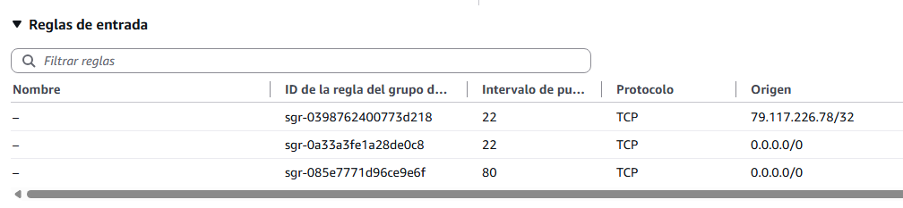

# 🧪 Actividad 2.2: Diagnóstico de fallos de red por capas

!!! warning "Descarga la plantilla"
    📄 [Plantilla 2.2 — Diagnóstico de fallos de red por capas](plantillas/Actividad_2_2_INU_Plantilla.docx){target="_blank" rel="noopener"}

!!! warning "Descarga los recursos"
    📦 [Recursos de la Actividad 2.2](recursos/actividad_2_2_recursos.zip){target="_blank" rel="noopener"} — trae dos ficheros: `arranque-servidor.sh` (ábrelo con un editor de texto para copiar su contenido en el Paso 1) y `rompe_red.sh` (este lo subes tal cual a tu CloudShell y lo ejecutas, sin abrirlo antes — lo necesitas en la Parte B).

## Contexto

Sobre la VPC que construiste la sesión pasada vas a levantar hoy la primera pieza real de la aplicación de reservas de pistas deportivas: una instancia pública con un servidor web y una instancia privada solo alcanzable desde ella. Y luego, sin previo aviso, esa misma red va a dejar de funcionar: una avería real, elegida al azar entre tres posibles, que tienes que diagnosticar contrarreloj.

## Qué vas a practicar

- Levantar una instancia pública que arranca su propio servidor web sin que tengas que conectarte a mano.
- Aislar una instancia privada, accesible solo desde la pública.
- Crear una pasarela NAT para dar salida a internet a una subred privada, sin exponerla.
- Diagnosticar fallos de red de fuera hacia dentro, capa a capa, sin dar palos de ciego.
- Calcular el coste mensual real de una pasarela NAT.

## Requisitos previos

La VPC de dos zonas de la Actividad 2.1, con sus subredes públicas y privadas ya creadas. Los apuntes de esta sesión — [«Seguridad de red»](seguridad-red.md).

---

## Parte A — Instancia pública y privada (guiada)

### Paso 1 — Lanza la instancia pública desde la consola

1. Busca "EC2" en el buscador de servicios → **Instancias** → **Lanzar instancia**.
2. Dale un nombre (por ejemplo `pistas-app-publica-<tu-identificador>`).
3. Elige como AMI **Amazon Linux 2023** (la más reciente disponible en la capa gratuita), y como tipo de instancia `t3.micro`.
4. En **Configuración de red**, elige tu VPC y tu subred pública, y asegúrate de que **Asignar IP pública automáticamente** está en **Habilitar**.
5. En **Grupo de seguridad**, elige **Crear un nuevo grupo de seguridad**. El asistente añade por defecto una única regla SSH — en su desplegable de origen, cámbiala de "Anywhere" a **Mi IP**.

    Añade una **segunda** regla SSH (**Agregar regla de seguridad** → tipo **SSH**), esta vez con origen **Anywhere-IPv4** (`0.0.0.0/0`). Y una tercera para el puerto 80: **Agregar regla de seguridad** de nuevo, tipo **HTTP**, origen `0.0.0.0/0`. Debes terminar con exactamente tres reglas: dos de SSH (una a tu IP, otra abierta) y una de HTTP abierta.

    !!! warning "Las dos reglas juntas no son buena práctica — son una limitación del aula"
        En cuanto abres `0.0.0.0/0`, la regla de **Mi IP** deja de proteger nada de verdad: cualquiera puede intentar conectar por el puerto 22, la estrecha no bloquea lo que la ancha ya deja pasar. No son dos capas que se complementen — la ancha anula a la estrecha por completo. En un trabajo real nunca tendrías las dos a la vez: elegirías **una**, según cómo te fueras a conectar. Aquí están juntas solo porque la red del centro bloquea la conexión SSH directa, así que necesitas el método del navegador (**EC2 Instance Connect**, que no pasa por tu red local, sino por la infraestructura de AWS) sí o sí — y de paso practicas también la regla de "Mi IP" que sí aplicarías en un caso real, aunque hoy no esté haciendo su trabajo. Ya viste el mismo razonamiento del navegador en la Actividad 2.1.

    

6. Antes de seguir, echa un vistazo a la **NACL** de tu subred pública — el otro filtro de tráfico que actúa antes de llegar a la instancia, a nivel de subred en vez de por instancia (lo has visto en [«Seguridad de red»](seguridad-red.md)). Ve a **VPC → Seguridad → ACL de red**, busca la asociada a `pistas-publica-a` y abre la pestaña **Reglas de entrada**: por defecto verás una regla `100` que permite (`ALLOW`) todo el tráfico, y una regla final `*` que deniega (`DENY`) todo lo que no haya coincidido antes — es la que actúa solo si ninguna otra regla numerada lo ha hecho. No cambies nada todavía: solo fíjate en qué aspecto tiene una NACL completamente abierta, para reconocer más adelante una que no lo esté.

7. Despliega **Detalles avanzados**. Busca el campo **Perfil de instancia de IAM** y selecciona `LabInstanceProfile` — lo necesitas más adelante, para autorizar el salto por SSH hacia la instancia privada. Baja hasta el campo **Datos de usuario** (*user data*: un fichero de texto que le pasas a la instancia al crearla, y que se ejecuta solo, automáticamente, la primera vez que arranca — hoy te basta con pegarlo aquí; lo vas a ver con más detalle, junto a las plantillas de lanzamiento que lo reutilizan, en la Actividad 2.3), y pega ahí el contenido completo de `arranque-servidor.sh` — el script vive en `recursos/tema2/actividad_2_2/arranque-servidor.sh`, dentro del zip que has descargado arriba.

    !!! tip "Si al abrir el script ves símbolos raros en vez de acentos (ó, é...)"
        El fichero está bien, en UTF-8 — lo que falla es el programa con el que lo has abierto, que ha adivinado mal la codificación (típico del Bloc de notas de Windows en algunas configuraciones). No lo arregles a mano: ábrelo con un editor que respete UTF-8 (por ejemplo VS Code) en vez de hacer doble clic, o simplemente copia el contenido tal cual te lo dé el profesor en clase.

    Antes de hacer clic en **Lanzar instancia**, haz ya tu propia captura del asistente relleno: en cuanto lances la instancia, desaparece, y no hay forma de volver atrás a verlo.

8. Ahora sí, haz clic en **Lanzar instancia**.

El script `arranque-servidor.sh` instala y arranca, al primer arranque de la instancia, un servidor web mínimo con la página de reservas de pistas deportivas — sin intervención tuya. Espera un par de minutos y prueba en el navegador `http://<ip-pública>` — **escribe el `http://` a mano**, sin dejar que el navegador lo complete solo.

!!! warning "Si ves ERR_SSL_PROTOCOL_ERROR ('conexión no segura')"
    Es el error más habitual de este paso. Muchos navegadores, si solo escribes la IP sin prefijo, prueban `https://` por defecto — y esta instancia no tiene ningún certificado, solo sirve tráfico sin cifrar por el puerto 80. No es un fallo de tu instancia ni del grupo de seguridad: escribe `http://` explícitamente delante de la IP y el error desaparece.

**Comprueba**: que la IP pública de la instancia responde en el puerto 80 desde tu navegador, sin haberte conectado nunca por SSH.

**Captura**: el asistente de lanzamiento con el grupo de seguridad y el user data rellenados (**antes** de lanzar, tu propia captura de ese momento), y el servidor web respondiendo en el navegador sin haberte conectado por SSH (**después**, ya con la instancia en marcha).

### Paso 2 — Lanza la instancia privada por CLI

Hasta ahora siempre has lanzado instancias rellenando el asistente de la consola, pantalla a pantalla. Para esta segunda instancia usas por primera vez la **CLI**: el mismo lanzamiento, pero como un único comando de texto en vez de veinte clics — no son dos herramientas distintas, son dos caras de la misma API que ya viste en el Tema 1, y a partir de aquí las vas a alternar según te convenga en cada momento.

Antes de lanzar necesitas tres datos, y cada uno se busca de una forma distinta:

1. **El ID de la AMI**: la misma que usaste en el Paso 1 (Amazon Linux 2023). Consíguelo desde tu instancia pública ya lanzada — consola: **EC2 → Instancias** → selecciona tu instancia pública → pestaña **Detalles** → campo **ID de AMI**. Por CLI, si ya tienes el ID de esa instancia:

    ```bash
    aws ec2 describe-instances --instance-ids <id-instancia-publica> \
      --query "Reservations[0].Instances[0].ImageId" --output text
    ```

2. **El ID de tu subred privada**: consola: **VPC → Subredes** → clic en `pistas-privada-a` → copia el **ID de la subred** (empieza por `subnet-`). Por CLI:

    ```bash
    aws ec2 describe-subnets --filters "Name=tag:Name,Values=pistas-privada-a" \
      --query "Subnets[0].SubnetId" --output text
    ```

3. **Un grupo de seguridad nuevo para la privada**, que no existe todavía — lo creas tú ahora, y a diferencia del de la pública, no debe permitir tráfico desde `0.0.0.0/0` en ningún puerto: solo SSH, y solo desde el grupo de seguridad de tu instancia pública (el mismo patrón de "salto" que ya viste en la Actividad 2.1). Primero, localiza el ID del grupo de seguridad de tu instancia pública (pestaña **Seguridad** de esa instancia, o `aws ec2 describe-instances --instance-ids <id-instancia-publica> --query "Reservations[0].Instances[0].SecurityGroups[0].GroupId" --output text`) y el ID de tu VPC (**VPC → Su VPC**, o `aws ec2 describe-vpcs --filters "Name=tag:Name,Values=pistas-vpc-<tu-identificador>" --query "Vpcs[0].VpcId" --output text`). Con esos dos datos, crea el grupo y autoriza la regla:

    ```bash
    aws ec2 create-security-group \
      --group-name pistas-app-privada-sg-<tu-identificador> \
      --description "SSH solo desde la instancia publica" \
      --vpc-id <vpc-id>

    aws ec2 authorize-security-group-ingress \
      --group-id <sg-privado-id> \
      --protocol tcp --port 22 \
      --source-group <sg-publico-id>
    ```

    El primer comando te devuelve un `GroupId` en la respuesta — ese es tu `<sg-privado-id>` para el resto de esta actividad.

Con los tres datos ya en la mano, lanza la instancia:

```bash
aws ec2 run-instances \
  --image-id <ami-id> \
  --instance-type t3.micro \
  --subnet-id <subnet-privada-id> \
  --security-group-ids <sg-privado-id> \
  --tag-specifications 'ResourceType=instance,Tags=[{Key=Name,Value=pistas-app-privada-<tu-identificador>}]'
```

A diferencia del asistente de la consola, `run-instances` no pone `t3.micro` por defecto (sin `--instance-type` AWS elige otro tamaño por su cuenta) ni le pone nombre a la instancia (sin `--tag-specifications` la verías sin nombre en el listado — es la etiqueta `Name` la que la consola muestra como si fuera el nombre). Si ya has lanzado una instancia sin este parámetro, termínala y vuelve a lanzarla bien — no se puede cambiar el tipo de instancia de una ya creada sin pararla primero.

**Comprueba**: conéctate primero a la instancia pública, y desde ahí intenta llegar a la instancia privada — el mismo salto por SSH que ya hiciste en la Actividad 2.1, con los mismos comandos. Debe funcionar. Comprueba también que la instancia privada no tiene IP pública asignada.

!!! tip "Si el salto falla por permisos, revisa el rol de tu instancia pública"
    Este salto necesita que tu instancia **pública** tenga el rol `LabInstanceProfile` (Paso 1). Si la lanzaste antes de tener ese campo en cuenta, añádelo ahora: **EC2 → Instancias** → selecciona la pública → **Acciones → Seguridad → Modificar rol de IAM** → elige **LabInstanceProfile** → **Actualizar rol de IAM**. No hace falta relanzar nada.

Ya que estás dentro, aprovecha para dejar constancia del punto de partida: desde ese mismo salto, comprueba que la privada **todavía no** sale a internet (`ping` a una IP externa, por ejemplo — no vas a crear la pasarela NAT hasta el Paso 3). Debe quedarse sin respuesta; es justo lo que vas a comparar cuando la pasarela NAT ya exista.

**Captura**: la conexión exitosa desde la instancia pública hacia la privada, la ausencia de IP pública en la instancia privada, y el `ping` sin respuesta desde dentro de la privada (todavía sin NAT).

### Paso 3 — Crea una pasarela NAT para la subred privada

Ya sabes por los apuntes de hoy qué es una pasarela NAT y por qué tiene coste — ahora la creas de verdad, para que tu instancia privada pueda salir a internet (actualizar paquetes, por ejemplo) sin dejar de ser inalcanzable desde fuera.

1. Busca "VPC" → **Direcciones IP elásticas** → **Asignar dirección IP elástica** → **Asignar**. Una **IP elástica** (*Elastic IP*) es una dirección pública fija que reservas tú y que no cambia aunque cambies o reinicies el recurso al que está asociada — a diferencia de la IP pública automática que le has visto a tus instancias hasta ahora, que sí puede cambiar. Una pasarela NAT necesita una de estas direcciones fijas propia; esta es la que le vas a dar.
2. Ve a **NAT Gateways** → **Crear gateway NAT**.
3. Dale un nombre. En **Modo de disponibilidad**, elige **Zonal** (no el que viene marcado por defecto, "Regional" — ese reparte la pasarela automáticamente entre zonas y no te deja elegir subred, y hoy la quieres en una subred concreta). Al elegir Zonal aparece el campo **Subred**: elige tu subred **pública** (`pistas-publica-a`) — este es el punto que más se olvida: la pasarela NAT vive en la subred pública, aunque la use la privada.
4. En **Tipo de conectividad**, deja **Pública**. En **ID de asignación de IP elástica**, selecciona la que has creado en el paso 1.
5. Crea la pasarela, y espera a que su estado pase de `Pending` a `Available` (tarda unos minutos).
6. Ve a **Tablas de enrutamiento**, selecciona la tabla asociada a tu subred **privada** (la principal, la misma que viste en la Actividad 2.1) → pestaña **Rutas** → **Editar rutas** → **Agregar ruta**: en **Destino** escribe `0.0.0.0/0`, y en **Destino de destino** elige tu pasarela NAT recién creada. Guarda los cambios.

Que la ruta esté bien puesta no demuestra por sí solo que la privada llegue a internet de verdad — compruébalo desde dentro. Conéctate a la instancia pública por **EC2 Instance Connect** y, desde ahí, salta a la privada por SSH con el mismo mecanismo de la Actividad 2.1 (clave temporal autorizada unos segundos) — el mismo salto y el mismo `ping` del Paso 2, pero esta vez debe responder.

**Comprueba**: que la pasarela NAT aparece en estado `Available`, que la tabla de rutas de tu subred privada tiene la entrada `0.0.0.0/0` apuntando a ella (no a la pasarela de internet, esa la usa solo la pública), y que el `ping` desde dentro de la instancia privada recibe respuesta — la prueba real de que sale a internet.

**Captura**: tu pasarela NAT en estado `Available`, la tabla de rutas de la subred privada mostrando la nueva ruta hacia ella, y la salida del `ping` con respuesta desde dentro de la instancia privada.

---

## Parte B — Diagnostica tu avería (reto)

Descarga `rompe_red.sh` (junto al resto de recursos de la actividad) y ejecútalo tal cual, desde tu **CloudShell**, sobre tu propia cuenta:

```bash
bash rompe_red.sh
```

El script aplica **una única avería al azar**, de entre tres posibles: una ruta incorrecta en una tabla de rutas, un grupo de seguridad cerrado donde no debería estarlo, o una regla de NACL bloqueante. No te dice cuál — eso es lo que tienes que averiguar. Es tu propia red la que se rompe, con un cambio real sobre tus propios recursos, no una simulación. No abras el script para mirar el código antes de terminar el diagnóstico: te chivarías la respuesta a ti mismo.

Diagnostica **de fuera hacia dentro**, sin saltarte capas, y usa el primer síntoma como pista real, no como trámite: primero comprueba si la instancia está en marcha (aquí siempre lo va a estar, pero es el primer sitio donde mirarías en un caso real). Después, prueba lo más simple: vuelve a abrir `http://<ip-pública>` en el navegador, igual que en el Paso 1 — si ya no carga, ahí tienes el primer síntoma. Para saber si es la ruta o es la NACL/el grupo de seguridad, intenta conectar por **EC2 Instance Connect**: si tampoco puedes —ni la web ni la conexión funcionan— el problema es la ruta de la subred, el único de los tres que corta todo el tráfico, no solo el puerto 80. Si consigues conectar sin problema pero la web sigue sin responder, descarta la ruta: el problema está en la NACL o en el grupo de seguridad, y ahí el síntoma externo es idéntico entre los dos — tienes que mirar los dos sitios para saber cuál es. En cuanto localices la tuya, documenta por escrito:

1. Qué síntoma has observado (qué esperabas y qué ha pasado en realidad).
2. Qué capa has revisado primero y por qué esa y no otra.
3. Qué has visto en la consola que te ha llevado a localizar el problema exacto.
4. Cómo lo has corregido.

Tanto el diagnóstico como la corrección los haces desde la **consola de AWS**, en el mismo sitio donde revisaste o editaste cada componente en la Parte A (tabla de rutas, NACL o grupo de seguridad) — sin comandos.

Cuando tengas tu avería resuelta, **calcula el coste mensual estimado** de la pasarela NAT que ya creaste en la Parte A, con la [calculadora oficial de precios de AWS](https://calculator.aws/#/){target="_blank" rel="noopener"}, a partir del precio por hora y una estimación razonable de GB de tráfico saliente de tus instancias privadas.

**Comprueba**: que, tras corregir tu avería desde la consola, la red vuelve a comportarse exactamente como en la Parte A.

**Captura**: tu ficha de diagnóstico (síntoma, capa revisada, qué has visto en la consola, corrección aplicada); una captura del problema **antes** de corregirlo (la regla, ruta o NACL incorrecta en la consola, o el error al intentar acceder); otra **después**, ya corregido; y el desglose de coste mensual de la pasarela NAT.

!!! question "Reflexiona"
    Busca a un compañero al que le haya tocado una avería distinta a la tuya, y comparad sin miraros el código de `rompe_red.sh`: ¿qué síntoma habéis visto cada uno al entrar por primera vez, y en qué momento del diagnóstico habéis podido distinguir con certeza cuál de las capas estaba fallando? Un grupo de seguridad cerrado y una NACL bloqueante producen síntomas muy parecidos desde fuera — ¿qué comprobación concreta es la que de verdad distingue una de la otra?

---

## Criterios de evaluación

**Parte A — hasta 7 puntos**

| Apartado | Puntos |
|---|---|
| Instancia pública con servidor web automático (user data) y grupo mínimo | 2 |
| Instancia privada accesible solo desde la pública | 3 |
| Pasarela NAT creada, con la ruta de la subred privada apuntando a ella | 2 |

**Parte B — reto, hasta 3 puntos adicionales (máximo total: 10)**

| Apartado | Puntos |
|---|---|
| Tu avería diagnosticada y corregida, con razonamiento documentado | 2 |
| Coste mensual de la pasarela NAT calculado y justificado | 1 |

---

## ✅ Cierre

Ya sabes diagnosticar una red de fuera hacia dentro, capa a capa, en vez de cambiar cosas al azar hasta que funcione — es la habilidad que más vas a usar el resto del curso cada vez que algo no responda como esperabas. La próxima sesión dejas de crear instancias a mano, una a una: vas a automatizar su lanzamiento con plantillas, para no repetir este mismo proceso cada vez que necesites una máquina más.

!!! danger "Antes de salir: borra las instancias y la pasarela NAT si la has creado"
    Termina las dos instancias EC2 de hoy (la pública de pistas y la privada) — la Actividad 2.3 lanza una instancia nueva, no reutiliza estas. Borra también la pasarela NAT que has creado en la Parte A (y su IP elástica asociada): es el recurso más caro de toda la sesión, factura por hora exista o no tráfico, y no le sirve a nadie después de hoy. **No borres la VPC, las subredes ni las tablas de rutas** — quita solo la ruta `0.0.0.0/0` que apuntaba a la NAT, la tabla en sí la sigue necesitando el resto del módulo.
