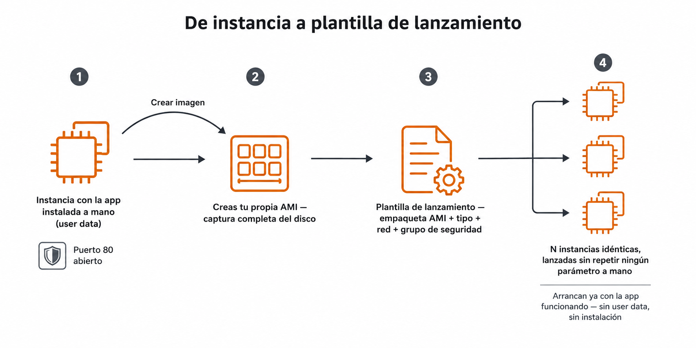
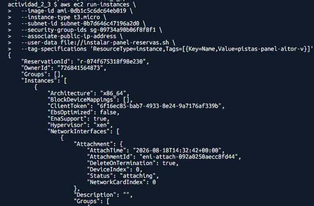
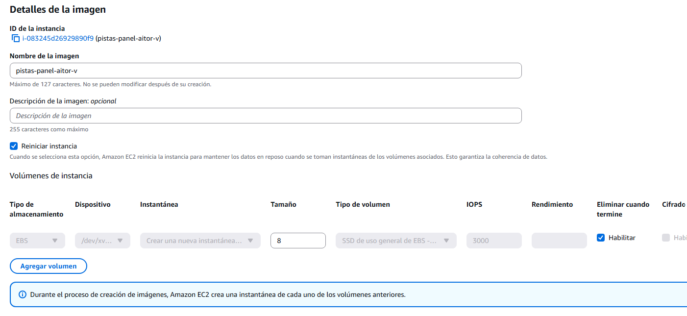
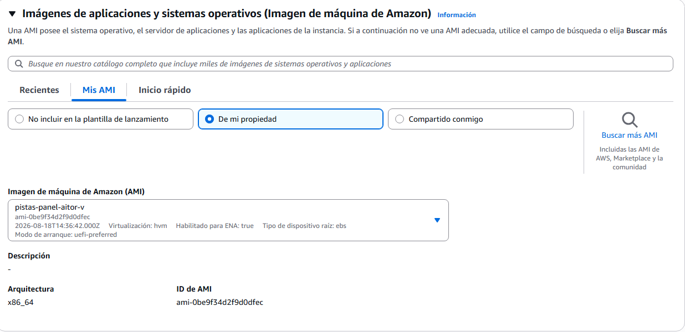
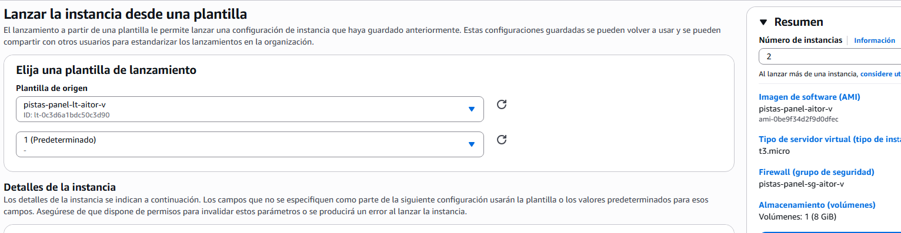

# 🧪 Actividad 2.3: De instancia a plantilla

!!! warning "Descarga la plantilla"
    📄 [Plantilla 2.3 — De instancia a plantilla](plantillas/Actividad_2_3_INU_Plantilla.docx){target="_blank" rel="noopener"}

!!! warning "Descarga los recursos"
    📦 [Recursos de la Actividad 2.3](recursos/actividad_2_3_recursos.zip){target="_blank" rel="noopener"} — lo vas a subir y descomprimir en el Paso 1 de esta actividad.

## Contexto

Hasta ahora has lanzado instancias sueltas, a mano, repitiendo los mismos parámetros cada vez. Hoy conviertes ese proceso manual en algo repetible: instalas un panel de reservas de pistas deportivas —la misma aplicación municipal que llevas construyendo desde la Actividad 2.1— en una instancia, capturas el resultado como tu propia imagen, la empaquetas en una plantilla de lanzamiento y arrancas varias instancias idénticas desde ella. Después demuestras que el mecanismo no depende de la aplicación: repites el mismo proceso con algo completamente distinto instalado.



## Qué vas a practicar

- Automatizar el despliegue de la aplicación con user data, sin conectarte a mano a la instancia.
- Crear tu propia imagen de máquina (AMI) a partir de una instancia ya configurada.
- Construir una plantilla de lanzamiento parametrizada y lanzar varias instancias idénticas desde ella.
- Repetir el mismo mecanismo con una aplicación distinta, para comprobar que no depende de lo que instales.
- Comparar coste mensual entre familias de instancia para la misma carga.

## Requisitos previos

La VPC de dos zonas de la Actividad 2.1, con su subred pública ya creada — hoy lanzas una instancia nueva sobre ella, no reutilizas la de la Actividad 2.2. Los apuntes de esta sesión — [«Máquinas virtuales»](maquinas-virtuales.md).

---

## Parte A — De instancia manual a imagen propia (guiada)

### Paso 1 — Despliega el panel de reservas con user data, solo en los puertos necesarios

Lanza una instancia nueva en tu subred pública. Necesita:

- Un grupo de seguridad con el puerto 80 abierto, y las mismas dos reglas de SSH que ya justificaste en la Actividad 2.2 (a tu IP, y a `0.0.0.0/0` — es la que de verdad te deja entrar desde el aula, por EC2 Instance Connect), por si hace falta revisar algo. Si todavía conservas el de la instancia pública de la Actividad 2.2 —mismas reglas exactas—, reutilízalo en vez de crear uno nuevo.
- Un script de user data que instale y arranque, sin intervención tuya, el panel de reservas de pistas deportivas.

Todo el Paso 1 lo haces por **CLI**, igual que en la Actividad 2.2 — el grupo de seguridad y la propia instancia, sin pasar por el asistente de consola en ningún momento. Hazlo desde tu **CloudShell** (Tema 1), no desde tu ordenador: sube `actividad_2_3_recursos.zip` con **Actions → Upload file** y descomprímelo (`unzip actividad_2_3_recursos.zip`) para tener `instalar-panel-reservas.sh` ahí mismo, en `recursos/tema2/actividad_2_3/`.

Antes de lanzar necesitas tres datos — mismo método de búsqueda que ya usaste en la 2.2:

1. **El ID de la AMI base**: la misma Amazon Linux 2023 que has usado en toda actividad anterior — reutiliza el ID que ya tengas anotado de la Actividad 2.1 o 2.2. Si no lo tienes a mano, consíguelo por CLI:

    ```bash
    aws ec2 describe-images --owners amazon \
      --filters "Name=name,Values=al2023-ami-2023*-x86_64" "Name=state,Values=available" \
      --query "reverse(sort_by(Images, &CreationDate))[:1].ImageId" --output text
    ```

2. **El ID de tu subred pública**: consola: **VPC → Subredes** → clic en `pistas-publica-a` → copia el ID. Por CLI:

    ```bash
    aws ec2 describe-subnets --filters "Name=tag:Name,Values=pistas-publica-a" \
      --query "Subnets[0].SubnetId" --output text
    ```

3. **Un grupo de seguridad con exactamente tres reglas** (80 abierto, y las dos de SSH de siempre: a tu IP y a `0.0.0.0/0`). Si reutilizas el de la Actividad 2.2, no ejecutes estos comandos: búscalo por consola (**EC2 → Grupos de seguridad**) y copia su ID. Si creas uno nuevo, sustituye `<tu-identificador>` y `<vpc-id>` por los tuyos en los comandos siguientes — necesitas el ID de tu VPC y tu IP pública actual:

    Primero créalo, y anota el `GroupId` que te devuelve — es tu `<sg-minimo>` para los comandos siguientes:

    ```bash
    aws ec2 create-security-group \
      --group-name pistas-panel-sg-<tu-identificador> \
      --description "HTTP abierto, SSH a mi IP y a 0.0.0.0/0 para EC2 Instance Connect" \
      --vpc-id <vpc-id> \
      --query "GroupId" --output text
    ```

    Con el `GroupId` ya en la mano, añade las tres reglas (si las ejecutas antes de tener el ID, o sin sustituirlo, fallan):

    ```bash
    aws ec2 authorize-security-group-ingress --group-id <sg-minimo> \
      --protocol tcp --port 80 --cidr 0.0.0.0/0

    aws ec2 authorize-security-group-ingress --group-id <sg-minimo> \
      --protocol tcp --port 22 --cidr $(curl -s https://checkip.amazonaws.com)/32

    aws ec2 authorize-security-group-ingress --group-id <sg-minimo> \
      --protocol tcp --port 22 --cidr 0.0.0.0/0
    ```

Con los tres datos ya en la mano, lanza la instancia:

```bash
cd recursos/tema2/actividad_2_3/
aws ec2 run-instances \
  --image-id <ami-base> \
  --instance-type t3.micro \
  --subnet-id <subnet-publica-id> \
  --security-group-ids <sg-minimo> \
  --associate-public-ip-address \
  --user-data file://instalar-panel-reservas.sh \
  --tag-specifications 'ResourceType=instance,Tags=[{Key=Name,Value=pistas-panel-<tu-identificador>}]'
```

Fíjate en `--associate-public-ip-address`: tu subred pública no asigna IP pública por defecto (lo has tenido que marcar a mano en el asistente de consola en actividades anteriores), así que por CLI hay que pedirla explícitamente — sin este flag, la instancia lanzaría sin IP pública y no podrías llegar a ella. No hace falta ningún perfil de IAM esta vez: a diferencia de la 2.2, aquí no saltas a ninguna instancia privada, solo te conectas a esta misma por Instance Connect.


*🖼️ Captura de referencia del profesor — guardar como `img/actividad_2_3_paso1.png`*

**Comprueba**: que el panel responde en el puerto 80 sin que te hayas conectado nunca por SSH a instalarlo a mano, y que ningún otro puerto además del 80 y el 22 está abierto.

**Captura**: tu propio panel de reservas funcionando en el navegador, y el grupo de seguridad mostrando solo los puertos estrictamente necesarios.

### Paso 2 — Crea tu propia imagen desde la consola

Con la instancia del Paso 1 ya funcionando y estable, captúrala como AMI propia:

1. En el panel de **Instancias**, selecciona (marca la casilla) tu instancia con el panel de reservas desplegado.
2. Ve a **Acciones → Imagen y plantillas → Crear imagen**.
3. Dale un nombre que la identifique como tuya, por ejemplo `pistas-panel-<tu-identificador>`.
4. Deja el resto de opciones por defecto y haz clic en **Crear imagen**.
5. Ve al menú lateral, a **AMIs** (dentro de Imágenes), y espera a que el estado pase de `pending` a `available` — tarda unos minutos.


*🖼️ Captura de referencia del profesor — guardar como `img/actividad_2_3_paso2.png`*

**Comprueba**: que la imagen aparece como disponible (`available`) al cabo de unos minutos, y que su nombre y descripción tienen sentido.

**Captura**: tu propia AMI en estado `available`, con su nombre y su ID de AMI visibles.

### Paso 3 — Empaqueta tu AMI en una plantilla de lanzamiento

Con la imagen ya disponible, empaquétala en una plantilla de lanzamiento básica.

1. Busca "EC2" → menú lateral, **Plantillas de lanzamiento** → **Crear plantilla de lanzamiento**.
2. Dale un nombre (por ejemplo `pistas-panel-lt-<tu-identificador>`).
3. En **Imagen de la aplicación y el SO (Amazon Machine Image)**, pestaña **Mis AMIs**, elige la que has creado en el Paso 2 — no una AMI pública.
4. En **Tipo de instancia**, `t3.micro`.
5. En **Par de claves (inicio de sesión)**, **No incluir en la plantilla de lanzamiento** — sigues sin necesitarlo, como en el Paso 1.
6. En **Configuraciones de red**, elige tu subred pública (no hay un campo aparte para elegir la VPC — se fija sola al elegir la subred, que ya pertenece a ella). En **Firewall (grupos de seguridad)**, elige **Seleccionar un grupo de seguridad existente** y marca el que creaste en el Paso 1 (`pistas-panel-sg-<tu-identificador>`).
7. Despliega **Configuración de red avanzada** (queda colapsada por defecto) y busca el campo para asignar automáticamente una dirección IP pública — actívalo. Igual que en cada actividad anterior, la subred no la asigna por su cuenta: sin este paso, las instancias que lances desde la plantilla no tendrían IP pública y no podrías llegar a ellas.
8. No hace falta rellenar **Datos de usuario**: tu AMI ya lleva el panel instalado y arrancando solo — es justo la diferencia frente al Paso 1, donde el user data hacía ese trabajo sobre una imagen genérica.
9. Crea la plantilla.


*🖼️ Captura de referencia del profesor — guardar como `img/actividad_2_3_paso3.png`*

**Comprueba**: que la plantilla aparece creada, con tu AMI propia y el resto de parámetros (tipo, red, grupo de seguridad) visibles en su resumen.

**Captura**: el resumen de tu plantilla de lanzamiento, con la AMI propia seleccionada y el resto de parámetros visibles.

### Paso 4 — Lanza instancias idénticas desde tu plantilla

Dos instancias idénticas, sin nada todavía que reparta tráfico entre ellas ni las use a la vez, no te sirven de nada por sí solas — y es normal que ahora mismo no le veas la utilidad práctica. Lo que demuestra este paso no es "para qué sirven dos copias", sino que la plantilla es de verdad reutilizable sin tocar ni un parámetro a mano: es exactamente la pieza que necesita el grupo de escalado automático del Tema 4 para añadir instancias cuando el tráfico lo justifique y quitarlas cuando no. Hoy compruebas que la pieza suelta funciona; el motivo real de tener varias lo ves en el Tema 4.

**Antes de lanzar nada, predice**: si arrancas una instancia desde tu plantilla —con tu propia AMI ya lista, sin user data que instalar—, ¿cuánto crees que va a tardar en estar respondiendo, comparado con el tiempo que tardó la instancia del Paso 1 (que instalaba el servidor desde cero vía user data sobre una imagen genérica)? Escribe tu predicción y por qué crees eso.

1. En el panel de **Plantillas de lanzamiento**, selecciona la tuya → **Acciones → Lanzar instancia desde plantilla**.
2. En **Número de instancias**, escribe `2` — el resto de campos ya vienen rellenos desde la plantilla, no los toques.
3. Lanza, y cronometra de verdad desde que pulsas lanzar hasta que cada instancia responde con el panel en el navegador.


*🖼️ Captura de referencia del profesor — guardar como `img/actividad_2_3_paso4.png`*

**Comprueba**: que las dos instancias responden con el panel de reservas sin ninguna configuración adicional, exactamente igual que la instancia original del Paso 1, y que tu predicción de tiempo se ajusta (o no) a lo que has cronometrado de verdad.

**Captura**: las dos instancias respondiendo en el navegador, el cronómetro real de arranque, y tu predicción escrita de antemano.

---

## Parte B — Reto: la misma receta, con otra aplicación distinta

Todo lo de la Parte A demuestra que el mecanismo AMI + plantilla funciona para el panel de reservas — pero el mecanismo en sí no sabe nada de pistas deportivas, sirve para cualquier aplicación. Demuéstralo tú: monta una **segunda plantilla de lanzamiento**, completa desde cero (instancia base → instala algo distinto → captura tu AMI → empaquétala en plantilla nueva), con una aplicación distinta a tu elección — un WordPress con su propia base de datos, un blog estático distinto, un servicio propio tuyo... lo que quieras, siempre que no sea el panel de reservas. No hay comandos dados ni pasos numerados: aplica exactamente el mismo proceso del Paso 1 al Paso 3, con la instalación que tú decidas.

Con la segunda plantilla funcionando, compara el coste mensual estimado de mantener esta misma carga (una instancia sirviendo tu aplicación, tráfico moderado) en tres familias distintas de instancia, usando la calculadora oficial de AWS, y justifica cuál elegirías para producción y cuál para clase.

**Comprueba**: que una instancia lanzada desde tu segunda plantilla responde con tu aplicación elegida, sin ninguna configuración adicional, y que puedes demostrar que viene de verdad de esa plantilla y no de un lanzamiento manual aparte.

**Captura**: tu aplicación distinta funcionando en el navegador; el resumen de tu segunda plantilla de lanzamiento; la instancia ya lanzada, con su pestaña **Detalles** mostrando el campo **Plantilla de lanzamiento de origen** (el ID de tu plantilla y la versión usada) — es la prueba de que ha salido de la plantilla, no de un lanzamiento aparte; y la tabla comparativa de coste mensual de las tres familias con su justificación.

---

## Criterios de evaluación

**Parte A — hasta 7 puntos**

| Apartado | Puntos |
|---|---|
| Panel de reservas desplegado automáticamente con user data, puertos mínimos | 2 |
| Imagen propia creada a partir de la instancia | 2 |
| Plantilla de lanzamiento creada a partir de tu AMI propia | 1 |
| Dos instancias lanzadas desde la plantilla, tiempos medidos y predicción comparada | 2 |

**Parte B — reto, hasta 3 puntos adicionales (máximo total: 10)**

| Apartado | Puntos |
|---|---|
| Segunda plantilla funcionando, con una aplicación distinta instalada | 2 |
| Comparación de coste entre tres familias, con justificación | 1 |

---

## ✅ Cierre

Ya tienes una imagen propia y una plantilla parametrizada — puedes lanzar tantas copias idénticas del panel de reservas como necesites, sin repetir la instalación ni un solo parámetro a mano. Con esto se cierra el Tema 2: tienes la red, la seguridad y las instancias resueltas. En el Tema 3 vas a decidir dónde guardar los datos de verdad — objetos, ficheros compartidos y una base de datos gestionada— y a montar la primera arquitectura completa de tres capas.

!!! danger "Antes de salir: hoy se borra todo, sin dejar nada suelto"
    Termina la instancia del Paso 1, las dos que has lanzado desde la plantilla en el Paso 4 y, si has hecho la Parte B, la instancia de tu segunda plantilla.

    Esta vez no dejes ni las AMIs ni las plantillas de lanzamiento: la plantilla lleva grabado el ID de tu subred y de tu grupo de seguridad, y en cuanto borres la VPC (siguiente párrafo) esos IDs dejan de existir — la plantilla se queda inservible, no reutilizable. Bórralo en este orden:

    1. **EC2 → Plantillas de lanzamiento**, selecciona la del Paso 3 (y la de la Parte B si la has hecho) → **Acciones → Eliminar plantilla de lanzamiento**.
    2. **EC2 → AMIs**, selecciona tu AMI propia (y la segunda, si la has hecho) → **Acciones → Anular el registro de la AMI**. Anota el ID de snapshot que te muestra el diálogo — anular el registro de una AMI no borra el snapshot que hay detrás, solo desvincula la imagen.
    3. **EC2 → Instantáneas**, busca esos mismos IDs de snapshot → **Acciones → Eliminar snapshot**. Es el paso que de verdad libera el espacio; si te lo saltas, sigues pagando por un disco que ya no sirve para nada.

    Con eso ya no queda nada que dependa de la red, así que hoy sí toca borrar también la VPC entera: ya no la vas a necesitar — el Tema 3 arranca con su propia red, creada con Terraform, para que todo el mundo parta exactamente de lo mismo. Ve a **VPC → Sus VPC**, selecciona tu VPC → **Acciones → Eliminar VPC**: el asistente te lista todo lo que va a borrar de un tirón (las cuatro subredes, la tabla de rutas, la puerta de enlace de internet) antes de confirmar.
