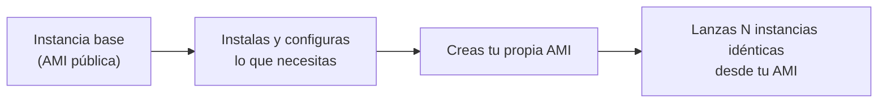
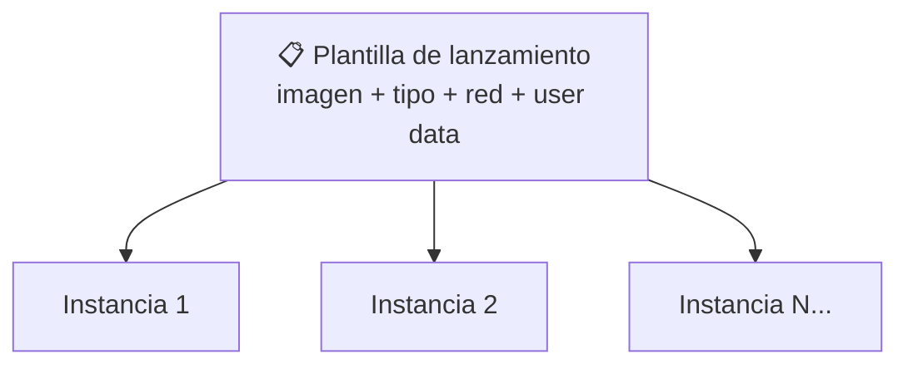

# 🧩 3. Máquinas virtuales

---

Ya sabes que una instancia es una **máquina virtual** — lo viste en «Diseño de la red virtual». En las dos sesiones anteriores has lanzado instancias sueltas, una a una, repitiendo a mano los mismos parámetros: la imagen, el tipo, la subred, el grupo de seguridad. Funciona para dos instancias de prueba, pero no escala — hoy dejas de repetir ese proceso a mano: entiendes qué decide su rendimiento y precio, cómo se empaqueta en una imagen reutilizable, y cómo se guarda esa receta en una plantilla que lanzas tantas veces como haga falta.

---

## 🧭 Familias y tamaños de instancia

Cuando lanzas una instancia EC2 eliges un **tipo**, con un nombre como `t3.micro` o `m5.large`. Ese nombre tiene tres partes, no dos: la letra inicial es la **familia** (para qué está optimizada), el número que sigue es la **generación** (una versión más nueva del mismo hardware, normalmente más eficiente que la anterior — cuanto más alto, más reciente), y la palabra final es el **tamaño** (cuánta CPU y memoria trae) — es esta última la que de verdad decide cuánto pagas.

| Familia | Optimizada para | Ejemplo de uso típico |
|---|---|---|
| `t` (general, ráfaga) | Cargas variables, con picos ocasionales | Instancia de la aplicación en desarrollo o pruebas |
| `m` (general, equilibrada) | CPU y memoria en proporción estándar | Instancia de la aplicación en producción |
| `c` (cómputo) | Mucha CPU, poca memoria relativa | Procesamiento intensivo, no lo usarás en este módulo |
| `r` (memoria) | Mucha memoria, poca CPU relativa | Bases de datos en memoria, no lo usarás en este módulo |

Dentro de cada familia, el tamaño sigue siempre la misma escalera de palabras: `nano → micro → small → medium → large → xlarge → 2xlarge → 4xlarge...`. Pero ojo, es un error frecuente pensar que la letra decide la CPU y el tamaño decide la memoria — no es así: **los dos números, vCPU y memoria, dependen de la combinación de las dos partes del nombre.** Lo que decide la letra es la proporción entre ambos y cómo se comporta esa CPU; lo que decide el tamaño es cuánto de esa proporción recibes. Con números reales de la familia `t3`, la que vas a usar en este módulo (**vCPU**, *virtual CPU*: el número de núcleos de procesamiento virtuales que trae la instancia — no la velocidad de cada uno, que depende del procesador físico de esa generación, no del tamaño que elijas):

| Tipo | vCPU | Memoria RAM |
|---|---|---|
| `t3.nano` | 2 | 0,5 GiB |
| `t3.micro` | 2 | 1 GiB |
| `t3.small` | 2 | 2 GiB |
| `t3.medium` | 2 | 4 GiB |
| `t3.large` | 2 | 8 GiB |
| `t3.xlarge` | 4 | 16 GiB |

Fíjate en que, dentro de la familia `t3`, subir de `nano` a `large` multiplica por 16 la memoria mientras el número de vCPU se mantiene igual — solo a partir de `xlarge` empieza a subir también la CPU. No es una regla universal para todas las familias (cada una reparte CPU y memoria a su manera según para qué está pensada), pero sí confirma la idea central: el tamaño no es "solo memoria", es todo el paquete de recursos que trae la instancia.

!!! example "El coste de sobredimensionar una instancia"
    Una `t3.micro` cuesta una fracción de lo que cuesta una `t3.large` —tres peldaños por encima, con ocho veces más memoria—, y para servir el front estático de una aplicación web durante una clase de treinta alumnos es más que suficiente. Sobredimensionar una instancia es tirar presupuesto del laboratorio a la basura sin ninguna mejora perceptible — vas a comparar el coste real de tres familias en la Actividad 2.3.

El propio nombre `t3.micro` te dice ya el 80 % de lo que necesitas: familia de uso general con ráfagas, tercera generación, tamaño mínimo de la escalera. No hace falta memorizar el catálogo entero — elige la familia según qué exige la carga, y sube en la escalera de tamaños solo hasta donde el tráfico real lo justifique.

---

## 🧩 Imágenes de máquina

Una **AMI** (*Amazon Machine Image*) es la fotografía completa de un disco de arranque: sistema operativo, paquetes instalados, configuración — todo lo que hace falta para que una instancia nueva arranque ya lista, sin repetir la instalación desde cero. AWS te ofrece AMIs públicas (Amazon Linux, Ubuntu...) como punto de partida, pero también puedes crear las tuyas propias a partir de una instancia que ya has configurado.

Esa es exactamente la secuencia que vas a seguir en la Actividad 2.3: arrancar de una imagen pública, instalar lo necesario para servir una pequeña aplicación web, y capturar el resultado como tu propia imagen — para no tener que repetir la instalación la próxima vez que necesites otra instancia igual.

---

## 🔧 Almacenamiento asociado

Cada instancia EC2 lleva asociado al menos un volumen de disco — un **EBS** (*Elastic Block Store*), que existe como recurso independiente de la instancia, aunque normalmente vaya pegado a ella. Esa independencia importa: por defecto, si terminas la instancia, el volumen raíz se borra con ella, pero puedes configurarlo para que sobreviva. Vas a ver la familia de almacenamiento en bloque con más detalle en el Tema 3 — por ahora basta con que sepas que el disco de tu instancia no es "parte" indivisible de ella, es una pieza aparte que se conecta.

---

## ⚙️ Ciclo de vida: parar no es terminar

Una instancia EC2 pasa por varios estados, y confundir dos de ellos es el error de facturación más común entre quien empieza con AWS: **parar** (*stop*) y **terminar** (*terminate*) no son lo mismo, ni de lejos.

| Estado | Qué pasa con la instancia | Qué pasa con el disco | ¿Sigue facturando cómputo? |
|---|---|---|---|
| En marcha (*running*) | Activa, consumiendo recursos | Activo | Sí |
| Parada (*stopped*) | Apagada, pero sigue existiendo | Sigue existiendo (y facturándose aparte) | No el cómputo, pero sí el almacenamiento |
| Terminada (*terminated*) | Eliminada por completo, no se puede recuperar | Se borra (salvo que lo hayas configurado para persistir) | No, nada |

!!! danger "Parar no vacía tu factura, solo la reduce"
    Una instancia parada dentro del Learner Lab deja de facturar cómputo, pero el volumen de disco asociado sigue existiendo y sigue teniendo un coste, por pequeño que sea. El ritual de apagado del final de cada sesión significa *parar* lo que quieras conservar para la próxima clase, y *terminar* de verdad lo que ya no necesitas — no es lo mismo, y confundirlo es tirar crédito sin darte cuenta.

---

## 📊 User data y plantillas de lanzamiento

Ya usaste **user data** en la actividad de la sesión pasada: un script que se ejecuta automáticamente la primera vez que arranca una instancia, sin que tengas que conectarte a mano. Hoy subes un escalón más: una **plantilla de lanzamiento** (*launch template*) que empaqueta *todos* los parámetros de una instancia —imagen, tipo, subred, grupo de seguridad, user data— en un único recurso reutilizable.

!!! tip "Por qué esto es la base de todo lo que viene después"
    Una plantilla de lanzamiento parametrizada es exactamente lo que va a usar el grupo de escalado automático del Tema 4 para decidir "necesito una instancia más, ¿con qué características la lanzo?" — sin plantilla, no hay escalado automático posible. Lo que hoy parece solo una comodidad para no repetir parámetros a mano es, en dos sesiones, el mecanismo que sostiene la alta disponibilidad de cualquier aplicación en producción.

!!! warning "Una plantilla no crea infraestructura, solo la reutiliza"
    La plantilla no guarda una copia de tu subred o tu grupo de seguridad — guarda sus **ID**, que solo existen dentro de tu cuenta y tu región. Si le pasas tu plantilla a otra persona con otra cuenta de AWS, no le funciona: esos `subnet-...` y `sg-...` no existen ahí, así que el lanzamiento falla. Para replicar toda una infraestructura de una cuenta a otra —VPC, subredes y todo lo demás incluido, no solo el lanzamiento de instancias sobre una red que ya existe— hace falta otra herramienta distinta: **infraestructura como código** (CloudFormation, en AWS), que verás en el Tema 6.

---

## ✅ Ideas clave

??? tip "Abrir resumen"

    - El tipo de instancia combina familia (letra, para qué está optimizada) y tamaño (número, cuánta CPU/memoria) — más grande no siempre es mejor, es más caro sin necesidad si no lo justifica la carga.
    - Una AMI es la fotografía completa de un disco de arranque, lista para lanzar instancias idénticas sin reinstalar nada.
    - El almacenamiento (EBS) es un recurso independiente conectado a la instancia, no una parte indivisible de ella.
    - Parar (*stop*) conserva la instancia y el disco, sin facturar cómputo; terminar (*terminate*) la elimina por completo. Confundirlos es un error de facturación habitual.
    - User data automatiza el arranque de una sola instancia; una plantilla de lanzamiento empaqueta todos los parámetros para lanzar muchas instancias idénticas — y es la base del escalado automático que verás en el Tema 4.

Con esto ya tienes las piezas para la Actividad 2.3 — De instancia a plantilla.
