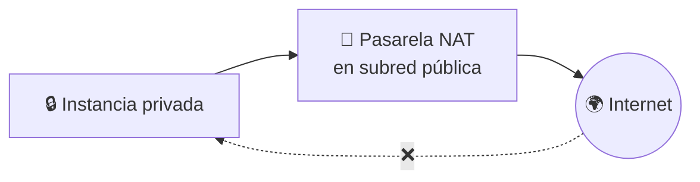
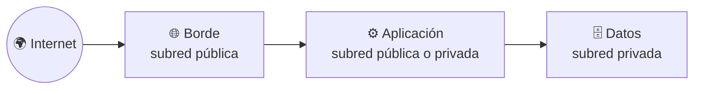

# 🧩 2. Seguridad de red

---

Ya tienes una VPC con subredes públicas y privadas bien repartidas — la sesión pasada construiste el terreno. Pero una subred pública sin ningún filtro más es solo una puerta abierta de par en par: cualquier instancia que lances ahí queda expuesta a todo internet, en todos sus **puertos** (un puerto es un número que identifica, dentro de una misma máquina, a qué servicio concreto va dirigida una conexión — el puerto 80, por ejemplo, es el que usa un servidor web para atender peticiones), salvo que añadas algo que decida quién entra y quién no.

Hoy añades justo eso: dos capas de filtrado que se confunden constantemente entre sí, una forma de dar salida a internet a las subredes privadas sin exponerlas, y el hábito de administrar una instancia sin dejar su puerto de **SSH** (*Secure Shell*, el protocolo que usas para conectarte a la terminal de una máquina remota y ejecutar comandos en ella como si estuvieras delante) abierto al mundo entero.

!!! info "Antes de empezar: qué es 'datos de usuario'"
    En la actividad de hoy vas a lanzar una instancia que arranca su propio servidor web sola, sin que te conectes a configurarla — usando un script de **datos de usuario** (*user data*): un fichero de texto que le pasas a la instancia al crearla, y que se ejecuta automáticamente la primera vez que arranca. Hoy te basta con pegarlo donde te indica el asistente de lanzamiento; lo vas a ver con más detalle, junto a las plantillas de lanzamiento que lo reutilizan, en la próxima sesión.

---

## 🧭 Grupos de seguridad frente a NACL

AWS te da dos herramientas de filtrado de tráfico, y la confusión entre ellas es uno de los errores más repetidos del curso. Ambas deciden qué tráfico entra y sale, pero funcionan de forma distinta y se aplican a nivel distinto.

| | Grupo de seguridad | NACL (*Network ACL*) |
|---|---|---|
| Se aplica a | La instancia (o al recurso concreto) | La subred entera |
| ¿Tiene estado? | **Con estado**: si permites la entrada, la respuesta de salida se permite automáticamente | **Sin estado**: tienes que permitir explícitamente la entrada Y la salida por separado |
| Reglas | Solo de "permitir" | De "permitir" y de "denegar" explícito |
| Orden de evaluación | Se evalúan todas las reglas que apliquen | Se evalúan en orden numérico, la primera que coincide gana |

!!! example "Por qué se confunden tanto"
    Imagina un portero de discoteca (grupo de seguridad) y una verja perimetral del recinto entero (NACL). El portero recuerda a quién ha dejado entrar, así que cuando esa persona sale, no le vuelve a pedir el carné — eso es "con estado". La verja del recinto no recuerda nada: cada vez que alguien cruza, en cualquier sentido, hay que comprobar la regla otra vez — eso es "sin estado". Las dos capas existen a la vez, y el tráfico tiene que pasar las dos para llegar a destino.

La diferencia práctica más importante es esta: si olvidas una regla de salida en un grupo de seguridad, no pasa nada, porque el estado se encarga. Si la olvidas en una NACL, el tráfico se corta aunque la entrada estuviera permitida — es exactamente uno de los fallos que vas a diagnosticar en la Parte B de la actividad de hoy.

---

## 🧩 NAT y su coste

Una subred privada no tiene ruta a la pasarela de internet — lo viste la sesión pasada, y es intencionado: nadie debe poder entrar directamente. Pero eso también le impide *salir*, y una instancia privada a veces necesita salir para actualizar paquetes de software o llamar a un servicio externo, sin que por ello deje de ser inalcanzable desde fuera.

La pieza que resuelve esta asimetría es la **pasarela NAT** (*Network Address Translation*): vive en una subred pública, y las subredes privadas la usan como salida. El tráfico sale con la IP de la pasarela, nunca con la de la instancia privada — así que nadie de fuera puede iniciar una conexión de vuelta hacia esa instancia.

!!! danger "La pasarela NAT no es gratis, y se paga por horas y por GB"
    A diferencia de la pasarela de internet (que no tiene coste propio), la pasarela NAT cobra por cada hora que está encendida y por cada GB que pasa a su través — y suele ser una de las líneas más caras de una arquitectura pequeña. En la Actividad 2.2 vas a calcular su coste mensual real, y va a ser tu primer contacto con el ritual de vigilar qué recurso concreto dispara la factura.

---

## 🔧 Arquitectura en capas: borde, aplicación y datos

Con grupos de seguridad, NACL y NAT ya puedes construir el patrón que vas a repetir en cada arquitectura del módulo: capas concéntricas, donde cada una solo habla con la de al lado, nunca se salta ninguna.

Cada flecha del diagrama representa, en la práctica, una regla de grupo de seguridad: la capa de datos solo acepta tráfico que venga de la capa de aplicación, nunca directamente de internet ni siquiera desde el borde. Es la misma idea de "nunca expongas más de lo necesario" de la sesión pasada, ahora aplicada capa a capa en vez de a una sola subred.

---

## ⚙️ Acceso administrativo sin exponer SSH a internet

Necesitas poder entrar por SSH a tus instancias para administrarlas — pero abrir el puerto 22 a `0.0.0.0/0` (cualquier IP del mundo) es de los errores de configuración más buscados por atacantes automatizados, que escanean internet constantemente buscando exactamente ese puerto abierto.

| Práctica | Qué hace | Nivel de exposición |
|---|---|---|
| SSH abierto a `0.0.0.0/0` | Cualquier IP del planeta puede intentar conectarse | Máximo — evítalo siempre |
| SSH restringido a tu IP concreta | Solo tu dirección actual puede conectarse | Bajo, pero cambia si te mueves de red |
| Instancia sin IP pública, acceso vía otra instancia intermedia | La instancia administrada nunca es alcanzable directamente desde internet | Mínimo |

!!! tip "Por qué esto es solo una advertencia, no una actividad completa hoy"
    Restringir el origen del grupo de seguridad de SSH a tu propia IP es una regla de una sola línea, y la vas a aplicar en la Actividad 2.2 sobre la instancia pública que construyas. La forma más avanzada —una instancia de salto intermedia (*bastion*) o acceso sin SSH en absoluto— la verás con más profundidad cuando trabajes con arquitecturas completas en el Tema 3.

---

## ✅ Ideas clave

??? tip "Abrir resumen"

    - Grupo de seguridad = filtro con estado, a nivel de instancia; NACL = filtro sin estado, a nivel de subred. Las dos capas se evalúan siempre, en ese orden.
    - Con estado significa que el grupo de seguridad recuerda la conexión y permite la respuesta automáticamente; sin estado significa que la NACL exige reglas de entrada y de salida por separado.
    - La pasarela NAT da salida a internet a las subredes privadas sin permitir entrada — y tiene coste por hora y por GB, a diferencia de la pasarela de internet.
    - Arquitectura en capas (borde → aplicación → datos): cada capa solo habla con la de al lado, nunca se salta ninguna.
    - SSH nunca debe quedar abierto a `0.0.0.0/0` — restringir el origen a tu propia IP es la primera línea de defensa.

Con esto ya tienes las piezas para la Actividad 2.2 — Diagnóstico de fallos de red por capas.
