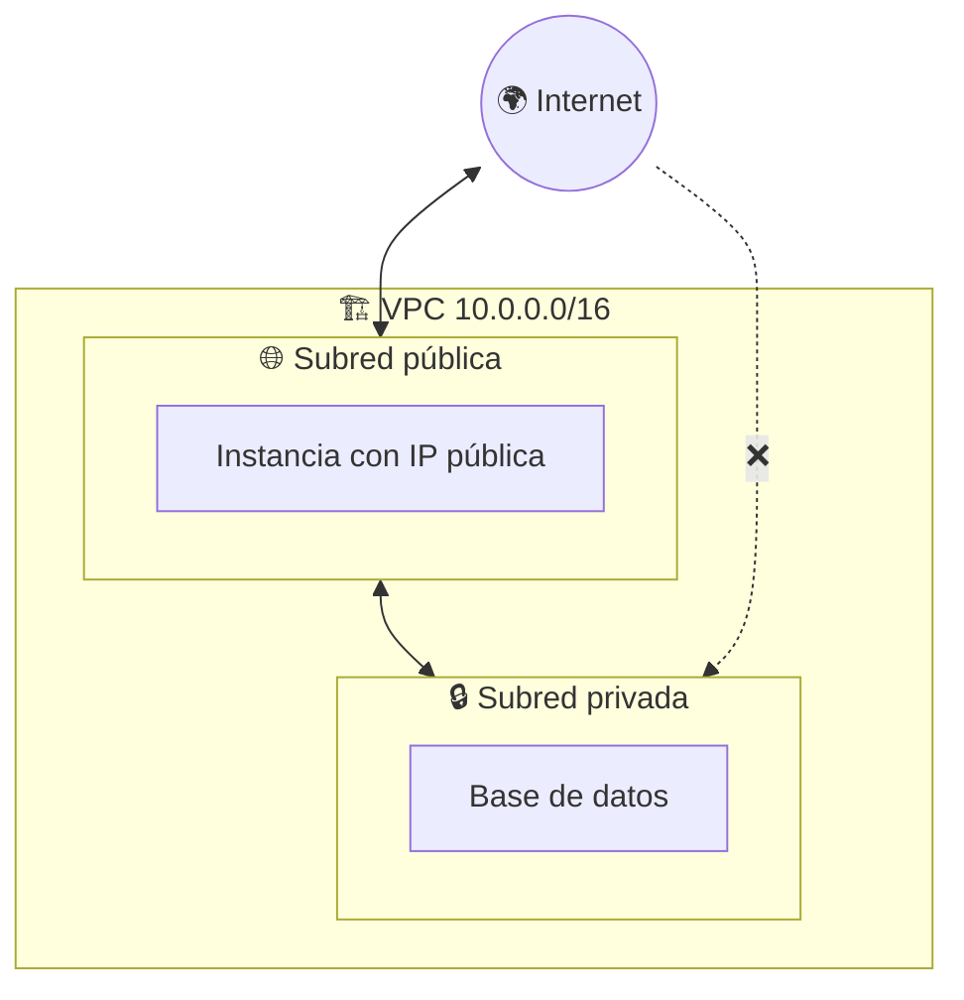
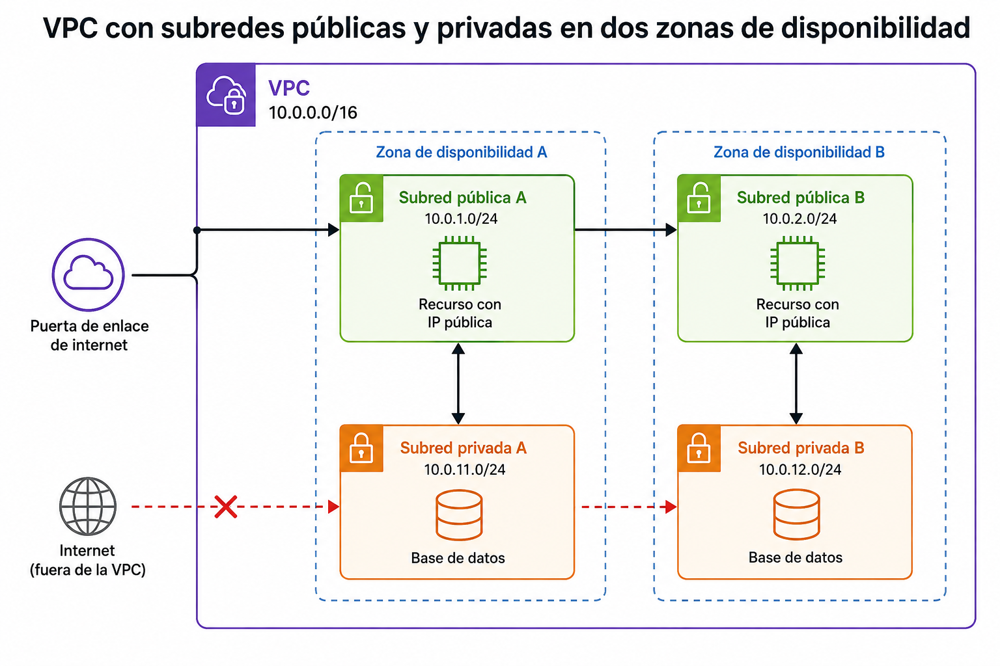
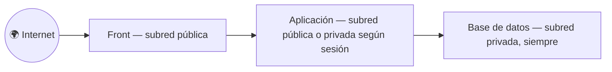

# 🧩 1. Diseño de la red virtual

---

El front que publicaste la sesión pasada no necesitó ni una decisión de red: S3 ya viene con su propia conectividad puesta. Eso ha sido la excepción, no la norma. Casi todo lo demás que vas a construir en este módulo va a vivir dentro de un espacio con reglas propias, con partes abiertas a internet y partes que no lo están nunca. Hoy diseñas ese espacio: primero en papel, después en consola, repartido en dos zonas de disponibilidad. En la Actividad 2.1 lo construyes tú mismo, siguiendo tu propio diseño.

---

## 🧭 Red virtual privada

Una **VPC** (*Virtual Private Cloud*) es tu propio trozo de red dentro de AWS, aislado del resto de clientes por defecto. Piensa en ella como en la parcela de un polígono industrial: dentro puedes levantar los edificios que quieras y decidir tú las calles internas, pero nadie de fuera entra sin que tú abras una puerta expresamente.

!!! info "Idea clave"
    Una VPC no tiene nada dentro al crearla — ni servidores, ni bases de datos, ni siquiera salida a internet. Es solo el espacio de direcciones IP donde vas a construir todo lo demás. Todo lo que uses en el resto del módulo (instancias, bases de datos gestionadas, balanceadores) va a vivir dentro de una VPC.

La pieza que más vas a repetir dentro de una VPC es la **instancia**: una máquina virtual — un ordenador completo, con su propio sistema operativo, CPU, memoria y disco, pero que en realidad es una porción de un servidor físico de AWS que alquilas por horas, no una máquina que compras. Desde dentro se comporta como un ordenador normal: instalas software, ejecutas procesos, la apagas y la enciendes cuando quieras. La vas a lanzar por primera vez en la Actividad 2.1; en el punto 3 de este tema (Máquinas virtuales) ves con detalle de qué plantilla exacta arranca y cómo la eliges — hoy te basta con saber que es lo que va a vivir dentro de las subredes que estás a punto de diseñar.

Ese "espacio de direcciones" no es infinito ni arbitrario: lo defines tú mediante un rango, y ese rango es la primera decisión de diseño de la sesión de hoy.

---

## 🧩 CIDR y subnetting aplicado

Cada máquina conectada a una red necesita una **dirección IP**: un número que la identifica de forma única dentro de esa red, algo así como su matrícula (por ejemplo `10.0.5.23`). El rango de direcciones de una VPC se escribe en notación **CIDR** (*Classless Inter-Domain Routing*): una dirección IP seguida de una barra y un número, como `10.0.0.0/16`. Ese número final —el **prefijo**— indica cuántos de los 32 bits de la dirección están fijos (la "red") y cuántos quedan libres para repartir entre subredes y direcciones concretas. Cuanto más pequeño el prefijo, más direcciones caben debajo.

| Prefijo | Direcciones totales | Uso típico en este módulo |
|---|---|---|
| `/16` | 65.536 | Rango completo de la VPC |
| `/24` | 256 | Una subred individual dentro de la VPC |
| `/28` | 16 | Subred muy pequeña, para casos puntuales |

!!! example "De la VPC a la subred, con números reales"
    Si tu VPC es `10.0.0.0/16`, tienes 65.536 direcciones para repartir. Si divides ese rango en subredes `/24`, obtienes 256 subredes de 256 direcciones cada una: `10.0.0.0/24`, `10.0.1.0/24`, `10.0.2.0/24`... Con solo dos o tres de esas subredes ya te sobra espacio para todo lo que vas a construir en el módulo.

No necesitas usar las 256 subredes posibles — con cuatro o seis te sobra para todo el curso. Mientras cada subred use un rango distinto —incrementando el tercer octeto, como en el ejemplo de arriba— no se solapan entre sí; el error típico es repetir sin darte cuenta el mismo rango en dos subredes. Lo importante es que el reparto quede documentado: en la Actividad 2.1 vas a diseñar sobre papel qué subred es cuál *antes* de crear nada en consola, exactamente igual que un plano se dibuja antes de levantar la primera pared.

---

## 🔧 Subredes públicas y privadas

Dentro de la VPC no todas las subredes tienen el mismo papel. Piensa en un edificio de oficinas: la recepción tiene puerta directa a la calle, cualquiera entra sin pedir permiso; la sala de servidores está en el sótano, y solo se llega a ella pasando antes por dentro del edificio. Una **subred pública** y una **subred privada** son exactamente eso — la diferencia no es ningún interruptor especial que actives al crearlas, es simplemente si tienen puerta a internet o no. Esa "puerta" se define con la tabla de rutas, que ves en la siguiente sección.

Fíjate en la flecha tachada del diagrama: internet nunca llega directamente a la subred privada. Solo lo que ya está dentro de la VPC —como la instancia de la subred pública— puede alcanzarla. Esa asimetría es intencionada, y es la razón de ser de todo lo que viene a continuación.

El diagrama de arriba solo dibuja una subred de cada tipo para no complicarlo, pero en la Actividad 2.1 vas a repartir pública y privada en **dos zonas de disponibilidad** distintas, no en una sola — el mismo patrón, repetido dos veces:

Es la misma redundancia que viste en el Tema 1: si una zona entera se cae por un fallo eléctrico o de red, la otra sigue funcionando. Diseñar la VPC pensando en dos zonas desde el primer día sale mucho más barato que añadir la segunda más adelante, cuando ya tengas media aplicación construida encima de la primera.

---

## ⚙️ Tabla de rutas y pasarela de internet

Lo que convierte a una subred en pública es una combinación de dos piezas: una **pasarela de internet** (*Internet Gateway*, IGW) conectada a la VPC, y una entrada en la **tabla de rutas** de esa subred que dice "todo el tráfico que no sea interno, mándalo por la pasarela". Esa entrada se escribe como `0.0.0.0/0` — el CIDR más amplio que existe, que en una tabla de rutas significa "cualquier dirección de internet, sin excepción".

| Elemento | Qué hace | Sin él, ¿qué pasa? |
|---|---|---|
| Pasarela de internet (IGW) | Puerta de entrada/salida entre la VPC e internet | Ninguna subred puede llegar a internet, por muy pública que la creas |
| Tabla de rutas con `0.0.0.0/0 → IGW` | Le dice a la subred "el tráfico externo sale por aquí" | La subred queda aislada aunque la VPC tenga IGW |
| Tabla de rutas sin esa entrada | El tráfico externo no tiene adónde ir | Así es exactamente como se define una subred privada |

!!! warning "El error más común de la sesión de hoy"
    Una subred no es pública "porque tú la llamaste así" — lo es porque su tabla de rutas apunta a la pasarela. Es habitual crear una instancia, asignarle una IP pública y esperar que funcione, y que no responda porque la subred donde vive sigue apuntando a ninguna parte. Vas a diagnosticar justo este fallo en la Actividad 2.2 de la próxima sesión.

La ruta no es la única pieza que decide si algo responde o no, aunque hoy sea la única que vas a tocar. La próxima sesión añades una capa más —los **grupos de seguridad**, una especie de portero que decide quién entra aunque la puerta (la ruta) esté abierta— capaz de bloquear tráfico incluso con la tabla de rutas perfecta. Todavía no los necesitas para la actividad de hoy, pero ya puedes intuir que "no me llega tráfico" tiene más de una causa posible: la ruta, o quién tiene permiso para pasar por ella.

---

## 📊 Por qué la base de datos nunca vive en una subred pública

Recupera un momento el modelo de responsabilidad compartida de la sesión pasada: la configuración de acceso a tus datos es responsabilidad tuya, no de AWS. Poner la base de datos en una subred privada es la decisión de diseño que traduce ese principio en una regla concreta de red: **si algo no necesita que internet lo alcance directamente, no le des un camino para que internet lo alcance.**

Cualquier aplicación web con esta arquitectura va a seguir este mismo patrón de capas:

La base de datos es la pieza que menos debe estar expuesta y la que más daño hace si alguien llega hasta ella sin permiso — por eso va siempre en la subred más protegida, sin excepción, en cualquier arquitectura que construyas el resto del módulo.

---

## 🌐 Diagramar antes de construir

Todo lo anterior lleva a un hábito, no solo a una explicación teórica: **antes de crear una sola subred en consola, dibuja el reparto en papel.** Cuántas subredes, en qué zonas, qué rango CIDR tiene cada una, cuáles son públicas y cuáles privadas. No es burocracia — es la única forma de detectar un solapamiento de rangos o una subred que se te ha olvidado antes de que cueste deshacerlo en consola.

!!! tip "La plantilla que vas a rellenar en la actividad"
    Un diagrama de red mínimo necesita cuatro columnas: nombre de la subred, rango CIDR, zona de disponibilidad y si es pública o privada. Con esa tabla ya puedes construir la VPC entera sin improvisar sobre la marcha.

---

## ✅ Ideas clave

??? tip "Abrir resumen"

    - Una VPC es tu propio espacio de red aislado dentro de AWS — vacío al crearla, con todo por construir dentro.
    - CIDR expresa un rango de direcciones con un prefijo (`/16`, `/24`...): cuanto más pequeño el número, más direcciones caben.
    - Una subred es pública o privada según su tabla de rutas, no según ningún atributo especial: pública si apunta a una pasarela de internet, privada si no.
    - Pasarela de internet (IGW) + entrada `0.0.0.0/0` en la tabla de rutas = subred pública. Sin esa combinación, la subred queda aislada de internet.
    - La base de datos va siempre en subred privada — es la traducción práctica del modelo de responsabilidad compartida a una regla de red.
    - Diagramar el reparto de subredes en papel antes de construir evita solapamientos y subredes olvidadas.

Con esto ya tienes las piezas para la Actividad 2.1 — Tu propia VPC en dos zonas.
