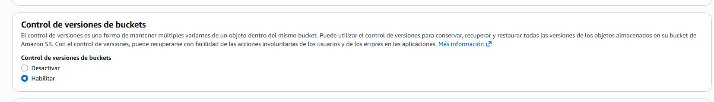
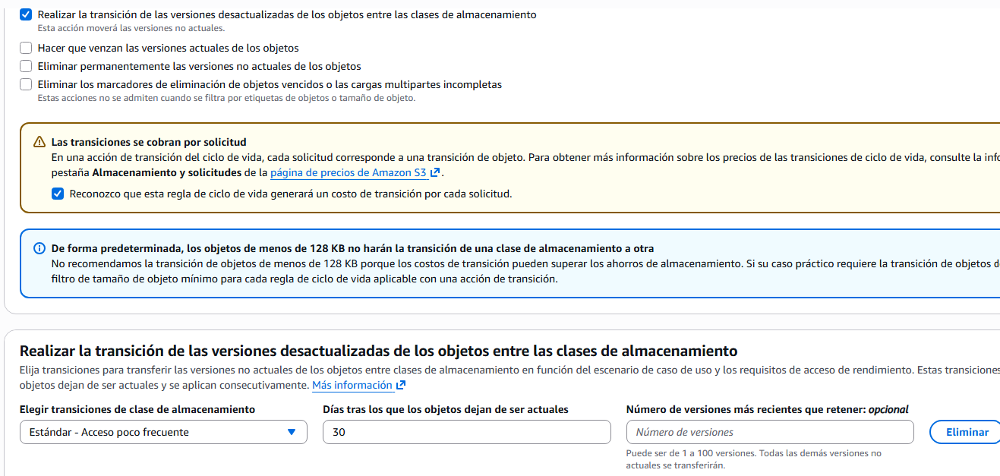
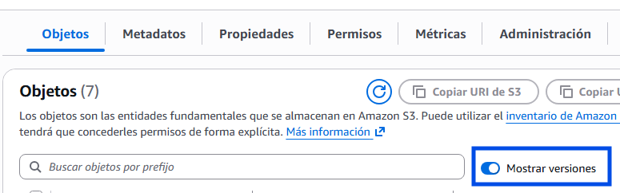
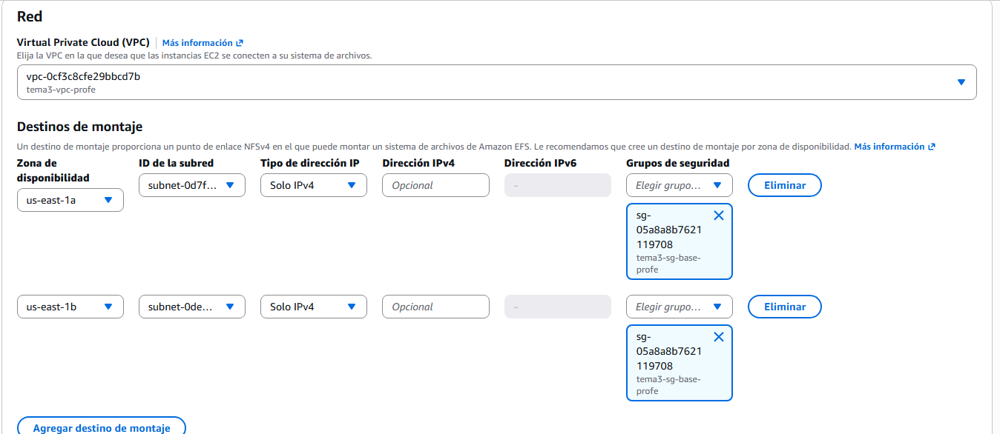
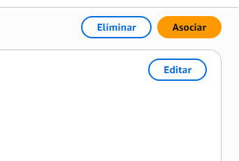

# 🧪 Actividad 3.1: S3, EBS y EFS: tres soluciones de almacenamiento

!!! warning "Descarga la plantilla"
    📄 [Plantilla 3.1 — S3, EBS y EFS: tres soluciones de almacenamiento](plantillas/Actividad_3_1_INU_Plantilla.docx){target="_blank" rel="noopener"}

!!! warning "Descarga los recursos"
    📦 [Recursos de la Actividad 3.1](recursos/actividad_3_1_recursos.zip){target="_blank" rel="noopener"} — descomprímelo en la raíz de tu proyecto: crea la carpeta `recursos/tema3/actividad_3_1/`, la misma ruta que usan los pasos de esta actividad.

## Contexto

La plataforma de gestión de un festival de música tiene ahora mismo tres necesidades de almacenamiento distintas, y cada una pide una familia diferente: guardar las fotos que suben los asistentes durante el evento, ampliar el disco de una instancia cuyo espacio de logs se ha quedado corto, y compartir esas mismas fotos entre las dos instancias que sirven contenido durante el festival. Hoy resuelves las tres, cada una con la herramienta que le corresponde.

## Qué vas a practicar

- Crear un bucket S3 y activar versionado y una regla de ciclo de vida sobre él.
- Ampliar el volumen de disco de una instancia en marcha.
- Crear un sistema de archivos compartido (EFS) y montarlo desde dos instancias distintas.
- Elegir familia y clase de almacenamiento razonando por coste según el patrón de acceso.

## Requisitos previos

No necesitas ningún proyecto previo: hoy creas desde cero, en el Paso 1, el bucket y las instancias sobre los que vas a trabajar. Si ya tienes alguna instancia mínima en marcha de una sesión anterior, puedes reutilizarla — no es obligatorio, el Paso 1 también te indica cómo lanzar una nueva. El apunte de esta sesión — «Servicios de almacenamiento» (almacenamiento.md).

!!! info "Recurso de apoyo"
    En `recursos/tema3/actividad_3_1/generar_fotos_ejemplo.sh` (dentro del zip que has descargado arriba) tienes un script que genera 5-6 ficheros de ejemplo con extensión `.jpg` (contenido aleatorio, no fotos reales) para que tengas algo que subir a S3 y a EFS sin tener que buscar imágenes por tu cuenta.

---

## Parte A — Resuelve las tres necesidades de almacenamiento (guiada)

### Paso 1 — Prepara el escenario: bucket nuevo e instancias del festival

1. Busca "S3" en el buscador de servicios → **Crear bucket**. Dale un nombre único (por ejemplo `festival-fotos-<tu-identificador>`) y dejalo con la configuración por defecto (bloqueo de acceso público activado — este bucket no necesita ser público).

    
    *🖼️ Captura de referencia del profesor — guardar como `img/actividad_3_1_paso1_a.png`*

2. Entra en el bucket recién creado → pestaña **Propiedades** → busca **Versionado del bucket** → **Editar** → **Habilitar** → **Guardar cambios**.
3. En el menú lateral del bucket, entra en **Administración** → **Reglas de ciclo de vida** → **Crear regla de ciclo de vida**.
4. Dale un nombre a la regla, y en su ámbito elige aplicarla a todos los objetos del bucket.
5. En las acciones, marca **Mover versiones no actuales a otra clase de almacenamiento**, elige la clase de acceso infrecuente, y define tras cuántos días se aplica (por ejemplo, 30).
6. Crea la regla.

    
    *🖼️ Captura de referencia del profesor — guardar como `img/actividad_3_1_paso1_b.png`*

7. Lanza (o reutiliza, si ya tienes) dos instancias mínimas — Amazon Linux, el tipo más pequeño disponible. No hace falta que sirvan ninguna aplicación web: para esta actividad son solo el punto desde el que vas a operar sobre el almacenamiento.
8. Desde tu **CloudShell** (Tema 1): sube `actividad_3_1_recursos.zip` con **Actions → Upload file**, descomprímelo (`unzip actividad_3_1_recursos.zip`), ejecuta `recursos/tema3/actividad_3_1/generar_fotos_ejemplo.sh`, y sube las fotos generadas al bucket con `aws s3 cp`.
9. Cambia el contenido de una de las fotos (por ejemplo, regenerándola) y vuelve a subirla con el mismo nombre.
10. En el bucket, activa el interruptor **Mostrar versiones** para comprobar que la versión anterior sigue existiendo, no se ha sobrescrito de verdad.


*🖼️ Captura de referencia del profesor — guardar como `img/actividad_3_1_paso1_c.png`*

**Comprueba**: en el panel de versiones del bucket, que ves al menos dos versiones del mismo fichero.

**Captura**: tu propio bucket creado, la regla de ciclo de vida configurada, y el listado de versiones del fichero mostrando al menos dos.

### Paso 2 — Amplía el disco de una instancia

El disco de logs de una de las dos instancias del festival se ha quedado corto de espacio. Amplía el tamaño de su volumen EBS: por consola es EC2 → **Volúmenes** → selecciona el tuyo → **Acciones** → **Modificar volumen**; por CLI es una sola línea:

```bash
aws ec2 modify-volume --volume-id <volume-id> --size <nuevo-tamaño-gb>
```

**Comprueba**: que `aws ec2 describe-volumes-modifications --volume-id <volume-id>` muestra el cambio en estado `optimizing` o `completed`.

**Captura**: la salida de `describe-volumes-modifications`.

### Paso 3 — Comparte las fotos entre las dos instancias con EFS

1. Busca "EFS" en el buscador de servicios → **Crear sistema de archivos**.
2. En **Personalizar**, elige tu VPC.
3. En el paso de puntos de montaje, deja uno por cada zona de disponibilidad de tu VPC (dos), cada uno en su subred correspondiente.
4. Crea o selecciona un grupo de seguridad que permita el puerto NFS (2049) solo desde el grupo de seguridad de tus instancias — no desde `0.0.0.0/0`.
5. Termina el asistente y crea el sistema de archivos.

    
    *🖼️ Captura de referencia del profesor — guardar como `img/actividad_3_1_paso3_a.png`*

6. Desde cada una de las dos instancias, instala el cliente NFS si hace falta y monta el sistema de archivos usando el punto de montaje de su propia zona (la consola te da el comando de montaje exacto en la pestaña **Adjuntar** del sistema de archivos).
7. Desde la primera instancia, copia una de las fotos generadas al directorio montado.
8. Desde la segunda instancia, comprueba que la foto ya está ahí, sin haberla copiado tú a mano.


*🖼️ Captura de referencia del profesor — guardar como `img/actividad_3_1_paso3_b.png`*

**Comprueba**: que la foto subida desde la primera instancia aparece inmediatamente visible desde la segunda, sin ningún paso de sincronización manual.

**Captura**: tu propio sistema de archivos EFS creado, y la misma foto visible desde las dos instancias tras montarlo.

!!! question "Reflexiona"
    Has resuelto la misma pregunta —"¿dónde guardo esto?"— de tres formas distintas en la misma sesión. Si mañana necesitaras guardar las grabaciones completas de los conciertos del festival, un archivo pesado que casi nadie va a volver a consultar salvo que haya una reclamación puntual, ¿cuál de las tres familias elegirías y por qué esa y no las otras dos?

---

## Parte B — El salto: recuperar, ampliar en caliente y decidir por coste (reto)

Tres retos, cada uno más exigente que su equivalente de la Parte A. No hay comandos dados para ninguno — solo el objetivo.

**Recupera lo irrecuperable**: borra "por accidente" una foto del bucket versionado del Paso 1, y recupérala sin perder ni una versión. Documenta cómo lo has hecho.

**Amplía en caliente de verdad**: en la Parte A ampliaste el tamaño del volumen desde el lado de AWS, pero el sistema de ficheros de dentro de la instancia todavía no lo sabe — el disco del sistema operativo sigue viendo el tamaño antiguo hasta que tú se lo dices. Consíguelo **sin reiniciar la instancia ni cortar el servicio**, y demuestra con un comando dentro de la instancia que el nuevo espacio ya está disponible para escribir.

**Decide por coste, no por costumbre**: para tres casos de uso del festival (las fotos de asistentes ya archivadas tras el evento, que casi nadie vuelve a consultar; el listado de control de acceso, leído constantemente durante las horas del evento; y una copia de seguridad diaria de la base de datos de reservas), elige la familia y la clase de almacenamiento más adecuada, calculando el coste estimado por GB almacenado y por operación de lectura/escritura con la calculadora oficial de AWS. Justifica cada elección — la respuesta "S3 estándar para todo" no vale como justificación.

**Comprueba**: que la foto recuperada tiene exactamente el mismo contenido que antes de borrarla, y que el nuevo espacio de disco es utilizable de verdad (por ejemplo, escribiendo un fichero de prueba que supere el tamaño original).

**Captura**: la foto recuperada y su historial de versiones; el comando dentro de la instancia mostrando el nuevo tamaño disponible; la tabla de coste por caso de uso con su justificación.

---

## Criterios de evaluación

**Parte A — hasta 7 puntos**

| Apartado | Puntos |
|---|---|
| Bucket creado con versionado y ciclo de vida activos | 2 |
| Disco ampliado por CLI, cambio verificado | 1 |
| EFS creado y montado desde dos instancias, con fichero compartido visible | 4 |

**Parte B — reto, hasta 3 puntos adicionales (máximo total: 10)**

| Apartado | Puntos |
|---|---|
| Objeto recuperado sin pérdida y disco extendido en caliente, sin cortar servicio | 2 |
| Decisión de familia/clase por coste, justificada para los tres casos | 1 |

---

## ✅ Cierre

Ya sabes elegir familia de almacenamiento según el patrón de acceso, no por costumbre, y sabes que ampliar un disco en AWS es solo la mitad del trabajo — la otra mitad vive dentro del sistema operativo. La próxima sesión dejas de guardar datos sueltos: montas una base de datos relacional gestionada, y conectas una aplicación a ella sin escribir ni una sola credencial en el código.

!!! danger "Antes de salir: borra las instancias y el sistema de archivos EFS"
    Termina las dos instancias del festival, y borra el sistema de archivos EFS — factura por GB almacenado cada mes mientras exista, y no le sirve a ninguna actividad posterior. El bucket de fotos puedes dejarlo o vaciarlo y borrarlo, su coste es prácticamente nulo. **No borres la VPC ni las subredes del Tema 2.**
