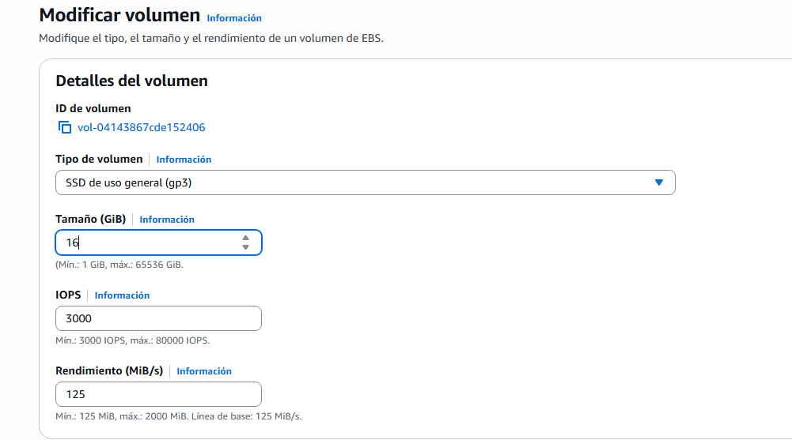

# 🧪 Actividad 3.1: S3, EBS y EFS: tres soluciones de almacenamiento

!!! warning "Descarga la plantilla"
    📄 [Plantilla 3.1 — S3, EBS y EFS: tres soluciones de almacenamiento](plantillas/Actividad_3_1_INU_Plantilla.docx){target="_blank" rel="noopener"}

!!! warning "Descarga los recursos"
    📦 [Recursos de la Actividad 3.1](recursos/actividad_3_1_recursos.zip){target="_blank" rel="noopener"} — lo vas a subir y descomprimir en el Paso 1 de esta actividad.

## Contexto

La plataforma de gestión de un festival de música tiene ahora mismo tres necesidades de almacenamiento distintas, y cada una pide una familia diferente: guardar las fotos que suben los asistentes durante el evento, ampliar el disco de una instancia cuyo espacio de logs se ha quedado corto, y compartir esas mismas fotos entre las dos instancias que sirven contenido durante el festival. Hoy resuelves las tres, cada una con la herramienta que le corresponde.


## Qué vas a practicar

- Crear un bucket S3 y activar versionado y una regla de ciclo de vida sobre él.
- Ampliar el volumen de disco de una instancia en marcha.
- Crear un sistema de archivos compartido (EFS) y montarlo desde dos instancias distintas.
- Elegir familia y clase de almacenamiento razonando por coste según el patrón de acceso.

## Requisitos previos

El Tema 2 ha terminado sin dejar ninguna red montada — al cerrar la Actividad 2.3 has borrado la VPC entera. Hoy no la reconstruyes a mano: el Paso 1 arranca desplegando una red idéntica para todo el mundo con **Terraform**, la herramienta de infraestructura como código que verás en detalle en el Tema 6. De momento la usas como una herramienta ya hecha — ejecutas dos comandos y en unos segundos tienes la VPC, las cuatro subredes y el grupo de seguridad listos, exactamente igual que los que ya conoces del Tema 2. Los apuntes de esta sesión — [«Servicios de almacenamiento»](almacenamiento.md).

!!! info "Recursos de apoyo"
    Dentro del zip que has descargado arriba tienes dos carpetas: `recursos/tema3/actividad_3_1/generar_fotos_ejemplo.sh`, un script que genera 5-6 ficheros de ejemplo con extensión `.jpg` (contenido aleatorio, no fotos reales) para que tengas algo que subir a S3 y a EFS sin buscar imágenes por tu cuenta; y `recursos/tema3/red-base/`, la configuración Terraform que despliega la red de esta sesión.

---

## Parte A — Resuelve las tres necesidades de almacenamiento (guiada)

### Paso 1 — Despliega la red y prepara el escenario

1. Desde tu **CloudShell** (Tema 1): sube `actividad_3_1_recursos.zip` con **Actions → Upload file** y descomprímelo (`unzip actividad_3_1_recursos.zip`).
2. Terraform no viene instalado por defecto en CloudShell — instálalo tú mismo, es un único binario y no hace falta ser administrador:

    ```bash
    curl -O https://releases.hashicorp.com/terraform/1.9.0/terraform_1.9.0_linux_amd64.zip
    unzip terraform_1.9.0_linux_amd64.zip
    export PATH=$PATH:$(pwd)
    terraform -version
    ```

3. Entra en la carpeta de la red (`cd recursos/tema3/red-base`) y despliégala:

    ```bash
    terraform init
    terraform apply -var="identificador=<tu-identificador>"
    ```

    Terraform te lista los recursos que va a crear (VPC, cuatro subredes, tabla de rutas, grupo de seguridad) y pide confirmación — escribe `yes`. Al terminar, imprime los IDs que necesitas para el resto de la actividad (`vpc_id`, `subnet_publica_a_id`, `subnet_privada_a_id`, `subnet_publica_b_id`, `subnet_privada_b_id`, `security_group_id`): guárdalos, los vas a usar varias veces.

    !!! tip "Por qué esto no es hacer trampa"
        Terraform no está resolviendo ningún problema de almacenamiento por ti — solo te ahorra reconstruir a mano, otra vez, la misma red que ya montaste y entendiste en el Tema 2. El objetivo de hoy son S3, EBS y EFS, no las subredes.

4. Busca "S3" en el buscador de servicios → **Crear bucket**. Dale un nombre único (por ejemplo `festival-fotos-<tu-identificador>`), deja el bloqueo de acceso público en su valor por defecto (activado — este bucket no necesita ser público), y baja hasta **Control de versiones de buckets** → **Habilitar**: no hace falta activarlo después por separado, el propio asistente de creación ya lo ofrece.

    
    *🖼️ Captura de referencia del profesor — guardar como `img/actividad_3_1_paso1_a.png`*

5. En el menú lateral del bucket ya creado, entra en **Administración** → **Reglas de ciclo de vida** → **Crear regla de ciclo de vida**.
6. Dale un nombre a la regla, y en su ámbito elige aplicarla a todos los objetos del bucket.
7. En las acciones, marca **Mover versiones no actuales a otra clase de almacenamiento**, elige la clase de acceso infrecuente, y define tras cuántos días se aplica (por ejemplo, 30).
8. Crea la regla.

    
    *🖼️ Captura de referencia del profesor — guardar como `img/actividad_3_1_paso1_b.png`*

9. Lanza dos instancias mínimas — Amazon Linux, el tipo más pequeño disponible, cada una en una subred **pública** distinta (`subnet_publica_a_id` y `subnet_publica_b_id`) y con el `security_group_id` que ha impreso Terraform. No hace falta que sirvan ninguna aplicación web: para esta actividad son solo el punto desde el que vas a operar sobre el almacenamiento.
10. Desde tu CloudShell, ejecuta `recursos/tema3/actividad_3_1/generar_fotos_ejemplo.sh` y sube las fotos generadas al bucket con `aws s3 cp`.
11. Cambia el contenido de una de las fotos (por ejemplo, regenerándola) y vuelve a subirla con el mismo nombre.
12. En el bucket, activa el interruptor **Mostrar versiones** para comprobar que la versión anterior sigue existiendo, no se ha sobrescrito de verdad.


*🖼️ Captura de referencia del profesor — guardar como `img/actividad_3_1_paso1_c.png`*

**Comprueba**: en el panel de versiones del bucket, que ves al menos dos versiones del mismo fichero.

**Captura**: tu propio bucket creado, la regla de ciclo de vida configurada, y el listado de versiones del fichero mostrando al menos dos.

### Paso 2 — Amplía el disco de una instancia

El disco de logs de una de las dos instancias del festival se ha quedado corto de espacio. Amplía el tamaño de su volumen EBS: por consola es EC2 → **Volúmenes** → selecciona el tuyo → **Acciones** → **Modificar volumen**; por CLI es una sola línea:

```bash
aws ec2 modify-volume --volume-id <volume-id> --size <nuevo-tamaño-gb>
```


*🖼️ Captura de referencia del profesor — guardar como `img/actividad_3_1_paso2_a.png`*

**Comprueba**: que `aws ec2 describe-volumes-modifications --volume-id <volume-id>` muestra el cambio en estado `optimizing` o `completed`.

**Captura**: la salida de `describe-volumes-modifications`.

### Paso 3 — Comparte las fotos entre las dos instancias con EFS

1. Busca "EFS" en el buscador de servicios → **Crear sistema de archivos**.
2. En **Personalizar**, elige la VPC que ha creado Terraform (`vpc_id` del Paso 1).
3. En el paso de puntos de montaje, deja uno por cada zona de disponibilidad (dos), cada uno en su subred **pública** correspondiente (`subnet_publica_a_id` y `subnet_publica_b_id`) — son las mismas subredes donde has lanzado tus dos instancias.
4. En el grupo de seguridad de cada punto de montaje, selecciona el `security_group_id` que ya tienes de Terraform: su regla de tráfico interno ya deja pasar el puerto NFS (2049) entre las instancias del grupo, sin necesidad de abrirlo a `0.0.0.0/0`.
5. Termina el asistente y crea el sistema de archivos.

    
    *🖼️ Captura de referencia del profesor — guardar como `img/actividad_3_1_paso3_a.png`*

6. Desde cada una de las dos instancias, instala el cliente NFS si hace falta y monta el sistema de archivos usando el punto de montaje de su propia zona (la consola te da el comando de montaje exacto en la pestaña **Adjuntar** del sistema de archivos).
7. Desde la primera instancia, descarga una de las fotos del bucket S3 del Paso 1 (`aws s3 cp s3://<tu-bucket>/<foto> .`) y cópiala al directorio montado del EFS.
8. Desde la segunda instancia, comprueba que la foto ya está ahí, sin haberla copiado tú a mano.


*🖼️ Captura de referencia del profesor — guardar como `img/actividad_3_1_paso3_b.png`*

**Comprueba**: que la foto subida desde la primera instancia aparece inmediatamente visible desde la segunda, sin ningún paso de sincronización manual.

**Captura**: tu propio sistema de archivos EFS creado, y la misma foto visible desde las dos instancias tras montarlo.

!!! question "Reflexiona"
    Has resuelto la misma pregunta —"¿dónde guardo esto?"— de tres formas distintas en la misma sesión. Si mañana necesitaras guardar las grabaciones completas de los conciertos del festival, un archivo pesado que casi nadie va a volver a consultar salvo que haya una reclamación puntual, ¿cuál de las tres familias elegirías y por qué esa y no las otras dos?

---

## Parte B — El salto: recuperar, ampliar en caliente y decidir por coste (reto)

Tres retos, cada uno más exigente que su equivalente de la Parte A. No hay comandos dados para ninguno — solo el objetivo.

- **Recupera lo irrecuperable**: borra "por accidente" una foto del bucket versionado del Paso 1, y recupérala sin perder ni una versión. Documenta cómo lo has hecho.

    **Comprueba**: que la foto recuperada tiene exactamente el mismo contenido que antes de borrarla.

    **Captura**: la foto recuperada y su historial de versiones.

- **Amplía en caliente de verdad**: ya sabes por los apuntes que ampliar el volumen en AWS es solo la mitad del trabajo — consigue tú la otra mitad, **sin reiniciar la instancia ni cortar el servicio**.

    **Comprueba**: que el nuevo espacio de disco es utilizable de verdad — por ejemplo, escribiendo un fichero de prueba que supere el tamaño original.

    **Captura**: el comando dentro de la instancia mostrando el nuevo tamaño disponible.

- **Decide por coste, no por costumbre**: elige familia y clase de almacenamiento para estos tres casos de uso del festival, calculando el coste estimado por GB almacenado y por operación de lectura/escritura con la calculadora oficial de AWS:

    - Las fotos de asistentes ya archivadas tras el evento, que casi nadie vuelve a consultar.
    - El listado de control de acceso, leído constantemente durante las horas del evento.
    - Una copia de seguridad diaria de la base de datos de reservas.

    Justifica cada elección — la respuesta "S3 estándar para todo" no vale como justificación.

    **Comprueba**: que cada elección tiene un coste estimado real (por GB y por operación) y una justificación propia, no genérica.

    **Captura**: la tabla de coste por caso de uso, con su justificación.

---

## Criterios de evaluación

**Parte A — hasta 7 puntos**

| Apartado | Puntos |
|---|---|
| Bucket creado con versionado y ciclo de vida activos | 2 |
| Disco ampliado por CLI, cambio verificado | 1 |
| EFS creado y montado desde dos instancias, con fichero compartido visible | 4 |

**Parte B — reto, hasta 3 puntos adicionales (máximo total: 10)**

| Apartado | Puntos |
|---|---|
| Objeto recuperado sin pérdida y disco extendido en caliente, sin cortar servicio | 2 |
| Decisión de familia/clase por coste, justificada para los tres casos | 1 |

---

## ✅ Cierre

Ya sabes elegir familia de almacenamiento según el patrón de acceso, no por costumbre, y sabes que ampliar un disco en AWS es solo la mitad del trabajo — la otra mitad vive dentro del sistema operativo. La próxima sesión dejas de guardar datos sueltos: montas una base de datos relacional gestionada, y conectas una aplicación a ella sin escribir ni una sola credencial en el código.

!!! danger "Antes de salir: borra las instancias, el EFS y la red de Terraform"
    Termina las dos instancias del festival, y borra el sistema de archivos EFS — factura por GB almacenado cada mes mientras exista, y no le sirve a ninguna actividad posterior. El bucket de fotos puedes dejarlo o vaciarlo y borrarlo, su coste es prácticamente nulo.

    Con las instancias y el EFS ya borrados, vuelve a `recursos/tema3/red-base` en tu CloudShell y ejecuta `terraform destroy -var="identificador=<tu-identificador>"` — es la forma correcta de deshacer exactamente lo que Terraform creó, en el orden correcto, sin dejar nada suelto. Si te lo pide antes de tiempo y falla porque el EFS o las instancias todavía existen dentro de la VPC, es la señal de que te has dejado algo del párrafo anterior sin borrar.
