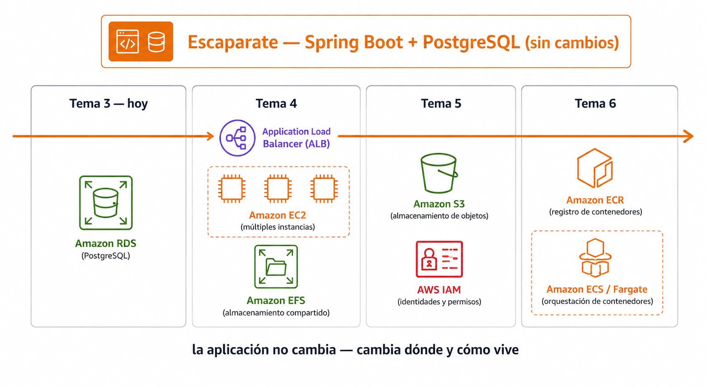
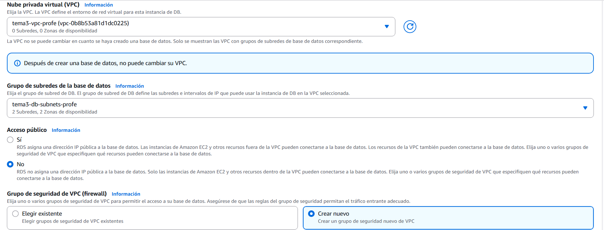
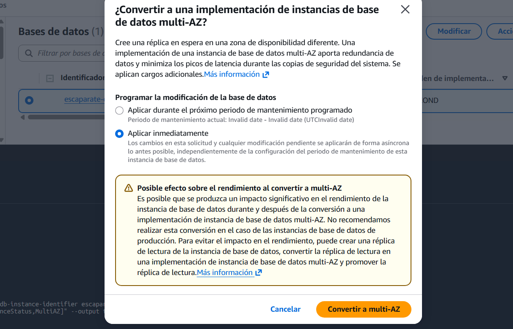

# 🧪 Actividad 3.2: Migración a base de datos gestionada con RDS

!!! warning "Descarga la plantilla"
    📄 [Plantilla 3.2 — Migración a base de datos gestionada con RDS](plantillas/Actividad_3_2_INU_Plantilla.docx){target="_blank" rel="noopener"}

!!! warning "Descarga los recursos"
    📦 [Recursos de la Actividad 3.2](recursos/actividad_3_2_recursos.zip){target="_blank" rel="noopener"} — lo vas a subir y descomprimir en el Paso 1 de esta actividad.

## Contexto

Esta es la primera sesión del módulo en la que trabajas sobre **Escaparate**: un catálogo de productos construido con Spring Boot (Java) y PostgreSQL. Hace lo que esperas de un catálogo — lista productos, permite dar de alta uno nuevo con nombre, descripción, precio y foto, y lo elimina cuando hace falta. Lo vas a usar en esta y en varias sesiones más, cambiando cada vez una pieza distinta de su infraestructura —hoy la base de datos, más adelante el balanceo de carga, el almacenamiento de imágenes, los contenedores— sin que la aplicación en sí cambie nunca.

Trae ya preparados varios endpoints pensados justo para eso:

- `GET /api/salud/listo` — confirma que está lista para servir tráfico solo si su conexión a la base de datos funciona de verdad. Es el que usas hoy.
- `/api/instancia`, `/api/salud/vivo`, `/api/carga` — para sesiones posteriores, cuando haya varias instancias o un balanceador de por medio.


*🖼️ Infografía pendiente de generar — no la foto del catálogo (esa la pide el propio Paso 5 como evidencia del alumno), sino el esquema de qué cambia sesión a sesión*

Escaparate ha vivido hasta ahora con su base de datos en un contenedor local, cómoda para desarrollar pero inservible en producción: si el contenedor desaparece, desaparecen los productos con él. Hoy la migras a una base de datos RDS gestionada de verdad — sin tocar ni una línea de su código, solo cambiando cómo se conecta — y, ya con ella en marcha, la pones a prueba: la haces fallar a propósito y mides cuánto tarda en recuperarse, y compruebas de primera mano qué otras familias de base de datos existirían si el catálogo de Escaparate no fuera tan relacional.

## Qué vas a practicar

- Desplegar una instancia RDS PostgreSQL en subred privada, con la contraseña generada y guardada por Secrets Manager.
- Migrar Escaparate a esa base de datos cambiando solo variables de entorno.
- Activar Multi-AZ y medir con tus propios números cuánto dura de verdad una conmutación por error.
- Diferenciar backups automáticos de snapshots manuales, y ampliar el rendimiento de lectura con una réplica.
- Comprobar de primera mano que existe DynamoDB, y razonar dónde encajaría DocumentDB sin desplegarlo (el Learner Lab no da permisos para crear su instancia), para distintos patrones de acceso.

## Requisitos previos

La red del Tema 3, desplegada con Terraform (`recursos/tema3/red-base`) — si ya la destruiste al cerrar la Actividad 3.1, el Paso 1 te indica cómo volver a desplegarla, es la misma configuración de siempre. `escaparate.war` — un **WAR** (*Web Application Archive*) es el empaquetado tradicional de una aplicación Java web en un único fichero, con el código ya compilado y todas sus dependencias dentro: es lo que ejecutas en un servidor real, en vez de arrancar la aplicación desde el código fuente con Maven como habrás hecho en local hasta ahora — descárgalo del enlace de arriba, ya construido, junto con el esquema de la base de datos (`db/01-schema.sql`, `db/02-data.sql`). Los apuntes de esta sesión — [«Bases de datos gestionadas»](bases-datos-gestionadas.md).

!!! info "No vas a programar nada de Escaparate"
    Igual que en el resto de actividades que usan Escaparate, no vas a escribir ni una línea de su código. Hoy trabajas exclusivamente en la infraestructura: la base de datos, la red, y las variables de entorno que conectan una cosa con la otra.

---

## Parte A — Migra, prueba y amplía la base de datos (guiada)

### Paso 1 — Despliega la red

Desde tu **CloudShell** (Tema 1): sube `actividad_3_2_recursos.zip` con **Actions → Upload file** y descomprímelo (`unzip actividad_3_2_recursos.zip`). Si ya instalaste Terraform en la Actividad 3.1, el binario sigue en tu carpeta personal (CloudShell la conserva entre sesiones), pero **el PATH no se conserva**: cada pestaña nueva de CloudShell arranca sin él, así que `terraform` puede darte "command not found" aunque el binario siga ahí. Compruébalo con `ls ~/terraform` antes de reinstalar nada.

Si no lo tienes instalado todavía:

```bash
cd ~
curl -O https://releases.hashicorp.com/terraform/1.9.0/terraform_1.9.0_linux_amd64.zip
unzip terraform_1.9.0_linux_amd64.zip
rm terraform_1.9.0_linux_amd64.zip
echo 'export PATH=$PATH:~' >> ~/.bashrc
export PATH=$PATH:~
```

La línea `>> ~/.bashrc` es la que evita repetir esto en cada sesión: deja el PATH configurado de forma permanente en tu CloudShell, no solo en la terminal que tienes abierta ahora. Si el binario ya existía de la 3.1 y solo te falta el PATH, basta con las dos últimas líneas.

Despliega la misma red del Tema 3 (si la destruiste al cerrar la 3.1, esto la recrea idéntica; si sigue viva, Terraform te lo dice y no cambia nada):

```bash
cd recursos/tema3/red-base
terraform init
terraform apply -var="identificador=<tu-identificador>"
```

!!! warning "Si `terraform init` o `apply` falla con "no space left on device""
    Tu CloudShell tiene una cuota de almacenamiento fija (normalmente 1 GB) que **no se resetea entre actividades** — si ya hiciste la Actividad 3.1, el zip de Terraform y los recursos descargados entonces siguen ocupando sitio. Libera espacio y reintenta:

    ```bash
    rm -f ~/terraform_1.9.0_linux_amd64.zip ~/*_recursos.zip
    rm -rf recursos/tema3/red-base/.terraform
    ```

    Borrar `.terraform/` (el caché del proveedor de AWS, normalmente lo que más pesa) no pierde nada — `terraform init` lo vuelve a descargar solo.

Guarda los IDs que imprime al terminar (`vpc_id`, `subnet_publica_a_id`, `subnet_privada_a_id`, `subnet_privada_b_id`, `security_group_id`, `db_subnet_group_name`) — los vas a necesitar varias veces hoy. El `db_subnet_group_name` es un grupo de subredes para bases de datos que Terraform ya te ha creado con solo las dos subredes **privadas** — lo necesitas en el Paso 2, porque el asistente de RDS no te deja elegir subredes sueltas ahí mismo, solo un grupo ya existente o "crear uno nuevo" que metería también las subredes públicas.

### Paso 2 — Crea la base de datos RDS

1. Busca "RDS" en el buscador de servicios (aparece como **Aurora and RDS** en el catálogo de servicios — Aurora y RDS comparten consola) → **Bases de datos** → **Crear base de datos**.
2. **Tipo de motor**: **PostgreSQL** — no `Aurora (PostgreSQL Compatible)`, que es un motor propio de AWS, más caro y no el que trabajas hoy.
3. **Elegir un método de creación de base de datos**: **Configuración completa** (no **Creación sencilla** — esa decide por ti la red, la seguridad y las credenciales, justo lo que hoy necesitas configurar a mano).
4. **Plantillas**: **Desarrollo y pruebas** — no **Producción** (fuerza valores pensados para alta disponibilidad, y es fácil que active Multi-AZ desde ya, dejándote sin la comparación del Paso 6) ni **Capa gratuita** (la elegibilidad del nivel gratuito depende de tu cuenta personal de AWS, no de una cuenta de laboratorio de Academy — aquí no significa nada real).
5. **Opciones de implementación** (dentro de "Disponibilidad y durabilidad"): **Implementación de una instancia de base de datos de zona de disponibilidad única (1 instancia)** — es la que no tiene redundancia todavía; la conmutación por error la activas tú mismo, a propósito, en el Paso 6, no ahora.
6. **Identificador del clúster de base de datos**: `escaparate-db-<tu-identificador>` — el nombre con el que lo vas a localizar por CLI en los pasos siguientes.
7. **Nombre de usuario maestro**: escríbelo tú explícitamente (por ejemplo `postgres`) — apúntalo, lo necesitas en el Paso 5.
8. **Administración de credenciales**: elige **Administrado en AWS Secrets Manager - más seguro** — es RDS quien genera la contraseña, tal como has visto en los apuntes: no la vas a escribir tú en ningún sitio.
9. **Clase de instancia de base de datos**: dentro de **Clases ampliables (incluye clases t)** —son las más pequeñas y baratas de las que ofrece el asistente, pensadas justo para cargas bajas e intermitentes como esta— elige `db.t3.micro`. Hoy no hay carga real que servir, solo estás probando el mecanismo, no tiene sentido pagar por más CPU o memoria de la que vas a usar.
10. **Almacenamiento**: si puedes elegir el tipo, `gp3` con el mínimo que te deje; si el asistente solo te ofrece `io2` (SSD de IOPS aprovisionadas), acepta el mínimo de almacenamiento y de IOPS que permita — mismo motivo que la clase de instancia: los ocho productos de ejemplo de Escaparate no van a llenar ni una fracción de eso.
11. **Conectividad**: elige la VPC de Terraform (`vpc_id`). En **Grupo de subredes de la base de datos**, selecciona el que ya te ha creado Terraform (`db_subnet_group_name`) — **no** uses la opción de "crear uno nuevo" desde aquí: el asistente no te deja elegir subredes concretas, y metería también tus subredes públicas. El grupo de Terraform ya tiene solo las dos privadas (`subnet_privada_a_id` y `subnet_privada_b_id`), en dos zonas de disponibilidad distintas, que es lo mínimo que RDS exige aunque la instancia final viva en una sola.

    

12. **Acceso público**: **No** — la base de datos vive en subred privada, la misma regla que fijaste en el Tema 2: nada de fuera de la VPC debe poder alcanzarla directamente, ni siquiera por accidente.
13. **Grupo de seguridad de VPC**: **Crear nuevo**, nómbralo `escaparate-rds-sg-<tu-identificador>` — el asistente le pone una regla por defecto que vas a corregir en el Paso 4, no la dejes así.
14. **Nombre de base de datos inicial**: `escaparate` — tiene que coincidir con la variable `DB_NAME` que espera Escaparate al arrancar (Paso 5); si aquí le pones otro nombre, cambia `DB_NAME` más abajo para que coincida.
15. Crea la base de datos.

La instancia tarda varios minutos en pasar a estado `available` — sigue con el Paso 3 mientras tanto, no hace falta esperar aquí.

**Comprueba**: que la instancia aparece en el panel de RDS, y que su grupo de subredes incluye las dos zonas de disponibilidad.

**Captura**: dos capturas — la pestaña **Configuración** de tu base de datos, con el motor y la clase de instancia visibles; y la página propia del grupo de subredes (**RDS → menú lateral → Grupos de subredes** → el tuyo), con la VPC y las subredes que contiene.

### Paso 3 — Mientras se crea, lanza la instancia de Escaparate

1. Lanza una instancia EC2 en tu subred **pública** (`subnet_publica_a_id`), tipo `t3.small` (Spring Boot necesita algo más de memoria que el mínimo que has usado en actividades anteriores), con el `security_group_id` de Terraform y el perfil de instancia de IAM `LabInstanceProfile` — lo vas a necesitar para leer el endpoint y el secreto por CLI en el Paso 5. Anota su ID de instancia, su zona de disponibilidad y su IP pública (pestaña **Detalles**).
2. Desde tu **CloudShell**, sin conectarte todavía a la instancia, sube los tres ficheros con el mismo mecanismo de clave temporal que ya usaste en la Actividad 2.1:

    ```bash
    ssh-keygen -t rsa -f ~/.ssh/tempkey -N '' -q
    aws ec2-instance-connect send-ssh-public-key \
      --instance-id <id-de-tu-instancia> \
      --instance-os-user ec2-user \
      --ssh-public-key file://~/.ssh/tempkey.pub \
      --availability-zone <zona-de-tu-instancia>

    scp -o StrictHostKeyChecking=no -i ~/.ssh/tempkey \
      escaparate.war 01-schema.sql 02-data.sql \
      ec2-user@<ip-publica-de-tu-instancia>:~
    ```

    La clave solo queda autorizada 60 segundos — si `scp` tarda en arrancar y falla por permisos, repite el `send-ssh-public-key` justo antes.

3. Conéctate a la instancia (por consola, con **Conectar → En el navegador web**, o con la misma clave temporal si prefieres seguir por CLI) y prepara el entorno de ejecución:

    ```bash
    sudo dnf install -y java-21-amazon-corretto postgresql15
    ```

**Comprueba**: que `java -version` muestra Java 21, y que los tres ficheros están en la instancia (`ls ~`).

**Captura**: la salida de `java -version` y el listado de los ficheros subidos.

### Paso 4 — Corrige el grupo de seguridad de RDS

El asistente del Paso 2 ha creado un grupo de seguridad con una regla por defecto — tal como está, no cumple la norma de "solo desde el grupo de seguridad de la aplicación" que has visto en los apuntes.

1. Una vez tu instancia RDS esté `available`, entra en **EC2 → Grupos de seguridad** y localiza `escaparate-rds-sg-<tu-identificador>`.
2. Elimina su regla de entrada por defecto.
3. Añade una única regla: puerto **5432**, origen **el `security_group_id`** de Terraform (no una IP, no `0.0.0.0/0`) — el mismo grupo de seguridad que ya tiene tu instancia EC2.

**Comprueba**: que el grupo de seguridad de RDS tiene exactamente una regla de entrada, con origen el grupo de seguridad de tu instancia, no una IP ni un rango abierto.

**Captura**: la regla de entrada del grupo de seguridad de RDS, mostrando el grupo de seguridad de origen.

### Paso 5 — Carga el esquema y arranca Escaparate apuntando a RDS

!!! warning "Un detalle del Paso 2"
    Los comandos de más abajo usan `postgres` como usuario maestro — sustitúyelo por el que hayas escrito tú en el Paso 2, si usaste otro.

1. Obtén el endpoint de tu base de datos desde la consola: entra en tu base de datos → pestaña **Conectividad y seguridad** → sección **Punto de enlace y puerto** → copia el valor de **Punto de enlace**. Con ese valor, en la instancia de Escaparate:

    ```bash
    export DB_HOST=<pega-aquí-el-endpoint-que-has-copiado>
    ```

2. Obtén la contraseña real desde la consola: en la misma pestaña **Conectividad y seguridad**, busca **ARN de las credenciales maestras** — justo debajo tiene un enlace **"Ver en Secrets Manager"** (no el botón "Copiar secreto", que solo copia el ARN, no la contraseña). Haz clic en ese enlace, y dentro de la página del secreto, en la sección **Valor del secreto**, pulsa **Recuperar valor del secreto**. Te muestra un JSON con `username` y `password`; copia el valor de `password`. Con eso, en la instancia de Escaparate:

    ```bash
    export DB_PASSWORD='<pega-aquí-la-contraseña-que-has-copiado>'
    ```

    !!! danger "Las comillas simples no son opcionales aquí"
        Secrets Manager genera contraseñas fuertes a propósito, con símbolos como `| < > : ~` — si pegas la contraseña sin las comillas simples que rodean `<pega-aquí-la-contraseña-que-has-copiado>`, bash interpreta esos símbolos como parte del comando (un `|` corta la línea en una tubería, un `>` la redirige a un fichero) en vez de como texto, y el `export` falla o hace otra cosa completamente distinta. Las comillas simples son las que evitan que bash interprete nada de lo que hay dentro.

3. Carga el esquema y los datos de ejemplo contra RDS — Escaparate no crea sus propias tablas al arrancar, las espera ya creadas:

    ```bash
    export PGPASSWORD="$DB_PASSWORD"
    psql -h "$DB_HOST" -U postgres -d escaparate -f 01-schema.sql
    psql -h "$DB_HOST" -U postgres -d escaparate -f 02-data.sql
    ```

    !!! warning "Si te saltas este paso, Escaparate no arranca"
        La aplicación valida al arrancar que la tabla `productos` ya existe (no la crea ella sola) — es una decisión deliberada para no dejar que cualquier despliegue modifique el esquema por accidente. Si arrancas el WAR antes de cargar `01-schema.sql`, falla con un error de validación de esquema, no con un error de conexión: son dos fallos distintos, no los confundas si te pasa.

4. Arranca Escaparate con las variables ya listas:

    ```bash
    export DB_PORT=5432
    export DB_NAME=escaparate
    export DB_USER=postgres
    nohup java -jar escaparate.war > escaparate.log 2>&1 &
    ```

5. Abre el puerto 8080 en el grupo de seguridad de Terraform (`security_group_id`, el mismo que ya tiene tu instancia) para poder ver el catálogo desde el navegador — también se puede hacer por consola: **EC2 → Grupos de seguridad → el tuyo → Reglas de entrada → Editar reglas de entrada → Agregar regla** (TCP personalizado, puerto 8080, origen `0.0.0.0/0`):

    ```bash
    aws ec2 authorize-security-group-ingress --group-id <security_group_id> \
      --protocol tcp --port 8080 --cidr 0.0.0.0/0
    ```

6. Comprueba la migración con el endpoint que ya trae la propia aplicación:

    ```bash
    curl http://localhost:8080/api/salud/listo
    ```

    Debe responder `{"estado":"ok"}` — eso solo ocurre si la conexión a RDS funciona de verdad, es la misma comprobación que usaría un balanceador de carga más adelante en el módulo.

**Comprueba**: que `/api/salud/listo` responde `ok`, y que el catálogo con los productos de ejemplo se ve en el navegador, en `http://<ip-pública-de-tu-instancia>:8080`.

**Captura**: la respuesta de `/api/salud/listo`, y el catálogo de Escaparate funcionando en el navegador, sirviendo desde RDS.

### Paso 6 — Activa Multi-AZ y provoca una conmutación por error real

**Antes de tocar nada, predice**: ¿cuántos segundos crees que Escaparate va a dejar de responder mientras RDS conmuta a la copia en espera? Escribe tu predicción antes de seguir.

1. En la consola de RDS, selecciona tu instancia → **Acciones → Convertir a implementación Multi-AZ** (más directo que pasar por "Modificar", que mezcla esto con el resto de opciones de configuración) → elige **Aplicar inmediatamente** → confirma.

    Esto tarda de verdad — cuenta con **10 a 20 minutos**, a veces más, aunque tu base de datos esté casi vacía: AWS tiene que crear una instancia en espera completa desde cero en otra zona y dejar la réplica síncrona funcionando antes de marcarlo como disponible. No es que se haya quedado colgado — aprovecha la espera para lo que viene, no hace falta quedarte mirando.

    
    *🖼️ Captura de referencia del profesor pendiente de capturar*

2. Cuando vuelva a `available` (compruébalo en la consola, o con `aws rds describe-db-instances --db-instance-identifier escaparate-db-<tu-identificador> --query "DBInstances[0].[DBInstanceStatus,MultiAZ]" --output text`), desde tu propia **CloudShell** deja corriendo un bucle que mida la respuesta cada segundo, apuntando a la **IP pública** de tu instancia (no `localhost` — eso apuntaría a la propia CloudShell, no a Escaparate; el puerto 8080 ya lo abriste al mundo en el Paso 5):

    ```bash
    while true; do
      date +%T; curl -s -o /dev/null -w "%{http_code}\n" http://<ip-publica-de-tu-instancia>:8080/api/salud/listo
      sleep 1
    done
    ```

3. Con el bucle ya corriendo y Multi-AZ activo, fuerza la conmutación: selecciona tu instancia → **Acciones** → **Reiniciar** → marca la opción de reiniciar **con conmutación por error** ("Reboot with failover").
4. Mira el bucle del paso 2: anota a qué hora deja de responder `200` y a qué hora vuelve a responderlo.

**Comprueba**: que tienes una marca de tiempo de inicio y otra de fin de la interrupción real, y que la comparas con tu predicción inicial.

**Captura**: la salida del bucle de comprobación mostrando el momento exacto de la interrupción y la recuperación, y tu predicción escrita de antemano.

### Paso 7 — Backups automáticos frente a snapshot manual

1. En la pestaña **Mantenimiento y copias de seguridad** de tu instancia, sección **Copia de seguridad**, busca el campo **Copias de seguridad automatizadas** — debe decir "Habilitado" seguido de un número de días entre paréntesis, por ejemplo `(7 días)`. Ese número es cuántos días hacia atrás guarda RDS tus backups automáticos antes de empezar a borrar los más antiguos (con 7 días, puedes restaurar a cualquier momento de la última semana, nada más antiguo que eso).
2. Crea un snapshot manual: selecciona tu instancia → **Acciones** → **Tomar una instantánea** → dale un nombre como `escaparate-snapshot-<tu-identificador>`.

**Comprueba**: que el snapshot manual aparece en **Instantáneas** con estado `available`, junto a los backups automáticos (que no se listan ahí, viven dentro de la propia instancia).

**Captura**: tu snapshot manual en la lista de instantáneas, y la ventana de retención de los backups automáticos configurada.

### Paso 8 — Amplía el rendimiento de lectura con una réplica

!!! danger "Límite real de AWS: las réplicas de lectura no admiten Secrets Manager"
    Si has seguido el Paso 2 con **Administrado en AWS Secrets Manager**, al intentar crear la réplica te va a salir un error: *"Secrets Manager no admite la característica de creación de réplicas de lectura"*. Hay que desactivarlo primero — no se pierde nada, ya tienes la contraseña guardada en `DB_PASSWORD` desde el Paso 5:

    1. Selecciona tu instancia RDS → **Modificar** → **Administración de credenciales** → cambia a **Autoadministrado** → en la contraseña, usa la misma que ya tienes en `$DB_PASSWORD` → **Aplicar inmediatamente** → espera a que vuelva a `available`. El estado pasa por `Resetting master credentials` mientras lo aplica — tarda un rato, no es instantáneo, dale unos minutos antes de seguir.

1. Selecciona tu instancia RDS → **Acciones** → **Crear réplica de lectura**. Déjala en la misma VPC, clase `db.t3.micro`.
2. Espera a que pase a `available` — cuenta con **5 a 15 minutos**.
3. Desde tu instancia de Escaparate, conéctate con `psql` directamente a la réplica (no a la principal) e intenta escribir algo:

    ```bash
    psql -h <endpoint-de-la-réplica> -U postgres -d escaparate \
      -c "INSERT INTO productos (nombre, precio, fecha_alta) VALUES ('prueba', 1, now());"
    ```

**Comprueba**: que la réplica aparece en la sección **Replicación** de tu base de datos original (puede tardar más en aparecer en el listado general de "Bases de datos" que ahí, no te preocupes si de momento solo la ves en Replicación), y que el `INSERT` contra ella falla explícitamente por ser de solo lectura — es la prueba de que de verdad es una réplica y no una copia editable.

**Captura**: la réplica de lectura en la sección Replicación, y el error de PostgreSQL al intentar escribir en ella.

!!! question "Reflexiona"
    Has usado Multi-AZ y una réplica de lectura para dos problemas distintos en la misma sesión. Si tu presupuesto solo te permitiera activar una de las dos, ¿cuál elegirías para Escaparate en producción real, sabiendo que es una tienda con más visitas navegando el catálogo que compras completándose?

---

## Parte B — Reto: comprueba que existe otra familia, y razona sobre una tercera (reto)

!!! danger "DocumentDB no se puede desplegar en el Learner Lab"
    Confirmado en directo: el rol de IAM del laboratorio (`voclabs`) bloquea `rds:CreateDBInstance` para DocumentDB — se puede crear el clúster, pero no la instancia que lo hace funcionar de verdad, así que un clúster vacío no sirve para nada. Por eso este reto solo despliega DynamoDB de verdad; DocumentDB se queda en razonamiento, con lo que ya has visto en la teoría.

Un reto desplegado, y una decisión razonada. No hay comandos exactos dados para el primero —eso lo decides e investigas tú—, pero sí una hoja de ruta de qué hacer en qué orden, porque es un servicio que no has tocado hasta hoy.

- **Existe de verdad: DynamoDB** — una tabla pequeña que podría usar Escaparate para las sesiones de los usuarios que navegan el catálogo:

    1. Busca "DynamoDB" en el buscador de servicios → crea una tabla nueva.
    2. Piensa qué campo tiene sentido como **clave de partición** para una sesión de usuario (por ejemplo, `sesion_id`) — es lo único que DynamoDB te obliga a decidir de antemano, no hace falta definir el resto de columnas.
    3. Inserta un elemento de prueba y vuelve a leerlo — por consola (**Explorar elementos de la tabla**) o por CLI (`aws dynamodb put-item` / `get-item`), tú eliges. El uso real es distinto al de SQL: no hay un `SELECT ... WHERE` genérico sobre cualquier campo — casi todo el acceso se hace pidiendo el elemento por su clave de partición. `put-item` escribe el elemento completo (no hay `UPDATE` de una sola columna, se sobrescribe entero) y `get-item` lo recupera pidiéndolo por esa misma clave.

    **Comprueba**: que la tabla existe, que el elemento insertado se puede leer de vuelta exactamente igual, y que no has necesitado ninguna VPC ni instancia para nada de esto.

    **Captura**: la tabla creada, y la lectura del elemento insertado.

Con DynamoDB ya comprobado de primera mano, responde: para el catálogo de productos de Escaparate, el carrito o sesión de un usuario mientras navega, y una ficha de producto con campos muy distintos según la categoría, ¿qué familia (relacional, DynamoDB, DocumentDB) usarías en cada caso, y por qué?

**Comprueba**: que tu respuesta razona por patrón de acceso y forma de los datos, no por "cuál es más nuevo".

**Entrega**: tu respuesta a las tres asignaciones, con su justificación — no es una captura de pantalla, es texto tuyo razonado.

---

## Criterios de evaluación

**Parte A — hasta 8 puntos**

| Apartado | Puntos |
|---|---|
| RDS creada en subred privada, con Secrets Manager y grupo de seguridad restringido correctamente | 2 |
| Escaparate migrado y funcionando contra RDS, verificado con `/api/salud/listo` | 2 |
| Multi-AZ activado y conmutación por error provocada y cronometrada de verdad | 2 |
| Backup automático y snapshot manual diferenciados | 1 |
| Réplica de lectura creada y verificada como de solo lectura | 1 |

**Parte B — reto, hasta 2 puntos adicionales (máximo total: 10)**

| Apartado | Puntos |
|---|---|
| Tabla DynamoDB creada y verificada con lectura/escritura real | 1 |
| Asignación de familia por caso de uso, razonada (incluyendo DocumentDB) | 1 |

---

## ✅ Cierre

Escaparate ya vive con una base de datos gestionada de verdad, y has comprobado con tus propios números lo que antes solo eran conceptos: cuánto dura de verdad una conmutación por error, y qué diferencia hay entre un backup que desaparece con la instancia y un snapshot que sobrevive. La próxima sesión separas el frontend del backend y montas la arquitectura de tres capas completa — vas a seguir necesitando esta misma base de datos.

!!! danger "Antes de salir: limpia solo lo que no vas a reutilizar"
    **No borres** la red de Terraform, la instancia de Escaparate ni la base de datos RDS — la Actividad 3.3 los reutiliza tal cual. Sí hay que limpiar lo que has creado solo para explorar hoy:

    1. Si has activado Multi-AZ, **desactívalo** (Modificar instancia → desmarca Multi-AZ → aplica inmediatamente) — dobla el coste de cómputo y ya has demostrado lo que hace; no hace falta seguir pagándolo el resto del módulo.
    2. Borra la **réplica de lectura** del Paso 8 — no la necesitas para la 3.3.
    3. Borra el **snapshot manual** del Paso 7 si no quieres seguir pagando por él (factura por GB mientras exista).
    4. Borra la **tabla DynamoDB** de la Parte B — no la necesitas después de hoy.
    5. Si no vas a volver a la Actividad 3.3 en las próximas horas, puedes **detener temporalmente** la instancia RDS y la instancia EC2 en vez de dejarlas corriendo (Acciones → Detener temporalmente, en cada una): mientras están detenidas no se cobra el cómputo, solo el almacenamiento. Ojo: RDS se reinicia sola a los 7 días si no la arrancas antes, y si tienes una réplica de lectura activa no puedes detener la instancia principal hasta borrarla.

    La red, la instancia EC2 y la base de datos RDS principal se quedan (detenidas o encendidas) hasta el cierre de la Actividad 3.3.
