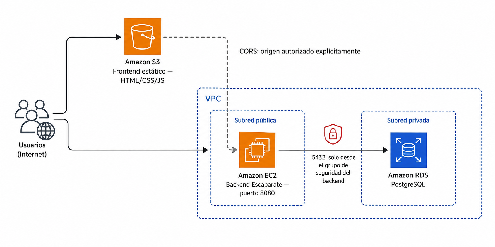

# 🧪 Actividad 3.3: Arquitectura de tres capas: front, aplicación y base de datos

!!! warning "Descarga la plantilla"
    📄 [Plantilla 3.3 — Arquitectura de tres capas: front, aplicación y base de datos](plantillas/Actividad_3_3_INU_Plantilla.docx){target="_blank" rel="noopener"}

!!! warning "Descarga los recursos"
    📦 [Recursos de la Actividad 3.3](recursos/actividad_3_3_recursos.zip){target="_blank" rel="noopener"} — el frontend desacoplado de Escaparate ya compilado, listo para editar y subir a S3.

## Contexto

Escaparate lleva toda la sesión anterior funcionando como una sola pieza: una instancia EC2 que sirve el catálogo entero, HTML incluido, y que habla directamente con tu base de datos RDS. Hoy la separas físicamente en las tres capas que llevas viendo desde los apuntes de hoy — front, aplicación y datos — cada una como un servicio real, desplegado por separado.



No vas a tocar ni una línea del código de Escaparate — igual que en la 3.2, lo que cambia es infraestructura y configuración. El backend ya sabía servir su API por separado desde hace tiempo (el propio `README` del proyecto lo llama la variante **Desacoplada**); hoy publicas un frontend estático que la consume desde otro origen, activas CORS para que el navegador lo permita, y cierras la sesión identificando dónde están, de verdad, los puntos únicos de fallo de lo que acabas de montar.

## Qué vas a practicar

- Publicar un frontend estático en S3 que consume una API REST que vive en otra instancia, en otra URL.
- Configurar CORS en el backend para autorizar explícitamente ese origen — sin abrir la API a cualquiera.
- Aplicar el principio de mínimo privilegio a una arquitectura completa: cada capa habla solo con la que le toca.
- Diferenciar configuración pública (el endpoint de la API) de secreto (la contraseña de la base de datos), ambas como configuración externa.
- Identificar, sobre tu propio despliegue real, los puntos únicos de fallo que tiene hoy — y razonar cuáles importan más.

## Requisitos previos

La red, la instancia EC2 con Escaparate y la base de datos RDS de la **Actividad 3.2** — si las detuviste al cerrar esa sesión, el Paso 1 te indica cómo reanudarlas; si las destruiste del todo, tendrías que rehacer la 3.2 antes de continuar, porque hoy no se vuelve a crear nada de eso desde cero. El frontend desacoplado ya compilado (enlace de recursos arriba) — solo vas a editar un fichero de configuración, no a programar nada. Los apuntes de esta sesión — [«Primera arquitectura cloud completa»](arquitectura-completa.md).

!!! info "No vas a programar nada de Escaparate"
    Igual que en la 3.2, hoy trabajas en infraestructura y configuración: dónde vive cada pieza, quién puede hablar con quién, y qué variables las conectan. El código de Escaparate no cambia.

---

## Parte A — Separa las capas y déjalas hablando entre sí (guiada)

### Paso 0 — Recupera tu identificador y comprueba qué sigue vivo

Vas a necesitar el mismo `<tu-identificador>` de toda la sesión 3.2, y los IDs que guardaste entonces (`vpc_id`, `subnet_publica_a_id`, `security_group_id`...). Si no los tienes a mano, `terraform output` dentro de `recursos/tema3/red-base` te los vuelve a mostrar sin volver a desplegar nada.

Comprueba el estado de lo que ya tenías, directamente en la consola:

1. **RDS** → **Bases de datos** → busca `escaparate-db-<tu-identificador>`. Si su estado no es `available` (por ejemplo, está `Detenida`), selecciónala → **Acciones** → **Comenzar**.
2. **EC2** → **Instancias** → busca tu instancia de Escaparate. Si su estado no es `En ejecución`, selecciónala → **Estado de la instancia** → **Iniciar instancia**.

!!! warning "Si has detenido la instancia EC2, va a tener una IP pública distinta"
    Una instancia EC2 sin IP elástica recibe una IP pública **nueva** cada vez que la arrancas después de haberla detenido — la de la 3.2 ya no vale. Una vez iniciada, anota su IP pública actualizada (columna **Dirección IPv4 pública** en el listado de instancias, o pestaña **Detalles** al seleccionarla) — la necesitas en el Paso 3. La base de datos RDS, en cambio, conserva el mismo endpoint aunque la hayas detenido y vuelto a arrancar.

**Comprueba**: que tu instancia RDS está en `available` y tu instancia EC2 en `running`, con su IP pública actual anotada.

### Paso 1 — Crea el bucket S3 para el frontend

Vas a repetir, con más soltura, el mismo procedimiento que has usado con El Manillar en la Actividad 1.1 — bloqueo de acceso público desmarcado, alojamiento de sitio web estático activado, política de bucket de solo lectura.

1. Busca "S3" en el buscador de servicios → **Crear bucket**.
2. Nómbralo `escaparate-front-<tu-identificador>` — recuerda que los nombres de bucket son globales en toda AWS.
3. Baja hasta **Configuración de bloqueo de acceso público a este bucket** → desmarca **Bloquear todo el acceso público** → confirma el aviso.
4. Crea el bucket.
5. Entra en él → pestaña **Propiedades** → baja hasta **Alojamiento de sitio web estático** → **Editar** → actívalo, con `index.html` como documento de índice → **Guardar cambios**.
6. Pestaña **Permisos** → **Política de bucket** → **Editar** → pega, sustituyendo `<tu-bucket>` por el nombre real:

    ```json
    {
      "Version": "2012-10-17",
      "Statement": [
        {
          "Sid": "LecturaPublica",
          "Effect": "Allow",
          "Principal": "*",
          "Action": "s3:GetObject",
          "Resource": "arn:aws:s3:::<tu-bucket>/*"
        }
      ]
    }
    ```

7. Anota la URL del *endpoint* de sitio web estático que aparece en **Propiedades → Alojamiento de sitio web estático** — la necesitas en el Paso 2 y en el Paso 4.

**Comprueba**: que el alojamiento de sitio web estático aparece como activo, y que tienes copiada la URL del endpoint.

**Captura**: la pantalla de alojamiento de sitio web estático con la URL del endpoint visible, y la política de bucket con el `Resource` mostrando el ARN de tu propio bucket.

### Paso 2 — Autoriza ese origen en el backend con CORS

El bucket de front todavía está vacío, pero ya conoces su URL — es exactamente el origen que Escaparate necesita autorizar. Conéctate a tu instancia EC2 (igual que en la 3.2: consola con **Conectar → En el navegador web**, o SSH con clave temporal) y reinicia Escaparate con la variable de CORS añadida.

Si Escaparate seguía corriendo desde la 3.2, párala primero:

```bash
pkill -f escaparate.war
```

Como es una conexión nueva, las variables de entorno de la sesión anterior ya no existen — vuelve a montarlas, aplicando el mismo patrón por CLI que has visto en los apuntes de bases de datos gestionadas, en vez del copia-pega manual de la consola que has usado en la 3.2:

```bash
export DB_HOST=$(aws rds describe-db-instances \
  --db-instance-identifier escaparate-db-<tu-identificador> \
  --query "DBInstances[0].Endpoint.Address" --output text)

export DB_SECRET_ARN=$(aws rds describe-db-instances \
  --db-instance-identifier escaparate-db-<tu-identificador> \
  --query "DBInstances[0].MasterUserSecret.SecretArn" --output text)

export DB_PASSWORD=$(aws secretsmanager get-secret-value \
  --secret-id "$DB_SECRET_ARN" \
  --query "SecretString" --output text | python3 -c "import sys,json; print(json.load(sys.stdin)['password'])")

export DB_PORT=5432
export DB_NAME=escaparate
export DB_USER=postgres
export APP_CORS_ALLOWED_ORIGINS=<url-del-endpoint-de-tu-bucket-del-paso-1>
```

!!! danger "Si has hecho el reto de la 3.2 (réplica de lectura), la contraseña no está en Secrets Manager"
    Crear una réplica de lectura obliga a pasar la base de datos a credenciales **autoadministradas** (lo has hecho en el Paso 8 de la 3.2), y eso borra el secreto de Secrets Manager — `DB_SECRET_ARN` te va a salir vacío, y el `get-secret-value` de arriba va a fallar. En ese caso, sáltate esas dos líneas (`DB_SECRET_ARN` y `get-secret-value`) y pon la contraseña directamente:

    ```bash
    export DB_PASSWORD='<tu-contraseña>'
    ```

    Ponla **entre comillas simples**, sin excepción: las contraseñas generadas por Secrets Manager suelen llevar caracteres como `|`, `<`, `>` o `:`, y sin comillas bash los interpreta como operadores en vez de como texto — el error típico es algo como `-bash: 3-Bc~whL2.:d: command not found`, cortado justo donde aparece el primer `|`.

    La contraseña en sí **no ha cambiado** al pasar a autoadministradas: sigue siendo la misma que ya tenías guardada en `$DB_PASSWORD` aquella sesión. Si no la has conservado apuntada en ningún sitio y no la recuerdas, tendrás que restablecerla tú mismo: **Modificar** → **Administración de credenciales** → define una contraseña nueva → aplícala, y usa esa.

Arranca Escaparate de nuevo, ya con CORS configurado:

```bash
nohup java -jar escaparate.war > escaparate.log 2>&1 &
```

**Comprueba**: que `curl http://localhost:8080/api/salud/listo` responde `{"estado":"ok"}` igual que en la 3.2 — CORS no afecta a esta llamada porque la estás haciendo desde la propia máquina, sin navegador de por medio.

**Captura**: la salida del comando `export APP_CORS_ALLOWED_ORIGINS=...` mostrando el valor real que has usado, y la respuesta de `/api/salud/listo`.

### Paso 3 — Apunta el frontend a tu backend

Descomprime los recursos de esta actividad. Dentro tienes `recursos/tema3/actividad_3_3/front/`, con el frontend desacoplado de Escaparate ya compilado — el mismo que generarías tú con Maven usando `-Dfrontend.api.base=...`, solo que aquí el valor queda por editar a mano en un fichero de texto, sin necesidad de recompilar nada.

Abre `front/config.js` y sustituye el marcador por la IP pública de tu instancia EC2 (la que anotaste en el Paso 0):

```js
window.APP_CONFIG = {
    modo: "api",
    apiBase: "http://<ip-publica-de-tu-instancia>:8080/api"
};
```

!!! warning "http, no https — y sin barra final"
    Tu backend de hoy responde por HTTP simple en el puerto 8080, no HTTPS (eso llega en el Tema 4, con el balanceador). Si añades una barra `/` al final de `apiBase`, las peticiones del frontend duplican la barra al construir la URL y fallan — respeta exactamente el formato de arriba.

**Comprueba**: que `config.js` tiene tu propia IP, no la del ejemplo ni la de un compañero.

### Paso 4 — Publica el frontend en tu bucket

Desde tu CloudShell, con los ficheros ya descomprimidos y `config.js` ya editado, sube el contenido de `front/` a tu bucket:

```bash
aws s3 cp recursos/tema3/actividad_3_3/front/ s3://escaparate-front-<tu-identificador>/ --recursive
```

!!! info "El catálogo de la 3.2 sigue viéndose en la IP de la instancia — y es normal"
    Si ahora mismo abres `http://<ip-instancia>:8080/` en el navegador, sigues viendo el catálogo completo, igual que en la 3.2. No es un error ni una sincronización a medias entre S3 y la instancia: son dos frontends distintos, compilados desde dos carpetas de código separadas dentro de Escaparate, y los dos siguen funcionando en paralelo sin que ninguno sepa del otro.

    - El que ves en la IP de la instancia viene empaquetado **dentro del propio `escaparate.war`** (la carpeta `resources/static/` del proyecto) — su configuración usa una ruta relativa (`./api`), así que le basta con que el navegador la pida al mismo servidor que sirve la página, sin necesidad de CORS.
    - El que acabas de subir a S3 es una compilación **distinta**, generada aparte (la carpeta `frontend-api/` del proyecto) con una URL absoluta a la API — pensada justo para vivir en un origen distinto al del backend, que es lo que estás montando hoy.

    El `aws s3 cp` de arriba no toca el backend ni el WAR para nada: solo copia una carpeta de ficheros estáticos sueltos a un bucket. La independencia está en qué copia de HTML/JS sirves y desde dónde —no en el backend que consultan, que siguen siendo el mismo—: si paras Escaparate, los dos catálogos dejan de mostrar productos por igual, aunque la página en sí siga cargando en los dos sitios (es justo lo que vas a comprobar en el reto de la Parte B).

Abre la URL del endpoint del Paso 1 en el navegador, en una ventana de incógnito.

**Comprueba**: que el catálogo de Escaparate se ve completo, con los productos que has cargado en la 3.2, sirviéndose desde una URL de S3 mientras los datos llegan de una IP distinta.

**Captura**: tu frontend cargando en el navegador **con la barra de direcciones visible** (para que se vea la URL de S3), mostrando el catálogo con productos.

### Paso 5 — Comprueba CORS de verdad, no solo que "funciona"

Que el catálogo cargue no demuestra por sí solo que CORS esté bien configurado — si `APP_CORS_ALLOWED_ORIGINS` estuviera vacío o mal escrito, verías exactamente el mismo catálogo vacío que si la base de datos no respondiera, y no sabrías cuál de los dos es el problema real. Abre las herramientas de desarrollador del navegador (F12) → pestaña **Consola**, con el frontend ya cargado.

1. Prueba a dar de alta un producto nuevo desde el propio catálogo (si el frontend lo permite) o, si no, recarga la página observando la consola.
2. Si no ves ningún error de CORS, es que la política está bien — pásate ahora a comprobar el caso contrario a propósito: cambia temporalmente `APP_CORS_ALLOWED_ORIGINS` a un valor distinto del real (por ejemplo, `http://origen-que-no-existe.com`), reinicia Escaparate (repite el arranque del Paso 2, sin cambiar nada más), y recarga el frontend.

**Comprueba**: que con el origen incorrecto, la consola del navegador muestra un error de CORS explícito (algo como *"has been blocked by CORS policy"*), y que el catálogo deja de cargar productos aunque el backend siga funcionando perfectamente por su cuenta — es la prueba de que el bloqueo lo pone el navegador, no el servidor. Vuelve a poner el valor correcto y reinicia Escaparate una última vez antes de seguir.

**Captura**: el error de CORS en la consola del navegador con el origen incorrecto, y la consola limpia (sin errores) una vez restablecido el origen correcto.

!!! question "Reflexiona"
    El backend de Escaparate procesó la petición igual de bien en los dos casos — con el origen correcto y con el incorrecto. ¿Dónde se toma exactamente la decisión de bloquear la respuesta: en el servidor, en el navegador, o en algún punto intermedio de la red? Explica qué significa esto para la seguridad real de tu API: ¿protege CORS los datos de alguien que llame a tu API directamente con `curl`, sin pasar por un navegador?

### Paso 6 — Identifica los puntos únicos de fallo de tu propio despliegue

Con la arquitectura completa ya en marcha, aplica lo que has visto en los apuntes de hoy sobre puntos únicos de fallo — pero no en abstracto, sobre lo que tienes desplegado tú mismo ahora mismo.

Completa esta tabla con tu propio despliegue:

| Pieza | ¿Es un SPOF hoy? | Por qué |
|---|---|---|
| Bucket S3 del frontend | | |
| Instancia EC2 de Escaparate | | |
| Instancia RDS | | |
| Grupo de seguridad de RDS | | |

**Entrega**: la tabla completada con tu propio razonamiento — no vale con copiar la tabla de ejemplo de los apuntes, tiene que reflejar lo que tú has desplegado hoy (por ejemplo, si en el Paso 6 de la 3.2 has dejado Multi-AZ activado o lo has desactivado, cambia la respuesta sobre RDS).

---

## Parte B — Reto: rompe una capa a propósito y documenta el fallo (reto)

Vas a provocar tú mismo, deliberadamente, dos de los fallos que la separación de capas hace posibles — y a comprobar que el resto del sistema no se entera.

- **Rompe el front sin tocar el backend**: borra (o renombra) el objeto `index.html` de tu bucket S3. Comprueba que la API sigue respondiendo perfectamente (`curl http://<ip-publica>:8080/api/salud/listo`) aunque el sitio ya no cargue en el navegador. Vuelve a subir el fichero y confirma que el front se recupera sin haber tocado el backend para nada.
- **Rompe el backend sin tocar el front**: para Escaparate (`pkill -f escaparate.war`) sin arrancarlo de nuevo todavía. Recarga el frontend en el navegador y observa qué pasa — la página en sí carga (sigue viviendo en S3), pero el catálogo no. Abre la consola del navegador y anota el error exacto que aparece esta vez (no es un error de CORS: es otro tipo de fallo, distingue cuál). Vuelve a arrancar Escaparate con las mismas variables del Paso 2 y confirma la recuperación.

**Comprueba**: que en los dos casos identificas correctamente qué capa sigue funcionando y cuál no, y que el error del navegador que anotas en el segundo caso es distinto del error de CORS que ya has visto en el Paso 5 — son dos fallos distintos y hay que saber diferenciarlos por el mensaje, no solo por "no funciona".

**Entrega**: los dos errores observados (capturas o texto exacto), con una frase que explique, para cada uno, cuál de las tres capas ha fallado y por qué las otras dos no se han visto afectadas.

---

## Criterios de evaluación

**Parte A — hasta 8 puntos**

| Apartado | Puntos |
|---|---|
| Bucket S3 creado, con alojamiento estático y política de lectura pública correctas | 2 |
| CORS configurado correctamente en el backend, con el origen real del bucket | 2 |
| Frontend publicado y consumiendo la API real, catálogo visible de extremo a extremo | 2 |
| Comprobación explícita de CORS con origen incorrecto, con el error real documentado | 1 |
| Tabla de puntos únicos de fallo completada sobre el despliegue propio | 1 |

**Parte B — reto, hasta 2 puntos adicionales (máximo total: 10)**

| Apartado | Puntos |
|---|---|
| Fallo del front provocado y diagnosticado correctamente (backend no afectado) | 1 |
| Fallo del backend provocado y diagnosticado correctamente (error distinto de CORS, identificado) | 1 |

---

## ✅ Cierre

Escaparate ya vive como tres servicios de verdad, cada uno en su sitio, hablando entre sí solo por donde debe. Es el cierre del Tema 3: llevas desde la primera sesión construyendo piezas sueltas — red, cómputo, almacenamiento, datos — y hoy las has visto funcionar juntas, con sus fallos incluidos, no solo en el diagrama de los apuntes. El resto del módulo se construye sobre esta misma arquitectura: en el Tema 4 le añades varias copias de la aplicación y un balanceador para eliminar el primer SPOF de tu tabla del Paso 6.

!!! danger "Antes de salir: detén lo que haga falta, pero no borres lo que reutiliza la 4.1"
    La Actividad 4.1 reutiliza directamente el bucket S3 del frontend y la base de datos RDS —no hace falta reconstruir ninguno de los dos desde cero—, así que borrarlos hoy solo crea trabajo de más mañana. Si no vas a seguir trabajando en las próximas horas:

    1. **No borres el bucket** `escaparate-front-<tu-identificador>` — la 4.1 solo le cambia el `config.js` de dentro, el bucket en sí se queda tal cual está.
    2. **No borres la instancia RDS: detenla** (**Acciones → Detener temporalmente**) en vez de eliminarla — dejas de pagar el cómputo sin perder los datos ni el modo de credenciales que tenga configurado ahora mismo. Recuerda que se reinicia sola a los 7 días si no la arrancas antes; si además quieres conservar un snapshot, créalo antes de detenerla.
    3. Termina la instancia EC2 de Escaparate — esta sí puedes borrarla del todo: la 4.1 lanza una instancia nueva desde una imagen propia, no reutiliza esta.
    4. Destruye la red de Terraform si quieres (`terraform destroy -var="identificador=<tu-identificador>"` desde `recursos/tema3/red-base`) — la 4.1 ya contempla que puede que la hayas destruido y te indica cómo recrearla.

    Si vas a continuar mañana con el mismo entorno, basta con detener (no terminar) la instancia EC2 además de la RDS, y dejar la red y el bucket como están — recuerda que la IP pública de EC2 volverá a cambiar al arrancarla de nuevo.
