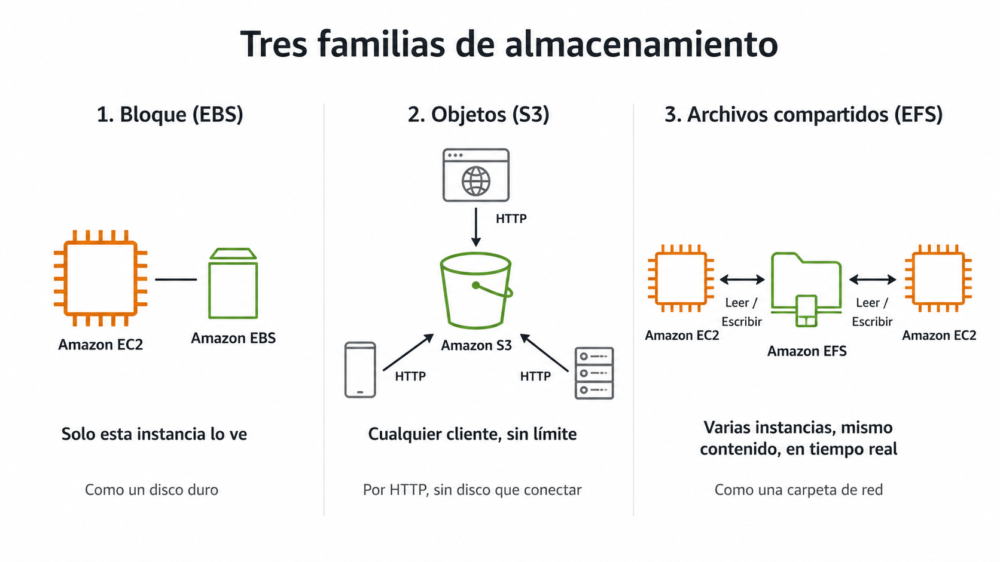
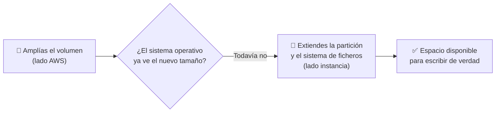
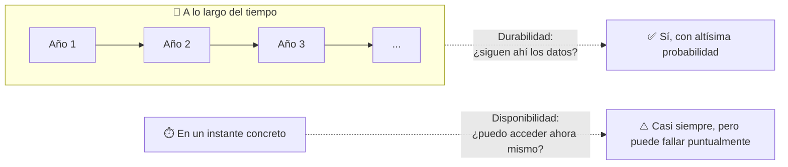
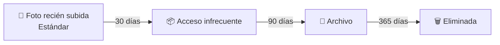
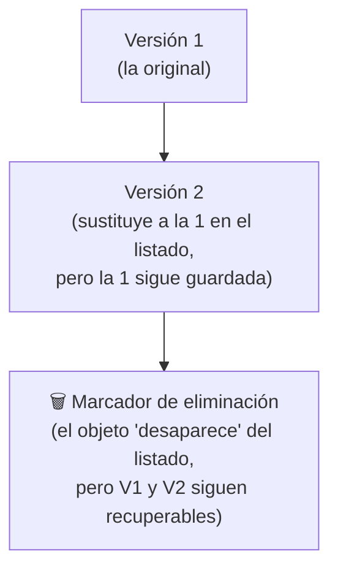
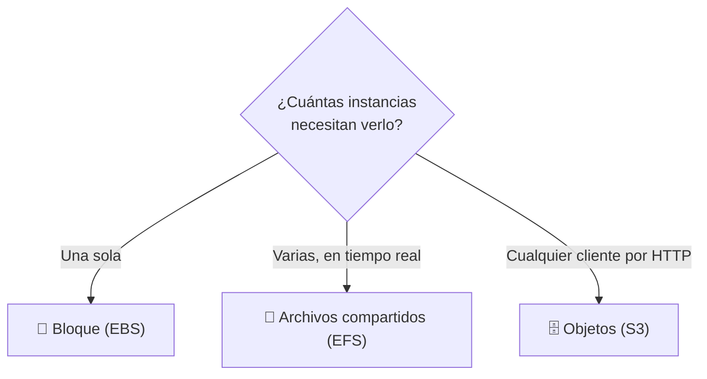

# 🧩 1. Servicios de almacenamiento

---

Ya usaste S3 en la primera sesión, sin detenerte a pensar en qué tipo de almacenamiento era ni por qué encajaba con un front estático. Hoy vas a trabajar con la plataforma de gestión de un festival de música, cuyas necesidades ya no encajan todas en S3: las fotos que suben los asistentes durante el evento, el disco de una instancia cuyo espacio se ha quedado corto, y una carpeta que dos instancias necesitan ver a la vez. Tres problemas de almacenamiento distintos, en la misma sesión — vas a resolverlos de verdad en la Actividad 3.1.

---

## 🧭 Tres familias, tres formas de guardar datos

No existe "el almacenamiento en la nube" en singular — existen tres familias distintas, y cada una guarda y sirve los datos de una forma físicamente distinta por debajo, no solo con un nombre distinto.

**Bloque** (EBS, *Elastic Block Store*): un espacio dividido en bloques de tamaño fijo, sin estructura de ficheros por sí solo — es el sistema operativo de la instancia el que lo formatea (con `ext4`, por ejemplo) y organiza carpetas encima. Por eso solo lo puede usar **una** instancia a la vez: está conectado a ella igual que un disco duro atornillado a una torre.

**Objetos** (S3): no hay disco que conectar a nada. Ya viste en la primera sesión que un **objeto** es cada fichero agrupado dentro de un **bucket** — lo que no viste entonces es que el bucket no tiene carpetas de verdad por dentro, es un espacio plano (`fotos/asistentes/img1.jpg` es un único nombre, no tres niveles). Cada objeto se pide por **HTTP** (*HyperText Transfer Protocol*, el mismo protocolo que usa tu navegador), así que cualquier cliente que hable HTTP puede leerlo o escribirlo.

**Archivos compartidos** (EFS, *Elastic File System*): el punto intermedio. Varias instancias montan la misma carpeta remota y la ven como si fuera su propio disco, con carpetas y ficheros de verdad. El protocolo que lo hace posible es **NFS** (*Network File System*): tu instancia trata una ubicación de red como si fuera local, y cualquier cambio se ve al instante desde cualquier otra instancia que la tenga montada.

Resumen de las tres, ya con los términos explicados:

| Familia | Cómo se accede | Cuántas instancias a la vez | Ejemplo típico |
|---|---|---|---|
| **Bloque** (EBS) | Como un disco duro, conectado directamente | Solo una | El disco raíz de tu instancia |
| **Objetos** (S3) | Por HTTP, a través de una URL | Sin límite práctico | Un sitio estático publicado en un bucket |
| **Archivos compartidos** (EFS) | Como una carpeta de red, por NFS | Varias, en tiempo real | Ficheros que varias instancias de una misma aplicación necesitan ver y escribir a la vez |

!!! example "El festival de música, tres respuestas distintas a "¿dónde lo guardo?""
    La plataforma del festival tiene las tres necesidades a la vez, y cada una pide una familia distinta. El espacio de logs de una de sus instancias se ha quedado corto — eso es el disco de esa máquina en concreto, bloque. Los asistentes suben fotos durante el evento, y quieres publicarlas para que cualquiera las vea desde su navegador — eso es objetos, S3. Y esas mismas fotos las tienen que servir dos instancias distintas a la vez, viendo ambas los mismos ficheros en tiempo real, sin que una tenga que copiárselos a la otra a mano — eso es archivos compartidos, EFS.

---

## 🔧 Ampliar un volumen EBS: dos partes, no una

Cuando el disco de bloque de una instancia (su volumen EBS) se queda corto de espacio —como el de logs del festival—, cambiar su tamaño en AWS no es todo el trabajo: es solo la mitad. Cuando se creó el volumen, AWS grabó una **tabla de particiones** (la estructura que dice "el disco mide X y está dividido así") en el propio disco, y el sistema operativo la leyó una vez al arrancar y se quedó con ese dato en memoria. Si amplías el volumen por fuera, esa tabla y esa memoria no se actualizan solas — el sistema operativo sigue creyendo que el disco mide lo que medía antes, aunque AWS ya le haya dado más espacio físico de verdad.

!!! warning "Un error habitual: dar por hecho que ya está"
    Es fácil ampliar el volumen en la consola, ver el nuevo tamaño reflejado ahí, y pensar que ya has terminado. Dentro de la instancia, un comando como `df -h` te seguiría mostrando el tamaño antiguo hasta que extiendas la partición y el sistema de ficheros — un par de comandos más, ejecutados dentro de la propia instancia, sin necesidad de reiniciarla ni cortar el servicio. Vas a hacer exactamente este proceso completo sobre el disco de logs del festival en la Actividad 3.1.

!!! tip "El tipo de volumen también existe, aunque hoy no lo elijas"
    Además del tamaño, un volumen EBS tiene un **tipo** que decide su rendimiento (`gp3` es el de propósito general, el que usarás por defecto en este módulo; existen otros pensados para bases de datos con mucha carga). No hace falta que profundices en esto ahora — igual que con los tipos de instancia, no hace falta memorizar el catálogo entero, solo saber que existe la opción si algún día la necesitas.

---

## 🧩 Durabilidad frente a disponibilidad

Dos palabras que se confunden constantemente, y no significan lo mismo:

- **Durabilidad**: la probabilidad de que tus datos sobrevivan con el tiempo, sin corromperse ni perderse. S3 la anuncia como un 99,999999999 % anual (once nueves) — para hacerte una idea de lo que significa ese número: si guardaras diez millones de objetos en S3, de media perderías uno cada diez mil años.
- **Disponibilidad**: la probabilidad de que puedas *acceder* a tus datos en un momento dado. Un servicio puede tener datos perfectamente duraderos y aun así estar temporalmente inaccesible por una caída puntual.

!!! tip "Un objeto puede sobrevivir a un fallo que sí te deja sin acceso un rato"
    Que las fotos del festival en S3 tengan una durabilidad altísima no significa que el servicio nunca vaya a tener una interrupción momentánea. Son dos garantías distintas, y las arquitecturas que vas a construir a partir del Tema 4 se preocupan de las dos por separado.

---

## 🔧 Clases de acceso y ciclo de vida

No todos los datos se acceden con la misma frecuencia, y S3 te deja elegir una **clase de almacenamiento** que ajusta el precio a ese patrón de uso. Las fotos del festival son el ejemplo perfecto: durante el fin de semana del evento se consultan constantemente, y un mes después casi nadie vuelve a mirarlas — salvo que haya una reclamación puntual.

El ahorro no sale de la nada: cuanto más barata la clase, menos preparado está el dato para devolvértelo al instante — es un intercambio, no una clase "mejor" y otras "peores".

- **Estándar** vive en el nivel más rápido de S3: cualquier petición se sirve al momento, y por eso es la que más cobra por GB guardado.
- **Acceso infrecuente** sigue siendo de lectura inmediata —no esperas nada—, pero te cobra una pequeña tarifa extra cada vez que recuperas un objeto, precisamente porque está pensada para que lo hagas poco. Guardar sale más barato; leer, un poco más caro.
- **Archivo** (Glacier) va más allá: el objeto no está listo para leerse tal cual. Tienes que pedir explícitamente una **restauración** y esperar —desde unos minutos hasta un día entero, según la urgencia que pagues— hasta que vuelve a estar disponible para descargar. No es que "tarde en cargar": hasta que no restauras, ni siquiera puedes empezar la descarga.

| Clase | Coste por GB | Coste de recuperación | Cuándo usarla |
|---|---|---|---|
| Estándar | Alto | Ninguno, acceso inmediato | Contenido que se lee constantemente (las fotos, durante el propio festival) |
| Acceso infrecuente | Medio | Bajo, pero acceso igual de inmediato | Copias de seguridad recientes, o las fotos ya pasadas unas semanas del evento |
| Archivo (Glacier) | Muy bajo | Alto, y hay que restaurar antes de poder leer | Datos que casi nunca se tocan pero hay que conservar, como las fotos meses después |

!!! warning "Glacier no vale para nada que puedas necesitar sin avisar"
    Si alguien te pide una foto del festival de hace seis meses y la tienes en Glacier, no se la puedes enviar en el momento — primero tienes que restaurarla y esperar. Es la contrapartida real de pagar céntimos por GB: perfecto para lo que sabes que no vas a tocar en mucho tiempo, inservible para cualquier cosa que puedan pedirte de un día para otro.

!!! note "Hay más clases de las que ves aquí"
    AWS ofrece alguna clase adicional (por ejemplo una que mueve el objeto sola entre clases según lo uses o no, sin que definas tú los días) que no vas a necesitar en este módulo — con estas tres te sobra para razonar cualquier caso que te vayas a encontrar aquí.

Cambiar de clase a mano, objeto a objeto, no escala. Para eso existen las **reglas de ciclo de vida**: políticas que mueven automáticamente un objeto de una clase a otra —o lo eliminan— pasado cierto tiempo, sin que tengas que vigilarlo.

---

## ⚙️ Versionado y cifrado

Dos protecciones más que S3 ofrece por configuración, no por trabajo extra tuyo.

**Versionado**: con el versionado desactivado (el comportamiento por defecto), subir un objeto con el mismo nombre que uno ya existente lo sobrescribe sin más — el anterior desaparece de verdad. Con el versionado activado, cada vez que subes un objeto con un nombre que ya existe, S3 no sobrescribe nada: le asigna un **ID de versión** nuevo y conserva las dos. Si alguien borra un objeto, tampoco desaparece de verdad — S3 le añade un **marcador de eliminación** (*delete marker*) que hace que deje de verse en el listado normal, pero la versión anterior sigue ahí debajo, recuperable.

**Cifrado**: los datos se guardan cifrados en disco por defecto, sin que tengas que gestionar tú las claves en la mayoría de los casos. Es otra pieza de la responsabilidad compartida: AWS cifra el disco físico, tú decides quién tiene permiso para leer el contenido.

!!! warning "El versionado no es una copia de seguridad completa"
    Versionar protege contra un borrado o una sobrescritura accidental de un objeto concreto, pero no sustituye a una estrategia de copias real si necesitas recuperar el estado completo de un bucket en un momento dado. Para lo que vas a hacer en este módulo, con versionado te sobra.

---

## 📊 Eligiendo familia según el patrón de acceso

Con las tres familias y sus matices ya vistos, la pregunta que te vas a hacer cada vez que necesites guardar algo nuevo es siempre la misma: ¿cuántas instancias necesitan verlo a la vez, y cómo se accede — por HTTP, como disco, o como carpeta compartida?

| Necesidad del festival | Cuántas instancias lo ven | Familia | Por qué |
|---|---|---|---|
| Espacio de logs de una instancia | Una sola | Bloque (EBS) | Nadie más necesita leer ese disco |
| Fotos publicadas para los asistentes | Cualquier navegador | Objetos (S3) | Acceso por HTTP, sin límite de clientes |
| Fotos que sirven dos instancias a la vez | Varias, en tiempo real | Archivos compartidos (EFS) | Las dos necesitan ver el mismo contenido al instante |

Vas a aplicar exactamente este criterio en la Actividad 3.1, sobre estas mismas tres necesidades del festival — cada una con la familia que le corresponde, no la misma para todo por comodidad.

---

## ✅ Ideas clave

??? tip "Abrir resumen"

    - Tres familias de almacenamiento, cada una con un mecanismo físico distinto por debajo: bloque (disco conectado a una sola instancia, sin sistema de ficheros propio), objetos (espacio plano accesible por HTTP, sin límite de clientes), archivos compartidos (carpeta de red por NFS, varias instancias a la vez).
    - Ampliar un volumen EBS son dos pasos: el tamaño en AWS, y la extensión de la partición y el sistema de ficheros dentro de la instancia — el segundo no ocurre solo, porque el sistema operativo cachea el tamaño del disco.
    - Durabilidad (que los datos sobrevivan con el tiempo) y disponibilidad (que puedas acceder a ellos ahora mismo) son garantías distintas, no la misma cosa con dos nombres.
    - Las clases de acceso ajustan precio a frecuencia de uso; las reglas de ciclo de vida mueven objetos entre clases automáticamente con el tiempo.
    - El versionado no sobrescribe ni borra de verdad: asigna IDs de versión nuevos y usa marcadores de eliminación — protege contra accidentes, pero no es una copia de seguridad completa.
    - La familia correcta depende de una sola pregunta: ¿cuántas instancias necesitan ver este dato a la vez, y cómo acceden a él?

Con esto ya tienes las piezas para la Actividad 3.1 — S3, EBS y EFS: tres soluciones de almacenamiento.
