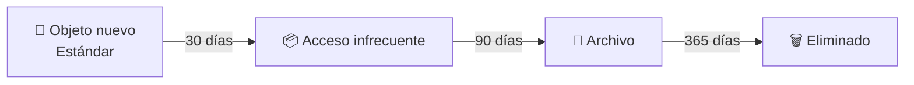
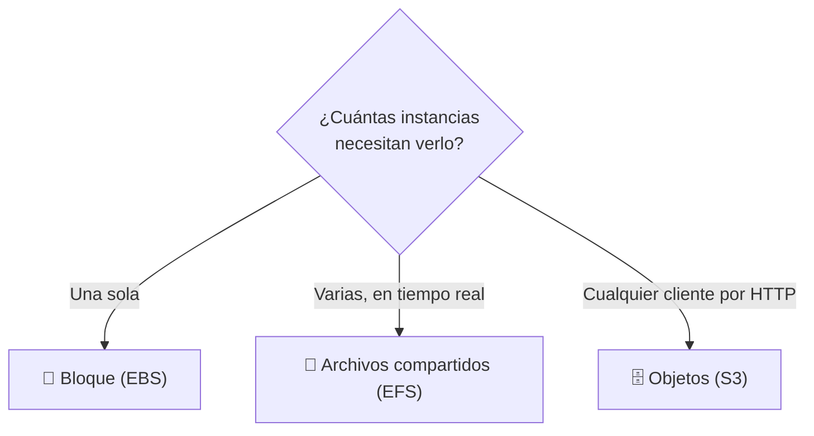

# 🧩 1. Servicios de almacenamiento

---

Ya usaste S3 en la primera sesión, sin detenerte a pensar en qué tipo de almacenamiento era ni por qué encajaba con un front estático. Hoy tocas las tres familias completas y aprendes a elegir entre ellas según lo que de verdad necesites guardar — porque a partir de esta sesión empiezas a tener necesidades de almacenamiento que ya no encajan solo en S3: el disco de una instancia, y una carpeta de ficheros que varias instancias necesitan ver a la vez.

---

## 🧭 Tres familias, tres formas de guardar datos

No existe "el almacenamiento en la nube" en singular — existen tres familias distintas, cada una pensada para un patrón de acceso diferente. Una de ellas se accede "por **HTTP**" (*HyperText Transfer Protocol*): el mismo protocolo que usa tu navegador para pedir cualquier página web, con sus operaciones típicas de leer y escribir un recurso a través de una URL — no hace falta tener el disco "conectado" a nada, cualquier cliente que hable HTTP puede pedir el objeto.

| Familia | Cómo se accede | Para qué encaja | Ejemplo típico |
|---|---|---|---|
| **Bloque** (EBS) | Como un disco duro, conectado a una única instancia | Sistema operativo, ficheros de la aplicación en ejecución | El disco raíz de tu instancia |
| **Objetos** (S3) | Por HTTP, sin límite práctico de instancias que lo lean a la vez | Contenido web, copias de seguridad, datos masivos | Un sitio estático publicado en un bucket |
| **Archivos compartidos** (EFS) | Como una carpeta de red, montable por varias instancias simultáneamente | Datos que varias máquinas necesitan ver y escribir a la vez | Ficheros que varias instancias de una misma aplicación necesitan ver y escribir a la vez |

!!! example "El mismo fichero, tres respuestas distintas a "¿dónde lo guardo?""
    Imagina una foto que forma parte del contenido de tu aplicación. Si solo la sirve una instancia, podría vivir en su disco (bloque) — pero si esa instancia se cae, la foto se va con ella. Si la publicas como parte de un sitio estático, S3 (objetos) es perfecto. Si tienes varias instancias sirviendo la misma aplicación a la vez y todas necesitan ver la misma foto recién subida, ni el disco de una sola instancia ni S3 puro resuelven bien ese "verla todas a la vez, en tiempo real" — ahí es donde entra EFS.

---

## 🧩 Durabilidad frente a disponibilidad

Dos palabras que se confunden constantemente, y no significan lo mismo:

- **Durabilidad**: la probabilidad de que tus datos sobrevivan con el tiempo, sin corromperse ni perderse. S3, por ejemplo, replica automáticamente cada objeto en varias zonas de disponibilidad.
- **Disponibilidad**: la probabilidad de que puedas *acceder* a tus datos en un momento dado. Un servicio puede tener datos perfectamente duraderos y aun así estar temporalmente inaccesible por una caída puntual.

!!! tip "Un objeto puede sobrevivir a un fallo que sí te deja sin acceso un rato"
    Que tus datos en S3 tengan una durabilidad altísima no significa que el servicio nunca vaya a tener una interrupción momentánea. Son dos garantías distintas, y las arquitecturas que vas a construir a partir del Tema 4 se preocupan de las dos por separado.

---

## 🔧 Clases de acceso y ciclo de vida

No todos los datos se acceden con la misma frecuencia, y S3 te deja elegir una **clase de almacenamiento** que ajusta el precio a ese patrón de uso.

| Clase | Coste por GB | Coste de recuperación | Cuándo usarla |
|---|---|---|---|
| Estándar | Alto | Ninguno, acceso inmediato | Contenido que se lee constantemente (tu front estático) |
| Acceso infrecuente | Medio | Bajo, por recuperación | Copias de seguridad recientes |
| Archivo (Glacier) | Muy bajo | Alto, y con retardo de horas | Datos que casi nunca se tocan pero hay que conservar |

Cambiar de clase a mano, objeto a objeto, no escala. Para eso existen las **reglas de ciclo de vida**: políticas que mueven automáticamente un objeto de una clase a otra —o lo eliminan— pasado cierto tiempo, sin que tengas que vigilarlo.

---

## ⚙️ Versionado y cifrado

Dos protecciones más que S3 ofrece por configuración, no por trabajo extra tuyo:

- **Versionado**: en vez de sobrescribir un objeto al subir uno nuevo con el mismo nombre, S3 conserva ambas versiones. Si borras un objeto "por accidente", no desaparece — solo se marca como borrado, y puedes recuperar la versión anterior. Lo vas a necesitar en la Actividad 3.1.
- **Cifrado**: los datos se guardan cifrados en disco por defecto, sin que tengas que gestionar tú las claves en la mayoría de los casos. Es otra pieza de la responsabilidad compartida: AWS cifra el disco físico, tú decides quién tiene permiso para leer el contenido.

!!! warning "El versionado no es una copia de seguridad completa"
    Versionar protege contra un borrado o una sobrescritura accidental de un objeto concreto, pero no sustituye a una estrategia de copias real si necesitas recuperar el estado completo de un bucket en un momento dado. Para lo que vas a hacer en este módulo, con versionado te sobra.

---

## 📊 Eligiendo familia según el patrón de acceso

Con las tres familias y sus matices ya vistos, la pregunta que te vas a hacer cada vez que necesites guardar algo nuevo es siempre la misma: ¿cuántas instancias necesitan verlo a la vez, y cómo se accede — por HTTP, como disco, o como carpeta compartida?

Vas a aplicar exactamente este criterio en la Actividad 3.1: tres necesidades de almacenamiento distintas, cada una resuelta con la familia que le corresponde — no la misma familia para todo por comodidad.

---

## ✅ Ideas clave

??? tip "Abrir resumen"

    - Tres familias de almacenamiento: bloque (una instancia), objetos (por HTTP, cualquier cliente), archivos compartidos (varias instancias a la vez).
    - Durabilidad (que los datos sobrevivan) y disponibilidad (que puedas acceder a ellos ahora) son garantías distintas, no la misma cosa con dos nombres.
    - Las clases de acceso ajustan precio a frecuencia de uso; las reglas de ciclo de vida mueven objetos entre clases automáticamente con el tiempo.
    - El versionado protege contra borrados y sobrescrituras accidentales de un objeto concreto — no es una copia de seguridad completa.
    - La familia correcta depende de una sola pregunta: ¿cuántas instancias necesitan ver este dato a la vez, y cómo acceden a él?

Con esto ya tienes las piezas para la Actividad 3.1 — S3, EBS y EFS: tres soluciones de almacenamiento.
