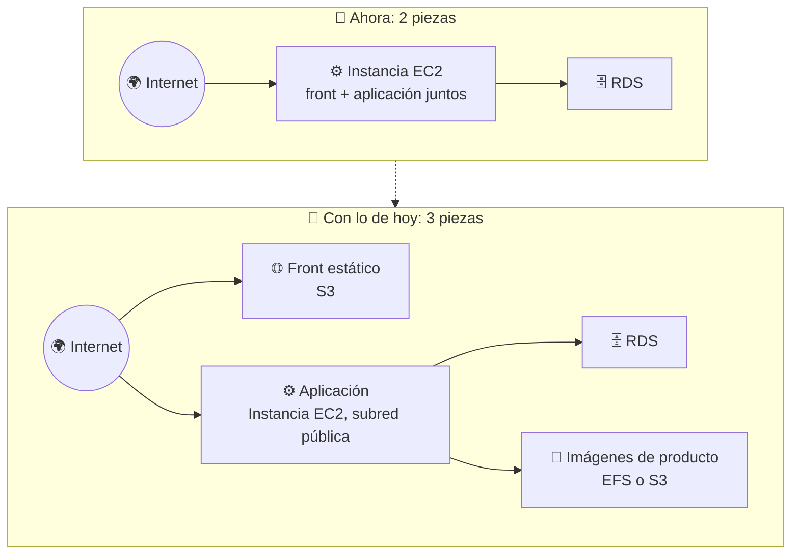
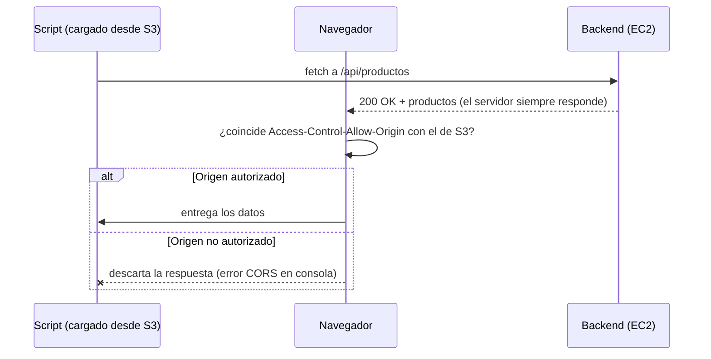
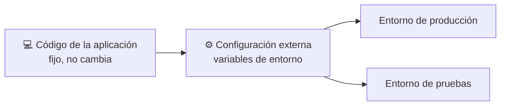
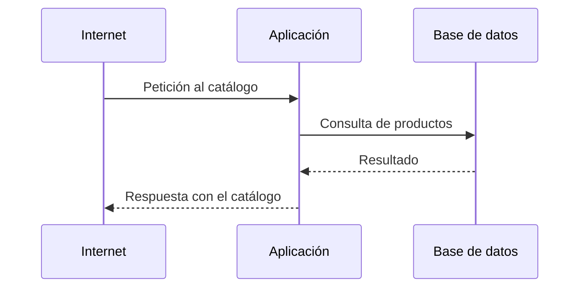

# 🧩 3. Primera arquitectura cloud completa

{ type=application/pdf style="width:100%;min-height:80vh" }

!!!info "Descarga de diapositivas"
    [Descarga las diapositivas](diapositivas/arquitectura-completa.pptx){target="_blank" rel="noopener"}

---

Tienes ya todas las piezas sueltas: red con capas públicas y privadas, instancias, almacenamiento de objetos y compartido, y una base de datos gestionada sin credenciales en el código. Hoy no aprendes ningún servicio nuevo — hoy las juntas todas en una sola arquitectura y ves, por primera vez, el conjunto completo funcionando como un solo sistema. Es el cierre natural de todo lo construido desde la primera sesión, y el punto de partida de todo lo que viene: alta disponibilidad, monitorización, coste, automatización — todo lo del resto del módulo se construye encima de esto.

---

## 🧭 Arquitectura de tres capas en la nube

Ya has visto el patrón de capas aplicado a la red en el Tema 2 (borde, aplicación, datos). Hoy ese patrón deja de ser solo una regla de grupos de seguridad y se convierte en una arquitectura completa: cada capa es un servicio real, con una responsabilidad concreta y ninguna otra.

Conviene tener claro el punto de partida antes de ver el objetivo. Ahora mismo, justo después de lo que dejaste montado en la sesión de bases de datos, Escaparate vive como **dos piezas**, no tres: una única instancia EC2 ejecuta la aplicación y, dentro del mismo artefacto desplegado, sirve también el HTML del catálogo —front y aplicación comparten servidor y proceso—, mientras que la base de datos ya es la única pieza que vive separada, en RDS. Hoy separas también el front, y el resultado pasa a ser tres piezas independientes, cada una en su propio servicio:

Fíjate en que el front y la aplicación reciben tráfico de internet por caminos distintos —el front directamente desde S3, la aplicación desde su propia instancia—, y que solo la aplicación tiene permiso para hablar con la base de datos. Ninguna capa se salta a la de al lado — es el mismo **principio de mínimo privilegio** que has aplicado con los grupos de seguridad del Tema 2, ahora aplicado a la arquitectura entera: cada pieza solo puede hablar con la siguiente, nunca con cualquiera.

---

## 🔓 CORS: por qué el backend necesita permitirlo

El front vive en una URL de S3 y la aplicación en la IP de una instancia EC2. Para el navegador, son **orígenes distintos**: un origen se define por tres datos —protocolo, dominio y puerto—, y con que uno solo de los tres cambie ya cuentan como orígenes diferentes.

| | Protocolo | Dominio | Puerto |
|---|---|---|---|
| Front (S3) | `http` | `escaparate-front-xxx.s3-website-...amazonaws.com` | 80 |
| Backend (EC2) | `http` | `3.84.12.9` | `8080` |

Aquí el dominio y el puerto son distintos, así que son dos orígenes distintos. Por defecto, un script cargado desde un origen no puede leer la respuesta de una petición hecha a otro origen. Esta restricción no protege al servidor: te protege **a ti**.

!!! example "Por qué existe esta restricción: el banco y la pestaña maliciosa"
    Imagina que tienes el banco abierto en una pestaña, con sesión iniciada, y en otra pestaña entras, sin querer, en una página maliciosa. Sin esta restricción, el script de esa página podría enterarse de tus datos del banco sin robarte nada directamente:

    1. Cualquier script puede pedir datos a cualquier URL, aunque no sea la suya.
    2. El navegador guarda las cookies por dominio, no por página: si tienes sesión en el banco, cualquier petición dirigida a ese dominio lleva tu cookie puesta, venga de donde venga.
    3. Por eso la petición del script malicioso llega al banco con tu cookie de sesión, y el banco responde como si fueras tú.
    4. Aquí es donde actúa la restricción: el navegador deja salir la petición —eso ya no lo puede evitar—, pero no deja que el script que la originó **lea la respuesta**. Ojo: si en vez de consultar datos la petición fuera un `POST` que cambia algo (por ejemplo, una transferencia), ese cambio ya se habría hecho igualmente, aunque el script nunca vea la confirmación. Existe otra técnica que sí lo arregla, pero no la vas a ver en este módulo: no es un tema de nube, es un tema de seguridad en el desarrollo de la propia aplicación, y no afecta a nada de lo que construyes en Escaparate.

**CORS** (*Cross-Origin Resource Sharing*) es la excepción a esa restricción: el servidor puede decir "confío en este origen concreto, dale la respuesta". Lo hace añadiendo una cabecera `Access-Control-Allow-Origin` a sus respuestas, y el navegador la respeta.

Lo importante es **cuándo** se comprueba esa cabecera — no antes de responder, sino después:

El servidor responde igual en los dos casos — nunca sabe si va a bloquear nada, ni le importa. Es el navegador quien, ya con la respuesta en la mano, decide si se la pasa al script o la descarta. Por eso, si abres la pestaña de red durante un fallo de CORS, vas a ver la petición completada con código 200, y aun así el script se queda sin datos.

!!! tip "Cómo lo activas hoy"
    El código de Escaparate ya sabe leer qué origen autorizar —viene programado para escuchar la variable `APP_CORS_ALLOWED_ORIGINS`—; lo que haces hoy en la actividad es decirle, mediante esa variable, cuál es el origen real de tu bucket. Vas a necesitar entender este mecanismo para responder a la Reflexión de la actividad.

---

## 🧩 Separación de responsabilidades

Cada capa hace una cosa, y **solo** esa cosa. El front no sabe nada de bases de datos; la aplicación no sirve ficheros estáticos; la base de datos no tiene ni idea de qué aspecto tiene el catálogo en el navegador.

| Capa | Responsabilidad | Lo que NO hace |
|---|---|---|
| Front (S3) | Servir HTML, CSS y JavaScript | No ejecuta lógica de negocio, no toca la base de datos |
| Aplicación (EC2) | Procesar peticiones, aplicar reglas de negocio | No sirve el front estático, no almacena datos de forma permanente |
| Base de datos (RDS) | Guardar y devolver datos de forma consistente | No sabe presentar nada, no toma decisiones de negocio |

!!! tip "Por qué importa esta separación, más allá del orden"
    Si mañana necesitas escalar solo la aplicación porque hay más tráfico, no tienes que tocar ni el front ni la base de datos — están desacoplados. Esa independencia es la que hace posible el Tema 4, donde vas a poner varias copias de la aplicación detrás de un balanceador sin cambiar nada del resto.

---

## 🔧 Configuración externa

La aplicación necesita saber dónde está su base de datos, y no debe llevar esa dirección escrita dentro del código —ya lo has visto la sesión pasada con las credenciales, y hoy se generaliza a todo lo que cambia según el entorno: el endpoint de RDS, la ruta del sistema de ficheros compartido, la URL del front.

`DB_HOST` y `DB_PASSWORD` —el endpoint y la contraseña que has visto en el apartado anterior, esta última entregada por Secrets Manager— no son dos mecanismos distintos: los dos son configuración externa. Da igual que el dato sea público (un endpoint) o un secreto (una contraseña) — ninguno de los dos vive escrito dentro del código, y los dos llegan a la aplicación de la misma forma, como variables de entorno en el arranque.

!!! example "El mismo código, dos entornos distintos"
    Si el endpoint de la base de datos viviera escrito dentro del código, tendrías que modificar y volver a desplegar la aplicación entera solo para apuntar a una base de datos de pruebas en vez de la real. Con configuración externa, el mismo artefacto sirve para los dos entornos — solo cambian las variables que le pasas al arrancar.

---

## ⚙️ Cadena de dependencias entre capas

Cada capa depende de que la de detrás esté disponible, y esa cadena tiene un orden que conviene tener claro antes de desplegar nada:

Si la base de datos no está lista cuando arranca la aplicación, la aplicación falla al intentar conectarse — no es un fallo aleatorio, es una dependencia no resuelta en el orden correcto. Vas a comprobar esto de primera mano en la Actividad 3.3, cuando despliegues la arquitectura completa y algo, inevitablemente, no arranque a la primera.

Cuando pase, la solución casi nunca es cambiar el orden de creación de los recursos —a veces ni se puede controlar del todo—, sino hacer que la aplicación **reintente** la conexión unos segundos antes de darse por vencida, en vez de fallar a la primera. Es un patrón que verás repetido en el resto del módulo: no evitar que una dependencia tarde en estar lista, sino esperar a que lo esté.

!!! tip "Antes de rehacer nada, mira los logs"
    Si algo no arranca en la Actividad 3.3, resiste la tentación de borrar y volver a crear la instancia a ciegas. Revisa primero el registro de arranque (`/var/log/cloud-init-output.log`) para ver en qué paso se ha quedado el script — casi siempre el mensaje de error ya te dice si el problema es la base de datos, la red o un permiso, y te ahorra repetir el despliegue entero por algo que se corrige en un minuto.

---

## 📊 Qué se rompe cuando una pieza se mueve

Una arquitectura de capas separa responsabilidades, pero no las hace independientes del todo: si cambias el endpoint de la base de datos y no actualizas la configuración de la aplicación, la aplicación deja de funcionar aunque la base de datos esté perfectamente sana. El fallo no está en la pieza que se movió — está en la referencia que se quedó apuntando al sitio viejo.

| Qué se mueve | Qué se rompe si no se actualiza la referencia |
|---|---|
| Endpoint de la base de datos (por ejemplo, tras recrear la instancia RDS) | La aplicación no puede conectar |
| Ruta o dirección del sistema de ficheros compartido | La aplicación no encuentra las imágenes de producto |
| Dirección del front | Los enlaces del catálogo hacia sus propios recursos dejan de resolver |

---

## 🌐 Puntos únicos de fallo

Un **punto único de fallo** (*Single Point of Failure*, SPOF) es cualquier pieza de la arquitectura tal que, si falla ella sola, se cae el sistema entero. La arquitectura que vas a construir hoy tiene varios, a propósito — identificarlos es precisamente el objetivo de la Parte B de la actividad, y la lista que generes hoy es el punto de partida de las próximas sesiones, donde vas a resolver esos mismos puntos uno a uno.

Que una arquitectura no tenga SPOF —o los tenga resueltos— es justo lo que significa que sea **resiliente**: que siga funcionando, aunque sea con alguna pieza degradada, cuando algo falla, en vez de caerse entera. Es la palabra que vas a encontrar en el criterio de evaluación de esta sesión, y hoy es donde empieza: no puedes hacer una arquitectura resiliente sin antes saber exactamente dónde está cada punto único de fallo.

En la arquitectura de hoy, sin ir más lejos, ya puedes señalar tres:

| Pieza | Por qué es un SPOF hoy |
|---|---|
| La instancia EC2 de la aplicación | Es una sola — si se para o se bloquea, no hay ninguna copia que responda en su lugar |
| La instancia RDS (sin Multi-AZ) | Sin la copia en espera que has visto en el apartado anterior, un fallo de la zona donde vive tumba la base de datos entera |
| La región donde despliegas todo | Toda la arquitectura vive en una única región — un fallo a ese nivel, aunque sea raro, se lleva por delante las tres capas a la vez |

!!! warning "Tener SPOF hoy no es un error de diseño — es el punto de partida"
    Toda arquitectura empieza con puntos únicos de fallo; lo que la hace madura no es no tenerlos desde el primer día, sino saber nombrarlos y decidir cuáles merece la pena resolver primero. Hoy los identificas; en el Tema 4 empiezas a eliminarlos.

---

## ✅ Ideas clave

??? tip "Abrir resumen"

    - Arquitectura de tres capas: front (S3), aplicación (EC2) y datos (RDS), cada una con una única responsabilidad y sin saltarse ninguna — cada capa solo habla con la siguiente, el mismo principio de mínimo privilegio de los grupos de seguridad aplicado a toda la arquitectura.
    - Front y aplicación viven en orígenes distintos (protocolo, dominio o puerto diferentes) — por defecto el navegador bloquea que un script lea respuestas de otro origen, para proteger al usuario, no al servidor. CORS es la excepción explícita que el backend concede a un origen concreto mediante una cabecera; el bloqueo lo aplica siempre el navegador, después de que el servidor ya haya respondido.
    - La separación de responsabilidades permite escalar o cambiar una capa sin tocar las demás.
    - La configuración externa (variables de entorno) permite que el mismo código sirva para varios entornos, sin credenciales ni endpoints fijos dentro del código — el endpoint de RDS y la contraseña de Secrets Manager llegan por el mismo mecanismo.
    - Las capas dependen unas de otras en un orden concreto — si una referencia se queda apuntando al sitio viejo tras un cambio, la capa que depende de ella falla aunque la otra esté sana. Si algo no arranca por una dependencia que tarda, la solución habitual es reintentar la conexión, no rehacer el despliegue a ciegas.
    - Un punto único de fallo es cualquier pieza cuya caída tumba el sistema entero — hoy hay al menos tres (la instancia de la aplicación, el RDS sin Multi-AZ, la región única). Una arquitectura **resiliente** es la que sigue funcionando cuando uno de esos puntos falla; identificarlos hoy es el primer paso para resolverlos en las próximas sesiones.

Con esto ya tienes las piezas para la Actividad 3.3 — Arquitectura de tres capas: front, aplicación y base de datos.
