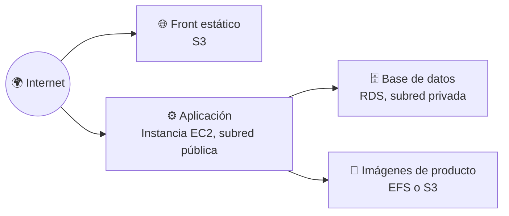
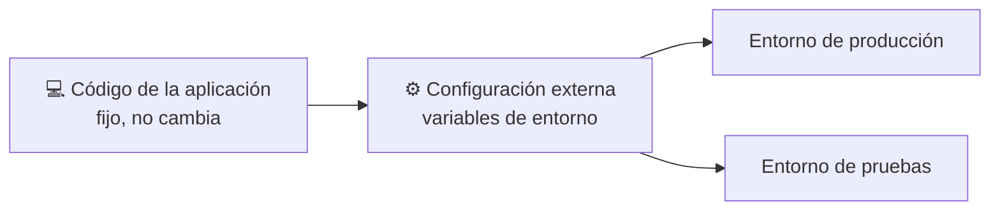
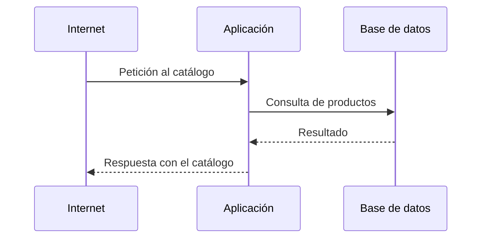

# 🧩 3. Primera arquitectura cloud completa

---

Tienes ya todas las piezas sueltas: red con capas públicas y privadas, instancias, almacenamiento de objetos y compartido, y una base de datos gestionada sin credenciales en el código. Hoy no aprendes ningún servicio nuevo — hoy las juntas todas en una sola arquitectura y ves, por primera vez, el conjunto completo funcionando como un solo sistema. Es el cierre natural de todo lo construido desde la primera sesión, y el punto de partida de todo lo que viene: alta disponibilidad, monitorización, coste, automatización — todo lo del resto del módulo se construye encima de esto.

---

## 🧭 Arquitectura de tres capas en la nube

Ya viste el patrón de capas aplicado a la red en el Tema 2 (borde, aplicación, datos). Hoy ese patrón deja de ser solo una regla de grupos de seguridad y se convierte en una arquitectura completa: cada capa es un servicio real, con una responsabilidad concreta y ninguna otra.

Fíjate en que el front y la aplicación reciben tráfico de internet por caminos distintos —el front directamente desde S3, la aplicación desde su propia instancia—, y que solo la aplicación tiene permiso para hablar con la base de datos. Ninguna capa se salta a la de al lado.

---

## 🧩 Separación de responsabilidades

Cada capa hace una cosa, y **solo** esa cosa. El front no sabe nada de bases de datos; la aplicación no sirve ficheros estáticos; la base de datos no tiene ni idea de qué aspecto tiene el catálogo en el navegador.

| Capa | Responsabilidad | Lo que NO hace |
|---|---|---|
| Front (S3) | Servir HTML, CSS y JavaScript | No ejecuta lógica de negocio, no toca la base de datos |
| Aplicación (EC2) | Procesar peticiones, aplicar reglas de negocio | No sirve el front estático, no almacena datos de forma permanente |
| Base de datos (RDS) | Guardar y devolver datos de forma consistente | No sabe presentar nada, no toma decisiones de negocio |

!!! tip "Por qué importa esta separación, más allá del orden"
    Si mañana necesitas escalar solo la aplicación porque hay más tráfico, no tienes que tocar ni el front ni la base de datos — están desacoplados. Esa independencia es la que hace posible el Tema 4, donde vas a poner varias copias de la aplicación detrás de un balanceador sin cambiar nada del resto.

---

## 🔧 Configuración externa

La aplicación necesita saber dónde está su base de datos, y no debe llevar esa dirección escrita dentro del código —ya lo viste la sesión pasada con las credenciales, y hoy se generaliza a todo lo que cambia según el entorno: el endpoint de RDS, la ruta del sistema de ficheros compartido, la URL del front.

!!! example "El mismo código, dos entornos distintos"
    Si el endpoint de la base de datos viviera escrito dentro del código, tendrías que modificar y volver a desplegar la aplicación entera solo para apuntar a una base de datos de pruebas en vez de la real. Con configuración externa, el mismo artefacto sirve para los dos entornos — solo cambian las variables que le pasas al arrancar.

---

## ⚙️ Cadena de dependencias entre capas

Cada capa depende de que la de detrás esté disponible, y esa cadena tiene un orden que conviene tener claro antes de desplegar nada:

Si la base de datos no está lista cuando arranca la aplicación, la aplicación falla al intentar conectarse — no es un fallo aleatorio, es una dependencia no resuelta en el orden correcto. Vas a comprobar esto de primera mano en la Actividad 3.3, cuando despliegues la arquitectura completa y algo, inevitablemente, no arranque a la primera.

---

## 📊 Qué se rompe cuando una pieza se mueve

Una arquitectura de capas separa responsabilidades, pero no las hace independientes del todo: si cambias el endpoint de la base de datos y no actualizas la configuración de la aplicación, la aplicación deja de funcionar aunque la base de datos esté perfectamente sana. El fallo no está en la pieza que se movió — está en la referencia que se quedó apuntando al sitio viejo.

| Qué se mueve | Qué se rompe si no se actualiza la referencia |
|---|---|
| Endpoint de la base de datos (por ejemplo, tras recrear la instancia RDS) | La aplicación no puede conectar |
| Ruta o dirección del sistema de ficheros compartido | La aplicación no encuentra las imágenes de producto |
| Dirección del front | Los enlaces del catálogo hacia sus propios recursos dejan de resolver |

---

## 🌐 Puntos únicos de fallo

Un **punto único de fallo** (*Single Point of Failure*, SPOF) es cualquier pieza de la arquitectura tal que, si falla ella sola, se cae el sistema entero. La arquitectura que vas a construir hoy tiene varios, a propósito — identificarlos es precisamente el objetivo de la Parte B de la actividad, y la lista que generes hoy es el guion de las sesiones 8 y 11, donde vas a resolver esos mismos puntos uno a uno.

!!! warning "Tener SPOF hoy no es un error de diseño — es el punto de partida"
    Toda arquitectura empieza con puntos únicos de fallo; lo que la hace madura no es no tenerlos desde el primer día, sino saber nombrarlos y decidir cuáles merece la pena resolver primero. Hoy los identificas; en el Tema 4 empiezas a eliminarlos.

---

## ✅ Ideas clave

??? tip "Abrir resumen"

    - Arquitectura de tres capas: front (S3), aplicación (EC2) y datos (RDS), cada una con una única responsabilidad y sin saltarse ninguna.
    - La separación de responsabilidades permite escalar o cambiar una capa sin tocar las demás.
    - La configuración externa (variables de entorno) permite que el mismo código sirva para varios entornos, sin credenciales ni endpoints fijos dentro del código.
    - Las capas dependen unas de otras en un orden concreto — si una referencia se queda apuntando al sitio viejo tras un cambio, la capa que depende de ella falla aunque la otra esté sana.
    - Un punto único de fallo es cualquier pieza cuya caída tumba el sistema entero — identificarlos hoy es el primer paso para resolverlos en las próximas sesiones.

Con esto ya tienes las piezas para la Actividad 3.3 — Arquitectura de tres capas: front, aplicación y base de datos.
