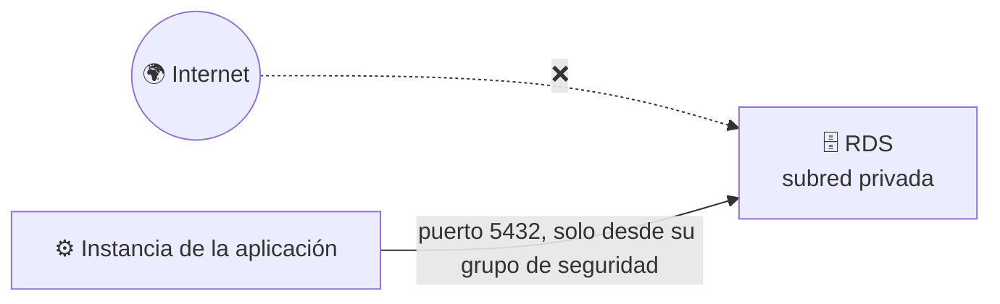
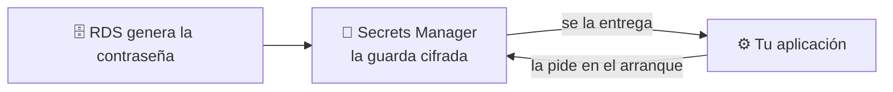
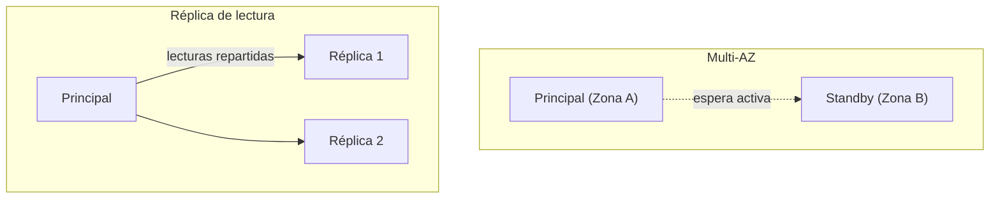

<a id="bases-datos-gestionadas"></a>

# 🧩 2. Bases de datos gestionadas

---

Hasta ahora, los datos con los que has trabajado en este módulo han vivido en ficheros: un front en S3, unas imágenes en EFS. Hoy llega la primera pieza que necesita algo más estructurado — una base de datos de verdad, con sus filas y sus relaciones. Una **base de datos relacional** guarda esa información en tablas con filas y columnas, relacionadas entre sí (un libro pertenece a una categoría, aparece en varios préstamos...), y un **motor de base de datos** (como PostgreSQL) es el programa que la gestiona: guarda los datos en disco, responde a las consultas y se asegura de que nada se corrompa aunque varias peticiones lleguen a la vez.

Ese motor podrías instalarlo tú mismo dentro de una instancia, exactamente igual que instalarías cualquier otro programa. Hoy vas a ver la alternativa: contratarlo como servicio gestionado, y entender exactamente qué te ahorra y qué renuncias a cambio.

---

## 🧭 Instalar frente a consumir como servicio

Instalar PostgreSQL dentro de una instancia EC2 te da control total: tú decides la versión exacta, tú aplicas los parches, tú configuras las copias de seguridad, tú resuelves qué pasa si el disco se llena a las tres de la mañana, y si la base de datos principal se cae, tú tienes que montar tú mismo la **conmutación por error** (*failover*): el proceso de detectar que ha fallado y pasar a una copia de reserva para no quedarte sin servicio. Un servicio de base de datos gestionado —como **RDS** (*Relational Database Service*)— se queda con buena parte de ese trabajo operativo, a cambio de que renuncies a acceder al sistema operativo por debajo.

| | Base de datos instalada por ti | Base de datos gestionada (RDS) |
|---|---|---|
| Tamaño de cómputo | Eliges el tipo de instancia EC2 (`t3`, `m5`...) | Eliges una clase de instancia de base de datos (`db.t3`, `db.m5`...) — mismo catálogo de tamaños que ya conoces, con el prefijo `db.` delante |
| Parches del motor | Los aplicas tú, cuando tú decides | Los aplica AWS en una ventana de mantenimiento |
| Copias de seguridad | Las configuras y vigilas tú | Automáticas, con recuperación a un punto en el tiempo |
| Conmutación por error (*failover*) | La montas tú, si la necesitas | Incluida si activas Multi-AZ (lo ves más abajo) |
| Acceso al sistema operativo | Total | Ninguno — ni siquiera por SSH |
| Control de versión exacta y extensiones | Total | El que RDS permita para ese motor |

"Recuperación a un punto en el tiempo" no significa solo volver a la foto de la última copia diaria: RDS guarda también los cambios que ha habido desde entonces, así que puedes restaurar la base de datos a cualquier segundo concreto dentro de la ventana de retención — por ejemplo, a las 10:47 de esta mañana, un minuto antes de que alguien borrara una tabla por error, sin perder todo lo escrito el resto del día.

!!! example "El mismo trabajo, en manos distintas"
    Piensa en la diferencia entre tener coche propio y usar un servicio de coche con conductor. Con el tuyo decides el mecánico, el taller, cuándo lo llevas a revisar — pero si se avería un domingo, el problema es tuyo. Con el servicio, no eliges el mecánico ni ves el motor por dentro, pero si el coche falla, no es tu problema resolverlo: te mandan otro.

Ninguna opción es "la buena" en abstracto — es la misma decisión de la escalera IaaS→PaaS→SaaS que viste en la sesión 1, aplicada ahora a bases de datos concretas.

!!! tip "RDS no es solo PostgreSQL"
    A lo largo de esta sesión vas a trabajar con PostgreSQL porque es el motor de la Actividad 3.2, pero RDS gestiona varios motores distintos — MySQL, MariaDB, PostgreSQL, SQL Server, Oracle, e incluso **Aurora**, un motor propio de AWS compatible con MySQL y PostgreSQL pero reescrito por dentro para ir más rápido y tolerar fallos mejor. La decisión de "instalar frente a servicio gestionado" que acabas de ver es la misma sea cual sea el motor que elijas.

---

## 🧩 Subred privada y grupos de seguridad de datos

La base de datos de tu aplicación va, sin excepción, en subred privada — lo estableciste como regla en el Tema 2, y hoy la aplicas de verdad. RDS, además, no se conecta a cualquiera que se lo pida: necesita su propio grupo de seguridad, con una única regla de entrada — el puerto de la base de datos (5432 para PostgreSQL), y **solo** desde el grupo de seguridad de la instancia de la aplicación, nunca desde `0.0.0.0/0`.

Para conectarte, tu aplicación necesita saber a qué dirección dirigirse: AWS te da un **endpoint**, un nombre de dirección único que apunta a tu base de datos (por ejemplo `biblioteca-db.abc123.us-east-1.rds.amazonaws.com`) y que sustituye a la dirección IP de siempre — cómodo porque, si AWS mueve la base de datos por dentro tras una conmutación por error, ese nombre sigue apuntando al sitio correcto sin que tú tengas que actualizar nada.



!!! danger "Una base de datos accesible desde internet no es un escenario hipotético"
    Bases de datos con el puerto abierto a `0.0.0.0/0` y sin contraseña son de los hallazgos más habituales cuando alguien escanea internet en busca de configuraciones abiertas. La regla de "solo desde el grupo de seguridad de la aplicación" no es una buena práctica opcional — es la diferencia entre una base de datos privada de verdad y una que solo lo parece.

---

## 🔐 La contraseña de la base de datos no se escribe en ningún sitio

Toda base de datos tiene una contraseña de acceso, y esa contraseña plantea el mismo problema que ya viste con el `Arn` de la sesión 1: alguien —o algo— tiene que guardarla en algún sitio para poder usarla. Escribirla dentro del código de la aplicación, o en un fichero de configuración que subes al repositorio, significa que cualquiera con acceso a ese código la tiene también a ella.

**AWS Secrets Manager** resuelve esto guardando la contraseña de forma cifrada, fuera del código, y entregándosela a quien la necesite solo en el momento de conectarse — nunca queda escrita en ningún fichero que tú edites o subas a ningún sitio. Al crear la base de datos, puedes pedirle a RDS que genere la contraseña él mismo y la guarde directamente en Secrets Manager, sin que ni siquiera tú llegues a verla ni a copiarla a mano.



!!! tip "La misma idea que vas a generalizar en el Tema 5"
    Hoy lo aplicas solo a la contraseña de la base de datos, pero el principio —ningún secreto escrito en el código ni en el repositorio— se repite con cualquier credencial que uses el resto del módulo. En el Tema 5 vas a verlo formalizado como una regla general de gestión de identidad y accesos.

---

## 🔌 Cómo llega esto a tu aplicación, en la práctica

Endpoint, grupo de seguridad, contraseña en Secrets Manager: son piezas sueltas hasta que tu aplicación las junta para conectarse de verdad. El patrón es siempre el mismo, y es el que vas a montar en la Actividad 3.2: en el arranque de la instancia —el mismo mecanismo de *user data* que ya usaste en la Actividad 2.3— un script pide el endpoint y la contraseña por CLI, y los deja como variables de entorno que la aplicación lee al arrancar, nunca escritos a mano en ningún fichero de configuración:

```bash
# El endpoint de RDS: el nombre que sustituye a la IP fija de siempre
export DB_HOST=$(aws rds describe-db-instances \
  --db-instance-identifier mi-base-de-datos \
  --query "DBInstances[0].Endpoint.Address" --output text)

# La contraseña, tal como la guardó Secrets Manager, sin haberla visto a mano
aws secretsmanager get-secret-value \
  --secret-id mi-base-de-datos-secret \
  --query "SecretString" --output text
```

La segunda llamada devuelve un JSON con la contraseña (y algún dato más) dentro — el script de arranque lo extrae de ahí y lo deja en `DB_PASSWORD`, sin que en ningún momento haya pasado por tus manos ni por un fichero que puedas subir por error a un repositorio.

!!! tip "No hace falta ningún permiso nuevo — ya sabes montar esto"
    Este script necesita permiso para llamar a `describe-db-instances` y a `get-secret-value`, y eso lo da el mismo mecanismo que ya conoces: el perfil de instancia de IAM (`LabInstanceProfile`) que has usado en el Tema 2 y en la Actividad 3.1 para dar permisos a una instancia sin credenciales fijas.

Con `DB_HOST` y `DB_PASSWORD` ya como variables de entorno, la aplicación se conecta igual que se conectaría a cualquier base de datos — el código no sabe ni le importa si esos valores vienen de Secrets Manager o de cualquier otro sitio. Esa separación entre "cómo se configura la infraestructura" y "cómo está escrita la aplicación" es lo que hace posible migrar una aplicación entera de una base de datos a otra sin tocar una sola línea de su código — solo esas dos variables.

Todas las piezas que has visto hasta aquí —subred privada, grupo de seguridad, endpoint, Secrets Manager— encajan en una sola foto:


---

## 🔧 Multi-AZ y réplicas de lectura

RDS te ofrece dos mecanismos distintos para repartir tu base de datos entre varias zonas de disponibilidad, y resuelven problemas diferentes — otro par de conceptos que se confunden con facilidad.

| | Multi-AZ | Réplica de lectura |
|---|---|---|
| Para qué existe | Alta disponibilidad — que la base de datos siga en pie si una zona falla | Rendimiento — repartir las consultas de lectura entre varias copias |
| ¿Se puede leer/escribir en la copia? | No, es pasiva hasta que hay una conmutación por error | Sí, solo lectura, en paralelo a la principal |
| ¿Qué pasa si falla la instancia principal? | AWS conmuta automáticamente a la copia en minutos | No conmuta sola — necesitarías promoverla tú manualmente |



Vas a provocar una conmutación por error de verdad en la Actividad 3.2, y a medir cuánto dura la interrupción real — un número mucho más pequeño de lo que la mayoría espera la primera vez.

!!! warning "Multi-AZ no es gratis: duplica el coste de cómputo"
    La copia en espera de Multi-AZ no es una foto ni un respaldo barato — es una instancia completa, del mismo tamaño que la principal, funcionando en todo momento aunque nunca respondas una consulta contra ella. Activarlo prácticamente dobla lo que pagas por cómputo de esa base de datos. Merece la pena cuando de verdad no puedes permitirte una caída; para una base de datos de desarrollo o de bajo riesgo, es dinero pagado por una garantía que no necesitas.

---

## 💾 Backups automáticos frente a snapshots manuales

La recuperación a un punto en el tiempo que has visto antes depende de los **backups automáticos**: copias que RDS hace solas todos los días, dentro de una **ventana de retención** que tú eliges (por ejemplo, siete días). Son cómodos porque no tienes que acordarte de nada — pero tienen una letra pequeña importante: si borras la instancia de base de datos, esos backups automáticos desaparecen con ella.

Para lo que quieras conservar más allá de la vida de esa instancia concreta —antes de una migración arriesgada, o simplemente porque quieres un punto de restauración que no caduque— existen los **snapshots manuales**: una copia que pides tú explícitamente, en el momento que decidas, y que sigue existiendo aunque elimines la base de datos que la originó. La diferencia no es técnica, es de quién decide cuándo se crea y cuánto dura.

| | Backup automático | Snapshot manual |
|---|---|---|
| ¿Quién lo crea? | RDS, solo, todos los días | Tú, cuando lo pides |
| ¿Cuánto dura? | Lo que dure la ventana de retención elegida | Hasta que tú lo borres |
| ¿Sobrevive a borrar la instancia? | No | Sí |
| Para qué sirve | Recuperación a un punto en el tiempo reciente | Conservar un estado concreto a largo plazo |

!!! warning "Borrar la base de datos no borra tu snapshot manual"
    Es al revés de lo que muchos alumnos esperan la primera vez: si borras una instancia de RDS que solo tiene backups automáticos, esos backups se pierden con ella. Un snapshot manual que hayas creado antes, en cambio, sigue disponible después de borrar la instancia — es precisamente lo que lo hace útil como "punto de seguridad" antes de un cambio arriesgado.

---

## 🔧 Cambiar la clase de instancia después de crearla

La clase `db.*` que elegiste al crear la base de datos —igual que el tipo de instancia EC2 del Tema 2— no es definitiva. Si la aplicación crece y la base de datos se queda corta de CPU o memoria, puedes cambiarla a una clase mayor sin tener que migrar los datos a mano: es el mismo **escalado vertical** que ya conoces, aplicado ahora a una base de datos.

El matiz que lo diferencia de cambiar el tamaño de una instancia EC2 cualquiera: el cambio implica un breve reinicio del motor, así que la base de datos deja de responder unos segundos o minutos mientras se aplica — salvo que tengas Multi-AZ activado, en cuyo caso RDS puede aplicar el cambio primero en la copia en espera y conmutar a ella, reduciendo la interrupción real que nota tu aplicación.

---

## ⚙️ Relacional frente a NoSQL: el patrón de acceso como criterio

RDS es un motor **relacional**: los datos viven en tablas con relaciones fijas entre ellas, y encajan de maravilla cuando la estructura de los datos es estable y las consultas cruzan varias tablas —por ejemplo, el catálogo de una tienda, con productos, categorías y pedidos relacionados entre sí. Pero no es la única familia de base de datos que existe en la nube.

| Modelo | Cómo se estructura | Cómo se consulta | Servicio en AWS | Cuándo encaja |
|---|---|---|---|---|
| Relacional (RDS) | Tablas con relaciones fijas, consultas complejas entre ellas | SQL, con `JOIN` entre tablas | RDS | Datos estructurados con relaciones claras — un catálogo con categorías y pedidos |
| Clave-valor | Un identificador, un valor asociado, sin estructura interna fija | Por la clave exacta — nada de `WHERE` sobre cualquier campo | DynamoDB | Sesiones de usuario, carritos de compra temporales |
| Documental | Documentos con estructura flexible, puede variar de uno a otro | Comandos sobre documentos JSON, no SQL | DocumentDB | Catálogos con atributos muy distintos entre productos |

**DynamoDB, en concreto**: no tiene columnas fijas — cada elemento es un documento con los atributos que tú quieras, y lo único que tienes que decidir de antemano es la **clave de partición** (el campo por el que vas a buscar cada elemento, por ejemplo `sesion_id`). El resto de atributos puede variar libremente de un elemento a otro, incluso dentro de la misma tabla. El acceso normal es siempre por esa clave —pides "el elemento con esta clave" (`get-item`), no "los elementos que cumplan esta condición sobre cualquier campo" como haría un `SELECT ... WHERE` en SQL—; esa segunda operación existe (`Scan`), pero es mucho más lenta y cara, y no es el uso para el que está pensado DynamoDB. No hay ningún motor que arrancar ni parches que aplicar: se factura por lo que usas, sin ninguna instancia por debajo que tú administres.

**DocumentDB, en concreto**: por debajo usa una arquitectura de clúster parecida a la de Aurora —un clúster no sirve nada hasta que tiene al menos una instancia dentro, con su propia clase de instancia—, pero no se habla con él en SQL: es compatible con el protocolo de MongoDB, así que las consultas son comandos como `db.coleccion.find({...})` o `db.coleccion.insertOne({...})` sobre documentos agrupados en colecciones, no en tablas. Cada documento de una misma colección puede tener una estructura distinta, sin que el motor obligue a que todos encajen en el mismo esquema.

!!! example "La misma biblioteca, tres preguntas distintas"
    Si la aplicación de la biblioteca guardara sus libros y préstamos en RDS, una consulta típica sería "todos los préstamos activos del usuario X, con el título y la categoría de cada libro" — cruza tres tablas relacionadas, el punto fuerte de lo relacional. Si en vez de eso quisieras guardar la sesión de cada usuario mientras navega la web —un simple identificador de sesión y unos datos asociados, sin relación con nada más—, encajaría mejor en DynamoDB. Y si cada libro tuviera una ficha con campos muy distintos según el tipo —número de páginas para uno, duración para un audiolibro, resolución para un cómic digital—, esa variabilidad encaja mejor en un modelo documental como DocumentDB que forzarla dentro de columnas fijas.

!!! tip "El criterio no es "cuál es más moderno""
    La pregunta correcta no es qué tecnología es más nueva, sino qué forma tienen tus datos y cómo los vas a consultar. En la Actividad 3.2 no te quedas solo con la teoría: vas a crear una tabla DynamoDB pequeña para comprobar con tus propias manos que existe y funciona (DocumentDB se queda en razonamiento, sin desplegarlo: el Learner Lab no da permisos para crear la instancia del clúster), y a razonar después para qué patrón de acceso de Escaparate encajaría cada modelo.

---

## ✅ Ideas clave

??? tip "Abrir resumen"

    - Instalar tu propia base de datos da control total; un servicio gestionado (RDS) asume parches, copias y conmutación por error a cambio de que pierdas el acceso al sistema operativo — y RDS no es solo PostgreSQL: gestiona también MySQL, MariaDB, SQL Server, Oracle y Aurora.
    - La base de datos va siempre en subred privada, con un grupo de seguridad que solo acepta tráfico desde la instancia de la aplicación.
    - Secrets Manager guarda la contraseña de la base de datos cifrada y fuera del código, y puede generarla él mismo al crear la instancia — nunca escrita en ningún fichero.
    - La aplicación recibe el endpoint y la contraseña como variables de entorno (`DB_HOST`, `DB_PASSWORD`) que un script de arranque rellena por CLI — el código de la aplicación no cambia, solo esas dos variables.
    - Multi-AZ resuelve alta disponibilidad (copia pasiva que conmuta sola); una réplica de lectura resuelve rendimiento (copia activa de solo lectura, no conmuta sola) — y Multi-AZ duplica el coste de cómputo, porque la copia en espera es una instancia completa funcionando todo el tiempo.
    - La recuperación a un punto en el tiempo restaura a cualquier segundo dentro de la ventana de retención, no solo a la última copia diaria — pero esos backups automáticos desaparecen si borras la instancia; un snapshot manual, no.
    - La clase `db.*` se puede cambiar después de crear la base de datos (escalado vertical), a costa de una breve interrupción salvo que Multi-AZ la amortigüe.
    - Relacional (RDS), clave-valor (DynamoDB) y documental (DocumentDB) son tres modelos distintos — la elección depende de la forma de los datos y del patrón de consulta, no de la moda. DynamoDB se consulta siempre por su clave de partición, sin SQL ni servidor que administrar; DocumentDB usa comandos de MongoDB sobre documentos, con una arquitectura de clúster parecida a la de Aurora.

Con esto ya tienes las piezas para la Actividad 3.2 — Migración a base de datos gestionada con RDS.
