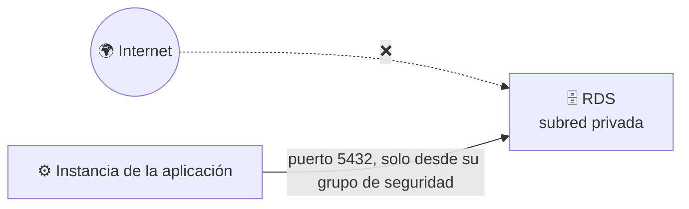
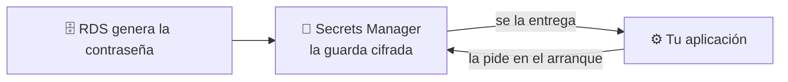
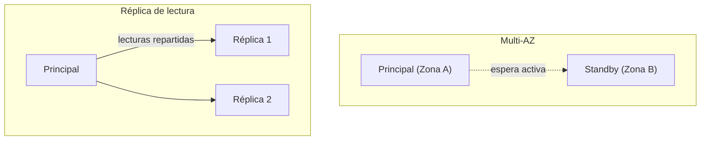

# 🧩 2. Bases de datos gestionadas

---

Hasta ahora, los datos con los que has trabajado en este módulo han vivido en ficheros: un front en S3, unas imágenes en EFS. Hoy llega la primera pieza que necesita algo más estructurado — una base de datos de verdad, con sus filas y sus relaciones. Una **base de datos relacional** guarda esa información en tablas con filas y columnas, relacionadas entre sí (un libro pertenece a una categoría, aparece en varios préstamos...), y un **motor de base de datos** (como PostgreSQL) es el programa que la gestiona: guarda los datos en disco, responde a las consultas y se asegura de que nada se corrompa aunque varias peticiones lleguen a la vez.

Ese motor podrías instalarlo tú mismo dentro de una instancia, exactamente igual que instalarías cualquier otro programa. Hoy vas a ver la alternativa: contratarlo como servicio gestionado, y entender exactamente qué te ahorra y qué renuncias a cambio.

---

## 🧭 Instalar frente a consumir como servicio

Instalar PostgreSQL dentro de una instancia EC2 te da control total: tú decides la versión exacta, tú aplicas los parches, tú configuras las copias de seguridad, tú resuelves qué pasa si el disco se llena a las tres de la mañana. Un servicio de base de datos gestionado —como **RDS** (*Relational Database Service*)— se queda con buena parte de ese trabajo operativo, a cambio de que renuncies a acceder al sistema operativo por debajo.

| | Base de datos instalada por ti | Base de datos gestionada (RDS) |
|---|---|---|
| Parches del motor | Los aplicas tú, cuando tú decides | Los aplica AWS en una ventana de mantenimiento |
| Copias de seguridad | Las configuras y vigilas tú | Automáticas, con recuperación a un punto en el tiempo |
| Conmutación por error (*failover*) | La montas tú, si la necesitas | Incluida si activas Multi-AZ (lo ves más abajo) |
| Acceso al sistema operativo | Total | Ninguno — ni siquiera por SSH |
| Control de versión exacta y extensiones | Total | El que RDS permita para ese motor |

!!! example "El mismo trabajo, en manos distintas"
    Piensa en la diferencia entre tener coche propio y usar un servicio de coche con conductor. Con el tuyo decides el mecánico, el taller, cuándo lo llevas a revisar — pero si se avería un domingo, el problema es tuyo. Con el servicio, no eliges el mecánico ni ves el motor por dentro, pero si el coche falla, no es tu problema resolverlo: te mandan otro.

Ninguna opción es "la buena" en abstracto — es la misma decisión de la escalera IaaS→PaaS→SaaS que viste en la sesión 1, aplicada ahora a bases de datos concretas.

---

## 🧩 Subred privada y grupos de seguridad de datos

La base de datos de tu aplicación va, sin excepción, en subred privada — lo estableciste como regla en el Tema 2, y hoy la aplicas de verdad. RDS, además, no se conecta a cualquiera que se lo pida: necesita su propio grupo de seguridad, con una única regla de entrada — el puerto de la base de datos (5432 para PostgreSQL), y **solo** desde el grupo de seguridad de la instancia de la aplicación, nunca desde `0.0.0.0/0`.

Para conectarte, tu aplicación necesita saber a qué dirección dirigirse: AWS te da un **endpoint**, un nombre de dirección único que apunta a tu base de datos (por ejemplo `biblioteca-db.abc123.us-east-1.rds.amazonaws.com`) y que sustituye a la dirección IP de siempre — cómodo porque, si AWS mueve la base de datos por dentro tras una conmutación por error, ese nombre sigue apuntando al sitio correcto sin que tú tengas que actualizar nada.

!!! danger "Una base de datos accesible desde internet no es un escenario hipotético"
    Bases de datos con el puerto abierto a `0.0.0.0/0` y sin contraseña son de los hallazgos más habituales cuando alguien escanea internet en busca de configuraciones abiertas. La regla de "solo desde el grupo de seguridad de la aplicación" no es una buena práctica opcional — es la diferencia entre una base de datos privada de verdad y una que solo lo parece.

---

## 🔐 La contraseña de la base de datos no se escribe en ningún sitio

Toda base de datos tiene una contraseña de acceso, y esa contraseña plantea el mismo problema que ya viste con el `Arn` de la sesión 1: alguien —o algo— tiene que guardarla en algún sitio para poder usarla. Escribirla dentro del código de la aplicación, o en un fichero de configuración que subes al repositorio, significa que cualquiera con acceso a ese código la tiene también a ella.

**AWS Secrets Manager** resuelve esto guardando la contraseña de forma cifrada, fuera del código, y entregándosela a quien la necesite solo en el momento de conectarse — nunca queda escrita en ningún fichero que tú edites o subas a ningún sitio. Al crear la base de datos, puedes pedirle a RDS que genere la contraseña él mismo y la guarde directamente en Secrets Manager, sin que ni siquiera tú llegues a verla ni a copiarla a mano.

!!! tip "La misma idea que vas a generalizar en el Tema 5"
    Hoy lo aplicas solo a la contraseña de la base de datos, pero el principio —ningún secreto escrito en el código ni en el repositorio— se repite con cualquier credencial que uses el resto del módulo. En el Tema 5 vas a verlo formalizado como una regla general de gestión de identidad y accesos.

---

## 🔧 Multi-AZ y réplicas de lectura

RDS te ofrece dos mecanismos distintos para repartir tu base de datos entre varias zonas de disponibilidad, y resuelven problemas diferentes — otro par de conceptos que se confunden con facilidad.

| | Multi-AZ | Réplica de lectura |
|---|---|---|
| Para qué existe | Alta disponibilidad — que la base de datos siga en pie si una zona falla | Rendimiento — repartir las consultas de lectura entre varias copias |
| ¿Se puede leer/escribir en la copia? | No, es pasiva hasta que hay una conmutación por error | Sí, solo lectura, en paralelo a la principal |
| ¿Qué pasa si falla la instancia principal? | AWS conmuta automáticamente a la copia en minutos | No conmuta sola — necesitarías promoverla tú manualmente |

Vas a provocar una conmutación por error de verdad en la Actividad 3.2, y a medir cuánto dura la interrupción real — un número mucho más pequeño de lo que la mayoría espera la primera vez.

---

## ⚙️ Relacional frente a NoSQL: el patrón de acceso como criterio

RDS es un motor **relacional**: los datos viven en tablas con relaciones fijas entre ellas, y encajan de maravilla cuando la estructura de los datos es estable y las consultas cruzan varias tablas —por ejemplo, el catálogo de una tienda, con productos, categorías y pedidos relacionados entre sí. Pero no es la única familia de base de datos que existe en la nube.

| Modelo | Cómo se estructura | Cuándo encaja |
|---|---|---|
| Relacional (RDS) | Tablas con relaciones fijas, consultas complejas entre ellas | Datos estructurados con relaciones claras — un catálogo con categorías y pedidos |
| Clave-valor | Un identificador, un valor asociado, sin estructura interna fija | Sesiones de usuario, carritos de compra temporales |
| Documental | Documentos con estructura flexible, puede variar de uno a otro | Catálogos con atributos muy distintos entre productos |

!!! tip "El criterio no es "cuál es más moderno""
    La pregunta correcta no es qué tecnología es más nueva, sino qué forma tienen tus datos y cómo los vas a consultar. Vas a comparar los tres modelos para patrones de acceso concretos en la Actividad 3.2, sin necesidad de montar ninguno de los que no sea relacional.

---

## ✅ Ideas clave

??? tip "Abrir resumen"

    - Instalar tu propia base de datos da control total; un servicio gestionado (RDS) asume parches, copias y conmutación por error a cambio de que pierdas el acceso al sistema operativo.
    - La base de datos va siempre en subred privada, con un grupo de seguridad que solo acepta tráfico desde la instancia de la aplicación.
    - Secrets Manager guarda la contraseña de la base de datos cifrada y fuera del código, y puede generarla él mismo al crear la instancia — nunca escrita en ningún fichero.
    - Multi-AZ resuelve alta disponibilidad (copia pasiva que conmuta sola); una réplica de lectura resuelve rendimiento (copia activa de solo lectura, no conmuta sola).
    - Relacional, clave-valor y documental son tres modelos distintos — la elección depende de la forma de los datos y del patrón de consulta, no de la moda.

Con esto ya tienes las piezas para la Actividad 3.2 — Migración a base de datos gestionada con RDS.
