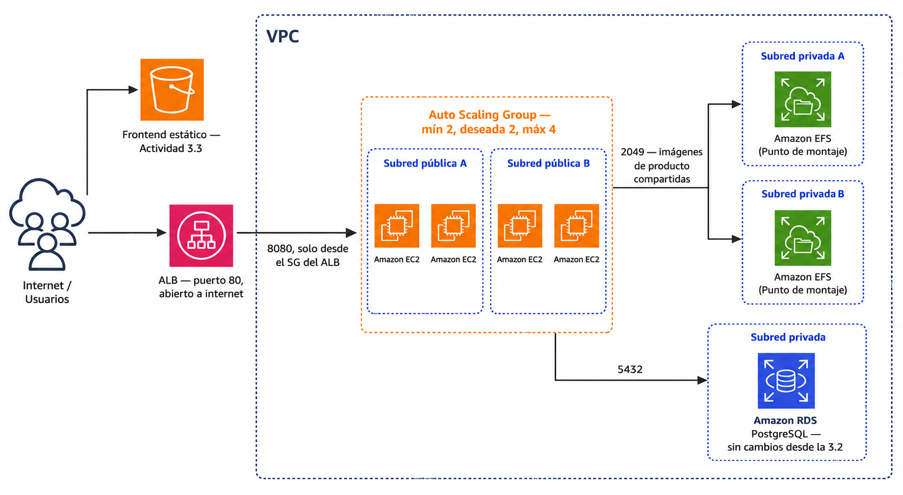

# 🧪 Actividad 4.1: Balanceador de carga y Auto Scaling Group

!!! warning "Descarga la plantilla"
    📄 [Plantilla 4.1 — Balanceador de carga y Auto Scaling Group](plantillas/Actividad_4_1_INU_Plantilla.docx){target="_blank" rel="noopener"}

!!! warning "Descarga los recursos"
    📦 [Recursos de la Actividad 4.1](recursos/actividad_4_1_recursos.zip){target="_blank" rel="noopener"} — los dos scripts de arranque que necesitas hoy. El `escaparate.war` lo reutilizas de la Actividad 3.2, no vuelve a bajarse aquí.

## Contexto

Escaparate ha vivido hasta ahora sobre una única instancia: si se caía, se caía el catálogo entero — es justo el primer punto único de fallo que has anotado en la tabla de la Actividad 3.3. Hoy lo eliminas de verdad: conviertes esa instancia suelta en una imagen propia, la empaquetas en una plantilla de lanzamiento, y pones un grupo de escalado automático detrás de un balanceador para que Escaparate viva en varias copias a la vez, repuestas solas si una falla.


*🖼️ Captura de referencia del profesor pendiente de capturar*

Con varias réplicas a la vez aparece un problema nuevo que con una sola instancia no existía: las imágenes de producto se guardaban en el disco local de esa única instancia (`FileSystemStorage`), así que un producto subido a una réplica "desaparece" cuando lo sirve otra. Hoy lo resuelves montando **EFS** en todas las instancias, sin cambiar una sola línea de Escaparate — para Java, EFS es simplemente una carpeta más.

## Qué vas a practicar

- Crear tu propia imagen (AMI) de Escaparate y empaquetarla en una plantilla de lanzamiento.
- Configurar un Application Load Balancer con su grupo de destino y comprobación de salud.
- Crear un grupo de escalado automático con capacidad mínima, deseada y máxima, y una política de escalado por CPU.
- Escribir un script de datos de usuario que obtiene las credenciales de la base de datos por CLI en cada arranque — no en la imagen, no a mano.
- Compartir las imágenes de producto entre réplicas montando EFS, sin tocar el código de Escaparate.
- Provocar el fallo de una instancia a propósito y medir cuánto tarda el grupo en reponerla y en escalar de verdad.
- Comparar el escalado horizontal automático con un escalado vertical manual, midiendo el corte de servicio real que exige cada uno.

## Requisitos previos

La base de datos RDS de la Actividad 3.2 (el Paso 0 te indica cómo continuar, tanto si la has destruido como si solo la has detenido) y el bucket S3 del frontend de la Actividad 3.3 (sigue sirviendo el mismo catálogo, solo cambia a qué backend apunta). El `escaparate.war` de los recursos de la 3.2. Los apuntes de esta sesión — [«Balanceo de carga y escalado automático»](alta-disponibilidad-escalado.md).

!!! info "No vas a programar nada de Escaparate"
    Como en toda la sesión anterior, hoy trabajas en infraestructura: cómo se lanza cada instancia, quién puede hablar con quién, y de dónde saca su configuración. El código no cambia.

---

## Parte A — De instancia suelta a flota con balanceo y escalado (guiada)

### Paso 0 — Prepara la red y la base de datos

Redespliega la red de Terraform si la has destruido al cerrar la 3.3 (mismo comando de siempre desde `recursos/tema3/red-base`).

Con la base de datos RDS, lo que hagas depende de qué dejaste al cerrar la 3.3:

- **Si solo la detuviste** (no la destruiste): arráncala desde la consola (**Acciones → Comenzar**) y sigue con el mismo endpoint y el mismo modo de credenciales que ya tenía. Si en su día hiciste el reto de la réplica de lectura de la 3.2, esta RDS seguirá en modo autoadministrado — tenlo presente para el reto de escalado vertical de esta misma actividad, más adelante.
- **Si la destruiste del todo**: recréala repitiendo el Paso 2 de la Actividad 3.2 tal cual — mismo identificador `escaparate-db-<tu-identificador>`, mismas opciones. Al nacer de nuevo, vuelve a tener credenciales gestionadas por Secrets Manager, como la primera vez.

Cuando esté `available`, carga el esquema y los datos de ejemplo (Paso 5 de la 3.2, con `01-schema.sql` y `02-data.sql` de los recursos de aquella actividad).

**Comprueba**: que tienes `vpc_id`, `subnet_publica_a_id`, `subnet_publica_b_id`, `subnet_privada_a_id`, `subnet_privada_b_id` y `security_group_id` de Terraform anotados, y tu instancia RDS en `available`.

### Paso 1 — Prepara una instancia base y captúrala como AMI propia

Lanza una instancia `t3.small` en tu subred pública, con el `security_group_id` de Terraform y el perfil de instancia `LabInstanceProfile`, usando como datos de usuario `recursos/tema4/actividad_4_1/preparar-imagen.sh` (de los recursos de hoy) — instala Java 21, el cliente de PostgreSQL y `amazon-efs-utils` (el paquete que sabe montar sistemas de ficheros EFS), sin arrancar todavía ninguna aplicación.

Cuando la instancia esté lista, sube `escaparate.war` con el mismo mecanismo de clave temporal de la 3.2:

```bash
ssh-keygen -t rsa -f ~/.ssh/tempkey -N '' -q
aws ec2-instance-connect send-ssh-public-key \
  --instance-id <id-de-tu-instancia> \
  --instance-os-user ec2-user \
  --ssh-public-key file://~/.ssh/tempkey.pub \
  --availability-zone <zona-de-tu-instancia>

scp -o StrictHostKeyChecking=no -i ~/.ssh/tempkey \
  escaparate.war ec2-user@<ip-publica-de-tu-instancia>:~
```

!!! warning "Si ya tenías una `tempkey` de una sesión anterior"
    `ssh-keygen` se para a preguntar `Overwrite (y/n)?` si el fichero ya existe — y si pegas los tres comandos juntos de golpe, esa pregunta se traga la primera línea del siguiente comando en vez de tu respuesta, y todo falla en cadena (incluido el `scp`, con `Permission denied`, porque la clave nunca llegó a regenerarse). Borra la clave vieja primero para que no pregunte nada:

    ```bash
    rm -f ~/.ssh/tempkey ~/.ssh/tempkey.pub
    ```

Conéctate y comprueba que todo está en orden:

```bash
java -version
efs-utils-watchdog --version || rpm -q amazon-efs-utils
ls ~/escaparate.war
```

Con la instancia lista, captúrala como imagen propia — mismo procedimiento que en la Actividad 2.3:

1. **Instancias** → selecciona la tuya → **Acciones → Imagen y plantillas → Crear imagen**.
2. Nómbrala `escaparate-ami-<tu-identificador>`.
3. Crea la imagen y espera a que pase de `pending` a `available` en **AMIs**.

**Comprueba**: que `java -version` muestra Java 21, que `escaparate.war` está en el home del `ec2-user`, y que tu AMI aparece `available`.

**Captura**: la salida de `java -version` y `ls ~/escaparate.war` en la instancia, y tu AMI en estado `available` con su ID visible.

### Paso 2 — Crea el sistema de ficheros EFS compartido

1. Busca "EFS" en el buscador de servicios → **Crear sistema de archivos**.
2. Nómbralo `escaparate-efs-<tu-identificador>`, elige tu VPC de Terraform, y dentro de **Configuración de red personalizada** añade un punto de montaje en cada una de tus dos subredes **privadas** (`subnet_privada_a_id` y `subnet_privada_b_id`), con el `security_group_id` de Terraform en ambos — el grupo de seguridad de Terraform ya trae la regla interna que permite el puerto 2049 (NFS) entre instancias del mismo grupo, así que no hace falta abrir nada nuevo.
3. Crea el sistema de archivos y anota su **ID de sistema de archivos** (`fs-...`).

**Comprueba**: que el sistema de archivos aparece `available`, con un punto de montaje por subred privada, en estado `available` cada uno.

**Captura**: el sistema de archivos EFS con sus dos puntos de montaje, mostrando el ID de sistema de archivos.

### Paso 3 — Crea el grupo de seguridad de las instancias y del balanceador

Hasta ahora el puerto 8080 de Escaparate estaba abierto a `0.0.0.0/0` (herencia de la 3.2/3.3). Con un balanceador delante, eso deja de tener sentido — solo el balanceador debe poder hablar con las instancias.

1. Crea un grupo de seguridad `escaparate-alb-sg-<tu-identificador>` en tu VPC, con una única regla de entrada: puerto **80**, origen `0.0.0.0/0` — es el único punto de la arquitectura que sigue abierto a cualquiera, y es exactamente lo que un balanceador está pensado para ser.
2. Crea un segundo grupo de seguridad `escaparate-app-sg-<tu-identificador>`, con una única regla de entrada: puerto **8080**, origen el grupo de seguridad `escaparate-alb-sg-<tu-identificador>` que acabas de crear — no una IP, no `0.0.0.0/0`.

**Comprueba**: que `escaparate-app-sg` tiene como origen de su única regla el propio `escaparate-alb-sg`, no un rango de IPs.

**Captura**: las dos reglas de entrada, cada una en su grupo de seguridad, mostrando el origen exacto de cada una.

### Paso 4 — Crea el grupo de destino y el balanceador

1. **EC2 → Grupos de destino → Crear grupo de destino**. Tipo de destino: **Instancias**. Protocolo HTTP, puerto 8080, tu VPC. En **Comprobaciones de salud**, ruta `/api/salud/listo`. Nómbralo `escaparate-tg-<tu-identificador>`. No registres ninguna instancia todavía — el grupo de escalado automático lo hará solo en el Paso 6.
2. **EC2 → Balanceadores de carga → Crear balanceador de carga → Application Load Balancer**. Nómbralo `escaparate-alb-<tu-identificador>`, **con acceso a internet**, IPv4. En **Asignaciones de red**, tu VPC, y selecciona **las dos subredes públicas** (`subnet_publica_a_id` y `subnet_publica_b_id`) — un ALB necesita al menos dos zonas de disponibilidad, no funciona con una sola. En **Grupos de seguridad**, elige `escaparate-alb-sg-<tu-identificador>` (quita el que venga por defecto si lo añade solo). En **Listeners y enrutamiento**, protocolo HTTP, puerto 80, reenviando al grupo de destino `escaparate-tg-<tu-identificador>`.
3. Crea el balanceador y espera a que pase a estado `Active`. Anota su **DNS name** (algo como `escaparate-alb-<tu-identificador>-123456789.us-east-1.elb.amazonaws.com`) — lo necesitas en el resto de la actividad.

**Comprueba**: que el balanceador está `Active`, con las dos subredes públicas seleccionadas, y que su único listener reenvía al grupo de destino correcto.

**Captura**: el resumen del balanceador con su DNS name visible, y la configuración del listener mostrando el grupo de destino de reenvío.

### Paso 5 — Construye la plantilla de lanzamiento

Abre `recursos/tema4/actividad_4_1/arranque-instancia.sh` de los recursos de hoy y sustituye los tres marcadores por tus valores reales: el **ID de tu sistema EFS** del Paso 2, tu **identificador** (para `escaparate-db-<tu-identificador>`), y la **URL de tu bucket de frontend** de la Actividad 3.3 (el mismo valor que ya has usado en `APP_CORS_ALLOWED_ORIGINS` en la 3.3 — no cambia, sigue siendo el mismo origen).

1. **EC2 → Plantillas de lanzamiento → Crear plantilla de lanzamiento**. Nómbrala `escaparate-lt-<tu-identificador>`.
2. **Imagen de la aplicación y el SO**, pestaña **Mis AMIs** → tu `escaparate-ami-<tu-identificador>` del Paso 1.
3. Tipo de instancia `t3.small` (Spring Boot, misma razón que en la 3.2).
4. **Par de claves**: no incluir.
5. **Configuraciones de red**: no fijes subred aquí (el ASG la asigna él mismo en el Paso 6) — en **Firewall (grupos de seguridad)**, elige **Seleccionar grupos de seguridad existentes** y marca **los dos**: `security_group_id` de Terraform (SSH + EFS) y `escaparate-app-sg-<tu-identificador>` (8080 desde el ALB).
6. Despliega **Detalles avanzados**: en **Perfil de instancia de IAM**, `LabInstanceProfile` — lo necesitas para que el script de arranque pueda leer el endpoint de RDS y la contraseña por CLI. Activa la asignación automática de IP pública.
7. En **Datos de usuario**, pega el contenido ya editado de `arranque-instancia.sh`.
8. Crea la plantilla.

!!! warning "A diferencia de la Actividad 2.3, hoy sí hace falta user data aunque uses tu propia AMI"
    En la 2.3 la AMI ya llevaba todo listo y no hacía falta ningún dato de usuario. Hoy es distinto: la AMI lleva Java, `amazon-efs-utils` y el propio `escaparate.war` ya instalados, pero el endpoint de la base de datos y su contraseña no pueden quedar grabados en la imagen —son secretos, y una imagen la puede lanzar cualquiera con acceso a ella—. Por eso hoy combinas AMI (lo que no cambia entre instancias) con datos de usuario (lo que sí debe decidirse en el momento del arranque, no antes).

**Comprueba**: que la plantilla tiene tu AMI propia, los dos grupos de seguridad, el perfil `LabInstanceProfile` y el script de datos de usuario con tus tres valores ya sustituidos (no los marcadores de ejemplo).

**Captura**: el resumen de la plantilla mostrando la AMI, los grupos de seguridad y el perfil de IAM.

### Paso 6 — Crea el grupo de escalado automático

1. **EC2 → Grupos de Auto Scaling → Crear un grupo de Auto Scaling**. Nómbralo `escaparate-asg-<tu-identificador>`, y elige la plantilla de lanzamiento del Paso 5.
2. **Redes**: tu VPC, con **las dos subredes públicas** seleccionadas (misma razón que con el ALB: el grupo necesita poder lanzar en más de una zona).
3. **Balanceo de carga**: **Adjuntar a un grupo de destino existente**, elige `escaparate-tg-<tu-identificador>`. Activa la comprobación de salud del balanceador de carga además de la de EC2 — así el ASG sabe si una instancia falla por su propia salud de red *o* porque Escaparate ha dejado de responder por dentro.
4. **Tamaño del grupo**: capacidad deseada `2`, mínima `2`, máxima `4`.
5. **Políticas de escalado**: **Política de seguimiento de destino**, métrica **Utilización media de CPU**, valor de destino `50`.
6. Crea el grupo.

Espera unos minutos a que las dos instancias iniciales aparezcan en el grupo de destino del Paso 4 en estado `healthy` — el arranque real tarda más que en actividades anteriores, porque cada instancia ejecuta el script de datos de usuario entero (montar EFS, leer credenciales, arrancar Spring Boot) antes de empezar a responder.

**Comprueba**: que el grupo de destino muestra dos instancias `healthy`, una por cada zona de disponibilidad.

**Captura**: el grupo de destino con las dos instancias en `healthy`, y el grupo de escalado automático mostrando capacidad 2/2/4.

### Paso 7 — Comprueba el reparto real de tráfico

Con la URL del balanceador (el DNS name del Paso 4), llama varias veces seguidas al endpoint que identifica qué réplica responde:

```bash
for i in {1..6}; do curl -s http://<dns-del-balanceador>/api/instancia; echo; done
```

**Comprueba**: que ves al menos dos identificadores de instancia distintos entre las seis respuestas — es la prueba de que el balanceador reparte de verdad, no que siempre contesta la misma máquina.

**Captura**: la salida de los seis `curl`, con los identificadores de instancia distintos resaltados.

### Paso 8 — Apunta el frontend al balanceador, no a una instancia

El frontend de la Actividad 3.3 seguía apuntando a la IP pública de una única instancia — ese backend ya no es el punto de entrada correcto. Edita `config.js` en tu copia local del frontend (el mismo que has subido en la 3.3) y cambia `apiBase` al DNS del balanceador:

```js
window.APP_CONFIG = {
    modo: "api",
    apiBase: "http://<dns-del-balanceador>/api"
};
```

Vuelve a subirlo al mismo bucket de la 3.3:

```bash
aws s3 cp config.js s3://escaparate-front-<tu-identificador>/config.js
```

Abre la URL del bucket en el navegador y recarga varias veces.

**Comprueba**: que el catálogo sigue cargando exactamente igual que en la 3.3, solo que ahora cada petición puede estar respondiéndola una réplica distinta sin que tú lo notes desde el navegador.

**Captura**: el frontend funcionando con la barra de direcciones visible, y el `config.js` actualizado mostrando el DNS del balenceador.

### Paso 9 — Sube una imagen y compruébala desde otra réplica

Da de alta un producto nuevo con foto desde el catálogo. Sin volver a subir nada, recarga varias veces hasta que el `curl` de comprobación (o las herramientas de desarrollador) confirme que una petición distinta ha respondido otra instancia.

**Comprueba**: que la foto del producto se ve igual sea cual sea la réplica que responda — es la prueba de que EFS soluciona de verdad el problema que tenía `FileSystemStorage` con varias copias.

**Captura**: el producto con su foto visible en el catálogo, tras confirmar (por `/api/instancia`) que la petición la ha servido una réplica distinta a la que ha recibido la subida.

!!! question "Reflexiona"
    Antes de esta sesión, cualquiera con la IP pública de tu instancia de la 3.3 podía llegar directamente a Escaparate. Ahora esa IP ya ni siquiera existe de forma estable — cada instancia del ASG puede desaparecer y ser reemplazada por otra con una IP distinta. ¿Qué le pasaría a un usuario que se hubiera guardado esa IP antigua, y qué te dice eso sobre por qué a un usuario nunca se le debe dar una dirección que apunte directamente a una instancia?

---

## Parte B — Reto: rompe una instancia y provoca un escalado real (reto)

- **Termina una instancia a mano**: en el grupo de destino, identifica una instancia `healthy` y termínala desde **EC2 → Instancias → Acciones → Terminar instancia** (no la detengas: termínala de verdad). No toques el ASG para nada más.

    **Comprueba**: que, sin que hagas nada, el grupo de Auto Scaling lanza una instancia nueva para volver a la capacidad deseada, y que en unos minutos vuelve a haber dos instancias `healthy` en el grupo de destino.

    **Captura**: el momento en que terminas la instancia (con su ID visible) y el grupo de destino, más tarde, con dos instancias `healthy` de nuevo — con IDs distintos a la que has terminado.

- **Genera carga real y mide el escalado**: antes de lanzar nada, **predice** cuánto tiempo crees que va a pasar desde que la CPU media supera el 50 % hasta que una instancia nueva empieza a responder tráfico de verdad. Después, genera carga de verdad contra el endpoint pensado para esto:

    ```bash
    for i in {1..50}; do
      curl -s "http://<dns-del-balanceador>/api/carga?ms=1000" &
    done
    wait
    ```

    Repite la llamada en un bucle mientras vigilas la métrica de CPU del grupo de destino (**EC2 → Grupos de Auto Scaling → tu grupo → pestaña Monitorización**) y el número de instancias.

    **Comprueba**: que el ASG añade al menos una instancia nueva por encima de la capacidad deseada mientras dura la carga, y que tu predicción se acerca (o no) al tiempo real medido desde que la métrica cruza el 50 % hasta que la instancia nueva aparece `healthy`.

    **Captura**: la métrica de CPU superando el 50 %, la actividad de escalado del ASG mostrando la instancia añadida con su marca de tiempo, y tu predicción escrita de antemano junto al tiempo real medido.

- **Escala verticalmente la instancia suelta del Paso 1, y compara el corte real**: a diferencia de lo que acabas de ver con el ASG, el escalado vertical no tiene ningún disparador automático por carga — no existe ningún mecanismo de AWS que detecte que una instancia va sobrecargada y le cambie el tipo sola. Siempre es una acción manual, y siempre exige parar la instancia primero. Vas a comprobar tú mismo cuánto cuesta eso en tiempo de corte real, usando la instancia suelta del Paso 1 —no la has tocado desde entonces, sigue sin formar parte del grupo de escalado, y de todas formas toca terminarla al cerrar la sesión (Cierre, punto 1)—.

    Antes de detener nada, dentro de la propia instancia, guárdate un script para no tener que volver a teclear las variables de conexión a mano después de reiniciarla — el volumen de la instancia sobrevive a pararla y arrancarla, así que el script sigue ahí cuando lo necesites:

    ```bash
    cat > ~/reiniciar-escaparate.sh <<'EOF'
    #!/bin/bash
    pkill -f escaparate.war
    export DB_HOST=$(aws rds describe-db-instances \
      --db-instance-identifier escaparate-db-<tu-identificador> \
      --query "DBInstances[0].Endpoint.Address" --output text)
    export DB_SECRET_ARN=$(aws rds describe-db-instances \
      --db-instance-identifier escaparate-db-<tu-identificador> \
      --query "DBInstances[0].MasterUserSecret.SecretArn" --output text)
    export DB_PASSWORD=$(aws secretsmanager get-secret-value \
      --secret-id "$DB_SECRET_ARN" \
      --query "SecretString" --output text | python3 -c "import sys,json; print(json.load(sys.stdin)['password'])")
    export DB_PORT=5432
    export DB_NAME=escaparate
    export DB_USER=postgres
    nohup java -jar escaparate.war > escaparate.log 2>&1 &
    EOF
    chmod +x ~/reiniciar-escaparate.sh
    ```

    !!! tip "Si tienes credenciales autoadministradas (reto de la 3.2)"
        Sustituye las tres líneas de `DB_SECRET_ARN` y `get-secret-value` por `export DB_PASSWORD='<tu-contraseña>'` directamente, entre comillas simples — mismo caso que ya viste en la 3.3.

    Con el script guardado:

    1. Anota el tipo de instancia actual (**Instancias** → columna **Tipo de instancia**, debería ser `t3.small`).
    2. **Predice**: ¿cuántos minutos crees que va a estar caído el servicio mientras cambias el tipo de instancia?
    3. Detén la instancia (**Estado de la instancia → Detener instancia**) — anota la hora exacta.
    4. Con la instancia ya `Detenida`: **Acciones → Configuración de la instancia → Cambiar tipo de instancia** → elige `t3.xlarge` (así se nota también el salto de vCPU, no solo el de memoria) → **Aplicar**.
    5. Arranca la instancia de nuevo (**Estado de la instancia → Iniciar instancia**) y anota su nueva IP pública (recuerda: cambia).
    6. Conéctate y ejecuta el script que has dejado guardado: `bash ~/reiniciar-escaparate.sh`.
    7. Desde CloudShell, comprueba en bucle cuándo vuelve a responder:

        ```bash
        while true; do
          date
          curl -s -o /dev/null -w "%{http_code}\n" http://<ip-nueva>:8080/api/salud/listo
          sleep 2
        done
        ```

    8. En cuanto veas el primer `200`, para el bucle (Ctrl+C) y calcula el tiempo real transcurrido desde que has detenido la instancia en el punto 3.
    9. Confirma que el recurso ha cambiado de verdad, no solo que ha tardado: `nproc` (antes 2, ahora debería mostrar 4) y `free -h` (memoria muy por encima de antes).

    **Comprueba**: que la columna **Tipo de instancia** en el listado de EC2 muestra ya `t3.xlarge` (la confirmación más directa: es el propio dato de AWS, no una inferencia tuya), y que `nproc`/`free -h` lo confirman también desde dentro del sistema operativo.

    **Captura**: el listado de instancias mostrando el cambio de tipo (`t3.small` → `t3.xlarge`), la hora de detención y la hora del primer `200` tras el cambio, y la salida de `nproc`/`free -h` después del cambio.

**Entrega**: los tres incidentes documentados con sus capturas, y una frase por cada uno explicando qué mecanismo concreto ha respondido (comprobación de salud + reposición automática en el primero; política de escalado por CPU en el segundo; cambio manual de tipo de instancia, sin disparador automático, en el tercero).

---

## Criterios de evaluación

**Parte A — hasta 7 puntos**

| Apartado | Puntos |
|---|---|
| AMI propia creada y sistema EFS con sus dos puntos de montaje | 2 |
| Grupos de seguridad correctos: ALB abierto a internet, instancias solo desde el ALB | 1 |
| Balanceador, grupo de destino y plantilla de lanzamiento configurados correctamente | 1 |
| Grupo de escalado automático creado, con las dos instancias iniciales `healthy` | 1 |
| Reparto de tráfico comprobado y frontend apuntando al balanceador | 1 |
| Imagen persistente entre réplicas comprobada vía EFS | 1 |

**Parte B — reto, hasta 3 puntos adicionales (máximo total: 10)**

| Apartado | Puntos |
|---|---|
| Instancia terminada y repuesta automáticamente, documentado | 1 |
| Escalado horizontal real provocado y cronometrado, con predicción previa | 1 |
| Escalado vertical manual medido y comparado, con predicción previa y confirmación de recurso (`nproc`/`free -h`) | 1 |

---

## ✅ Cierre

Escaparate ya no depende de ninguna instancia concreta: el balanceador reparte, el grupo de escalado repone lo que falla y añade capacidad cuando hace falta, y EFS hace que no importe qué réplica atienda cada petición. Has eliminado hoy el primer punto único de fallo que has identificado en la tabla de la 3.3 — el segundo (Multi-AZ en RDS) lo has trabajado ya en la 3.2, y el tercero (una única región) queda fuera del alcance de este módulo. La próxima sesión le pones un dominio propio, HTTPS y una caché en el borde a esta misma arquitectura.

!!! danger "No borres el balanceador, el ASG ni el EFS: la Actividad 4.2 los reutiliza tal cual"
    La 4.2 le pone dominio propio, HTTPS y una CDN a esta misma arquitectura — necesita el balanceador, el grupo de escalado, la plantilla de lanzamiento, el EFS, la base de datos y la red exactamente como están ahora. Solo hay una pieza que ya no hace falta:

    1. Termina la instancia suelta del Paso 1 (la que has usado para preparar la AMI, y para el reto de escalado vertical si lo has hecho) si sigue encendida — ya cumplió su función, la AMI ya la tienes capturada y no forma parte del grupo de escalado. Si la has dejado en `t3.xlarge` tras el reto, más razón para no dejarla encendida sin necesidad.
    2. Si no vas a continuar en las próximas horas, puedes bajar la capacidad del ASG a mínima 1, deseada 1 (Editar el grupo de Auto Scaling) para reducir el gasto sin perder la configuración — recuerda volver a subirla a 2 antes de medir nada en el futuro, porque con una sola instancia no hay balanceo real que observar.

    No toques el balanceador, el grupo de destino, la plantilla de lanzamiento, el EFS, la instancia RDS ni la red de Terraform — todo eso sigue en pie hasta el cierre de la Actividad 4.2.
