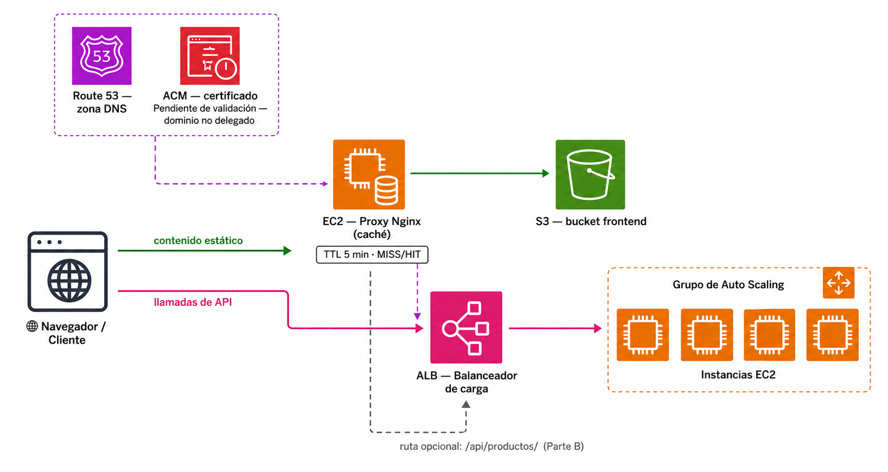

# 🧪 Actividad 4.2: Dominio propio y caché en el borde

!!! warning "Descarga la plantilla"
    📄 [Plantilla 4.2 — Dominio propio y caché en el borde](plantillas/Actividad_4_2_INU_Plantilla.docx){target="_blank" rel="noopener"}

## Contexto

Escaparate ya se repone solo y escala solo, pero sigue viviendo detrás de la URL genérica del balanceador de la 4.1 —algo como `escaparate-alb-<tu-identificador>-123456789.us-east-1.elb.amazonaws.com`—, nada que le pondrías a un cliente real. Hoy le pones un nombre de dominio propio con Route 53, y separas el frontend estático del origen poniéndolo detrás de una **caché en el borde**, para que las peticiones repetidas al mismo contenido no tengan que ir siempre hasta el origen.



Fíjate en el diagrama: son dos caminos paralelos, no uno metido dentro del otro — el proxy de hoy no sustituye al balanceador de la 4.1, cachea un tramo distinto de la arquitectura.

Hay dos matices importantes que vas a comprobar tú mismo hoy, en vez de leerlos sin más:

- En una cuenta real, con un dominio comprado de verdad, el paso de "dominio propio" incluiría también un certificado HTTPS válido para ese dominio, emitido por AWS Certificate Manager (ACM). Ese certificado es lo que se instalaría en un listener HTTPS (puerto 443) del balanceador —el mismo patrón "HTTPS en el borde" que ya has visto en la teoría—: el navegador vería el candado y confiaría en él porque está firmado por una entidad pública, sin ningún aviso de conexión insegura. En el Learner Lab no tienes un dominio real que delegar a Route 53, así que vas a solicitar igualmente un certificado y ver exactamente en qué paso se queda parado —es la propia demostración de por qué la validación por DNS exige un dominio delegado de verdad, no solo una zona—.
- **CloudFront** es el servicio de CDN gestionado de AWS —tú le dices qué origen copiar (un bucket, un balanceador...) y él se encarga de replicarlo en sus ubicaciones de borde, gestionar el TTL y la invalidación, y añadir HTTPS automático con su propio dominio—, y está bloqueado por política en este Learner Lab: puedes comprobarlo tú mismo con `aws cloudfront list-distributions`, que devuelve un error de autorización explícito, distinto de una lista vacía. La mecánica de una caché en el borde (TTL, acierto/fallo de caché, invalidación) no depende de que el servicio sea gestionado por AWS o no, así que hoy la construyes tú mismo con un **proxy Nginx** —*Nginx* es un servidor web de código abierto, uno de los más usados del mundo, que además de servir páginas sabe actuar como *proxy inverso* (recibe la petición del visitante y la reenvía él mismo a otro servidor por detrás) con su propia caché incorporada— delante de tu bucket. Pierdes la parte de "ubicaciones de borde repartidas por el mundo" —eso sí es exclusivo de un CDN gestionado con presencia global, y no se puede simular con una sola instancia—, pero no pierdes nada de la mecánica de caché en sí.

!!! warning "Hoy no vas a ver HTTPS funcionando de verdad en ningún sitio, y es intencionado"
    Ni el certificado de ACM (se queda pendiente para siempre), ni CloudFront (bloqueado), ni el proxy Nginx (lo montas solo con el puerto 80, sin certificado propio) te dan HTTPS real hoy. No es un fallo de la actividad: es justo lo que demuestra por qué el "dominio propio" completo —zona, delegación real y certificado válido— exige tener un dominio comprado de verdad, algo que este Lab no te da. Lo que sí practicas es el mecanismo completo de cada pieza por separado, aunque ninguna llegue a encajar del todo en este entorno concreto.

## Qué vas a practicar

- Crear una zona pública en Route 53 y un registro Alias apuntando al balanceador de la 4.1.
- Comprobar una resolución DNS consultando directamente a los servidores de nombres de tu zona, sin depender de una delegación real.
- Solicitar un certificado público en ACM y entender por qué su validación por DNS se queda pendiente sin un dominio delegado de verdad.
- Configurar un proxy de caché con Nginx delante del frontend estático de la 3.3, con su propia zona de caché y cabeceras de diagnóstico.
- Medir con datos reales la diferencia entre una caché fría y una caché caliente, y qué pasa cuando cambias contenido sin invalidar.

## Requisitos previos

El balanceador y el grupo de escalado automático de la Actividad 4.1, activos y con sus instancias `healthy`. El bucket S3 del frontend de la Actividad 3.3 (`escaparate-front-<tu-identificador>`), con su contenido completo (`index.html`, `css/`, `js/`, `config.js`) — es el mismo bucket que sigues usando, no se toca hoy. Los apuntes de esta sesión — [«DNS, HTTPS y distribución de contenido»](dns-https-cdn.md).

!!! info "Si has pausado algo al cerrar la 4.1"
    Si has dejado la RDS detenida o el grupo de Auto Scaling a capacidad 0 para ahorrar créditos, reactívalos antes de empezar: primero arranca la RDS y espera a que esté `available`, y solo entonces sube el ASG a mínima 2, deseada 2. Espera a que las dos instancias vuelvan a estar `healthy` en el grupo de destino antes de seguir — el registro Alias del Paso 2 necesita un balanceador con destinos sanos detrás para que la comprobación tenga sentido.

!!! info "Hoy tampoco tocas Escaparate"
    Todo lo de hoy es enrutamiento y caché por delante de lo que ya tienes construido — ni el backend ni el frontend cambian una sola línea.

---

## Parte A — Dominio, certificado y caché en el borde (guiada)

### Paso 1 — Crea una zona pública en Route 53

1. **Route 53 → Zonas hospedadas → Crear zona alojada**. Nombre de dominio: uno de prueba, inventado por ti (por ejemplo `escaparate-<tu-identificador>.academy`) — no hace falta que lo hayas comprado, porque no lo vas a delegar de verdad.
2. Tipo: **Pública**.
3. Pulsa **Crear zona alojada** para confirmar.
4. Route 53 te lleva directo al detalle de tu zona nueva — ahí mismo, en la tabla **Registros**, ya aparecen dos filas creadas solas, sin que tengas que hacer nada más: una de tipo `NS` (con los cuatro servidores de nombres, uno debajo de otro) y otra de tipo `SOA`.

!!! info "Qué son estos dos registros que has creado sin querer"
    El `NS` trae los cuatro **servidores de nombres** de tu zona — los que responderían de verdad si alguien les preguntara directamente (justo lo que vas a hacer con `dig` en el Paso 3). Hay cuatro, no uno, por redundancia: si uno falla, cualquiera de los otros tres contesta igual. El `SOA` (*Start of Authority*) es un único registro con los metadatos administrativos de la zona —servidor principal, número de serie, temporizadores de mantenimiento entre servidores—; no lo vas a tocar, solo verlo ahí.

**Comprueba**: que la zona aparece creada, con sus registros `NS` y `SOA` visibles.

**Captura**: el resumen de la zona con el dominio y los cuatro servidores de nombres del registro `NS`.

### Paso 2 — Añade un registro Alias apuntando al balanceador

1. Dentro de tu zona, **Crear registro**. Deja el nombre en blanco (el dominio raíz, sin subdominio) — es justo el caso donde un `CNAME` no serviría y un `Alias` sí, el mismo matiz de los apuntes.
2. Tipo `A`. Activa **Alias**, elige **Alias a un Application/Classic Load Balancer**, región **us-east-1 (Norte de Virginia)** —la misma que usas en toda la sesión—, y selecciona tu balanceador `escaparate-alb-<tu-identificador>` de la 4.1.
3. Crea el registro.

**Comprueba**: que el registro aparece como tipo `A`, con **Alias** activado, apuntando al DNS name de tu balanceador.

**Captura**: el registro creado, mostrando el balanceador como destino.

### Paso 3 — Comprueba la resolución contra los nameservers de tu propia zona

Ningún resolutor público sabe todavía que tiene que preguntarle a tu zona —eso exigiría delegación real, y no tienes el dominio registrado—, pero tu zona sí responde si le preguntas directamente. `dig` no siempre viene preinstalado en CloudShell; si al ejecutarlo te da "command not found", instálalo primero:

```bash
sudo dnf install -y bind-utils
```

Desde CloudShell, sustituye `<ns-1>` por el primero de los cuatro servidores de nombres que has anotado en el Paso 1 (sin el punto final):

```bash
dig @<ns-1> <tu-dominio-de-prueba> +short
```

**Comprueba**: que la respuesta trae al menos una dirección IP —las del balanceador—, en vez de quedarse vacía.

**Captura**: la salida del `dig`, con las IP resueltas.

!!! tip "Por qué esto demuestra algo real, aunque el dominio no exista para el resto de internet"
    Route 53 es **autoritativo** para tu zona en cuanto la creas — responde con las direcciones correctas a quien le pregunte directamente. Lo único que falta para que funcione desde cualquier navegador del mundo es que el registrador del dominio delegue la resolución a esos cuatro `NS`, algo que solo puede hacer quien sea dueño real del dominio. La zona y la delegación son dos cosas distintas, tal como ya has visto en la teoría.

### Paso 4 — Solicita un certificado público en ACM y observa la validación por DNS

1. **AWS Certificate Manager → Solicitar → Solicitar un certificado público**.
2. Nombre de dominio: el mismo dominio de prueba del Paso 1.
3. Método de validación: **Validación de DNS**.
4. Algoritmo de clave y el resto de opciones (incluida la de exportación de la clave): déjalas todas con su valor por defecto — no las necesitas para hoy, solo te interesa ver la validación por DNS.
5. Solicita el certificado. ACM te muestra un registro `CNAME` de validación con un nombre y un valor únicos.
6. Con el certificado abierto, usa el botón **Crear registros en Route 53** para añadir ese `CNAME` a tu zona automáticamente (o créalo a mano si prefieres verlo paso a paso).
7. Espera unos minutos y recarga el estado del certificado.

**Comprueba**: que el certificado se queda en estado **Pendiente de validación**, sin pasar nunca a **Emitido** —no es un error tuyo: ACM valida consultando la resolución **pública** de internet, y tu zona no está delegada de verdad, así que ACM nunca ve ese `CNAME` en su sitio. Es la comprobación práctica de lo que has leído en la teoría: alojar la zona no es lo mismo que controlar el dominio de verdad.

**Captura**: el certificado en estado **Pendiente de validación**, con el registro `CNAME` de validación visible tanto en ACM como en tu zona de Route 53.

!!! warning "No dejes este certificado a medias sin más"
    Un certificado en `Pendiente de validación` no cuesta nada, pero tampoco sirve de nada dejarlo ahí para siempre — lo borras en el Cierre de hoy, junto con el resto de recursos nuevos.

### Paso 5 — Levanta un proxy de caché con Nginx delante del frontend

Con CloudFront bloqueado, construyes tú mismo la pieza de caché — mismo concepto, mecanismo propio.

1. Lanza una instancia EC2 `t3.micro` en tu subred pública, con el `security_group_id` de Terraform y el perfil de instancia `LabInstanceProfile`. Añade una regla nueva de entrada en ese grupo de seguridad para el puerto **80**, origen `0.0.0.0/0` —es una regla distinta de la que has abierto para el 8080 en la 3.2, esta es para el proxy de hoy—.
2. Conéctate por SSH/Instance Connect e instala Nginx:

    ```bash
    sudo dnf install -y nginx
    ```

3. La instalación trae un bloque `server` por defecto escuchando ya en el puerto 80 (sirve una página de bienvenida), **por partida doble: una línea para IPv4 y otra para IPv6**. Tu bloque nuevo (Paso 4) va a declararse como `default_server` para ese mismo puerto, así que muévele las dos líneas al puerto que trae de fábrica para que no compitan por el 80:

    ```bash
    sudo sed -i '0,/listen\s\+80;/s//listen 8081;/' /etc/nginx/nginx.conf
    sudo sed -i 's/^\(\s*listen\s*\)\[::\]:80;/\1[::]:8081;/' /etc/nginx/nginx.conf
    ```

    Estos dos comandos sustituyen las dos líneas `listen 80;` y `listen [::]:80;` del bloque de fábrica (una por cada protocolo) por `8081` — un puerto que no vas a usar para nada, así que ese bloque queda inofensivo sin tener que borrar ni comentar nada a mano.

    !!! warning "Las dos líneas hacen falta, no solo la primera"
        Si solo cambias la línea IPv4 y dejas la de IPv6 (`[::]:80`) tal cual, tu proxy puede parecer que no funciona: si `localhost` en tu instancia resuelve por IPv6 antes que por IPv4 (algo habitual), tus peticiones de prueba seguirán cayendo en el bloque de fábrica en vez de en el tuyo —verás respuestas casi instantáneas y sin la cabecera `X-Cache-Status`, la señal de que en realidad estás hablando con la página de bienvenida de Nginx, no con tu proxy—.

4. Crea tu propia configuración de proxy con caché, sustituyendo `<tu-identificador>` por el tuyo:

    ```bash
    sudo tee /etc/nginx/conf.d/cache.conf > /dev/null <<'EOF'
    proxy_cache_path /var/cache/nginx levels=1:2 keys_zone=frontend_cache:10m max_size=100m inactive=60m use_temp_path=off;

    server {
        listen 80 default_server;
        server_name _;

        location / {
            proxy_cache frontend_cache;
            proxy_cache_valid 200 5m;
            proxy_pass http://escaparate-front-<tu-identificador>.s3-website-us-east-1.amazonaws.com;
            proxy_set_header Host escaparate-front-<tu-identificador>.s3-website-us-east-1.amazonaws.com;
            add_header X-Cache-Status $upstream_cache_status always;
        }
    }
    EOF
    ```

    | Línea | Qué hace |
    |---|---|
    | `proxy_cache_path ...` | Define dónde vive la caché en disco (`/var/cache/nginx`), le pone nombre (`frontend_cache`) y límites: cuánto ocupa como máximo (`max_size=100m`) y cuánto tiempo mantiene una entrada sin pedirse antes de descartarla (`inactive=60m`) |
    | `listen 80 default_server;` | Escucha en el puerto 80 y se convierte en el servidor por defecto para cualquier petición que llegue a ese puerto |
    | `location / { ... }` | Todo lo que hay dentro se aplica a cualquier ruta que llegue |
    | `proxy_cache frontend_cache;` | Activa, para esta ruta, el uso de la zona de caché que acabas de definir arriba |
    | `proxy_cache_valid 200 5m;` | El TTL: cuánto tiempo se guarda una respuesta con código 200 antes de volver a pedirla al origen |
    | `proxy_pass http://...` | A dónde reenvía la petición cuando no la tiene en caché — el punto de enlace de tu bucket S3 |
    | `proxy_set_header Host ...` | El bucket S3 necesita ver la cabecera `Host` correcta para saber a qué sitio le estás pidiendo contenido; sin esto, la petición reenviada llegaría sin esa información y fallaría |
    | `add_header X-Cache-Status ...` | Añade la cabecera de diagnóstico que compruebas en el Paso 6 (`MISS`/`HIT`) a todas las respuestas, incluso las que no son un 200 (por el `always`) |

5. Comprueba la sintaxis y arranca Nginx:

    ```bash
    sudo nginx -t
    sudo systemctl enable --now nginx
    ```

**Comprueba**: que `sudo nginx -t` confirma la sintaxis correcta, que el servicio está `active (running)` (`sudo systemctl status nginx`), y que al abrir la IP pública de esta instancia en el navegador ves la página de Escaparate cargando —cabecera, textos, botones—.

!!! info "El catálogo y el panel de instancia van a decir «No disponible», y es lo esperado"
    El HTML/CSS/JS carga bien, pero las llamadas que ese JavaScript hace al backend (`/api/productos`, `/api/instancia`) van a fallar por **CORS**: `APP_CORS_ALLOWED_ORIGINS`, que configuraste en la 3.3, solo permite peticiones desde el origen del bucket S3 —y ahora estás viendo la página desde un origen distinto, la IP de tu proxy—. El navegador bloquea la respuesta aunque el balanceador conteste bien. Confírmalo en las herramientas de desarrollador (F12 → Consola): deberías ver un error explícito de CORS, no un error de red genérico. No hace falta arreglarlo para el resto de la actividad —lo que importa hoy es la caché del contenido estático, no el catálogo.

**Captura**: la salida de `sudo systemctl status nginx` mostrando el servicio activo, y la página de Escaparate cargando al abrir la IP pública del proxy (aunque el catálogo diga "No disponible" — es lo esperado, por CORS).

!!! warning "Si nginx -t se queja de 'duplicate default server'"
    Muy poco probable tras el paso 3, pero si ocurre: abre `/etc/nginx/nginx.conf` con `sudo nano`, localiza el bloque `server { ... }` que trae de fábrica (el que tiene `root /usr/share/nginx/html;`) y bórralo entero a mano —es el único bloque de todo el fichero, fácil de encontrar—. Guarda, y repite `sudo nginx -t`.

!!! info "proxy_cache_valid 200 5m — de dónde sale ese número"
    Es el TTL que tú mismo has fijado en la configuración: 5 minutos para cualquier respuesta con código 200. A diferencia de CloudFront, aquí no hay ningún valor "por defecto" oculto — el TTL es exactamente el que has escrito, ni un segundo más ni menos. Lo necesitas para el reto de la Parte B.

### Paso 6 — Mide caché fría frente a caché caliente, con datos reales

Con la IP pública de tu proxy (sustituye `<ip-proxy>`), pide dos veces seguidas el mismo fichero y compara:

```bash
curl -s -o /dev/null -D - -w "Tiempo total: %{time_total}s\n" http://<ip-proxy>/index.html | grep -E "X-Cache-Status|Tiempo"
curl -s -o /dev/null -D - -w "Tiempo total: %{time_total}s\n" http://<ip-proxy>/index.html | grep -E "X-Cache-Status|Tiempo"
```

**Comprueba**: que la primera petición trae la cabecera `X-Cache-Status: MISS` (caché fría: Nginx ha tenido que ir a buscarlo al bucket S3), y la segunda `X-Cache-Status: HIT` (caché caliente: lo ha servido directamente desde su propia caché local) — con un tiempo total menor en la segunda.

**Captura**: las dos salidas, con la cabecera `X-Cache-Status` y el tiempo total de cada una, una debajo de otra.

---

## Parte B — Reto: pon a prueba el TTL de verdad (reto)

- **Cambia contenido sin invalidar, y mide cuánto tarda en notarse**: antes de tocar nada, **predice** cuántos minutos va a tardar tu proxy en servir una versión nueva de un fichero, sabiendo que has fijado `proxy_cache_valid 200 5m` en el Paso 5. Después, edita algo visible de `index.html` (un texto del catálogo, por ejemplo) en tu copia local, súbelo al bucket S3 con `aws s3 cp` (igual que en la 3.3 y en el Paso 8 de la 4.1) **sin tocar nada en el proxy**, y comprueba con `curl` contra la IP del proxy (forzar recarga con `Ctrl+F5` en el navegador no vale para esto —eso solo vacía la caché de tu propio navegador, no la del proxy—) si el cambio se ve enseguida o si sigue sirviendo la versión antigua.

    Cuando confirmes que sigue sirviendo la versión antigua, fuerza la actualización invalidando manualmente —aquí no hay un comando de AWS equivalente a `create-invalidation`, porque la caché es tuya: borra los ficheros cacheados directamente en el proxy—:

    ```bash
    sudo find /var/cache/nginx -mindepth 1 -delete
    ```

    !!! warning "Por qué `find -delete` y no `rm -rf /var/cache/nginx/*`"
        Con `rm -rf .../*`, el comodín `*` lo expande tu propia shell, **antes** de que `sudo` entre en juego — así que si tu usuario no tiene permiso para listar el contenido de `/var/cache/nginx` (pertenece a `nginx:nginx`, con permisos restrictivos), el comodín no encuentra nada, y `sudo rm -rf` recibe un literal `*` que no existe: no borra nada, sin avisar de ningún error. `find`, al ir precedido de `sudo`, hace él mismo el listado como root, sin depender de lo que tu usuario pueda ver.

    Comprueba otra vez con `curl` justo después.

    **Comprueba**: que, sin invalidar, la versión antigua sigue sirviéndose durante varios minutos pese a que el fichero real en S3 ya ha cambiado (la prueba de que la caché es real, no solo teoría), y que tras borrar la caché el cambio se refleja en la siguiente petición.

    **Captura**: la respuesta de `curl` mostrando el contenido antiguo tras subir el cambio, el comando que borra la caché, y la respuesta de `curl` mostrando ya el contenido nuevo — tu predicción escrita de antemano junto al resultado real.

- **Añade una ruta de caché independiente para las imágenes de producto, con un TTL que tengas que justificar**: las imágenes de producto de Escaparate no viven en S3 —se sirven dinámicamente a través de la app, desde EFS, en `/api/productos/{id}/imagen`—, pero según la tabla de la teoría son justo el tipo de contenido que sí merece caché: son iguales para cualquier visitante que pida el mismo producto. Añade un segundo bloque `location` a tu configuración de Nginx (en `/etc/nginx/conf.d/cache.conf`), con patrón de ruta `/api/productos/` y como destino tu balanceador `escaparate-alb-<tu-identificador>` en vez del bucket S3, incluyendo `proxy_ignore_headers Cache-Control;` (ver el aviso de abajo). Elige un `proxy_cache_valid` para esta ruta —no tiene por qué ser el mismo que el del frontend— y justifica por escrito, en un par de frases, por qué ese tiempo y no otro, apoyándote en qué tan grave sería que alguien viera una imagen desactualizada durante ese tiempo. Recarga la configuración (`sudo nginx -t && sudo systemctl reload nginx`) y repite la comprobación de caché fría/caliente del Paso 6, pero contra esta ruta nueva.

    !!! warning "Usa el ID de un producto que tenga foto de verdad"
        Los productos de la base de datos de ejemplo (los del `02-data.sql` de la 3.2) no tienen ninguna imagen asociada — solo la tiene el producto que subiste tú a mano en el Paso 9 de la 4.1 (o en el reto de escalado vertical, si subiste otro allí). Si pides la imagen de un producto sin foto, el backend responde `404`, y como la configuración de arriba solo cachea respuestas `200` (`proxy_cache_valid 200 ...`), un 404 nunca se cachea: verías `MISS` en las dos peticiones seguidas, sin llegar nunca a `HIT`, y no sería un fallo de tu configuración. Antes de nada, comprueba que tienes al menos un producto con foto: `curl -s http://<dns-del-balanceador>/api/productos` y busca alguno cuyo campo de imagen no sea nulo. Si no tienes ninguno (por ejemplo, porque no llegaste a hacer el Paso 9 de la 4.1, o has recreado la base de datos), da de alta uno ahora mismo desde el catálogo —botón **+ Producto**, con una foto— antes de seguir con este reto.

    !!! warning "Aunque uses un producto con foto, seguirás viendo MISS sin `proxy_ignore_headers`"
        El backend responde con `Cache-Control: no-cache` en sus respuestas (es un comportamiento por defecto de Spring Security, no algo que hayas configurado tú). Nginx **respeta esa cabecera del origen por defecto**: aunque le hayas puesto `proxy_cache_valid 200 1h`, si el origen dice explícitamente "no me caches", Nginx obedece y nunca guarda nada, así que verías `MISS` siempre, en cualquier petición. La línea `proxy_ignore_headers Cache-Control;` es la que le dice a Nginx que ignore esa instrucción del origen y aplique tu propia política de caché en su lugar.

    **Comprueba**: que las peticiones a `/api/productos/{id}/imagen` a través de tu proxy muestran el mismo patrón `MISS` → `HIT` que has visto con el frontend, y que tu justificación del TTL elegido es coherente con lo que se juega si esa imagen tarda en actualizarse.

    **Captura**: el bloque `location` nuevo de tu configuración con el patrón de ruta y el destino del balanceador visibles, y las dos peticiones (`MISS`/`HIT`) contra una imagen de producto real.

**Entrega**: los dos retos documentados con sus capturas, tu predicción del primero junto al tiempo real medido, y la justificación por escrito del TTL elegido en el segundo.

---

## Criterios de evaluación

**Parte A — hasta 6 puntos**

| Apartado | Puntos |
|---|---|
| Zona Route 53 creada y registro Alias correcto apuntando al balanceador | 1 |
| Resolución comprobada contra los nameservers propios de la zona | 1 |
| Certificado ACM solicitado, con el registro de validación identificado y su estado explicado correctamente | 1 |
| Proxy Nginx configurado correctamente (zona de caché, `proxy_pass`, cabecera de diagnóstico) y catálogo accesible a través de él | 2 |
| Caché fría y caliente comprobadas con datos reales (cabecera `X-Cache-Status` y tiempos) | 1 |

**Parte B — reto, hasta 4 puntos adicionales (máximo total: 10)**

| Apartado | Puntos |
|---|---|
| TTL sin invalidar frente a invalidación forzada, con predicción previa y tiempos reales | 2 |
| Ruta de caché independiente para imágenes de producto, con TTL justificado y caché fría/caliente comprobada | 2 |

---

## ✅ Cierre

Con esto se cierra el Tema 4, pero **no** la arquitectura de Escaparate: el Tema 5 sigue trabajando sobre ella (monitorización en la 5.1, mover imágenes a S3 en la 5.2, estimar su coste en la 5.3). Así que hoy no se borra todo — solo lo que realmente no vas a volver a necesitar, más la única pieza que no tiene forma barata de dejarla pausada.

!!! danger "Elimina lo de hoy, y solo el balanceador de la 4.1 — el resto se pausa, no se borra"
    1. Termina la instancia del proxy Nginx del Paso 5 — ya cumplió su función, es solo de hoy.
    2. Borra el certificado ACM que se quedó en `Pendiente de validación` — solo de hoy.
    3. Borra el registro Alias y, si no vas a reutilizar el dominio de prueba para nada más, la zona alojada de Route 53 completa (tiene un pequeño coste mensual por zona activa) — solo de hoy.
    4. **Elimina el balanceador y el grupo de destino de la 4.1** — a diferencia de la RDS o del grupo de Auto Scaling, un balanceador no tiene ningún estado de pausa: existe y cobra por hora, o no existe. Es la única pieza de la 4.1 que de verdad compensa borrar del todo.
    5. Baja el grupo de Auto Scaling a capacidad mínima y deseada **0** si no lo has hecho ya — la plantilla de lanzamiento y la definición del grupo no cuestan nada dejarlas ahí, solo las instancias que lanza.
    6. Detén (no elimines) la instancia RDS.
    7. **No toques** el EFS, la AMI propia ni la plantilla de lanzamiento — su coste es prácticamente cero y la 5.2 necesita el EFS tal cual.
    8. El bucket S3 del frontend (`escaparate-front-<tu-identificador>`) tampoco se toca — lo sigue usando el frontend.

    Cuando vuelvas a necesitar el balanceador (al empezar la 5.1), no hace falta repetir a mano los Pasos 3-4 de la 4.1: los recursos de la 5.1 incluyen un script que crea el grupo de destino, el balanceador, el listener y engancha el ASG, todo de una vez. Ojo: el DNS name nuevo será distinto al de antes — hay que actualizar `config.js` y el registro Alias de Route 53 si sigues usando la zona.
