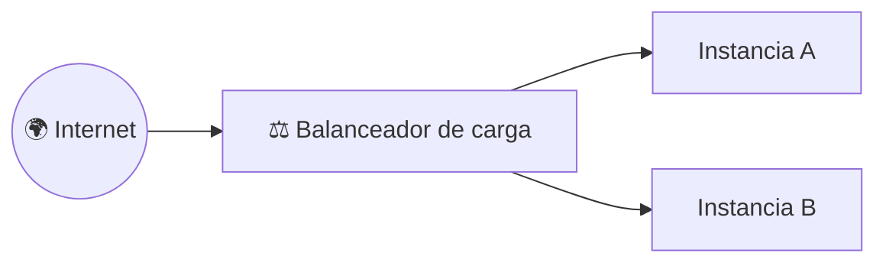
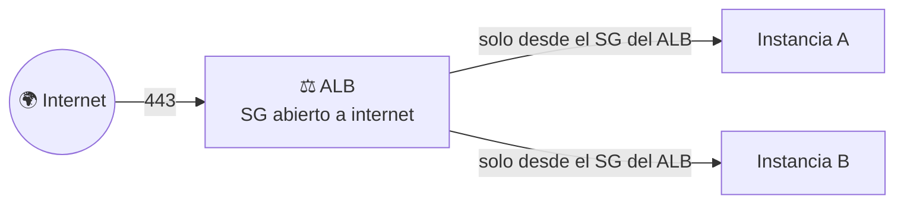
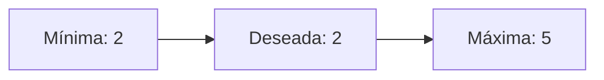
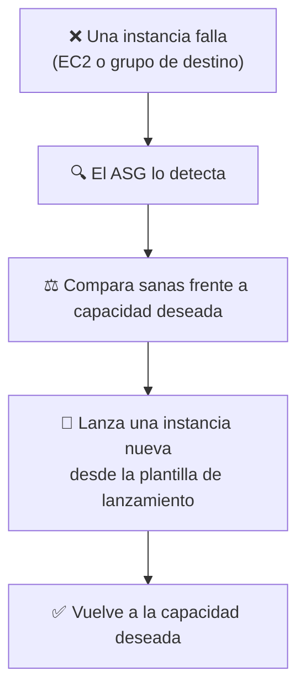
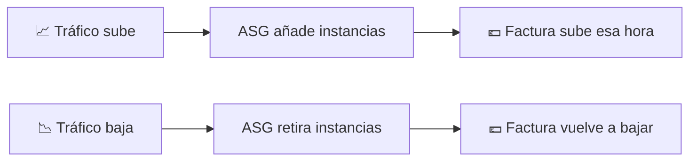

# 🧩 1. Balanceo de carga y escalado automático

---

Cualquier aplicación desplegada sobre una única instancia tiene el mismo punto único de fallo: si esa instancia se cae, se cae la aplicación entera. Hoy resuelves justo ese punto — no añadiendo "una instancia más por si acaso", sino un mecanismo que reparte el tráfico entre varias copias y que repone automáticamente la que falle, sin que tú tengas que estar mirando la pantalla.

---

## 🧭 Balanceador de carga, grupos de destino y comprobaciones de salud

Un **balanceador de carga** (*Load Balancer*) se coloca delante de tus instancias y reparte el tráfico entrante entre ellas, de forma que el cliente nunca habla directamente con una instancia concreta — habla con el balanceador, y es él quien decide a cuál mandar cada petición. AWS ofrece varios tipos según el nivel al que operan; el que vas a usar hoy es el **ALB** (*Application Load Balancer*), pensado justo para tráfico HTTP/HTTPS como el de la API de Escaparate — es la opción que vas a elegir en la consola cuando llegue el momento de crearlo.

El balanceador necesita saber en qué puerto y protocolo escucha, y a qué grupo de instancias reenvía lo que recibe — esa regla es un **listener**: "todo lo que llegue por el puerto 443 en HTTPS, mándalo a este grupo de destino". Un balanceador puede tener varios listeners a la vez (por ejemplo, uno en HTTP y otro en HTTPS).

Las instancias detrás del balanceador se organizan en un **grupo de destino** (*Target Group*), y el balanceador no manda tráfico a ciegas — antes comprueba periódicamente, mediante una **comprobación de salud** (*Health Check*, una petición HTTP a una ruta concreta que debe responder correctamente), si cada instancia está realmente en condiciones de atender peticiones.

!!! example "Por qué la comprobación de salud importa más de lo que parece"
    Imagina una instancia que sigue "encendida" pero cuya aplicación se ha quedado colgada — responde al ping de red, pero no sirve ninguna página. Sin comprobación de salud, el balanceador seguiría mandándole tráfico igualmente, y una parte de tus usuarios vería errores sin que nada en el estado de la instancia lo delatara. Con la comprobación activa, el balanceador la retira del grupo de destino en cuanto deja de responder correctamente, y solo la vuelve a incluir cuando se recupera.

Ahora que hay un balanceador delante, el grupo de seguridad de tus instancias tiene que cambiar con él: ya no tiene sentido que el puerto de la aplicación siga abierto a `0.0.0.0/0` como en el Tema 3, porque nadie de fuera necesita hablar con una instancia directamente — todo el mundo pasa por el balanceador. La regla correcta es la misma de siempre, aplicada un escalón más: el puerto de la aplicación solo acepta tráfico desde el grupo de seguridad **del propio balanceador**, y es el balanceador el único que tiene su puerto abierto a internet.

!!! tip "Retirar una instancia no corta las peticiones en marcha, si le das tiempo"
    Cuando el balanceador retira una instancia del grupo de destino —porque falla la comprobación de salud o porque el ASG reduce capacidad— no la mata en el acto: durante un tiempo configurable, el **retraso de anulación de registro** (*deregistration delay*), deja de mandarle peticiones nuevas pero espera a que termine de responder las que ya tenía en curso. Sin ese margen, un usuario que estuviera a mitad de una petición vería la conexión cortada de golpe, aunque la instancia no tuviera ningún problema real hasta ese momento.

Fíjate en un detalle que vas a encontrar en la propia consola al crear el balanceador: AWS no te deja elegir una sola subred, exige al menos dos, en dos zonas de disponibilidad distintas. No es una limitación arbitraria del formulario — el propio ALB es un servicio distribuido, con nodos redundantes repartidos entre esas zonas, precisamente para que el balanceador en sí no se convierta en el nuevo punto único de fallo que hoy estás eliminando de tus instancias. Si una zona entera cae, el ALB sigue funcionando con los nodos de la otra.

---

## 🧩 Escalado vertical frente a horizontal

Cuando una instancia se queda corta de capacidad, hay dos formas de responder, y no son intercambiables:

| | Escalado vertical | Escalado horizontal |
|---|---|---|
| Qué haces | Cambias la instancia por un tipo más grande | Añades más instancias iguales |
| Límite | El tamaño de instancia más grande que existe | Prácticamente ninguno |
| ¿Hay corte de servicio? | Sí — normalmente hay que parar la instancia para cambiar su tipo | No, si está bien orquestado: las nuevas se añaden mientras las demás siguen sirviendo |
| Encaja con balanceador | No lo necesita | Es la base de todo lo que vas a construir hoy |

El escalado horizontal es el que hace posible la alta disponibilidad: si tienes una sola instancia, por muy grande que sea, sigue siendo un único punto de fallo. Con varias instancias más pequeñas repartidas, la caída de una no tumba el servicio.

---

## 🔧 Grupos de escalado automático

Un **grupo de escalado automático** (*Auto Scaling Group*, ASG) es el mecanismo que mantiene un número de instancias saludables detrás del balanceador, añadiendo o quitando automáticamente según haga falta. Se define con tres números:

| Parámetro | Qué significa |
|---|---|
| Capacidad mínima | Nunca hay menos instancias que esta, pase lo que pase |
| Capacidad deseada | El número que el grupo intenta mantener en condiciones normales |
| Capacidad máxima | Nunca hay más instancias que esta, por mucho que suba la demanda |

Fíjate en algo importante: el grupo de escalado automático necesita una plantilla de lanzamiento como la que has visto en el Tema 2 — sin ella, el ASG no sabría con qué imagen, tipo y configuración lanzar una instancia nueva cuando le hiciera falta reponer una.

---

## 🩺 Dos capas de comprobación de salud: EC2 y grupo de destino

El grupo de destino del balanceador ya comprueba la salud de cada instancia con una petición HTTP, como has visto antes — pero el grupo de escalado automático trae la suya propia, más básica, activada por defecto: el **estado del sistema EC2** (si la instancia responde a nivel de red y hardware, sin mirar si la aplicación de dentro funciona). Ahí está el problema si solo confías en esa comprobación: una instancia puede estar perfectamente sana a nivel de EC2 —arrancada, con red, sin fallos de host— y aun así tener la aplicación colgada por dentro, sin servir ni una sola petición.

| | Comprobación EC2 (por defecto) | Comprobación del grupo de destino |
|---|---|---|
| Qué mira | Estado del hardware y la red de la instancia | Respuesta HTTP de la propia aplicación |
| Detecta | Instancia parada, bloqueada o con fallo de host | Aplicación colgada, aunque la instancia esté "viva" |
| Quién la aporta | El propio servicio EC2 | El balanceador de carga |

Por eso, cuando conectas el ASG a un grupo de destino, se le puede indicar que use *también* la comprobación de salud del balanceador —la misma petición a `/api/salud/listo` que ya conoces— para decidir si una instancia sigue sana. Con las dos activas, el ASG detecta y repone tanto una instancia caída de verdad como una que sigue "viva" pero con la aplicación colgada por dentro: dos fallos muy distintos que, sin la comprobación del grupo de destino, pasarían desapercibidos igual.

---

## 🔁 Cómo repone el ASG una instancia caída

Cuando cualquiera de las dos comprobaciones falla, el ASG no espera a que hagas nada: compara continuamente cuántas instancias sanas tiene contra la capacidad deseada, y en cuanto detecta que faltan, lanza una nueva desde la misma plantilla de lanzamiento —la misma AMI, el mismo tipo de instancia, los mismos datos de usuario— hasta volver al número que le has pedido mantener.

Vas a provocar esto tú mismo en el reto de la Actividad 4.1, terminando una instancia a mano y cronometrando cuánto tarda el grupo en reponerla — es exactamente este mecanismo el que vas a ver actuar, sin que tengas que tocar nada más.

---

## ⚙️ Políticas por métrica y periodo de calentamiento

El ASG no decide escalar al azar — sigue una **política de escalado**, normalmente basada en una métrica como el uso de CPU: "si la CPU media supera el 70 % durante varios minutos, añade una instancia; si baja del 30 %, quita una". Cada vez que se añade una instancia nueva, hay un **periodo de calentamiento** (*warm-up* o *cooldown*) antes de que el ASG vuelva a evaluar si necesita escalar más — le da tiempo a la instancia recién lanzada a arrancar y empezar a servir tráfico de verdad antes de contarla como "ya está ayudando".

!!! warning "Sin periodo de calentamiento, el escalado se dispara sin control"
    Si el ASG evaluara la métrica inmediatamente después de lanzar una instancia nueva —que todavía está arrancando, sin servir tráfico— seguiría viendo la CPU alta y lanzaría otra instancia, y otra, en una espiral que solo se detiene al llegar a la capacidad máxima. El periodo de calentamiento existe precisamente para evitar esto.

---

## 📊 La elasticidad reflejada en la factura

Todo esto tiene una consecuencia directa en el gasto: un grupo de escalado automático no factura una capacidad fija, sino la que realmente está en marcha en cada momento. Un pico de tráfico de una hora sube el gasto solo esa hora, y vuelve a bajar en cuanto el ASG retira las instancias que ya no hacen falta.

Vas a medir esto de primera mano en la Actividad 4.1: vas a generar carga real, ver cómo responde el grupo de escalado, y comprobar cuánto tarda de verdad —no en teoría— desde que sube la CPU hasta que una instancia nueva atiende tráfico.

!!! tip "El balanceador no escala como las instancias"
    Todo lo anterior se aplica a las instancias del grupo de escalado, no al balanceador en sí: el ALB tiene un coste base por hora simplemente por existir, más un cargo adicional según cuánto tráfico procesa —cuántas peticiones nuevas atiende, cuántas conexiones mantiene abiertas y cuántos datos mueve, resumido en una unidad de medida propia llamada **LCU** (*Load Balancer Capacity Unit*)—, independientemente de cuántas instancias haya detrás en cada momento. Es la pieza fija de esta arquitectura; las instancias son la pieza elástica.

---

## ✅ Ideas clave

??? tip "Abrir resumen"

    - Un balanceador de carga (hoy, un ALB, pensado para HTTP/HTTPS) reparte tráfico entre instancias de un grupo de destino, comprobando su salud antes de mandarles peticiones; un listener define en qué puerto/protocolo escucha y a qué grupo de destino reenvía. El propio ALB exige al menos dos zonas de disponibilidad, para no ser él mismo un punto único de fallo.
    - Con el balanceador delante, el puerto de la aplicación deja de estar abierto a internet: solo acepta tráfico del grupo de seguridad del propio balanceador — el mismo principio de mínimo privilegio del Tema 3, un escalón más.
    - El retraso de anulación de registro deja que una instancia retirada termine las peticiones que ya tenía en marcha antes de dejar de recibir tráfico nuevo — evita cortes en seco.
    - Escalado vertical (instancia más grande) tiene límite y suele cortar servicio; escalado horizontal (más instancias) es la base de la alta disponibilidad.
    - Un grupo de escalado automático se define con capacidad mínima, deseada y máxima, y usa una plantilla de lanzamiento (como la del Tema 2) para saber cómo lanzar instancias nuevas.
    - El ASG combina dos comprobaciones de salud —la básica de EC2 (hardware/red) y la del grupo de destino (respuesta HTTP de la aplicación)— para detectar tanto una instancia caída como una que sigue viva pero colgada por dentro; en cuanto detecta que faltan instancias sanas, lanza una nueva desde la plantilla de lanzamiento hasta volver a la capacidad deseada.
    - Las políticas de escalado reaccionan a una métrica (típicamente CPU); el periodo de calentamiento evita que el ASG escale en espiral mientras una instancia nueva todavía está arrancando.
    - La elasticidad se refleja directamente en la factura para las instancias: se paga por la capacidad real en marcha, no por una fija reservada de antemano. El balanceador, en cambio, tiene un coste base fijo por existir más un cargo por tráfico (LCU) — es la pieza no elástica de esta arquitectura.

Con esto ya tienes las piezas para la Actividad 4.1 — Balanceador de carga y Auto Scaling Group.
