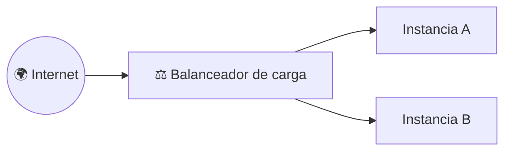
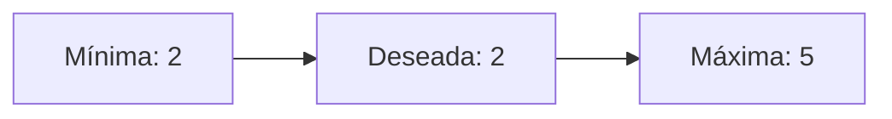
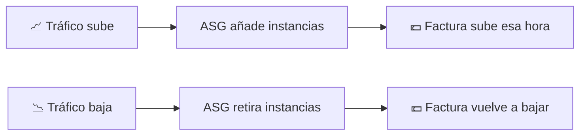

# 🧩 1. Balanceo de carga y escalado automático

---

Cualquier aplicación desplegada sobre una única instancia tiene el mismo punto único de fallo: si esa instancia se cae, se cae la aplicación entera. Hoy resuelves justo ese punto — no añadiendo "una instancia más por si acaso", sino un mecanismo que reparte el tráfico entre varias copias y que repone automáticamente la que falle, sin que tú tengas que estar mirando la pantalla.

---

## 🧭 Balanceador de carga, grupos de destino y comprobaciones de salud

Un **balanceador de carga** (*Load Balancer*) se coloca delante de tus instancias y reparte el tráfico entrante entre ellas, de forma que el cliente nunca habla directamente con una instancia concreta — habla con el balanceador, y es él quien decide a cuál mandar cada petición.

El balanceador necesita saber en qué puerto y protocolo escucha, y a qué grupo de instancias reenvía lo que recibe — esa regla es un **listener**: "todo lo que llegue por el puerto 443 en HTTPS, mándalo a este grupo de destino". Un balanceador puede tener varios listeners a la vez (por ejemplo, uno en HTTP y otro en HTTPS).

Las instancias detrás del balanceador se organizan en un **grupo de destino** (*Target Group*), y el balanceador no manda tráfico a ciegas — antes comprueba periódicamente, mediante una **comprobación de salud** (*Health Check*, una petición HTTP a una ruta concreta que debe responder correctamente), si cada instancia está realmente en condiciones de atender peticiones.

!!! example "Por qué la comprobación de salud importa más de lo que parece"
    Imagina una instancia que sigue "encendida" pero cuya aplicación se ha quedado colgada — responde al ping de red, pero no sirve ninguna página. Sin comprobación de salud, el balanceador seguiría mandándole tráfico igualmente, y una parte de tus usuarios vería errores sin que nada en el estado de la instancia lo delatara. Con la comprobación activa, el balanceador la retira del grupo de destino en cuanto deja de responder correctamente, y solo la vuelve a incluir cuando se recupera.

---

## 🧩 Escalado vertical frente a horizontal

Cuando una instancia se queda corta de capacidad, hay dos formas de responder, y no son intercambiables:

| | Escalado vertical | Escalado horizontal |
|---|---|---|
| Qué haces | Cambias la instancia por un tipo más grande | Añades más instancias iguales |
| Límite | El tamaño de instancia más grande que existe | Prácticamente ninguno |
| ¿Hay corte de servicio? | Sí — normalmente hay que parar la instancia para cambiar su tipo | No, si está bien orquestado: las nuevas se añaden mientras las demás siguen sirviendo |
| Encaja con balanceador | No lo necesita | Es la base de todo lo que vas a construir hoy |

El escalado horizontal es el que hace posible la alta disponibilidad: si tienes una sola instancia, por muy grande que sea, sigue siendo un único punto de fallo. Con varias instancias más pequeñas repartidas, la caída de una no tumba el servicio.

---

## 🔧 Grupos de escalado automático

Un **grupo de escalado automático** (*Auto Scaling Group*, ASG) es el mecanismo que mantiene un número de instancias saludables detrás del balanceador, añadiendo o quitando automáticamente según haga falta. Se define con tres números:

| Parámetro | Qué significa |
|---|---|
| Capacidad mínima | Nunca hay menos instancias que esta, pase lo que pase |
| Capacidad deseada | El número que el grupo intenta mantener en condiciones normales |
| Capacidad máxima | Nunca hay más instancias que esta, por mucho que suba la demanda |

Fíjate en algo importante: el grupo de escalado automático necesita una plantilla de lanzamiento como la que viste en el Tema 2 — sin ella, el ASG no sabría con qué imagen, tipo y configuración lanzar una instancia nueva cuando le hiciera falta reponer una.

---

## ⚙️ Políticas por métrica y periodo de calentamiento

El ASG no decide escalar al azar — sigue una **política de escalado**, normalmente basada en una métrica como el uso de CPU: "si la CPU media supera el 70 % durante varios minutos, añade una instancia; si baja del 30 %, quita una". Cada vez que se añade una instancia nueva, hay un **periodo de calentamiento** (*warm-up* o *cooldown*) antes de que el ASG vuelva a evaluar si necesita escalar más — le da tiempo a la instancia recién lanzada a arrancar y empezar a servir tráfico de verdad antes de contarla como "ya está ayudando".

!!! warning "Sin periodo de calentamiento, el escalado se dispara sin control"
    Si el ASG evaluara la métrica inmediatamente después de lanzar una instancia nueva —que todavía está arrancando, sin servir tráfico— seguiría viendo la CPU alta y lanzaría otra instancia, y otra, en una espiral que solo se detiene al llegar a la capacidad máxima. El periodo de calentamiento existe precisamente para evitar esto.

---

## 📊 La elasticidad reflejada en la factura

Todo esto tiene una consecuencia directa en el gasto: un grupo de escalado automático no factura una capacidad fija, sino la que realmente está en marcha en cada momento. Un pico de tráfico de una hora sube el gasto solo esa hora, y vuelve a bajar en cuanto el ASG retira las instancias que ya no hacen falta.

Vas a medir esto de primera mano en la Actividad 4.1: vas a generar carga real, ver cómo responde el grupo de escalado, y comprobar cuánto tarda de verdad —no en teoría— desde que sube la CPU hasta que una instancia nueva atiende tráfico.

---

## ✅ Ideas clave

??? tip "Abrir resumen"

    - Un balanceador de carga reparte tráfico entre instancias de un grupo de destino, comprobando su salud antes de mandarles peticiones; un listener define en qué puerto/protocolo escucha y a qué grupo de destino reenvía.
    - Escalado vertical (instancia más grande) tiene límite y suele cortar servicio; escalado horizontal (más instancias) es la base de la alta disponibilidad.
    - Un grupo de escalado automático se define con capacidad mínima, deseada y máxima, y usa una plantilla de lanzamiento (como la del Tema 2) para saber cómo lanzar instancias nuevas.
    - Las políticas de escalado reaccionan a una métrica (típicamente CPU); el periodo de calentamiento evita que el ASG escale en espiral mientras una instancia nueva todavía está arrancando.
    - La elasticidad se refleja directamente en la factura: se paga por la capacidad real en marcha, no por una capacidad fija reservada de antemano.

Con esto ya tienes las piezas para la Actividad 4.1 — Balanceador de carga y Auto Scaling Group.
