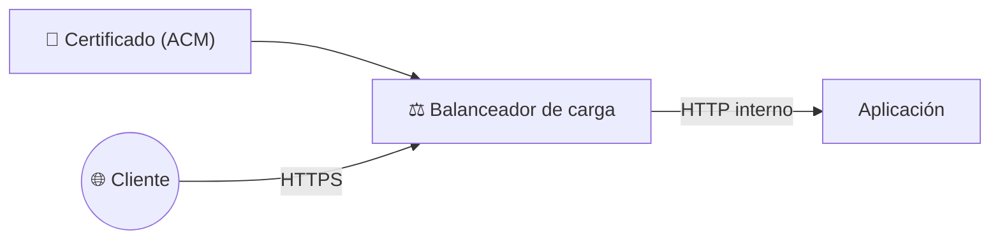
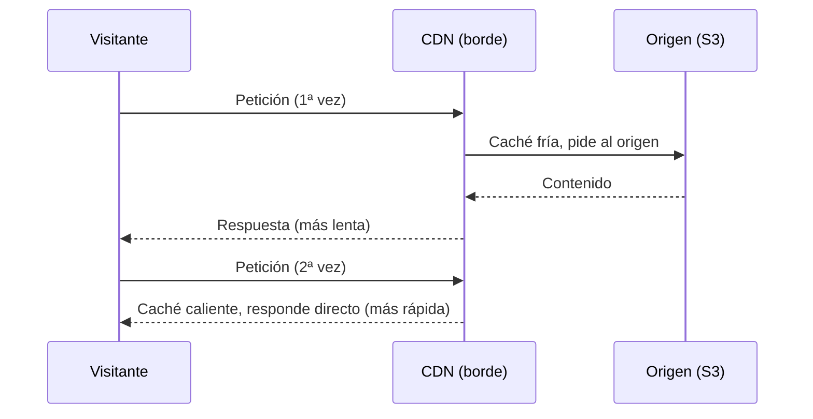

# 🧩 2. DNS, HTTPS y distribución de contenido

---

Escaparate ya se repone solo si una instancia falla y escala si sube el tráfico, pero sigue viviendo detrás de una URL genérica de AWS, larga y sin HTTPS propio — nada que le pondrías a un cliente real. Hoy le das una dirección con nombre propio, un certificado que garantiza la conexión cifrada, y una red que acerca el contenido estático al visitante en vez de servirlo siempre desde la misma región. Con esto se cierra el segundo punto único de fallo de tu lista: depender de una única forma de entrar al sistema, sin nombre, sin cifrado y sin acercamiento al usuario.

---

## 🧭 DNS gestionado: zonas y registros

Cuando escribes `escaparate.tudominio.com` en el navegador, tu ordenador no sabe hablar con un nombre — necesita una dirección IP. El **DNS** (*Domain Name System*) es el sistema que hace esa traducción: una especie de agenda de contactos gigante y repartida por todo internet, donde cada nombre de dominio tiene asociada la dirección real a la que hay que conectarse. Sin DNS, tendrías que memorizar y escribir directamente la dirección IP de cada sitio que quisieras visitar.

Un servicio de DNS gestionado —como **Route 53**— te permite alojar tu propia **zona** (el conjunto de registros DNS de un dominio) sin tener que montar y mantener tú un servidor de nombres. Dentro de esa zona defines **registros**: entradas que traducen un nombre legible en algo que un ordenador puede usar para conectar.

| Tipo de registro | Traduce a | Cuándo lo usas |
|---|---|---|
| `A` | Una dirección IP | Apuntar directamente a un recurso con IP fija |
| `CNAME` | Otro nombre de dominio | Apuntar a un recurso de AWS con nombre propio (una CDN, por ejemplo) |
| `Alias` (propio de Route 53) | Un recurso de AWS, sin coste de consulta añadido | Apuntar a un balanceador de carga o una CDN, la opción recomendada dentro de AWS |

!!! tip "Por qué un registro Alias y no un CNAME hacia el balanceador"
    El balanceador de carga no tiene una IP fija —puede cambiar—, así que un registro `A` no sirve. Un `CNAME` funcionaría, pero un registro `Alias` hace lo mismo sin el coste adicional de una consulta DNS extra y sin la limitación de no poder usarse en el propio nombre raíz del dominio. Es la opción que vas a usar en la Actividad 4.2.

---

## 🧩 Comprobaciones de salud y políticas de enrutamiento

Route 53 no se limita a traducir nombres — puede comprobar activamente si un destino está sano, y decidir a cuál de varios responder según una **política de enrutamiento**.

| Política | Qué decide | Ejemplo de uso |
|---|---|---|
| Simple | Siempre el mismo destino | Un solo balanceador, sin alternativas |
| Latencia | El destino que responda más rápido al usuario concreto | Varias regiones, cada una sirviendo a los usuarios más cercanos |
| Geolocalización | El destino según el país o continente del usuario | Contenido distinto según la zona geográfica |
| Conmutación por error | El destino principal, y solo si falla su comprobación de salud, el secundario | Alta disponibilidad a nivel de DNS, no solo dentro de una región |

!!! example "La diferencia entre latencia y conmutación por error, con el mismo par de destinos"
    Con dos balanceadores en dos regiones, una política de latencia reparte tráfico entre ambos constantemente, según quién responda más rápido a cada usuario. Una política de conmutación por error, en cambio, usa siempre el principal mientras esté sano, y solo pasa al secundario si el principal deja de responder — no reparte, sustituye.

Este módulo trabaja con una única región, así que no vas a configurar geolocalización ni latencia entre regiones — pero es importante que sepas que existen, porque son la pieza que falta para llevar la alta disponibilidad del Tema 4 más allá de una sola región.

---

## 🔧 Certificados gestionados y HTTPS en el borde

Un certificado digital demuestra que el servidor con el que hablas es quien dice ser, y habilita la conexión cifrada (HTTPS). **AWS Certificate Manager** (ACM) emite y renueva certificados de forma gestionada — sin que tengas que generar una petición de firma, ni acordarte de renovarlo antes de que caduque.

Antes de emitirlo, ACM tiene que comprobar que el dominio es de verdad tuyo — si no, cualquiera podría pedir un certificado para el dominio de otro. La forma más cómoda es la **validación por DNS**: ACM te da un registro concreto (un CNAME con un valor único) para que lo añadas a tu zona; en cuanto lo detecta ahí, da por probado que controlas el dominio y emite el certificado — sin que tengas que demostrar nada por otra vía.

Fíjate en el diagrama: el certificado se instala en el balanceador, no en cada instancia. La conexión cifrada llega hasta el balanceador —eso es "HTTPS en el borde"—, y de ahí hacia dentro, entre el balanceador y tus instancias, puede seguir siendo HTTP normal, porque ese tramo ya no sale nunca a internet. Es la misma lógica de "no expongas más de lo necesario" que ya conoces, aplicada al cifrado: cifra el tramo que de verdad viaja por una red que no controlas.

---

## ⚙️ CDN: caché en el borde, TTL e invalidación

Una **CDN** (*Content Delivery Network*, como CloudFront) guarda copias de tu contenido estático en ubicaciones de borde repartidas por el mundo —las mismas que viste en la sesión 1—, para que un visitante lejano de tu región no tenga que esperar a que la petición viaje hasta allí y vuelva.

- **TTL** (*Time To Live*): cuánto tiempo guarda la CDN una copia antes de volver a pedirla al origen. Un TTL alto reduce peticiones al origen, pero también retrasa que los visitantes vean un cambio de contenido.
- **Invalidación**: forzar a la CDN a descartar una copia en caché antes de que expire su TTL, para que la próxima petición sí vaya a buscar la versión nueva al origen.

Vas a medir esta diferencia de tiempos de verdad en la Actividad 4.2 — caché fría frente a caché caliente— y vas a comprobar qué pasa cuando cambias el contenido sin invalidar.

---

## 📊 Qué contenido merece CDN y cuál no

No todo el contenido de Escaparate se beneficia igual de una CDN. La regla es sencilla: cuanto más estático y menos personal sea un contenido, más sentido tiene cachearlo cerca del usuario.

| Contenido | ¿Merece CDN? | Por qué |
|---|---|---|
| Front estático (HTML, CSS, JS) | Sí | Igual para todos los visitantes, cambia poco |
| Imágenes de producto | Sí | Igual para todos, se benefician mucho de estar cerca del usuario |
| Respuesta de la API con datos del carrito de un usuario | No | Distinta para cada usuario, no tiene sentido cachearla |
| Endpoint `/api/salud` de comprobación | No | Necesita reflejar el estado real en cada instante, no una copia antigua |

!!! warning "Cachear contenido que cambia por usuario es un error real, no solo ineficiente"
    Si una CDN cachea por error una respuesta que debería ser distinta para cada visitante, un usuario podría llegar a ver datos que no le corresponden. La pregunta antes de poner algo detrás de una CDN nunca es solo "¿es más rápido?", es también "¿es lo mismo para todo el mundo?".

---

## ✅ Ideas clave

??? tip "Abrir resumen"

    - Una zona DNS gestionada aloja registros que traducen nombres a recursos; un registro Alias es la forma recomendada de apuntar a un balanceador dentro de AWS.
    - Las políticas de enrutamiento deciden a qué destino responder: simple, por latencia, por geolocalización, o con conmutación por error entre principal y secundario.
    - Un certificado gestionado (ACM) habilita HTTPS en el borde — se instala en el balanceador, no en cada instancia, y el tramo interno puede seguir siendo HTTP.
    - Una CDN guarda copias en ubicaciones de borde; el TTL decide cuánto dura la copia, y la invalidación fuerza a descartarla antes de tiempo.
    - Solo merece la pena poner detrás de una CDN contenido igual para todos los visitantes — nunca datos que deban ser distintos para cada usuario.

Con esto ya tienes las piezas para la Actividad 4.2 — Dominio propio y caché en el borde.
