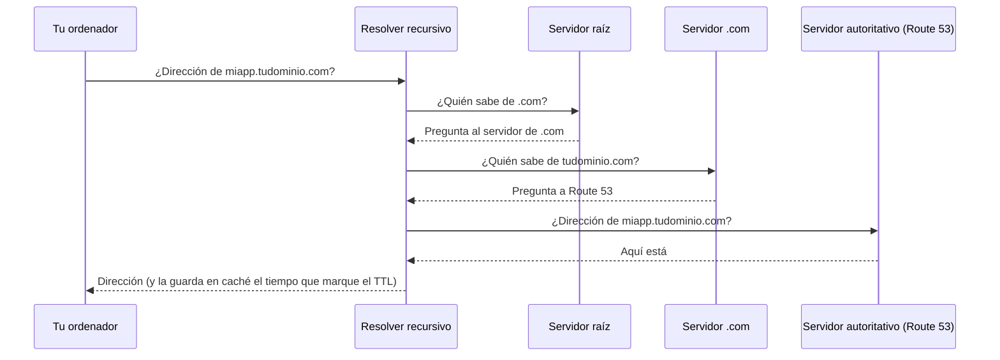
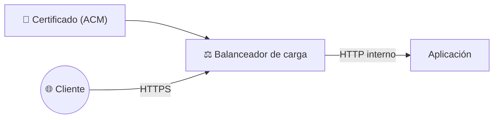
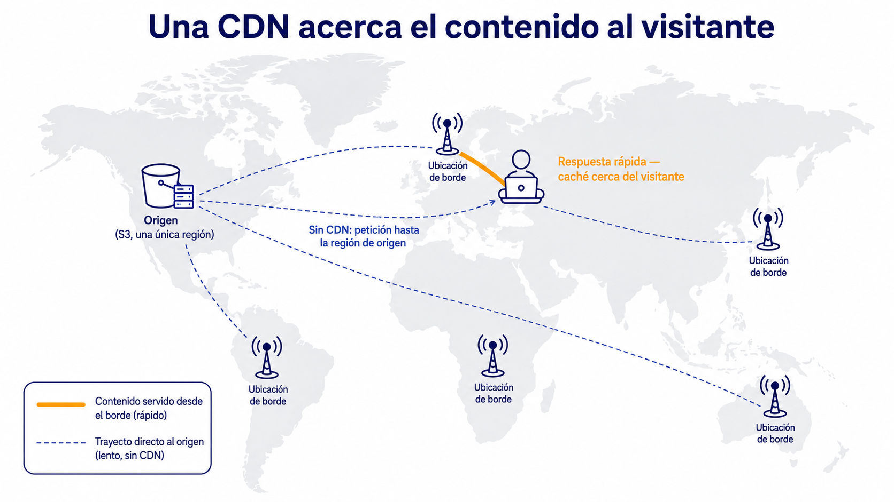
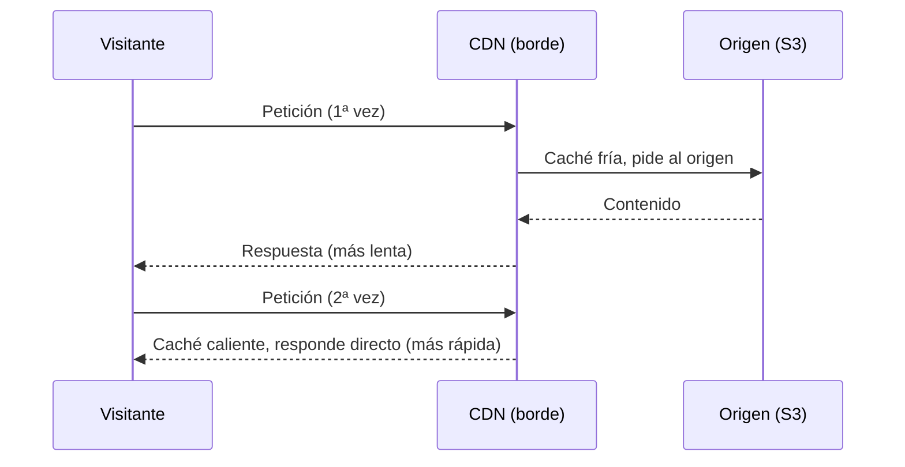

# 🧩 2. DNS, HTTPS y distribución de contenido

---

Una aplicación con balanceador y escalado automático ya se repone sola si una instancia falla y escala si sube el tráfico, pero puede seguir viviendo detrás de una URL genérica de AWS, larga y sin HTTPS propio — nada que le pondrías a un cliente real. Hoy le das una dirección con nombre propio, un certificado que garantiza la conexión cifrada, y una red que acerca el contenido estático al visitante en vez de servirlo siempre desde la misma región. Con esto se cierra otro punto único de fallo habitual: depender de una única forma de entrar al sistema, sin nombre, sin cifrado y sin acercamiento al usuario.

---

## 🧭 DNS gestionado: zonas y registros

Cuando escribes `miapp.tudominio.com` en el navegador, tu ordenador no sabe hablar con un nombre — necesita una dirección IP. El **DNS** (*Domain Name System*) es el sistema que hace esa traducción: una especie de agenda de contactos gigante y repartida por todo internet, donde cada nombre de dominio tiene asociada la dirección real a la que hay que conectarse. Sin DNS, tendrías que memorizar y escribir directamente la dirección IP de cada sitio que quisieras visitar.

Esa agenda de contactos no la lleva un único servidor, sino que está repartida entre muchísimos servidores distintos, cada uno responsable de una porción del nombre. Para tu propio dominio, esa porción la puedes alojar tú mismo con **Route 53**, el servicio de AWS pensado para esto: en vez de montar y mantener tu propio servidor de nombres, usas el de AWS. Ese conjunto de registros de tu dominio, alojado en Route 53, es lo que se llama una **zona**.

Resolver un nombre no es preguntarle a un único servidor, sino a varios, cada uno con un papel distinto:

| Quién | Qué papel tiene |
|---|---|
| Resolver recursivo | Hace todas las preguntas siguientes en tu lugar, saltando de servidor en servidor hasta conseguir la respuesta final. No guarda ningún registro propio — normalmente es el de tu operador de internet, o el que trae configurado tu sistema operativo. |
| Servidor raíz | La cima de todo el sistema DNS mundial —hay solo unos pocos, repartidos por el planeta—. No conoce ninguna dirección, pero sabe qué servidor lleva cada terminación de dominio (`.com`, `.org`, `.es`...). |
| Servidor de `.com` (servidor TLD, *Top Level Domain*) | Responsable de todo un dominio de primer nivel como `.com`. Tampoco conoce la dirección final, pero sabe qué servidor concreto es responsable de cada dominio registrado bajo él, como `tudominio.com`. |
| Servidor autoritativo | El único de la cadena que guarda de verdad los registros de un dominio concreto, y por tanto el único capaz de responder con la dirección definitiva. Es justo el papel que cumple Route 53 para las zonas que alojas en él. |

Con estos cuatro papeles ya claros, mira cómo encajan en la cadena completa de preguntas que hace falta para resolver un nombre:

Sigue las flechas en orden: tu ordenador solo le habla al resolver recursivo, nunca directamente a los demás. Es el resolver quien va subiendo la cadena —raíz, luego `.com`, luego el autoritativo— y cada escalón, salvo el último, no contesta la pregunta: solo indica a quién preguntar después. Solo el servidor autoritativo —Route 53, en este caso— conoce de verdad la dirección y se la devuelve.

La buena noticia es que casi nunca ves esta cadena completa: tu proveedor de internet o tu propio sistema operativo ya guardan en caché las respuestas más frecuentes, así que la mayoría de las veces la resolución termina mucho antes de llegar al servidor autoritativo.

Dentro de tu zona en Route 53 defines **registros**: entradas que traducen un nombre legible en algo que un ordenador puede usar para conectar.

!!! note "Alojar la zona no es lo mismo que ser dueño del dominio"
    Son dos servicios independientes, aunque mucha gente los contrate juntos en el mismo sitio por comodidad. El **registrador** es la empresa donde compras `tudominio.com` —por ejemplo GoDaddy, o el propio Route 53— y certifica que ese nombre es tuyo, sin más. Alojar la **zona** es otra cosa: es dónde viven de verdad los registros DNS de ese dominio, y lo puede hacer un proveedor completamente distinto al registrador —podrías comprar el dominio en GoDaddy y alojar la zona en Route 53, por ejemplo—. En este módulo das por hecho que el dominio ya está comprado; te centras solo en la zona.

Dos de los tipos de registro de la tabla mencionan una **CDN** —una red que guarda copias de tu contenido cerca de cada visitante, para no tener que servirlo siempre desde tu región—; la explico con detalle un poco más abajo, en su propia sección, así que de momento quédate solo con que es "otro recurso más al que un registro puede apuntar".

| Tipo de registro | Traduce a | Cuándo lo usas |
|---|---|---|
| `A` | Una dirección IP | Apuntar directamente a un recurso con IP fija |
| `CNAME` | Otro nombre de dominio | Apuntar a un recurso de AWS con nombre propio (una CDN, por ejemplo) |
| `Alias` (propio de Route 53) | Un recurso de AWS, sin coste de consulta añadido | Apuntar a un balanceador de carga o una CDN, la opción recomendada dentro de AWS |

!!! tip "Por qué un registro Alias y no un CNAME hacia el balanceador"
    El balanceador de carga no tiene una IP fija —puede cambiar—, así que un registro `A` no sirve. Un `CNAME` funcionaría, pero un registro `Alias` hace lo mismo sin el coste adicional de una consulta DNS extra y sin la limitación de no poder usarse en el propio nombre raíz del dominio. Es la opción que vas a usar en la Actividad 4.2.

---

## 🧩 Comprobaciones de salud y políticas de enrutamiento

Route 53 no se limita a traducir nombres — puede comprobar activamente si un destino está sano, y decidir a cuál de varios responder según una **política de enrutamiento**.

| Política | Qué decide | Ejemplo de uso |
|---|---|---|
| Simple | Siempre el mismo destino | Un solo balanceador, sin alternativas |
| Latencia | El destino que responda más rápido al usuario concreto | Varias regiones, cada una sirviendo a los usuarios más cercanos |
| Geolocalización | El destino según el país o continente del usuario | Contenido distinto según la zona geográfica |
| Conmutación por error | El destino principal, y solo si falla su comprobación de salud, el secundario | Alta disponibilidad a nivel de DNS, no solo dentro de una región |

!!! example "La diferencia entre latencia y conmutación por error, con el mismo par de destinos"
    Con dos balanceadores en dos regiones, una política de latencia reparte tráfico entre ambos constantemente, según quién responda más rápido a cada usuario. Una política de conmutación por error, en cambio, usa siempre el principal mientras esté sano, y solo pasa al secundario si el principal deja de responder — no reparte, sustituye.

Este módulo trabaja con una única región, así que no vas a configurar geolocalización ni latencia entre regiones — pero es importante que sepas que existen, porque son la pieza que falta para llevar la alta disponibilidad del Tema 4 más allá de una sola región.

---

## 🔧 Certificados gestionados y HTTPS en el borde

Un certificado digital demuestra que el servidor con el que hablas es quien dice ser, y habilita la conexión cifrada (HTTPS). **AWS Certificate Manager** (ACM) emite y renueva certificados de forma gestionada — sin que tengas que generar una petición de firma, ni acordarte de renovarlo antes de que caduque.

Antes de emitirlo, ACM tiene que comprobar que el dominio es de verdad tuyo — si no, cualquiera podría pedir un certificado para el dominio de otro. La forma más cómoda es la **validación por DNS**: ACM te da un registro concreto (un CNAME con un valor único) para que lo añadas a tu zona; en cuanto lo detecta ahí, da por probado que controlas el dominio y emite el certificado — sin que tengas que demostrar nada por otra vía.

Fíjate en el diagrama: el certificado se instala en el balanceador, no en cada instancia. La conexión cifrada llega hasta el balanceador —eso es "HTTPS en el borde"—, y de ahí hacia dentro, entre el balanceador y tus instancias, puede seguir siendo HTTP normal, porque ese tramo ya no sale nunca a internet. Es la misma lógica de "no expongas más de lo necesario" que ya conoces, aplicada al cifrado: cifra el tramo que de verdad viaja por una red que no controlas.

---

## ⚙️ CDN: caché en el borde, TTL e invalidación

Una **CDN** (*Content Delivery Network*, como CloudFront) guarda copias de tu contenido estático en ubicaciones de borde repartidas por el mundo —las mismas que has visto en la sesión 1—, para que un visitante lejano de tu región no tenga que esperar a que la petición viaje hasta allí y vuelva.

El diagrama de arriba es la otra cara del que ya has visto en la sesión 1: allí las ubicaciones de borde aparecían como parte de la infraestructura global; aquí es donde entra en juego la distancia real — el visitante cercano a la región apenas nota la CDN, y el visitante lejano es quien más gana con ella.

AWS ofrece su propia CDN gestionada bajo el nombre **CloudFront**: le indicas qué origen tiene que copiar —un bucket S3, un balanceador de carga, prácticamente cualquier servidor HTTP— y CloudFront se encarga de todo lo demás: replica el contenido en sus ubicaciones de borde, gestiona el TTL y la invalidación desde la consola o por CLI, y añade HTTPS automático con su propio dominio y certificado, sin que tengas que aportar ni configurar nada tú. Es el mismo concepto que ya conoces del balanceador de carga: un servicio completamente gestionado, tú decides las reglas y AWS opera la infraestructura de detrás.

!!! tip "CloudFront en el Learner Lab"
    Algunos Learner Labs bloquean CloudFront por política, como medida de control de coste en una cuenta compartida por muchos alumnos a la vez —lo puedes comprobar tú mismo con `aws cloudfront list-distributions`, que devuelve un error de autorización explícito si está bloqueado, distinto de una lista vacía—. Si es tu caso, la Actividad 4.2 te lo dice claramente y te enseña a construir la misma mecánica de caché (TTL, acierto/fallo de caché, invalidación) con un proxy propio en vez de con el servicio gestionado: los conceptos de esta página no cambian, solo quién opera la infraestructura.

- **TTL** (*Time To Live*): cuánto tiempo guarda la CDN una copia antes de volver a pedirla al origen. Un TTL alto reduce peticiones al origen, pero también retrasa que los visitantes vean un cambio de contenido.
- **Invalidación**: forzar a la CDN a descartar una copia en caché antes de que expire su TTL, para que la próxima petición sí vaya a buscar la versión nueva al origen.

!!! example "El mismo TTL, dos escenarios muy distintos"
    Un TTL de **300 segundos** (5 minutos) en el logo de una tienda significa, como mucho, 5 minutos de retraso si lo cambias — asumible. Ese mismo TTL de 300 segundos en el precio de un producto en oferta relámpago ya no lo es: durante esos 5 minutos, una CDN puede seguir sirviendo un precio que ya no es válido. Un TTL de **86400 segundos** (24 horas) en cambio tiene sentido para algo que casi nunca cambia, como una imagen de fondo. El TTL correcto no es un número fijo — depende de cuánto te cuesta que alguien vea una versión antigua.

Vas a medir esta diferencia de tiempos de verdad en la Actividad 4.2 — caché fría frente a caché caliente— y vas a comprobar qué pasa cuando cambias el contenido sin invalidar.

---

## 📊 Qué contenido merece CDN y cuál no

No todo el contenido de una aplicación se beneficia igual de una CDN. La regla es sencilla: cuanto más estático y menos personal sea un contenido, más sentido tiene cachearlo cerca del usuario.

| Contenido | ¿Merece CDN? | Por qué |
|---|---|---|
| Front estático (HTML, CSS, JS) | Sí | Igual para todos los visitantes, cambia poco |
| Imágenes de producto | Sí | Igual para todos, se benefician mucho de estar cerca del usuario |
| Respuesta de la API con datos del carrito de un usuario | No | Distinta para cada usuario, no tiene sentido cachearla |
| Endpoint `/api/salud` de comprobación | No | Necesita reflejar el estado real en cada instante, no una copia antigua |

!!! warning "Cachear contenido que cambia por usuario es un error real, no solo ineficiente"
    Si una CDN cachea por error una respuesta que debería ser distinta para cada visitante, un usuario podría llegar a ver datos que no le corresponden. La pregunta antes de poner algo detrás de una CDN nunca es solo "¿es más rápido?", es también "¿es lo mismo para todo el mundo?".

---

## ✅ Ideas clave

??? tip "Abrir resumen"

    - Resolver un nombre de dominio es una cadena de preguntas (resolver → raíz → TLD → autoritativo); una zona DNS gestionada aloja los registros que responden en el último paso, y alojar la zona no es lo mismo que ser dueño del dominio.
    - Un registro Alias es la forma recomendada de apuntar a un balanceador dentro de AWS, porque su dirección puede cambiar.
    - Las políticas de enrutamiento deciden a qué destino responder: simple, por latencia, por geolocalización, o con conmutación por error entre principal y secundario.
    - Un certificado gestionado (ACM) habilita HTTPS en el borde — se instala en el balanceador, no en cada instancia, y el tramo interno puede seguir siendo HTTP.
    - Una CDN guarda copias en ubicaciones de borde; el TTL decide cuánto dura la copia (un TTL corto tolera menos desactualización, uno largo reduce peticiones al origen), y la invalidación fuerza a descartarla antes de tiempo.
    - Solo merece la pena poner detrás de una CDN contenido igual para todos los visitantes — nunca datos que deban ser distintos para cada usuario.

Con esto ya tienes las piezas para la Actividad 4.2 — Dominio propio y caché en el borde.
