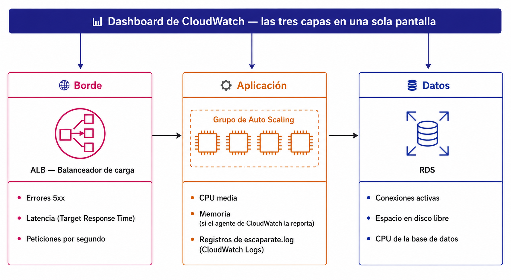

# 🧪 Actividad 5.1: Monitorización y diagnóstico con CloudWatch

!!! warning "Descarga la plantilla"
    📄 [Plantilla 5.1 — Monitorización y diagnóstico con CloudWatch](plantillas/Actividad_5_1_INU_Plantilla.docx){target="_blank" rel="noopener"}

!!! warning "Descarga los recursos"
    📦 [Recursos de la Actividad 5.1](recursos/actividad_5_1_recursos.zip){target="_blank" rel="noopener"} — el script para recrear el balanceador de la 4.1 y el nuevo script de arranque con el agente de CloudWatch incluido.

## Contexto

Escaparate se repone solo, escala solo y tiene su propia caché delante — pero hasta ahora, cada vez que algo ha ido mal en esta sesión, lo has diagnosticado conectándote a mirar por dentro: un `cat` a un log, un `ps aux`, un `curl` a mano. Eso funciona hoy porque sabes exactamente qué instancia mirar. En una arquitectura con escalado automático de verdad, la instancia que falló puede llevar minutos terminada y reemplazada cuando llegues a conectarte — la comodidad de "entro y miro" deja de ser fiable.



Hoy le pones a Escaparate lo que le falta para operarse sin esa comodidad: métricas y logs centralizados, un dashboard con las tres capas a la vista, tres alarmas que de verdad importan, y una incidencia real que vas a diagnosticar solo con lo que ha quedado registrado — sin asomarte a ninguna instancia mientras ocurre.

## Qué vas a practicar

- Instalar y configurar el agente de CloudWatch para centralizar los logs de Escaparate y las métricas que EC2 no reporta solo (memoria, disco).
- Construir un dashboard de CloudWatch con las tres capas de la arquitectura: borde, aplicación y datos.
- Diseñar y crear tres alarmas útiles, una por capa — no veinte alarmas de todo lo que se puede medir.
- Diagnosticar una incidencia real siguiendo el orden de la teoría: cuándo, qué capa, qué error, quién.
- Capturar un evento de cambio de estado con EventBridge, la cuarta señal que la teoría deja fuera del alcance práctico del módulo.

## Requisitos previos

El balanceador, el grupo de escalado y la RDS de la 4.1 (el Paso 0 te indica cómo reactivarlos si los has dejado pausados al cerrar la 4.2). El bucket S3 del frontend de la 3.3. Los apuntes de esta sesión — [«Monitorización y operación»](monitorizacion-operacion.md).

!!! info "Hoy tampoco tocas el código de Escaparate"
    Todo lo de hoy es observabilidad por fuera — ni el backend ni el frontend cambian una sola línea. Lo único que cambia es la plantilla de lanzamiento, para añadir el agente de CloudWatch.

---

## Parte A — Métricas, logs, dashboard y alarmas (guiada)

### Paso 0 — Reactiva la arquitectura de la 4.1

1. **RDS → tu instancia → Acciones → Comenzar** (si la has dejado detenida). Espera a que esté `Disponible` — tarda unos **5 minutos**, no es instantáneo.
2. Desde CloudShell, con el script de los recursos de hoy, recrea el balanceador y el grupo de destino:

    ```bash
    bash recrear-alb.sh
    ```

    Sustituye antes los tres marcadores del script (identificador, `vpc_id`, las dos subredes públicas) por tus valores de Terraform.

3. Anota el DNS name nuevo que imprime el script, y actualiza `config.js` en tu bucket de frontend (`apiBase`) con ese valor — sube el fichero de nuevo con `aws s3 cp`, igual que en el Paso 8 de la 4.1.
4. **EC2 → Grupos de Auto Scaling → tu grupo → Editar** → capacidad mínima **2**, deseada **2** (si la habías dejado a 0) — deja **máxima en 4**, tal como quedó en la 4.1, no la cambies.

!!! warning "Respeta este orden: primero el script, luego la capacidad"
    Si subes la capacidad del ASG **antes** de ejecutar `recrear-alb.sh`, el grupo de Auto Scaling va a intentar lanzar instancias mientras todavía tiene enganchado el ARN del grupo de destino antiguo (borrado en un cierre anterior) — y cada lanzamiento falla con `One or more target groups not found. Validating load balancer configuration failed.` (lo ves con `aws autoscaling describe-scaling-activities --auto-scaling-group-name escaparate-asg-<tu-identificador>`). El script ya desengancha esa referencia antigua antes de enganchar la nueva, así que si sigues el orden de los puntos 1 a 4 tal cual, no te pasa. Si ya lo has hecho al revés y te has quedado con este error, corrígelo a mano sin esperar a que el script se ejecute solo: `aws autoscaling detach-load-balancer-target-groups --auto-scaling-group-name escaparate-asg-<tu-identificador> --target-group-arns <arn-del-grupo-de-destino-antiguo>` (el ARN exacto lo sacas de `aws autoscaling describe-auto-scaling-groups --auto-scaling-group-names escaparate-asg-<tu-identificador> --query "AutoScalingGroups[0].TargetGroupARNs"`).

!!! tip "Esto no es instantáneo: cuenta con varios minutos de espera en cada punto"
    La RDS tarda en torno a 5 minutos en pasar a `Disponible`. Una vez subes la capacidad del ASG, lanzar las dos instancias nuevas y que pasen las comprobaciones de salud del grupo de destino (que además arrancan el user data entero: montar EFS, leer credenciales, arrancar Escaparate) tarda otros 5-10 minutos más. No es que algo esté fallando si no ves resultado al momento — aprovecha esa espera para dejar preparado el resto de recursos de la sesión.

**Comprueba**: que la RDS está `Disponible`, que el grupo de destino nuevo muestra las dos instancias `healthy`, y que el catálogo carga correctamente desde la URL de tu bucket de frontend.

**Captura**: el grupo de destino con las dos instancias `healthy`, y el catálogo cargando con datos reales.

### Paso 1 — Instala el agente de CloudWatch en la plantilla de lanzamiento

EC2 ya reporta CPU, red y E/S de disco de cada instancia sin que hagas nada — pero **memoria** y **espacio libre de disco** no forma parte de las métricas por defecto, y los logs de `escaparate.log` se quedan dentro de cada instancia, no llegan solos a CloudWatch. El agente de CloudWatch es quien recoge las dos cosas y las envía.

1. **EC2 → Plantillas de lanzamiento → tu plantilla de la 4.1 → Modificar plantilla (crear nueva versión)**.
2. En **Datos de usuario**, sustituye el contenido entero por el nuevo script de los recursos de hoy, `arranque-instancia-cloudwatch.sh` (edítalo primero con tus tres marcadores de siempre — EFS, identificador, origen del frontend — exactamente igual que en la 4.1).
3. Dentro de **Detalles de la plantilla**, marca esta versión nueva como **Versión predeterminada**.
4. Termina **una sola** de las dos instancias actuales a mano (**EC2 → Instancias → selecciónala → Estado de la instancia → Terminar instancia**). El ASG lanza una de reemplazo usando ya la plantilla nueva —la que acabas de marcar como predeterminada—, sin que tengas que decirle nada más.
5. Espera a que la instancia nueva aparezca `healthy` en el grupo de destino **antes de tocar la segunda** — así nunca te quedas sin ninguna instancia sana atendiendo tráfico.
6. Repite los puntos 4 y 5 con la segunda instancia.

**Comprueba**: que **CloudWatch → Métricas → Métricas clásicas** muestra un espacio de nombres nuevo (`CWAgent`) con datos de memoria de tus instancias, y que **CloudWatch → Registros → Administración de registros** muestra un grupo nuevo con entradas de `escaparate.log`.

**Captura**: la métrica de memoria del agente con datos reales, y el grupo de registros mostrando al menos una entrada.

### Paso 2 — Construye un dashboard con las tres capas

1. **CloudWatch → Paneles → Crear panel**. Nómbralo `escaparate-dashboard-<tu-identificador>`.
2. Añade un widget de tipo **Línea** con la métrica del **borde**: `TargetResponseTime` de tu balanceador. Al buscarla, elige la categoría **"Métricas por AppELB"** (una sola línea agregada, sin desglosar por zona ni grupo de destino) — dentro de esa lista, asegúrate de marcar el `LoadBalancer` con el nombre real de tu balanceador actual (`app/escaparate-alb-<tu-identificador>/...`); CloudWatch conserva durante un tiempo las métricas de balanceadores ya borrados de sesiones anteriores, así que puede aparecer más de uno en la lista.

    !!! info "HTTPCode_Target_5XX_Count se añade más adelante, en la Parte B"
        CloudWatch no crea una métrica hasta que ocurre al menos un evento de ese tipo — como tu balanceador de hoy todavía no ha tenido ningún error 5xx de aplicación, esa serie **todavía no existe**, y buscarla ahora no serviría de nada. Vas a volver a este mismo widget para añadirla en la Parte B, justo cuando provoques el fallo que la hace aparecer con datos reales.
3. Añade un segundo widget, también de tipo **Línea**, con las métricas de la **aplicación**: `CPUUtilization` del grupo de Auto Scaling, y `mem_used_percent` del espacio de nombres `CWAgent`. Para `CPUUtilization` elige la métrica agregada **"por grupo de Auto Scaling"** (una sola línea); para `mem_used_percent`, en cambio, el agente no agrega entre instancias —dentro de la categoría `host`, marca **las dos** instancias, no solo una—, así que verás dos líneas de memoria, una por réplica.
4. Añade un tercer widget, también de tipo **Línea**, con las métricas de los **datos**: `DatabaseConnections` y `FreeStorageSpace` de tu instancia RDS. Búscalas dentro de la categoría **"RDS > DBInstanceIdentifier"** (no por clase de instancia ni por motor, que agregan varias bases de datos distintas) y marca el identificador que coincida exactamente con tu base de datos actual (`escaparate-db-<tu-identificador>`) — igual que con el balanceador, puede aparecer más de un identificador si en algún momento renombraste o recreaste la RDS.
5. Ordena los tres widgets en fila, de izquierda a derecha, en el mismo orden que la teoría: borde, aplicación, datos.

**Comprueba**: que el dashboard muestra las tres capas a la vez, en una sola pantalla, sin tener que cambiar de vista para ver cada una.

**Captura**: el dashboard completo con los tres widgets visibles.

### Paso 3 — Diseña y crea dos de las tres alarmas (la tercera espera a la Parte B)

No vale poner una alarma a todo lo que se puede medir — elige una por capa, la que de verdad detectaría un problema real en cada una. La alarma de borde (`HTTPCode_Target_5XX_Count`) tiene el mismo problema que la métrica del Paso 2: todavía no existe ningún dato, así que ni siquiera aparece en el buscador del asistente. Créala más adelante, en la Parte B, en cuanto haya errores 5xx de verdad — por ahora, crea las otras dos. El asistente es el mismo para ambas, solo cambia la métrica y los números:

1. **CloudWatch → Alarmas → Todas las alarmas → Crear alarma**.
2. **Seleccionar métrica** → busca y elige la métrica de esta alarma (con las mismas categorías del Paso 2: "por grupo de Auto Scaling" para la CPU, "por DBInstanceIdentifier" para la RDS).
3. En **Especificar métrica y condiciones**: elige el **período** de evaluación y la **condición** (mayor que / menor que) y el **umbral**, según la alarma:
    - **Alarma de aplicación**: `CPUUtilization` (la del grupo de Auto Scaling), estadística **Promedio**, período **5 minutos**, condición **Mayor que 80** —la misma métrica que ya usas para escalar en la 4.1, pero con un propósito distinto: ahí dispara una acción automática, aquí solo te avisa a ti—.
    - **Alarma de datos**: `FreeStorageSpace` de la RDS, estadística **Promedio**, período **5 minutos**, condición **Menor que 2147483648** (2 GiB en bytes, la unidad en la que viene la métrica).
4. En **Configurar acciones**: quita cualquier notificación que el asistente proponga por defecto (botón **Eliminar** junto a la acción) y deja la alarma **sin ninguna acción** — no hace falta un tema SNS con correo suscrito para esta actividad, lo que se evalúa es el umbral y el período, no la notificación.
5. Ponle un nombre descriptivo (por ejemplo `escaparate-alarma-cpu-<tu-identificador>`) y crea la alarma.
6. Repite los puntos 1 a 5 para la otra.

**Comprueba**: que las dos alarmas aparecen creadas, cada una vigilando la métrica correcta de su capa, con el umbral y el período que has elegido.

**Captura**: las dos alarmas en la lista de **CloudWatch → Alarmas**, con su estado y su métrica visibles.

### Paso 4 — Genera carga real y observa la alarma de CPU

Con el DNS de tu balanceador nuevo del Paso 0, genera carga real —más concurrencia y más duración por petición que en la 4.1, para asegurar que satura bloques enteros de 5 minutos, no solo picos puntuales—:

```bash
for tanda in {1..120}; do
  for i in {1..150}; do
    curl -s "http://<dns-del-balanceador>/api/carga?ms=5000" &
  done
  wait
done
```

Son unos 10 minutos de carga sostenida — déjalo corriendo sin cortar hasta que veas la alarma reaccionar.

!!! tip "El gráfico no sube en tiempo real, sube a saltos de 5 minutos"
    Por defecto, EC2 publica `CPUUtilization` cada **5 minutos** (monitorización básica) — así que el widget del dashboard no va a subir suave y continuo mientras miras, sino que va a dar un salto cada vez que llega un punto nuevo, y puede ser un salto grande (de un 25% a un 90-100% de golpe, por ejemplo), porque cada punto representa la media de todo ese bloque de 5 minutos, no una foto instantánea. Deja el bucle corriendo sin parar mientras esperas — la alarma necesita ver **varios puntos consecutivos** por encima del 80%, así que hacen falta al menos un par de esos bloques de 5 minutos con carga sostenida antes de que cambie de estado.

!!! tip "Si la alarma dice 'En alarma' pero el gráfico del widget no llega a 80, haz caso a la alarma"
    Abre la propia alarma y mira su gráfico: si dice algo como "CPUUtilization > 80 para 1 puntos de dato", es porque CloudWatch ha detectado de verdad al menos un punto por encima del umbral en su evaluación exacta del período que configuraste. El widget del dashboard, en cambio, puede agrupar los datos en bloques más anchos según el rango de tiempo que tengas seleccionado, suavizando visualmente picos breves que sí existen en los datos reales. Ante una discrepancia entre los dos, la alarma es la fuente fiable —evalúa el período exacto, sin suavizar—, no el gráfico del widget.

**Comprueba**: que la alarma de CPU del Paso 3 pasa a estado **En alarma** (o se acerca claramente al umbral, si el ASG escala antes de completar los 5 minutos) mientras dura la carga, y que el widget de aplicación del dashboard refleja la subida.

**Captura**: la alarma en estado `En alarma` (o su gráfica acercándose al umbral), junto con el widget del dashboard mostrando la misma subida.

---

## Parte B — Reto: rompe algo a propósito y diagnostícalo a ciegas (reto)

- **Predice, rompe la conexión a la base de datos, y diagnostica siguiendo el orden de la teoría**: antes de tocar nada, **predice** por escrito qué esperas ver en cada una de las tres capas del dashboard si Escaparate deja de poder conectarse a su base de datos —¿subirá la CPU? ¿subirán los 5xx? ¿qué mostrará la métrica de la propia RDS?—.

    Después, rompe la conexión tú mismo, tocando **solo** el grupo de seguridad de RDS y la propia RDS —nada de EC2, nada de EFS—:

    1. Localiza `escaparate-rds-sg-<tu-identificador>` (el que has corregido en el Paso 4 de la 3.2) y elimina su única regla de entrada (puerto 5432).
    2. Borrar la regla **no basta por sí sola**: los grupos de seguridad de AWS no cortan las conexiones TCP que ya estaban abiertas antes de borrar la regla, solo bloquean intentos de conexión nuevos — y Escaparate mantiene un *pool* de conexiones (HikariCP) ya abiertas hacia la RDS, que además el propio *health check* del grupo de destino (`/api/salud/listo`, que hace una consulta real a la base de datos cada 30 segundos) mantiene siempre "calientes". Mientras esas conexiones sigan vivas, nada falla, por mucha carga que generes. Para forzar que la aplicación necesite abrir una conexión **nueva** —la única que de verdad choca con la regla que has borrado—, tienes que cortar las conexiones existentes desde el lado de la base de datos: **RDS → tu instancia → Acciones → Reiniciar** (sin marcar "Reiniciar con conmutación por error" — no aplica a una instancia de una sola zona).
    3. Anota la hora exacta en la que reinicias la RDS.
    4. En cuanto la RDS esté reiniciando, prueba con un solo `curl http://<dns-del-balanceador>/api/productos`. La petición se queda colgada varios segundos —normal: la aplicación está esperando a que el *pool* le entregue una conexión nueva y no llega—. Espera a que termine sola: HikariCP tiene un tiempo máximo de espera por conexión, y pasado ese tiempo la petición devuelve un error 500 real.

    !!! warning "La ventana de fallo con el target todavía sano es breve"
        En cuanto la RDS deja de responder, el propio *health check* (`/api/salud/listo`) empieza a fallar también, con lo que en cuestión de uno o dos minutos el grupo de destino va a marcar tus instancias como `unhealthy` y las saca de la rotación. Antes de que eso pase tienes una ventana breve en la que el *target* todavía está `healthy` pero las peticiones a `/api/productos` ya fallan con 500 — es en ese momento cuando `HTTPCode_Target_5XX_Count` recoge datos reales. Si tardas demasiado y llegas tarde a esa ventana, no pasa nada: ver los targets pasar a `unhealthy` es también una señal diagnóstica válida, solo que entonces el error que verías sería del propio balanceador (`HTTPCode_ELB_5XX_Count`), no del target.

    Ahora que ya hay errores 5xx de verdad, vuelve al widget de borde del dashboard (**Editar**) y añade la métrica `HTTPCode_Target_5XX_Count` de tu balanceador —la misma que en el Paso 2 no aparecía porque todavía no existía—. De paso, crea también la tercera alarma que dejaste pendiente en el Paso 3 (**CloudWatch → Alarmas → Crear alarma**, misma métrica, estadística **Suma**, período **1 minuto**, condición **Mayor que 5**) — ahora sí debería aparecer al buscarla.

    Diagnostica siguiendo **exactamente** este orden, sin saltarte ninguno:

    1. **Cuándo** — mira las métricas del dashboard y localiza el momento exacto en que algo empezó a comportarse distinto.
    2. **Qué capa** — compara las tres capas en esa ventana de tiempo: ¿cuál muestra la anomalía y cuál se queda normal? (pista: no todas van a moverse igual).
    3. **Qué error concreto** — usa **CloudWatch Logs → Insights**, apunta al grupo de registros del Paso 1, y busca las líneas de `escaparate.log` de esa ventana de tiempo con una consulta como `fields @timestamp, @message | filter @message like /Connection/`.
    4. **Quién ha cambiado algo** — abre **CloudTrail → Historial de eventos** (no hace falta crear ningún *trail* nuevo, el historial de los últimos 90 días ya viene activado por defecto) y busca el evento `RevokeSecurityGroupIngress` cerca de la hora que has anotado.

    Cuando termines de diagnosticar, arréglalo: vuelve a añadir la regla de entrada al puerto 5432 con origen el `security_group_id` de Terraform, y confirma que el catálogo vuelve a responder.

    !!! warning "Añadir la regla no arregla nada al instante — no reinicies la RDS otra vez"
        Mientras las instancias estaban `unhealthy`, es probable que el Auto Scaling ya las haya sustituido por otras nuevas (compruébalo por la hora de lanzamiento en **EC2 → Instancias**). Justo después de añadir la regla vas a seguir viendo fallos —un `502 Bad Gateway` del balanceador es normal en este momento—, porque el grupo de destino tarda uno o dos minutos en volver a comprobar la salud de las instancias existentes, y si son instancias nuevas, necesitan el mismo arranque completo del Paso 0 (montar EFS, leer credenciales, arrancar Escaparate) antes de pasar el *health check*. No hace falta que reinicies la RDS de nuevo ni que toques nada más: solo espera a que el grupo de destino vuelva a marcar `healthy` las instancias, y entonces sí, el catálogo responde.

    **Comprueba**: que tu predicción por escrito existe antes de romper nada, que has seguido el orden completo (no has ido directo a los logs sin mirar antes las métricas), y que identificas correctamente cuál de las tres capas muestra la anomalía y cuál no.

    **Captura**: tu predicción escrita, el momento exacto localizado en las métricas, la consulta de Logs Insights con el error real, el evento `RevokeSecurityGroupIngress` en CloudTrail con su hora y su usuario, y la confirmación final de que el catálogo vuelve a responder tras arreglarlo.

- **Justifica una retención de logs real**: por defecto, un grupo de registros de CloudWatch Logs no borra nunca nada —se conserva para siempre, y ese espacio cuesta dinero mientras existe—. Entra en el grupo de registros del Paso 1, cambia su retención de "Nunca caduca" a un valor concreto, y justifica por escrito, en un par de frases, por qué ese número de días y no otro, pensando en cuánto tiempo de verdad necesitarías mirar hacia atrás si tuvieras que investigar una incidencia como la de este reto.

    **Comprueba**: que el grupo de registros muestra la retención nueva (no "Nunca caduca"), y que la justificación tiene en cuenta un caso de uso real, no un número al azar.

    **Captura**: la configuración de retención del grupo de registros, con tu justificación al lado.

- **Captura el cuarto tipo de señal con EventBridge**. Ya has trabajado con las otras tres señales de la teoría —métricas y alarmas con CloudWatch, registros con CloudWatch Logs, auditoría con CloudTrail—; cierra ahora el círculo con **EventBridge**, quien reacciona a los eventos de cambio de estado:

    1. **EventBridge → Reglas → Crear regla**. Nómbrala `escaparate-eventos-instancia-<tu-identificador>`.
    2. Tipo: **Regla con patrón de eventos**. Origen: servicio de AWS **EC2**, tipo de evento **EC2 Instance State-change Notification**, estado `terminated` — si el asistente no te deja filtrar por estado en el desplegable, pega directamente este patrón:

        ```json
        {
          "source": ["aws.ec2"],
          "detail-type": ["EC2 Instance State-change Notification"],
          "detail": { "state": ["terminated"] }
        }
        ```

    3. Destino: **Grupo de registros de CloudWatch Logs**, crea uno nuevo, `/escaparate/eventos-instancia`. Acepta cuando la consola te pida permiso para añadir la política de recursos que deja a EventBridge escribir ahí.
    4. Prueba la regla terminando una instancia del ASG a mano (la misma acción del primer reto de la 4.1) y comprueba que el grupo de registros nuevo recoge el evento, con el `instance-id` y el estado `terminated` dentro.

    **Comprueba**: que el grupo de registros nuevo tiene una entrada con el evento capturado, generada justo al terminar la instancia.

    **Captura**: la regla de EventBridge configurada, y la entrada del evento en el grupo de registros.

**Entrega**: el diagnóstico completo del primer reto, con las cuatro capturas en el orden en que las has ido consiguiendo, la retención de logs justificada del segundo, y la regla de EventBridge del tercero.

---

## Criterios de evaluación

**Parte A — hasta 6 puntos**

| Apartado | Puntos |
|---|---|
| Agente de CloudWatch instalado, con métrica de memoria y log de aplicación llegando correctamente | 2 |
| Dashboard con las tres capas (borde, aplicación, datos) correctamente construido | 1 |
| Tres alarmas creadas, una por capa, con umbrales razonables | 2 |
| Carga real generada y alarma de CPU comprobada en el dashboard | 1 |

**Parte B — reto, hasta 4 puntos adicionales (máximo total: 10)**

| Apartado | Puntos |
|---|---|
| Predicción previa, incidencia provocada y diagnosticada siguiendo el orden completo (cuándo → capa → error → quién) | 2 |
| Retención de logs configurada y justificada con un caso de uso real | 1 |
| Regla de EventBridge capturando el evento de terminación de una instancia | 1 |

---

## ✅ Cierre

Escaparate ya no depende de que tú estés mirando en el momento exacto en que algo falla — las métricas quedan grabadas, los logs quedan centralizados, y las alarmas avisan solas. Has practicado además algo que vale para cualquier incidente real, no solo para el de hoy: el orden de diagnóstico (cuándo, qué capa, qué error, quién) no depende de qué se haya roto en concreto.

!!! danger "Antes de salir: qué hacer con lo de hoy"
    1. Borra el grupo de registros de CloudWatch Logs si no vas a seguir usándolo pronto (aunque con la retención que has fijado en el reto, ya no se acumula para siempre). Borra también la regla de EventBridge y el grupo de registros `/escaparate/eventos-instancia`.
    2. Borra las tres alarmas y el dashboard si no vas a continuar en las próximas horas —no cuestan nada mientras existen, pero tampoco sirven de nada si no vas a mirarlos—.
    3. Si no vas a continuar con la 5.2 en las próximas horas: baja el ASG a capacidad 0, detén la RDS, y borra el balanceador y el grupo de destino otra vez (el mismo `recrear-alb.sh` te lo vuelve a montar en un par de minutos) — el mismo criterio de pausar-no-borrar que ya conoces de la 4.2.
    4. No toques el EFS, la AMI, la plantilla de lanzamiento ni el bucket S3 del frontend — la 5.2 los necesita tal cual.
