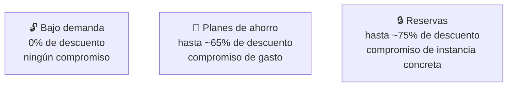

# 🧩 3. Economía de la nube

{ type=application/pdf style="width:100%;min-height:80vh" }

!!!info "Descarga de diapositivas"
    [Descarga las diapositivas](diapositivas/economia-nube.pptx){target="_blank" rel="noopener"}

---

Llevas varias sesiones apagando en cada cierre lo que no hacía falta y anotando el recurso más caro del día. Hoy conviertes esa costumbre en algo con nombre y con números: cómo se factura de verdad cada pieza que has usado, qué modelos de compra existen más allá de pagar sobre la marcha, y cómo se estima el coste de una arquitectura completa antes de construirla — no después, cuando ya es tarde para decidir distinto.

---

## 🧭 Cómo se factura de verdad

Cada servicio de AWS se factura con su propia unidad, y confundirlas lleva a estimaciones muy equivocadas.

| Servicio | Unidad de facturación | Lo que ya has usado en el módulo |
|---|---|---|
| Cómputo (EC2) | Por segundo de instancia en marcha | Cada instancia lanzada desde el Tema 2 |
| Almacenamiento (S3, EBS) | Por GB-mes almacenado | El front, las imágenes, los discos de tus instancias |
| Transferencia de salida | Por GB que sale hacia internet | Cada visita a tu aplicación desde fuera de AWS |
| Peticiones | Por número de operaciones (lecturas, escrituras) | Cada `GetObject` a S3, cada consulta a RDS |

!!! warning "La transferencia de salida es la que más sorprende"
    La transferencia de **entrada** (subir datos a AWS) normalmente no cuesta nada; la de **salida** (que un dato salga de AWS hacia internet) sí, y es una de las líneas que más crece sin que te des cuenta, sobre todo si sirves imágenes pesadas sin optimizar. La CDN del Tema 4 no solo acerca contenido al usuario — también reduce esta partida, porque buena parte del tráfico se sirve desde el borde sin volver a salir del origen.

Con esas cuatro unidades ya puedes poner un número a una arquitectura antes de construirla, sumando cada pieza por separado. Una instancia pequeña encendida todo el mes, una base de datos gestionada del mismo tamaño, unos pocos GB de imágenes y un poco de tráfico de salida da, de forma orientativa, algo así:

| Partida | Estimación mensual orientativa |
|---|---|
| 1 instancia EC2 pequeña, 24/7 | ~7 € |
| 1 réplica de base de datos gestionada, mismo tamaño | ~13 € |
| 10 GB de imágenes en S3 | menos de 1 € |
| 5 GB de transferencia de salida al mes | ~0,5 € |
| **Total orientativo** | **~21 €/mes** |

No memorices estas cifras — cambian con la región, el tamaño exacto y el tipo de instancia, y **la calculadora que vas a usar en la Actividad 5.3 te da el número real para tu caso concreto**, no uno aproximado como este. Lo que sí conviene retener es la idea: cada fila de esta tabla sale de una unidad de facturación distinta de la tabla de arriba, y sumarlas por separado —en vez de intentar adivinar "cuánto cuesta la aplicación" de un plumazo— es exactamente el método que vas a aplicar hoy sobre tu propia arquitectura.

---

## 🧩 Capa gratuita y sus límites

La **capa gratuita** (*Free Tier*) de AWS incluye una cantidad limitada de uso sin coste durante un tiempo, pensada para aprender y probar — no para sostener una carga de producción real. Tiene tres formas distintas, y confundirlas lleva a sorpresas en la factura:

| Tipo | Cómo funciona |
|---|---|
| Siempre gratis | Un límite mensual que nunca caduca (por ejemplo, cierto número de peticiones a Lambda) |
| 12 meses gratis | Solo durante el primer año de la cuenta, después se factura normal |
| Prueba de corta duración | Un crédito o límite que caduca en pocas semanas |

!!! tip "El Learner Lab no funciona con capa gratuita normal"
    El crédito de tu laboratorio es una asignación distinta a la capa gratuita de una cuenta personal — por eso el ritual de vigilar el gasto importa desde la primera sesión, no solo cuando se agote un límite anual como en una cuenta nueva normal.

---

## 🔧 Modelos de compra

El cómputo no tiene un único precio — AWS ofrece varios modelos de compra, y todos responden a la misma lógica: cuanto más compromiso asumes tú sobre cuánto vas a usar, más descuento te da AWS, porque le resulta más fácil planificar la capacidad de sus centros de datos si sabe de antemano qué va a estar ocupado. Ese compromiso es de **facturación**, no de uso real: si reservas una instancia durante un año y la apagas dos meses, sigues pagando el año entero — la reserva no es "un descuento si la usas", es "te cobro esto sí o sí, a cambio de un precio menor".

Estos tres se comparan bien entre sí porque los tres cobran **el mismo tipo de compromiso**: cuánto tiempo y con qué detalle le garantizas a AWS que vas a mantener algo encendido.

| Modelo | Compromiso | Descuento típico | Cuándo encaja |
|---|---|---|---|
| Bajo demanda | Ninguno, pagas por segundo de uso | Ninguno | Cargas impredecibles, o mientras pruebas |
| Planes de ahorro | Compromiso de gasto (no de instancia concreta) durante 1 o 3 años | Alto, más flexible que una reserva | Cargas estables pero que pueden cambiar de tipo de instancia |
| Reservas | Una instancia concreta durante 1 o 3 años | Alto | Cargas estables y predecibles a largo plazo, sin previsión de cambiar de tamaño |

A más tiempo y más detalle te comprometes por adelantado, menor es el precio por hora — un único espectro, de menos a más compromiso.

Hay un cuarto modelo que no aparece en esa tabla: las **instancias interrumpibles**, o *Spot* — el descuento más alto de los cuatro modelos, a cambio de que AWS pueda quitártela con muy poco margen de aviso en cuanto le haga falta esa misma capacidad.

Spot queda fuera del espectro de arriba a propósito — no cambia compromiso por descuento, cambia **disponibilidad** por descuento, así que necesita sus propias columnas, no las de "cuánto te comprometes":

| Modelo | Compromiso de tiempo | Riesgo que asumes | Descuento típico |
|---|---|---|---|
| Instancias interrumpibles (*Spot*) | Ninguno — puedes apagarla tú cuando quieras, como en bajo demanda | AWS puede recuperarla ella misma, con solo 2 minutos de aviso | Muy alto (hasta 90%) |

!!! info "De dónde sale ese descuento tan alto"
    En cada centro de datos de AWS hay, en todo momento, servidores físicos que nadie está usando ahora mismo — nadie ha reservado esa capacidad ni la está pagando bajo demanda. Dejarla parada no le genera a AWS ningún ingreso, así que la vende muy barata (hasta un 90% menos) con una condición: si en algún momento aparece un cliente dispuesto a pagar el precio normal por esa misma capacidad, AWS te la quita a ti para dársela a él. Es como el asiento de un avión que se vende como "stand-by" a última hora: mucho más barato, pero si aparece alguien dispuesto a pagar el billete completo, el asiento vuelve a ser suyo, no tuyo.

    Mecánicamente esto significa: cuando AWS necesita recuperar tu instancia Spot, te avisa con **una notificación de interrupción con 2 minutos de margen** (puedes programar tu aplicación para detectarla y guardar lo que haga falta antes de que la instancia se detenga) y después la apaga. No hay negociación ni forma de evitarlo — los 2 minutos son fijos, sean cuales sean tus circunstancias.

    Por eso Spot no encaja para nada que necesite seguir encendido sin interrupción (una base de datos, un servidor que atiende peticiones en directo) — encaja para trabajo que se puede cortar y retomar sin que nadie lo note: generar miniaturas de un lote de imágenes, procesar un fichero grande por partes, entrenar un modelo guardando puntos de control cada pocos minutos.

!!! example "Lo que cuesta de verdad la diferencia, en números"
    Una instancia pequeña de propósito general encendida los 365 días del año, pagada mes a mes bajo demanda, ronda los 90 € al año. La misma instancia con un compromiso de reserva a un año puede bajar a unos 55-60 € — el mismo hardware, la misma capacidad, la diferencia es solo cuánto le has garantizado a AWS por adelantado que la vas a mantener encendida.

!!! example "Un mismo sistema, varios modelos de compra a la vez"
    En una arquitectura real no se elige un único modelo para todo: la parte de tu aplicación que sabes que va a estar encendida siempre (por ejemplo, la base de datos) es candidata a un plan de ahorro o una reserva; el tráfico que varía y no puedes predecir se deja en bajo demanda; y una tarea de fondo tolerante a interrupciones, como generar miniaturas de un lote de imágenes de una vez, encaja bien en instancias Spot — si se interrumpe, se puede relanzar sin que nadie note nada.

---

## ⚙️ Las 6 R de la migración

Cuando una aplicación que ya existe (no una nueva, construida ya pensando en la nube) se plantea llevarla a la nube, hay seis estrategias distintas — y "migrar" aquí no significa siempre "mover algo a AWS": dos de las seis son, de hecho, decisiones de **no moverla**.

**Las que no implican tocar nada en la nube:**

| Estrategia | Qué implica | Ejemplo |
|---|---|---|
| Retiring | Apagarla: ya no aporta valor y mantenerla solo cuesta dinero | Una aplicación interna de hace años que quedó sustituida por otra y nadie ha vuelto a abrir |
| Retaining | Dejarla exactamente donde está, sin fecha de migración | Un sistema que depende de un equipo físico muy concreto, y migrarlo ahora mismo no compensa el esfuerzo |

**Las que sí migran, con esfuerzo creciente:**

| Estrategia | Qué implica | Esfuerzo | Ejemplo |
|---|---|---|---|
| Rehosting (*lift-and-shift*) | Mover tal cual, sin cambiar nada | Bajo | Copiar un servidor físico a una instancia EC2, con el mismo sistema operativo y la misma configuración |
| Replatforming | Cambios menores para aprovechar algún servicio gestionado | Medio | Sustituir una base de datos instalada a mano por RDS, sin tocar el código de la aplicación |
| Repurchasing | Dejar de mantener la aplicación propia y pasarse a un producto ya hecho (SaaS) | Variable | Cerrar un servidor de correo propio y contratar un correo gestionado en su lugar |
| Refactoring | Rediseñar la aplicación pensando en la nube desde cero | Alto | Partir un monolito en varios servicios independientes que escalan cada uno por su cuenta |

El esfuerzo de Repurchasing aparece como "Variable" y no en un punto fijo de la escala a propósito: depende por completo de lo distinto que sea el producto SaaS al que te cambias, no hay una regla general como con las otras tres.

!!! tip "No hay una estrategia "correcta" en abstracto"
    Una aplicación heredada crítica pero estable puede beneficiarse más de un *rehosting* rápido y barato que de un *refactoring* completo que tarde meses — el criterio no es cuál demuestra más dominio técnico, es cuál resuelve el problema de negocio con el esfuerzo justificado. Vas a aplicar este criterio a un caso concreto en la Actividad 5.3.

---

## 📊 Palancas de optimización y etiquetado

Cambiar de modelo de compra (la sección de arriba) no es la primera palanca que se toca en un caso real: antes hay otras más sencillas de aplicar y, muchas veces, con más margen de ahorro. Ninguna de las cuatro siguientes depende de negociar nada con AWS — depende solo de mirar lo que ya tienes desplegado y ajustarlo.

| Palanca | En qué consiste | Ejemplo |
|---|---|---|
| Apagar lo que no se usa | Muchos recursos siguen encendidos (y facturando) fuera de las horas en que alguien los usa | Una instancia EC2 de entorno de pruebas que solo se usa en horario de oficina sigue encendida las 24 horas: apagarla por la noche y el fin de semana recorta su coste de cómputo en más de un 75%, sin tocar nada de la aplicación |
| Ajustar tamaño al uso real (*rightsizing*) | Es habitual sobredimensionar "por si acaso" al crear un recurso, y no volver a revisarlo nunca más | Una instancia con 4 vCPU que CloudWatch lleva meses mostrando al 8% de uso de CPU probablemente funciona igual de bien —y más barata— en un tamaño con la mitad de vCPU |
| Mover datos fríos a clases de acceso más baratas | S3 tiene varias clases de almacenamiento (visto en el Tema 3); no toda clase de acceso tiene por qué costar igual | Los informes mensuales de hace tres años casi nunca se vuelven a abrir: moverlos de S3 Standard a una clase de acceso infrecuente reduce su coste de almacenamiento aunque el tamaño en GB no cambie |
| Elegir el modelo de compra según la predictibilidad | Esta es la palanca de la sección anterior — aquí no se repite, solo se ordena: se aplica *después* de las tres de arriba, no antes | Una carga que llevas meses viendo estable en Cost Explorer es la candidata a pasar de bajo demanda a un plan de ahorro, no al revés |

Fíjate en el orden: las tres primeras filas se pueden aplicar en cualquier momento sin comprometerte a nada; la cuarta es la única que implica un compromiso de facturación, así que conviene dejarla para el final, cuando ya conoces bien el patrón de uso real.

El **etiquetado** (*tagging*) no es una palanca de ahorro más — es lo que hace posible aplicar las cuatro de arriba con criterio en vez de a ciegas. Consiste en poner etiquetas como `proyecto: escaparate` o `entorno: pruebas` a cada recurso al crearlo, y su efecto se nota en cómo se puede leer la misma factura:

| Vista de la factura | Qué se ve |
|---|---|
| Sin etiquetas | EC2: 340 € — un único número para toda la cuenta |
| Con etiquetas, desglosado por `entorno` | producción: 90 € · pruebas: 250 € |

Sin etiquetas no hay forma de saber si esos 340 € son normales o si escondían un entorno de pruebas que alguien olvidó apagar. Con etiquetas, Cost Explorer puede desglosar la factura por `proyecto` o por `entorno`, y ahí es donde aparecen los candidatos reales a las tres primeras palancas.

---

## 🧮 Antes de construir, o después de construir

Todo lo anterior sirve para dos momentos distintos, y AWS tiene una herramienta para cada uno:

| Herramienta | Cuándo se usa | Qué responde |
|---|---|---|
| **Calculadora de precios** ([calculator.aws](https://calculator.aws)) | Antes de construir | "¿Cuánto va a costar esta arquitectura si la levanto?" — una estimación, sin tocar tu cuenta |
| **Cost Explorer / Budgets** | Después de construir | "¿Cuánto está costando de verdad lo que ya tengo desplegado?" — gasto real, ya facturado |

Llevas desde la Actividad 1.1 con un presupuesto y una alerta activos en tu cuenta — eso es la mitad "después" de esta pareja. Hoy trabajas la mitad "antes": poner un número a una arquitectura *antes* de que exista, para decidir con datos si merece la pena construirla tal cual o cambiarle algo primero. Las seis R de arriba son precisamente el tipo de decisión que se toma con ese número en la mano, no después de ver la factura.

---

## ✅ Ideas clave

??? tip "Abrir resumen"

    - Cada servicio se factura con su propia unidad: cómputo por segundo, almacenamiento por GB-mes, transferencia de salida por GB, peticiones por operación.
    - La capa gratuita tiene tres formas distintas (siempre gratis, 12 meses, prueba corta) y no es lo mismo que el crédito del Learner Lab.
    - Los modelos de compra van de bajo demanda (flexible, caro) a reservas y planes de ahorro (compromiso, descuento) hasta Spot (muy barato, interrumpible).
    - Las 6 R de la migración van de mover tal cual (rehosting) a rediseñar por completo (refactoring) — la mejor no es siempre la más ambiciosa.
    - Apagar lo que no se usa, ajustar tamaños y mover datos fríos de clase son palancas más sencillas que cambiar de modelo de compra; el etiquetado es lo que hace visible dónde aplicarlas.
    - La calculadora de precios estima **antes** de construir; Cost Explorer y los presupuestos (como el que activaste en la Actividad 1.1) miden el gasto real **después**.

Con esto ya tienes las piezas para la Actividad 5.3 — Cuánto cuesta lo que has construido.
