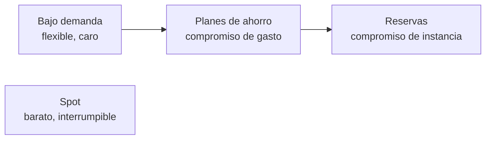
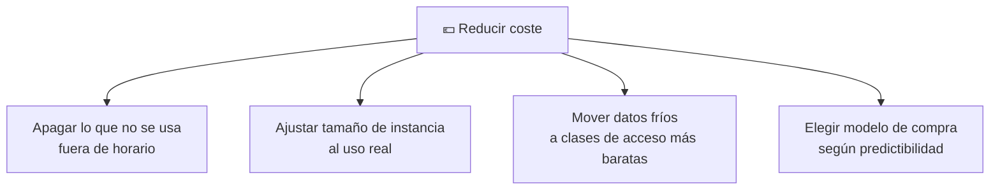

# 🧩 3. Economía de la nube

---

Llevas varias sesiones apagando en cada cierre lo que no hacía falta y anotando el recurso más caro del día. Hoy conviertes esa costumbre en algo con nombre y con números: cómo se factura de verdad cada pieza que has usado, qué modelos de compra existen más allá de pagar sobre la marcha, y cómo se estima el coste de una arquitectura completa antes de construirla — no después, cuando ya es tarde para decidir distinto.

---

## 🧭 Cómo se factura de verdad

Cada servicio de AWS se factura con su propia unidad, y confundirlas lleva a estimaciones muy equivocadas.

| Servicio | Unidad de facturación | Lo que ya has usado en el módulo |
|---|---|---|
| Cómputo (EC2) | Por segundo de instancia en marcha | Cada instancia lanzada desde el Tema 2 |
| Almacenamiento (S3, EBS) | Por GB-mes almacenado | El front, las imágenes, los discos de tus instancias |
| Transferencia de salida | Por GB que sale hacia internet | Cada visita a tu aplicación desde fuera de AWS |
| Peticiones | Por número de operaciones (lecturas, escrituras) | Cada `GetObject` a S3, cada consulta a RDS |

!!! warning "La transferencia de salida es la que más sorprende"
    La transferencia de **entrada** (subir datos a AWS) normalmente no cuesta nada; la de **salida** (que un dato salga de AWS hacia internet) sí, y es una de las líneas que más crece sin que te des cuenta, sobre todo si sirves imágenes pesadas sin optimizar. La CDN del Tema 4 no solo acerca contenido al usuario — también reduce esta partida, porque buena parte del tráfico se sirve desde el borde sin volver a salir del origen.

---

## 🧩 Capa gratuita y sus límites

La **capa gratuita** (*Free Tier*) de AWS incluye una cantidad limitada de uso sin coste durante un tiempo, pensada para aprender y probar — no para sostener una carga de producción real. Tiene tres formas distintas, y confundirlas lleva a sorpresas en la factura:

| Tipo | Cómo funciona |
|---|---|
| Siempre gratis | Un límite mensual que nunca caduca (por ejemplo, cierto número de peticiones a Lambda) |
| 12 meses gratis | Solo durante el primer año de la cuenta, después se factura normal |
| Prueba de corta duración | Un crédito o límite que caduca en pocas semanas |

!!! tip "El Learner Lab no funciona con capa gratuita normal"
    El crédito de tu laboratorio es una asignación distinta a la capa gratuita de una cuenta personal — por eso el ritual de vigilar el gasto importa desde la primera sesión, no solo cuando se agote un límite anual como en una cuenta nueva normal.

---

## 🔧 Modelos de compra

El cómputo no tiene un único precio — AWS ofrece varios modelos de compra, cada uno con un compromiso distinto a cambio de un descuento.

| Modelo | Compromiso | Descuento típico | Cuándo encaja |
|---|---|---|---|
| Bajo demanda | Ninguno, pagas por segundo de uso | Ninguno | Cargas impredecibles, o mientras pruebas |
| Reservas | Uso constante durante 1 o 3 años | Alto | Cargas estables y predecibles a largo plazo |
| Planes de ahorro | Compromiso de gasto (no de instancia concreta) durante 1 o 3 años | Alto, más flexible que una reserva | Cargas estables pero que pueden cambiar de tipo de instancia |
| Instancias interrumpibles (*Spot*) | Ninguno, pero AWS puede recuperarlas con poco aviso | Muy alto (hasta 90%) | Cargas tolerantes a interrupción: procesamiento por lotes, pruebas |

!!! example "Un mismo sistema, dos modelos de compra distintos"
    La instancia de una aplicación en producción, encendida de forma más o menos constante, es candidata a un plan de ahorro. Una tarea de procesamiento por lotes que generase miniaturas de un lote de imágenes de una vez, en cambio, encajaría bien en instancias Spot: si se interrumpe, se puede relanzar sin que nadie note nada.

---

## ⚙️ Las 6 R de la migración

Cuando una aplicación que ya existe (no una nueva, construida ya pensando en la nube) se lleva a la nube, hay seis estrategias distintas, y no siempre la más ambiciosa es la mejor opción:

| Estrategia | Qué implica | Esfuerzo |
|---|---|---|
| Rehosting (*lift-and-shift*) | Mover tal cual, sin cambios | Bajo |
| Replatforming | Cambios menores para aprovechar servicios gestionados | Medio |
| Repurchasing | Sustituir por un producto SaaS equivalente | Variable |
| Refactoring | Rediseñar la aplicación para la nube | Alto |
| Retiring | Apagarla, ya no hace falta | Bajo |
| Retaining | Dejarla donde está, no migrar todavía | Ninguno |

!!! tip "No hay una estrategia "correcta" en abstracto"
    Una aplicación heredada crítica pero estable puede beneficiarse más de un *rehosting* rápido y barato que de un *refactoring* completo que tarde meses — el criterio no es cuál demuestra más dominio técnico, es cuál resuelve el problema de negocio con el esfuerzo justificado. Vas a aplicar este criterio a un caso concreto en la Actividad 5.3.

---

## 📊 Palancas de optimización y etiquetado

Antes de elegir un modelo de compra más barato, hay palancas más sencillas que a menudo se pasan por alto:

El **etiquetado** (*tagging*) —poner etiquetas como `proyecto: miapp` o `entorno: pruebas` a cada recurso— no ahorra dinero por sí solo, pero es lo que hace posible saber *qué* está costando *qué*, y sin esa visibilidad ninguna de las otras palancas se puede aplicar con criterio.

---

## ✅ Ideas clave

??? tip "Abrir resumen"

    - Cada servicio se factura con su propia unidad: cómputo por segundo, almacenamiento por GB-mes, transferencia de salida por GB, peticiones por operación.
    - La capa gratuita tiene tres formas distintas (siempre gratis, 12 meses, prueba corta) y no es lo mismo que el crédito del Learner Lab.
    - Los modelos de compra van de bajo demanda (flexible, caro) a reservas y planes de ahorro (compromiso, descuento) hasta Spot (muy barato, interrumpible).
    - Las 6 R de la migración van de mover tal cual (rehosting) a rediseñar por completo (refactoring) — la mejor no es siempre la más ambiciosa.
    - Apagar lo que no se usa, ajustar tamaños y mover datos fríos de clase son palancas más sencillas que cambiar de modelo de compra; el etiquetado es lo que hace visible dónde aplicarlas.

Con esto ya tienes las piezas para la Actividad 5.3 — Cuánto cuesta lo que has construido.
