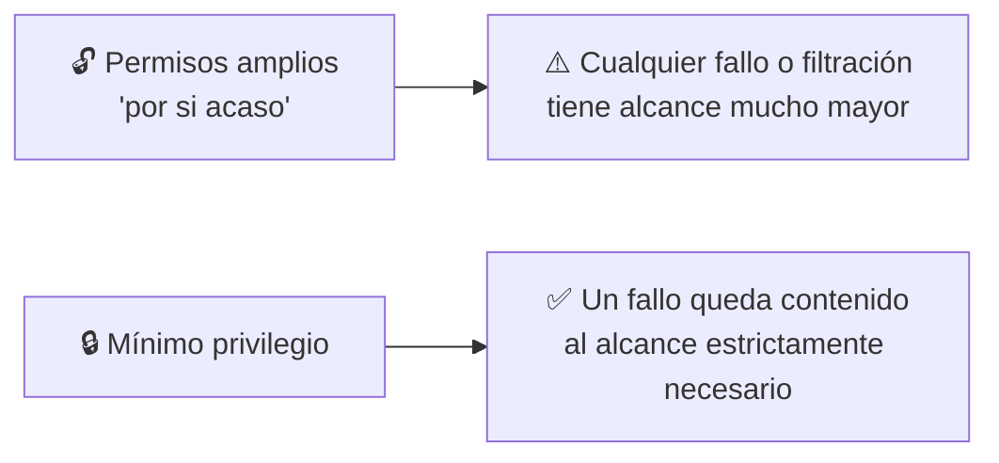
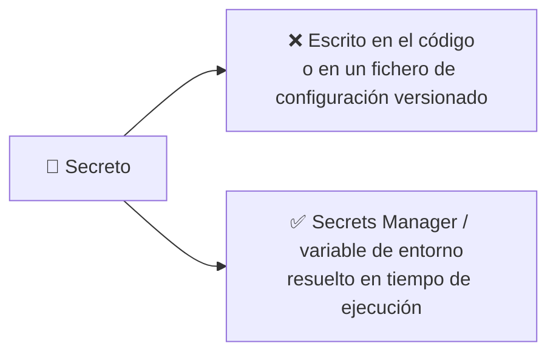

<a id="iam-aplicado"></a>

# 🧩 2. Identidad y gestión de accesos

---

Desde la primera sesión sabes que tu rol en el Learner Lab está preasignado, y que no puedes crear usuarios ni roles nuevos. Hoy no cambia esa regla — pero sí dejas de tratar IAM como una caja negra que "ya viene configurada" y empiezas a leerla, corregirla y usarla de verdad: aplicar un rol existente a una instancia para que acceda a otros servicios sin credenciales, y detectar por qué una política está mal escrita antes de que cause un problema real.

---

## 🧭 Usuarios frente a roles, políticas y credenciales temporales

IAM (*Identity and Access Management*) tiene varias piezas que conviene distinguir bien, porque ya llevas semanas usando una de ellas sin nombrarla:

| Pieza | Qué es | En el Learner Lab |
|---|---|---|
| Usuario | Una identidad fija, con sus propias credenciales de larga duración | No puedes crear ninguno — no lo necesitas para este módulo |
| Rol | Una identidad que "se presta" temporalmente a quien la asume (una persona, o un servicio como una instancia) | Tienes uno preasignado (`assumed-role`, lo viste en la sesión 1) |
| Política | Un documento que dice qué acciones están permitidas o denegadas | Puedes leerlas, analizarlas y corregirlas — no crear roles nuevos para adjuntarlas |
| Credenciales temporales | Claves de acceso con caducidad, generadas al asumir un rol | Es lo que usa tu sesión del Learner Lab ahora mismo |

!!! tip "Por qué un rol y no un usuario, para una instancia"
    Si una instancia necesitara las credenciales fijas de un usuario para acceder a S3, esas credenciales tendrían que vivir en algún sitio dentro de la instancia — exactamente el problema de "credenciales en el código" que ya evitaste en el Tema 3 con Secrets Manager. Un rol asignado a la instancia resuelve esto de raíz: AWS genera credenciales temporales automáticamente, sin que tú tengas que guardar ni rotar nada.

---

## 🧩 Anatomía de una política

Una política IAM es un documento en el mismo formato JSON que ya viste en la sesión 1, con una estructura fija, y aprender a leerla rápido es más útil que memorizar su sintaxis exacta.

```json
{
  "Effect": "Allow",
  "Action": "s3:GetObject",
  "Resource": "arn:aws:s3:::escaparate-front-*/*",
  "Condition": {
    "IpAddress": { "aws:SourceIp": "203.0.113.0/24" }
  }
}
```

| Campo | Responde a | En el ejemplo |
|---|---|---|
| `Effect` | ¿Permite o deniega? | `Allow` |
| `Action` | ¿Qué operación? | `s3:GetObject` (leer un objeto) |
| `Resource` | ¿Sobre qué recurso concreto? | Los objetos de los buckets que empiecen por `escaparate-front-` |
| `Condition` | ¿Bajo qué circunstancia adicional? | Solo si la petición viene de un rango de IP concreto |

!!! example "Leer una política, frase por frase"
    Este ejemplo completo se lee así: "Permite la acción de leer un objeto, sobre cualquier objeto dentro de un bucket cuyo nombre empiece por `escaparate-front-`, pero solo si la petición viene de esa red concreta." Cuatro campos, una frase — cuando te enfrentes a una política más larga en la Actividad 5.2, sigue leyéndola exactamente así, campo a campo.

Leer una política te dice qué *debería* permitir sobre el papel, pero con varias líneas y comodines de por medio es fácil equivocarse. El **simulador de políticas de IAM** te deja elegir una política, una acción y un recurso concretos, y te responde directamente "permitido" o "denegado" — sin ejecutar nada de verdad contra tu cuenta. Es la forma de comprobar si tu lectura de una política era correcta antes de fiarte de ella.

---

## 🔧 Principio de mínimo privilegio y MFA

El **principio de mínimo privilegio** dice que una identidad debe tener exactamente los permisos que necesita para su trabajo, ni uno más. No es una recomendación abstracta — tiene un coste medible cuando se ignora.



!!! warning "Un comodín de más es la forma más común de romper este principio"
    Una política con `"Action": "s3:*"` en vez de `"Action": "s3:GetObject"` da permiso para borrar, sobrescribir y cambiar permisos de todo el almacenamiento, cuando quizás solo hacía falta leer. Vas a encontrarte exactamente este tipo de error en las políticas que corrijas en la Actividad 5.2.

El **MFA** (*Multi-Factor Authentication*) añade una segunda prueba de identidad —un código temporal, además de la contraseña— para las operaciones más sensibles. En el Learner Lab no lo vas a configurar tú (la identidad ya viene resuelta por el rol asumido), pero es la pieza que, en una cuenta real, protege contra que una contraseña filtrada sea suficiente para entrar.

---

## ⚙️ Gestión de secretos: nunca en el código ni en el repositorio

Ya aplicaste esta regla en el Tema 3 con la contraseña de la base de datos — hoy se generaliza a cualquier secreto: claves de API, tokens, certificados privados. Ninguno debe aparecer nunca en texto plano dentro de un fichero versionado.



!!! danger "Un secreto que ha llegado a un repositorio, aunque lo borres después, sigue expuesto"
    El historial de Git conserva versiones anteriores de cualquier fichero — borrar un secreto en el commit siguiente no lo elimina del historial. La única solución correcta ante un secreto filtrado es rotarlo (generar uno nuevo e invalidar el antiguo), nunca solo "quitarlo" del código.

---

## 📊 Registro de auditoría

El **registro de auditoría** (en AWS, CloudTrail) guarda un histórico de quién ha hecho qué, cuándo y desde dónde — cada llamada a la API queda registrada, tanto si la has hecho tú por consola como por CLI. Ya lo mencionaste como una de las cinco señales de la sesión pasada; hoy lo usas para responder a una pregunta muy concreta: "¿quién ha tocado esto, y cuándo?"

!!! example "Auditoría aplicada a un caso real"
    Imagina que en la incidencia que diagnosticaste la sesión pasada, un grupo de seguridad tenía una regla que no debería estar ahí. Las métricas y los registros te dijeron *qué* estaba fallando; el registro de auditoría te dice *quién* cambió esa regla y *cuándo* — la pieza que faltaba para entender no solo el síntoma, sino el origen del problema.

---

## ✅ Ideas clave

??? tip "Abrir resumen"

    - Un rol se presta temporalmente (con credenciales que caducan); un usuario tiene credenciales fijas — el Learner Lab usa un rol preasignado, y tú no creas roles ni usuarios nuevos.
    - Una política se lee en cuatro campos: efecto (permite/deniega), acción (qué operación), recurso (sobre qué) y condición (bajo qué circunstancia).
    - El principio de mínimo privilegio limita el alcance de cualquier fallo o filtración; un comodín de más en una acción es el error más común que lo rompe.
    - Ningún secreto va nunca en texto plano en un fichero versionado — y si uno llega a estarlo, la solución es rotarlo, no solo borrarlo del código.
    - El registro de auditoría responde a quién ha hecho qué y cuándo — la pieza que completa el diagnóstico de una incidencia, más allá de las métricas y los registros.

Con esto ya tienes las piezas para la Actividad 5.2 — Gestión de credenciales y políticas IAM.
