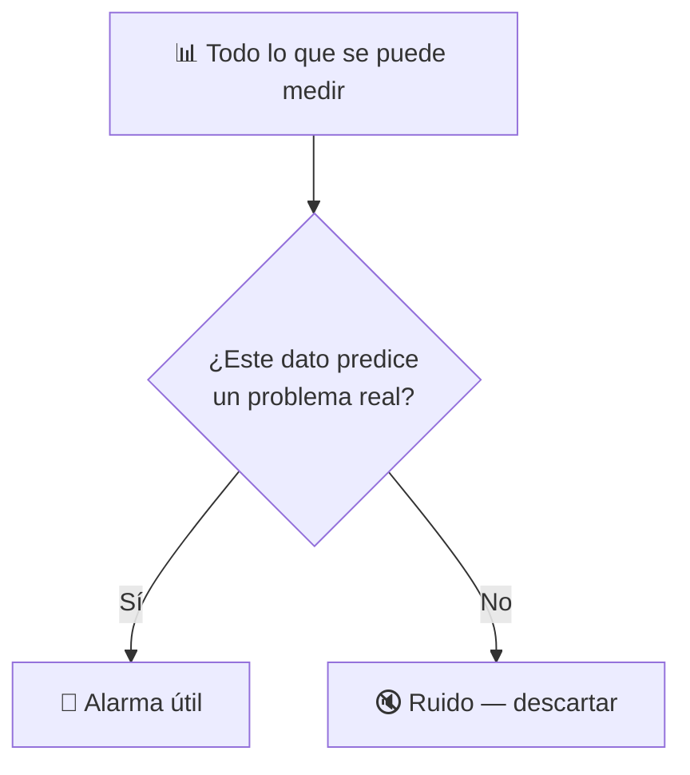
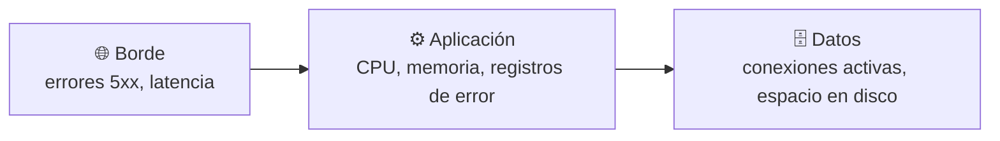

# 🧩 1. Monitorización y operación

---

Cualquier servidor en producción tiene el mismo problema de fondo: nadie lo va a estar mirando constantemente. Si algo falla a las tres de la madrugada, nadie está delante de una pantalla viéndolo en directo. Necesitas que el propio sistema te avise, y necesitas saber diagnosticar una incidencia sin la comodidad de conectarte por SSH a mirar qué pasa por dentro — porque en una arquitectura gestionada, esa comodidad cada vez existe menos.

---

## 🧭 Métricas, registros, alarmas, eventos y auditoría

AWS te da cinco tipos de señal distintos para saber qué está pasando en tu arquitectura, y cada uno responde a una pregunta diferente:

| Señal | Responde a | Ejemplo |
|---|---|---|
| **Métricas** | ¿Cuánto? (un número que cambia con el tiempo) | CPU media de las instancias, peticiones por segundo del balanceador |
| **Registros** (*logs*) | ¿Qué ha pasado exactamente, con detalle? | El mensaje de error concreto de una petición fallida |
| **Alarmas** | ¿Cuándo algo cruza un umbral que me importa? | CPU por encima del 80 % durante 5 minutos seguidos |
| **Eventos** | ¿Qué cambio de estado ha ocurrido en un recurso? | Una instancia ha pasado de `running` a `terminated` |
| **Auditoría** | ¿Quién ha hecho qué, y cuándo? | Quién ha modificado un grupo de seguridad esta mañana |

Cada una de estas señales tiene un servicio de AWS detrás: **CloudWatch** recoge tanto las métricas como las alarmas que se disparan sobre ellas; **CloudWatch Logs** guarda los registros; **EventBridge** es quien reacciona a los eventos de cambio de estado; y **CloudTrail** es el registro de auditoría, con quién ha hecho cada llamada a la API de AWS y cuándo. Vas a usar los cuatro en la Actividad 5.1: CloudWatch para las métricas y alarmas, CloudWatch Logs para centralizar los registros de Escaparate, CloudTrail para investigar quién ha cambiado algo, y EventBridge para reaccionar tú mismo a un cambio de estado real, capturando el momento exacto en que una instancia pasa a `terminated`.

!!! example "Las cinco señales sobre el mismo incidente"
    Imagina que una instancia se queda sin memoria y deja de responder. La **métrica** de memoria te mostraría la subida antes de que pasara nada grave. El **registro** de la aplicación diría el error concreto en el momento del fallo. La **alarma** te habría avisado en cuanto la métrica cruzó el umbral. El **evento** registraría que el grupo de escalado ha terminado esa instancia y lanzado otra. Y la **auditoría** confirmaría que nadie ha tocado nada manualmente — el sistema ha reaccionado solo.

---

## 🧩 Qué se monitoriza de verdad y qué es ruido

No todo lo que se puede medir merece una alarma. Monitorizar todo, sin criterio, produce tanto ruido que dejas de prestarle atención a las alarmas de verdad — es el mismo problema que un detector de humos tan sensible que salta con el vapor de la ducha: al final lo desconectas, y el día que hay fuego de verdad no te enteras.

Vas a diseñar exactamente tres alarmas útiles en la Actividad 5.1, no veinte — la disciplina de elegir pocas y que importen es la parte difícil de estos apuntes, más que el mecanismo técnico de crearlas.

Para no tener que ir métrica por métrica cada vez que diagnosticas algo, CloudWatch permite agrupar varias en una sola pantalla: un **dashboard**, con las gráficas que de verdad consultas a menudo ya montadas y una junto a otra. En la Actividad 5.1 vas a montar el tuyo con las métricas de las tres capas que ves más abajo, precisamente para poder mirarlas todas juntas en el mismo golpe de vista en vez de saltar de una pantalla a otra.

---

## 🔧 Capa a capa de la arquitectura

Cada capa de una arquitectura necesita un tipo de señal distinto, porque cada una falla de forma distinta. Un detalle que vas a usar mucho a partir de aquí: cada respuesta HTTP lleva un **código de estado** de tres cifras, y la primera cifra agrupa el tipo de resultado — los que empiezan por 2 significan éxito, los que empiezan por 4 son error del cliente (por ejemplo, pedir algo que no existe), y los que empiezan por 5 —los **errores 5xx**— son error del propio servidor, la señal de que algo se ha roto por dentro.

Un fallo en el borde (por ejemplo, muchos errores 5xx del balanceador) apunta a algo distinto que un fallo de CPU en la aplicación, y ese a su vez es distinto de un fallo de espacio en la base de datos. Diagnosticar rápido significa saber, según el síntoma, en qué capa mirar primero — el mismo principio de "fuera hacia dentro" que ya has aplicado con las averías de red del Tema 2.

---

## ⚙️ Cómo se diagnostica una incidencia sin acceso al servidor

En una arquitectura con escalado automático, la instancia que estaba fallando puede haber sido terminada y reemplazada antes de que llegues a conectarte a ella — así que conectarte por SSH a "ver qué pasa" deja de ser una opción fiable. El diagnóstico tiene que apoyarse en lo que ya quedó registrado, no en lo que puedas observar en directo.

| Paso | Con qué señal |
|---|---|
| 1. ¿Cuándo empezó el problema? | Métricas — busca el momento exacto en que algo cruzó un umbral anómalo |
| 2. ¿Qué capa está implicada? | Métricas por capa — compara borde, aplicación y datos en esa ventana de tiempo |
| 3. ¿Qué error concreto ha ocurrido? | Registros de esa capa, en esa ventana de tiempo |
| 4. ¿Alguien ha cambiado algo justo antes? | Auditoría — busca modificaciones de configuración cerca del momento del fallo |

!!! warning "El orden importa: empieza siempre por cuándo, no por qué"
    Ir directamente a leer registros sin haber acotado antes la ventana de tiempo con las métricas es buscar una aguja en un pajar entero en vez de en el rincón donde de verdad cayó. Vas a diagnosticar una incidencia real siguiendo exactamente este orden en la Actividad 5.1.

!!! tip "Los registros no se guardan gratis ni para siempre"
    Cada registro que se genera ocupa espacio, y ese espacio cuesta dinero mientras lo conservas. Dejar la retención de logs "para siempre" por defecto es una forma silenciosa de acumular coste sin darte cuenta — normalmente conviene fijar cuánto tiempo de verdad necesitas conservarlos. Vuelves a esta misma idea, pero con números reales, en el siguiente apartado, Economía de la nube.

---

## ✅ Ideas clave

??? tip "Abrir resumen"

    - Cinco señales distintas, cada una con su servicio detrás: métricas y alarmas (CloudWatch), registros (CloudWatch Logs), eventos (EventBridge), auditoría (CloudTrail).
    - Un dashboard de CloudWatch agrupa las métricas que consultas a menudo en una sola pantalla, en vez de ir saltando de una en una.
    - Monitorizar todo sin criterio genera ruido y hace que dejes de prestar atención a las alarmas que sí importan.
    - Cada capa de la arquitectura falla de forma distinta y necesita su propia señal: borde (errores, latencia), aplicación (CPU, memoria, registros), datos (conexiones, espacio).
    - Sin acceso directo al servidor, el diagnóstico se apoya en lo ya registrado: primero acota cuándo con las métricas, luego busca qué con los registros, y confirma con la auditoría si alguien cambió algo antes.
    - Los registros tienen coste mientras se conservan — fijar una retención razonable evita un gasto silencioso.

Con esto ya tienes las piezas para la Actividad 5.1 — Monitorización y diagnóstico con CloudWatch.
