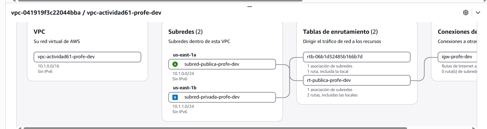

# 🧪 Actividad 6.1: Destruir y reconstruir

!!! warning "Descarga la plantilla"
    📄 [Plantilla 6.1 — Destruir y reconstruir](plantillas/Actividad_6_1_INU_Plantilla.docx){target="_blank" rel="noopener"}

!!! warning "Descarga los recursos"
    📦 [Recursos de la Actividad 6.1](recursos/actividad_6_1_recursos.zip){target="_blank" rel="noopener"} — descomprímelo en la raíz de tu proyecto: crea la carpeta `recursos/tema6/actividad_6_1/terraform/`, la misma ruta que usan los pasos de esta actividad.

## Contexto

El profesor te entrega un módulo de Terraform ya escrito, autocontenido, que despliega una VPC de ejemplo con una subred pública y una privada en dos zonas de disponibilidad — descárgalo del enlace de arriba, en `recursos/tema6/actividad_6_1/terraform/`. Hoy lo lees, lo entiendes, lo modificas, y lo destruyes y reconstruyes por completo — cronometrando cuánto tarda el código en hacer lo que a mano, clic a clic en la consola, te llevaría mucho más tiempo y sería fácil de dejar a medias.

## Qué vas a practicar

- Leer un módulo de Terraform ya escrito y entender qué infraestructura describe.
- Modificarlo, revisar el plan antes de aplicar, y aplicarlo de verdad.
- Parametrizar el código para desplegar dos entornos distintos con el mismo módulo.
- Medir el tiempo real de destruir y reconstruir una infraestructura completa desde código.

## Requisitos previos

Terraform no viene instalado en tu CloudShell (Tema 1) por defecto — lo instalas tú mismo en el Paso 2, sin necesitar permisos de administrador, porque es un único binario que se descomprime en tu propia carpeta. El módulo de Terraform (`main.tf`, `variables.tf`, `outputs.tf`) — descárgalo del enlace de arriba. El apunte de esta sesión — «Infraestructura como código» (infraestructura-como-codigo.md).

---

## Parte A — Lee, modifica y aplica con plan (guiada)

### Paso 1 — Lee el módulo antes de tocar nada

Abre los tres ficheros `.tf` del módulo y localiza, sin ejecutar todavía nada:

1. Qué recursos declara (busca los bloques `resource`).
2. Qué variables acepta (busca los bloques `variable`, en `variables.tf`).
3. Qué salidas expone al terminar (busca los bloques `output`, en `outputs.tf`).

Anota, en tus propias palabras, qué infraestructura completa describe el módulo — sin ejecutarlo, solo leyéndolo.

**Comprueba**: que tu descripción coincide con lo que realmente declaran los ficheros — una VPC, una subred pública y una privada en dos zonas de disponibilidad distintas, una pasarela de internet y su tabla de rutas.

**Captura**: tu descripción escrita del módulo, junto a una captura del propio fichero `.tf` con los recursos señalados.

### Paso 2 — Inicializa y aplica por primera vez

Desde tu **CloudShell** (Tema 1): sube `actividad_6_1_recursos.zip` con **Actions → Upload file** y descomprímelo (`unzip actividad_6_1_recursos.zip`). Terraform no viene instalado por defecto, así que instálalo tú mismo — es un único binario, no hace falta ser administrador:

```bash
curl -O https://releases.hashicorp.com/terraform/1.9.0/terraform_1.9.0_linux_amd64.zip
unzip terraform_1.9.0_linux_amd64.zip
export PATH=$PATH:$(pwd)
terraform -version
```

Vas a tener que repetir esta instalación cada vez que arranques el laboratorio — CloudShell no conserva lo instalado entre sesiones. Ahora sí, entra en la carpeta del módulo y aplica:

```bash
cd recursos/tema6/actividad_6_1/terraform/
terraform init
terraform plan
```

Lee el plan con atención antes de continuar: cuántos recursos va a crear, y si coincide con tu lectura del Paso 1.

```bash
terraform apply
```

Confirma cuando te lo pida. Al terminar, comprueba en la consola de AWS que la VPC y las subredes existen de verdad.


*🖼️ Captura de referencia del profesor — guardar como `img/actividad_6_1_paso2.png`*

**Comprueba**: que el número de recursos creados coincide exactamente con lo que mostraba el plan.

**Captura**: la salida de `terraform apply` con el resumen final, y tu propia VPC con las subredes creadas por Terraform, visibles en la consola de AWS.

### Paso 3 — Modifica el módulo para añadir una subred

Añade una tercera subred al módulo (por ejemplo, otra privada en una de las dos zonas), editando el código — no la consola. Antes de aplicar:

```bash
terraform plan
```

**Comprueba**: que el plan muestra únicamente la creación de la subred nueva, sin tocar ni destruir ninguno de los recursos que ya existían.

```bash
terraform apply
```

**Comprueba**: que la subred nueva aparece en la consola con exactamente el CIDR y la zona que has definido en el código.

**Captura**: el plan mostrando solo la creación añadida, y la subred nueva visible en consola.

!!! question "Reflexiona"
    Añadir una subred a mano en la consola significa varios clics, sin ningún registro de qué has cambiado ni por qué. Hoy ha quedado como una línea de código, con su commit. Si dentro de tres meses alguien pregunta por qué existe esa subred nueva, ¿qué respuesta te da el código que nunca te habría dado la consola?

---

## Parte B — Parametriza, despliega dos entornos y cronometra (reto)

**Parametriza el módulo**: modifica el código para que el entorno (`dev` o `prod`), el rango de red y el tipo de instancia sean variables, no valores fijos escritos dentro del código. No hay una estructura de variables dada — decide tú qué parámetros necesitas y cómo los organizas.

**Despliega dos entornos con el mismo código**: usando las variables del punto anterior, despliega dos instancias completas de la infraestructura (por ejemplo, `dev` y `prod`) que no choquen entre sí — mismos recursos, rangos y nombres distintos.

**Añade una instancia de prueba al módulo**: extiende el código para que también despliegue una instancia EC2 mínima, con un servidor web simple arrancado por `user_data` (por ejemplo, nginx sirviendo una página con un mensaje mínimo) — declarada directamente dentro del propio módulo de Terraform, sin depender de ninguna plantilla de lanzamiento externa.

**Cronometra destruir y reconstruir**: destruye uno de los dos entornos por completo y vuelve a crearlo desde cero, cronometrando el tiempo real desde el primer comando hasta que la infraestructura vuelve a estar disponible. Compáralo con una estimación razonada de lo que tardarías en montar la misma infraestructura a mano, clic a clic en la consola.

**Comprueba**: que los dos entornos coexisten sin conflicto de nombres ni de rangos, y que tras destruir y reconstruir un entorno, no queda ningún recurso huérfano de la versión anterior.

**Captura**: el código parametrizado; los dos entornos desplegados y visibles en consola; el cronómetro real de destruir/reconstruir, comparado con tu estimación del montaje manual.

---

## Criterios de evaluación

**Parte A — hasta 7 puntos**

| Apartado | Puntos |
|---|---|
| Módulo leído y entendido, descripción correcta antes de ejecutar | 2 |
| Aplicado correctamente, con plan revisado antes de cada cambio | 3 |
| Subred añadida por código, sin tocar recursos existentes | 1 |
| Documentación en el repositorio | 1 |

**Parte B — reto, hasta 3 puntos adicionales (máximo total: 10)**

| Apartado | Puntos |
|---|---|
| Módulo parametrizado y dos entornos desplegados sin conflicto, con la instancia de prueba incluida | 2 |
| Cronómetro de destruir/reconstruir, comparado con la estimación del montaje manual | 1 |

---

## ✅ Cierre

Ya sabes leer, modificar y reconstruir infraestructura completa desde código, con un plan que revisas antes de aplicar cualquier cambio — y has medido con tus propios números cuánto se gana en tiempo y en trazabilidad frente a montarlo a mano. La próxima sesión subes un peldaño más en la escalera de responsabilidad: dejas de gestionar instancias del todo, y ejecutas código sin ningún servidor que tú administres.
