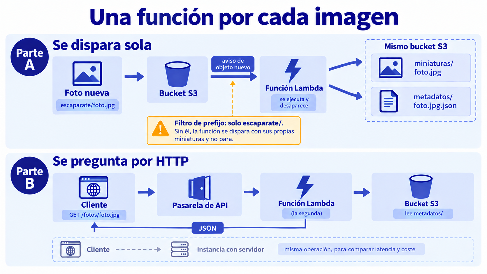

# 🧪 Actividad 6.2: Una función por cada imagen

!!! warning "Descarga la plantilla"
    📄 [Plantilla 6.2 — Una función por cada imagen](plantillas/Actividad_6_2_INU_Plantilla.docx){target="_blank" rel="noopener"}

!!! warning "Descarga los recursos"
    📦 [Recursos de la Actividad 6.2](recursos/actividad_6_2_recursos.zip){target="_blank" rel="noopener"} — lo vas a subir y descomprimir en el Paso 3 de esta actividad.

## Contexto

Desde que Escaparate guarda las fotos de producto en S3 (Actividad 5.2), el listado del catálogo carga la imagen entera de cada producto solo para mostrar una miniatura pequeña — un desperdicio de ancho de banda que se nota según crece el catálogo. Hoy resuelves eso sin tocar el backend de Escaparate: una función se dispara sola en cuanto llega una foto nueva, genera su miniatura y registra sus metadatos, y desaparece — Escaparate ni se entera de que existe.

## Qué vas a practicar

- Crear una función Lambda disparada por un evento de S3.
- Procesar una imagen y registrar sus metadatos sin ningún servidor que administres.
- Montar una mini API con pasarela y función, y compararla con la misma operación servida por una instancia.

## Requisitos previos

El bucket de imágenes de Escaparate ya configurado en la Actividad 5.2 (`escaparate-imagenes-<tu-identificador>`, con las fotos de producto bajo el prefijo `escaparate/`). Si no has hecho esa actividad, crea un bucket nuevo con esa misma estructura de prefijo — el Paso 1 te indica cómo. El código base de la función, `lambda_function.py` (con su `requirements.txt` y su `README.md` de empaquetado) — descárgalo del enlace de arriba. Los apuntes de esta sesión — [«Serverless»](serverless.md).

!!! tip "Lambda no forma parte de Escaparate, y es intencionado"
    No vas a tocar ni una línea del backend Java de Escaparate. La función vive al lado, como una pieza satélite que observa el bucket — así se demuestra que serverless puede añadir capacidades a una aplicación ya existente sin meterse dentro de su código ni de su ciclo de despliegue.

---

## Parte A — Función disparada por evento (guiada)

### Paso 1 — Localiza (o crea) el bucket de imágenes de Escaparate

1. Si ya has hecho la Actividad 5.2, busca "S3" en el buscador de servicios y localiza el bucket de imágenes que creaste ahí (`escaparate-imagenes-<tu-identificador>`) — reutilízalo, no crees uno nuevo.
2. Si no la has hecho, crea un bucket con la misma estructura: **Crear bucket**, nombre único (por ejemplo `escaparate-imagenes-<tu-identificador>`), resto de opciones por defecto (bloqueo de acceso público activado).

**Comprueba**: que el bucket existe y, si vienes de la 5.2, que ya tiene fotos de producto bajo `escaparate/`.

**Captura**: tu bucket de imágenes de Escaparate, con al menos una foto de producto visible bajo `escaparate/`.

### Paso 2 — Crea la función desde la consola

1. Busca "Lambda" en el buscador de servicios → **Crear función**.
2. Elige **Crear desde cero**.
3. Dale un nombre (por ejemplo `escaparate-miniaturas-<tu-identificador>`).
4. Elige el entorno de ejecución **Python** (Lambda no tiene que compartir lenguaje con el backend que complementa). La versión tiene que ser **la misma que tiene tu CloudShell**, porque Pillow se empaqueta allí en el Paso 3 y viene compilada para esa versión concreta de Python: mira cuál es con `python3 --version` (hoy, la 3.13) y elige esa. Si eliges otra, la función fallará al arrancar con un error de importación.
5. Despliega **Configuración adicional** y, dentro de **General**, marca la casilla **Rol de ejecución personalizada**. Elige **Utilizar un rol existente** y selecciona `LabRole` (no puedes crear uno nuevo). Es el rol que ya han usado tus instancias y que tiene acceso a S3.
6. Crea la función.
7. Antes de subir código, ajusta dos valores en **Configuración → Configuración general → Editar**: **Memoria** a `512` MB y **Tiempo de espera** a `30` segundos, y guarda. Por defecto una función tiene 128 MB y solo 3 segundos para terminar: con una foto pequeña justo llega (usa unos 100 MB de esos 128), pero una foto de producto más grande, o un arranque en frío lento, la dejaría sin memoria o sin tiempo.

**Comprueba**: que la función aparece con estado activo en el panel de Lambda, y que en **Configuración general** figuran los 512 MB y los 30 segundos.

**Captura**: tu propia función Lambda creada, con su configuración inicial visible.

!!! question "Reflexiona"
    La función que has creado tiene ahora 512 MB de memoria y no 128 MB. ¿Crees que eso la hace más cara, más barata o igual por invocación? Razónalo con lo que has visto en la teoría sobre memoria, CPU y duración, y luego compruébalo en el Paso 3: cuando tengas tus líneas `REPORT` con 512 MB, cambia la memoria a 128 MB, sube otra foto y compara la duración y la memoria facturada de las dos.

### Paso 3 — Sube el código y configura el desencadenador de S3

El código ya viene escrito en `recursos/tema6/actividad_6_2/lambda_function.py`: recibe el evento de S3, genera una miniatura real con Pillow (redimensionada a 200x200 manteniendo la proporción) bajo el prefijo `miniaturas/`, y registra un objeto JSON con los metadatos (tamaño original, formato, fecha de subida) bajo el prefijo `metadatos/`, todo en el mismo bucket — sin tocar el prefijo `escaparate/` donde vive la foto original, así que `ProductoService` sigue encontrando exactamente lo que espera.

1. Pillow no viene incluida en el entorno de ejecución de Lambda por defecto, y tiene partes compiladas específicas del sistema operativo — tienes que empaquetarla en un Linux compatible con Lambda, no en Windows ni macOS. Para eso usa tu **CloudShell** (Tema 1), que ya es Amazon Linux: sube `actividad_6_2_recursos.zip` con **Actions → Upload file**, descomprímelo (`unzip actividad_6_2_recursos.zip`), y sigue las instrucciones de `recursos/tema6/actividad_6_2/README.md` para empaquetar el código junto con sus dependencias en un `.zip` — todo dentro de CloudShell.
2. El `.zip` empaquetado se ha generado dentro de CloudShell, no en tu ordenador — descárgalo primero con **Actions → Download file** (indicando la ruta del `.zip` dentro de CloudShell). Ahora sí, súbelo como código de la función desde la consola de Lambda (**Actualizar desde → archivo .zip**), en vez de escribirlo en el editor integrado.
3. Ve a la pestaña **Configuración → Desencadenadores → Añadir desencadenador**.
4. Selecciona **S3**, elige tu bucket de imágenes de Escaparate, tipo de evento **Todos los eventos de creación de objetos**, y en **Prefijo** escribe `escaparate/` — así la función solo se dispara para fotos de producto nuevas, no para las miniaturas ni los metadatos que ella misma genera en otros prefijos del mismo bucket.
5. Guarda el desencadenador.

6. Sube una foto de producto nueva a tu bucket bajo el prefijo `escaparate/` (por CLI, por consola, o dando de alta un producto en Escaparate si lo tienes desplegado) y comprueba que se genera la miniatura sin que tú hayas ejecutado nada más.

    !!! warning "Tras guardar el desencadenador, S3 tarda unos minutos en activarlo"
        Las fotos que subas en los primeros 3 o 4 minutos pueden no disparar la función, y no hay ningún error que te lo avise: simplemente no pasa nada. Si no aparece la miniatura, espera un poco y sube otra foto distinta (no la misma) antes de pensar que algo está mal configurado.

**Comprueba**: que la miniatura aparece en el bucket unos segundos después de subir la foto original, sin intervención tuya, y que el objeto de metadatos aparece bajo `metadatos/` con los datos correctos.

Si no aparece nada, mira en **Supervisión → Ver registros en CloudWatch** de tu función: ahí está lo que ha impreso y el error, si lo ha habido. Anota también la línea `REPORT` de la primera ejecución (lleva la duración y, si ha habido arranque en frío, el tiempo de `Init Duration`); la necesitarás en la Parte B.

**Captura**: tu propio desencadenador de S3 configurado sobre la función, y la miniatura generada automáticamente tras subir la foto original.

!!! question "Reflexiona"
    Si se subieran cien fotos de producto a la vez (por ejemplo, al cargar un catálogo entero de golpe), ¿qué pasaría con tu función? Compáralo con lo que le pasaría a una única instancia si tuviera que procesar cien peticiones simultáneas de generación de miniaturas.

---

## Parte B — Mini API y comparación real (reto)

Monta una mini API con una pasarela de API (*API Gateway* — la has visto en la teoría) delante de una función que resuelva una operación sencilla: dado el nombre de una foto (por ejemplo `GET /fotos/camiseta.jpg`), devolver el JSON de sus metadatos, el que la función de la Parte A ha guardado bajo `metadatos/`. Necesitas una segunda función (pocas líneas: piensa qué recibe del evento la pasarela y qué tiene que devolver) y decidir tú cómo conectas la pasarela con ella y cómo la pruebas (con `curl`, con Postman, o desde el propio navegador si es un `GET`). Recuerda qué has visto en la teoría sobre los dos tipos de API —HTTP y REST— y elige con criterio.

Con la API funcionando, mide la latencia real de esa operación servida por tu función, y compárala con la latencia de la misma operación servida por una instancia con un servidor sencillo desplegado por ti (no hace falta que lea nada real de S3, basta con que responda un JSON fijo — lo que mides es la latencia de servir la petición, no la lógica; la instancia es lo que más tiempo te va a llevar: empieza pronto y no la dejes para el final). Repite la medición varias veces para distinguir el efecto del arranque en frío de una invocación ya "caliente".

Después, estima el coste mensual de ambas opciones para dos volúmenes de tráfico distintos: uno bajo (pocas peticiones al día) y uno alto (miles de peticiones por minuto de forma sostenida), y decide, con esos números delante, en qué casos elegirías la función y en cuáles la instancia. Usa los precios de la teoría como punto de partida (la tabla y el gráfico de la sección «Facturación por invocación» de [serverless.md](serverless.md)) y comprueba en la calculadora de precios de AWS que siguen siendo esos.

**Comprueba**: que tus medidas de latencia distinguen claramente entre una invocación con arranque en frío y una ya caliente, y que tu comparación de coste está basada en cifras reales de la calculadora, no en una estimación aproximada.

**Captura**: las medidas de latencia (fría y caliente) de ambas soluciones; la comparación de coste para los dos volúmenes de tráfico; tu decisión razonada de cuándo elegir cada una.

---

## Criterios de evaluación

**Parte A — hasta 6 puntos**

| Apartado | Puntos |
|---|---|
| Función creada y desencadenador de S3 configurado correctamente | 2 |
| Miniatura generada automáticamente, sin intervención manual | 3 |
| Metadatos registrados correctamente | 1 |

**Parte B — reto, hasta 4 puntos adicionales (máximo total: 10)**

| Apartado | Puntos |
|---|---|
| Mini API funcionando con pasarela y función | 2 |
| Latencia real medida, distinguiendo frío y caliente, para la función y para la instancia | 1 |
| Coste estimado para dos volúmenes de tráfico con cifras reales, y decisión razonada de cuándo elegir cada una | 1 |

---

## ✅ Cierre

Ya tienes procesamiento de imágenes que se dispara solo, sin ningún servidor que administres, y sabes con datos propios cuándo compensa serverless y cuándo no. La próxima sesión ves la tercera forma de ejecutar una aplicación: contenedores, sin servidor que gestionar pero sin el modelo de eventos de hoy.

!!! tip "Antes de salir: borra la instancia de comparación, si la has creado"
    Si has hecho la Parte B, termina la instancia que desplegaste para comparar su latencia con la función Lambda — es lo único de esta actividad con coste por hora. La función, el bucket y la pasarela API no cuestan nada por existir sin tráfico, puedes dejarlos.
