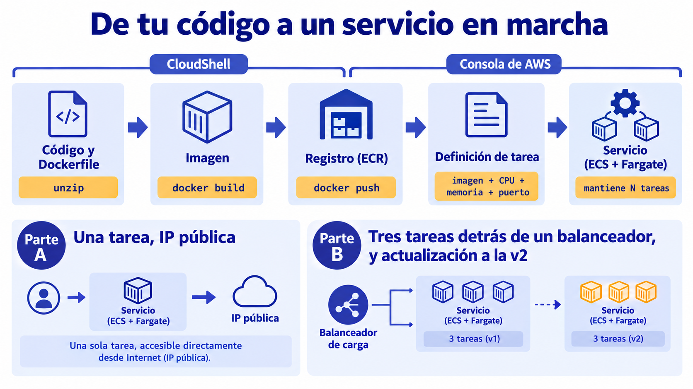

# 🧪 Actividad 6.3: Tu imagen, sin servidores

!!! warning "Descarga la plantilla"
    📄 [Plantilla 6.3 — Tu imagen, sin servidores](plantillas/Actividad_6_3_INU_Plantilla.docx){target="_blank" rel="noopener"}

!!! warning "Descarga los recursos"
    📦 [Recursos de la Actividad 6.3](recursos/actividad_6_3_recursos.zip){target="_blank" rel="noopener"} — lo vas a subir y descomprimir en el Paso 1 de esta actividad.

## Contexto

Un evento necesita saber cuánta gente ha llegado, y un compañero ha escrito una pequeña aplicación web, un **contador de asistencia**, que muestra el número de asistentes registrados. Tienes su código y su `Dockerfile` en dos versiones: la 1, con el contador en azul, y la 2, con otro número y otro color. Hoy la conviertes en una imagen de contenedor, la guardas en un registro y la ejecutas como servicio gestionado, sin crear ninguna instancia. Después la escalas, la actualizas de la versión 1 a la 2 sin cortar el servicio y comparas las tres formas de ejecutar una aplicación que has visto en este tema.



## Qué vas a practicar

- Construir una imagen de contenedor a partir de un `Dockerfile` y probarla antes de publicarla.
- Guardarla en un registro (ECR) y describir cómo ejecutarla con una definición de tarea.
- Ejecutarla como servicio en ECS con Fargate, sin ninguna instancia que administres.
- Comprobar qué hace el servicio cuando una tarea desaparece.
- Escalar el servicio detrás de un balanceador y actualizar a la versión 2 sin cortar el servicio.
- Comparar con datos instancia, función y contenedor gestionado.

## Requisitos previos

Los apuntes de esta sesión — [«Contenedores gestionados»](contenedores-gestionados.md). El código del contador en sus dos versiones (`v1` y `v2`, cada una con su `Dockerfile`) — descárgalo del enlace de arriba. La misma **CloudShell** de la sesión anterior: si en la 6.1 borraste la carpeta `.terraform`, tienes espacio de sobra; si no, hazlo ahora (`rm -rf ~/recursos/tema6/actividad_6_1/terraform/.terraform`).

!!! warning "Cómo hacer las capturas"
    En cada captura tiene que verse con claridad lo que se pide — una captura recortada, borrosa o con la información clave fuera de encuadre no sirve como evidencia. Además, tiene que verse algo que identifique que los recursos son tuyos y que la práctica la has hecho tú: tu identificador en el nombre de los recursos (`contador-<tu-identificador>`), o el nombre de la tarea que responde (el hostname que aparece en la propia página del contador) — no una captura genérica que podría ser de cualquier otro alumno.

!!! warning "Esta actividad depende de que el Learner Lab permita Docker, ECR y ECS"
    El laboratorio no siempre deja hacer todo lo de una cuenta AWS completa. Esta actividad usa Docker dentro de CloudShell, el registro de imágenes (ECR) y el servicio de contenedores (ECS con Fargate), con el rol `LabRole` que trae el laboratorio. Si en algún paso un permiso te falla, no insistas: apunta el mensaje de error exacto y pregunta antes de seguir.

---

## Parte A — De la imagen al servicio (guiada)

### Paso 1 — Construye y prueba la imagen en CloudShell

Abre **CloudShell** desde la consola de AWS, con la región **US East (N. Virginia)**.

1. Sube `actividad_6_3_recursos.zip` con **Actions → Upload file** y descomprímelo:

    ```bash
    unzip actividad_6_3_recursos.zip
    cd recursos/tema6/actividad_6_3/
    ```

2. Abre el `Dockerfile` de la versión 1 (`cat v1/Dockerfile`) y localiza qué imagen base usa, qué copia dentro y con qué orden arranca la aplicación.
3. Construye la imagen: `docker build` lee el `Dockerfile` y ejecuta sus instrucciones una a una, empaquetando el resultado — la misma relación que hay entre una AMI y el proceso que la genera, pero aquí produce una imagen de contenedor en lugar de una imagen de máquina. El `-t` le pone nombre y etiqueta (`contador:v1`), y el punto final indica dónde está el `Dockerfile`:

    ```bash
    docker build -t contador:v1 v1/
    ```

4. Con `docker run` pasas de la imagen (la receta, todavía parada) a un contenedor de verdad en marcha — la misma relación que hay entre una AMI y una instancia. `-d` la deja en segundo plano y `-p 8080:80` conecta el puerto 8080 de CloudShell con el 80 del contenedor, que es donde escucha la aplicación:

    ```bash
    docker run -d --name prueba -p 8080:80 contador:v1
    curl -s localhost:8080 | grep -i "asistentes\|tarea"
    docker rm -f prueba
    ```

    `docker rm -f prueba` borra solo este contenedor de prueba local, el de verificación rápida: la imagen que acabas de construir no se toca, sigue ahí lista para subir en el Paso 2.

**Comprueba**: que `docker build` termina sin errores, que `curl` muestra los asistentes registrados y la línea «Responde la tarea», y que `docker images` lista `contador` con la etiqueta `v1`.

**Captura**: la salida de `docker build` con su final, y la del `curl` a la aplicación.

!!! question "Reflexiona"
    La imagen que acabas de construir ya funciona en CloudShell. ¿Funcionaría igual en la instancia que montaste en la Actividad 2.3 o en el servicio gestionado de más abajo? ¿Qué tendría que tener esa máquina instalado, además de un sistema que sepa ejecutar contenedores? Compara con lo que tuviste que instalar a mano para Escaparate en la 3.2.

### Paso 2 — Guarda la imagen en el registro (ECR)

Primero, el repositorio, desde la consola. Un repositorio en ECR es donde va a vivir tu imagen para que ECS pueda descargarla más adelante — el mismo papel que S3 cumple con tus ficheros, pero especializado en imágenes de contenedor:

1. Busca **ECR** (*Elastic Container Registry*) en el buscador de servicios → **Repositorios privados** → **Crear repositorio**.
2. **Nombre del repositorio**: `contador-<tu-identificador>`. Deja el resto por defecto.
3. Crea el repositorio y copia su **URI**, con la forma `<número-de-cuenta>.dkr.ecr.us-east-1.amazonaws.com/contador-<tu-identificador>`.

Después, desde CloudShell, tres pasos: te identificas ante el registro (como iniciar sesión antes de poder subir un fichero a un Drive privado), le pones a tu imagen local el nombre completo que exige el repositorio remoto (sigue siendo la misma imagen, solo cambia su etiqueta) y, con `docker push`, la subes de verdad:

```bash
CUENTA=$(aws sts get-caller-identity --query Account --output text)
REGISTRO=$CUENTA.dkr.ecr.us-east-1.amazonaws.com
aws ecr get-login-password --region us-east-1 | docker login --username AWS --password-stdin $REGISTRO
docker tag contador:v1 $REGISTRO/contador-<tu-identificador>:v1
docker push $REGISTRO/contador-<tu-identificador>:v1
```

**Comprueba**: que en ECR, dentro de tu repositorio, aparece una imagen con la etiqueta `v1` y un tamaño en MB, y que ese es el mismo `v1` que has construido.

**Captura**: tu repositorio en ECR con la imagen `v1` visible.

### Paso 3 — Crea el clúster y la definición de tarea

1. Busca **ECS** (*Elastic Container Service*) → **Clústeres** → **Crear clúster**. Nombre: `contador-<tu-identificador>`. En **Infraestructura**, deja marcado **AWS Fargate (sin servidor)**. Crea el clúster — recuerda que el clúster no va a ejecutar nada por sí solo, solo agrupa lo que crees a partir de ahora.
2. En el menú lateral, **Definiciones de tareas** → **Crear nueva definición de tarea**. Aquí no arrancas todavía ninguna tarea: solo describes la receta con la que se arrancará.
3. **Familia de definición de tareas**: `contador-<tu-identificador>`. **Tipo de lanzamiento**: **AWS Fargate**. Sistema operativo: **Linux/X86_64**.
4. **Tamaño de la tarea**: **0,25 vCPU** y **0,5 GB** de memoria, el más pequeño posible. En **Rol de tarea** y **Rol de ejecución de tareas**, elige `LabRole` en los dos (no puedes crear otros).
5. En **Contenedor 1**: nombre `contador`, **URI de la imagen** la de tu repositorio con la etiqueta (`…/contador-<tu-identificador>:v1`), **Puerto del contenedor** `80`, protocolo TCP.
6. Baja al final y pulsa **Crear**.

**Comprueba**: que la definición de tarea aparece en la lista con estado activo, y que su revisión más reciente tiene la imagen que subiste en el paso anterior, el tamaño de tarea y el puerto correctos. Si te ha salido más de una revisión (por ejemplo, porque has corregido algo a medio camino), no borres las anteriores: ECS no las sobrescribe, guarda cada una como un historial, y solo importa que la última esté bien.

**Captura**: tu definición de tarea con la imagen, el tamaño de la tarea y el puerto.

### Paso 4 — Ejecuta el servicio

1. Entra en tu clúster → pestaña **Servicios** → **Crear**. El servicio es quien de verdad arranca tareas a partir de la definición del Paso 3, y quien las repondría si una fallara.
2. **Opciones de computación**: **Modo de lanzamiento**, tipo **FARGATE**. **Familia**: `contador-<tu-identificador>`, revisión más reciente. **Nombre del servicio**: `contador`. **Tareas deseadas**: `1`.
3. En **Redes**, deja la VPC predeterminada y elige subredes **públicas**. En **Grupo de seguridad**, crea uno nuevo que permita **HTTP (puerto 80)** desde **Cualquier lugar**. Asegúrate de que **Asignar IP pública** está activado: sin ella la tarea no puede descargar su imagen del registro.
4. No configures balanceador de carga todavía. Pulsa **Crear**.
5. Espera a que la tarea pase a estado **En ejecución**. Entra en la tarea y copia su **IP pública**. Abre `http://<ip-publica>` en el navegador.

**Comprueba**: que el servicio muestra 1 tarea en ejecución de 1 deseada, y que la página del contador se ve en el navegador con el nombre de la tarea que responde.

**Captura**: el servicio con su tarea en ejecución, y el contador abierto en el navegador.

Ahora un experimento. En la pestaña **Tareas** del servicio, selecciona la tarea y pulsa **Detener**, **antes** de mirar nada más: **predice** qué va a ocurrir en el servicio y con la dirección IP de la tarea.

!!! question "Reflexiona"
    ¿Ha coincidido tu predicción? Anota qué ha pasado con el número de tareas, cuánto ha tardado en volver a haber una en ejecución, y qué IP pública tiene ahora. Con lo que has visto, ¿qué problema tendría una aplicación real si los usuarios la abrieran por esa IP, y qué pieza de la teoría lo resuelve?

---

## Parte B — Escala, actualiza y compara (reto)

**Escala detrás de un balanceador.** El contador tiene que servirse desde una única dirección estable, con tres tareas detrás, y tienes que comprobar que las peticiones se reparten entre ellas: la propia página te dice qué tarea responde. Necesitarás un balanceador y un grupo de destino, como en la 4.1, y esta vez sus destinos son las direcciones de las tareas (tipo de destino **IP**). La aplicación responde con un `200` en la ruta `/salud`. Decide tú cómo lo montas y qué tienes que cambiar del servicio actual.

!!! warning "Tres cosas que suelen salir mal en este montaje"
    - A un servicio ya creado no se le puede añadir un balanceador: hay que crear uno nuevo. Dale otro nombre, porque el anterior tarda unos minutos en quedar inactivo tras eliminarlo.
    - El balanceador solo envía tráfico a las tareas que están en una zona de disponibilidad donde él tiene subred. Si el servicio reparte tareas por más subredes que el balanceador, las de las zonas sobrantes quedan en el grupo de destino como **«no en uso»** y nunca atienden. Usa las mismas subredes en los dos.
    - Ten paciencia: el balanceador tarda un par de minutos en quedar activo y una tarea nueva no recibe tráfico hasta superar varias comprobaciones de salud seguidas, así que tres tareas sanas llevan en torno a un minuto y medio tras crear el servicio.

**Actualiza a la versión 2 sin cortar el servicio.** Construye y publica la versión 2 (`v2/`), y haz que el servicio la use sin que ninguna petición falle durante el cambio. Demuéstralo con datos, no con una impresión: mide, mientras dura la actualización, qué responde el servicio a un flujo continuo de peticiones, cuándo empiezan a aparecer respuestas de la versión 2, y cuántas tareas llegas a tener en marcha a la vez. La actualización lleva unos minutos, porque cada tarea nueva tiene que superar las comprobaciones de salud antes de que se retire una antigua.

**Compara las tres formas de ejecutar una aplicación.** Construye una tabla con tres columnas (instancia, contenedor gestionado, función) y cuatro filas: tiempo de despliegue, coste estimado, esfuerzo operativo y cuándo lo elegirías. Rellénala con datos que hayas medido tú en esta sesión y en las dos anteriores (la instancia de la 6.1, la función de la 6.2, el contenedor de hoy) y con precios de la calculadora de AWS, no con lo que dice la teoría. Termina con una recomendación: ¿qué elegirías para el contador de asistencia y por qué?

**Comprueba**: que las respuestas de la Parte B muestran al menos tres tareas distintas respondiendo, que durante la actualización no hay ninguna respuesta con error, y que en la tabla comparativa cada dato tiene una fuente (una medida tuya o un precio de la calculadora).

**Captura**: el reparto de peticiones entre tareas; los datos de la actualización (respuestas por versión y máximo de tareas simultáneas); tu tabla comparativa con la recomendación razonada.

---

## Criterios de evaluación

**Parte A — hasta 6 puntos**

| Apartado | Puntos |
|---|---|
| Imagen construida y probada, y publicada en ECR con su etiqueta | 2 |
| Clúster y definición de tarea correctos (tamaño mínimo, `LabRole`, puerto del contenedor) | 1 |
| Servicio en marcha, respondiendo en la IP pública de su tarea | 2 |
| Predicción sobre la tarea detenida contrastada y razonada, con la pieza que resuelve el problema de la IP | 1 |

**Parte B — reto, hasta 4 puntos adicionales (máximo total: 10)**

| Apartado | Puntos |
|---|---|
| Servicio con tres tareas tras un balanceador, con el reparto de peticiones demostrado | 1 |
| Actualización a la v2 sin errores, demostrada con datos | 2 |
| Tabla comparativa con datos propios y recomendación razonada | 1 |

---

## ✅ Cierre

Ya has recorrido los tres modelos de ejecución de una aplicación: la instancia, donde gestionas el sistema operativo entero; el contenedor gestionado, donde solo empaquetas la aplicación; y la función, donde solo aportas el código. Y tienes datos propios de cada uno para elegir con criterio.

!!! danger "Antes de salir: borra todo lo de hoy"
    Una tarea de Fargate factura por segundo mientras está en marcha, y un balanceador factura por hora aunque no reciba tráfico. Limpia en este orden:

    1. **ECS → tu clúster → Servicios**: elimina el servicio `contador` (marca **Forzar eliminación** si te lo pide). Comprueba que en la pestaña **Tareas** no queda ninguna en ejecución.
    2. **EC2 → Balanceadores de carga**: elimina el balanceador que hayas creado en la Parte B, y después su **Grupo de destino** (hasta que el balanceador no ha desaparecido, el grupo de destino no se deja borrar).
    3. **ECS → Clústeres**: elimina el clúster `contador-<tu-identificador>`.
    4. **ECR → tu repositorio**: elimínalo con sus imágenes (las imágenes guardadas también se facturan, aunque sea poco).
    5. **EC2 → Grupos de seguridad**: elimina el grupo de seguridad que creaste para el servicio. Si no te deja, espera un minuto: sigue en uso hasta que las tareas terminan de apagarse.
    6. Comprueba con `aws ecs list-clusters`, `aws ecr describe-repositories` y `aws elbv2 describe-load-balancers` que no queda nada. Los buckets de S3 los dejas: son de las sesiones anteriores.

    Eliminar el servicio puede tardar unos minutos en el estado **Draining** mientras se apagan las tareas: no lo interrumpas.
