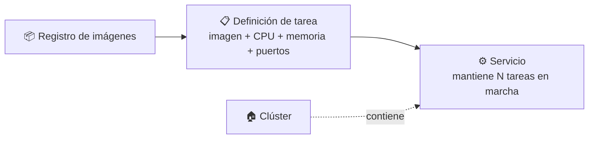
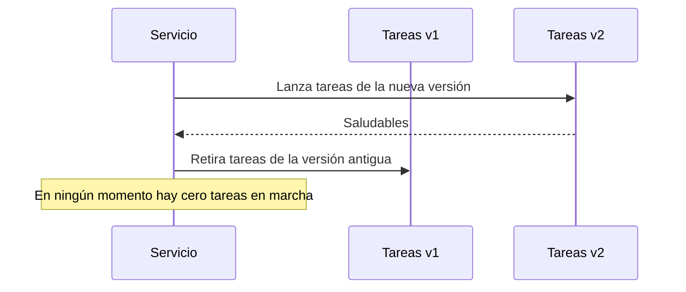

# 🧩 3. Contenedores gestionados

---

Ya has visto cómo ejecutar una aplicación como instancia (Tema 2) y como función serverless (la sesión pasada). Hoy la ejecutas como **contenedor** —una imagen que empaqueta la aplicación con exactamente lo que necesita para correr, igual en cualquier sitio—, pero sin montar tú ningún servidor que la aloje: un servicio gestionado se encarga de dónde vive ese contenedor, de mantenerlo en marcha, y de sustituirlo si falla. El profesor te entrega el código fuente y su `Dockerfile` ya listos — este módulo no cubre cómo se construye un contenedor desde cero, solo cómo se construye a partir de una receta dada y se ejecuta de forma gestionada.

---

## 🧭 Registro de imágenes, definición de tarea y servicio

Cuatro piezas nuevas, cada una con un papel concreto:

| Pieza | Qué es | Analogía |
|---|---|---|
| **Registro de imágenes** | Dónde se guardan las imágenes de contenedor, listas para desplegar | Un almacén de plantillas ya montadas |
| **Definición de tarea** | La receta: qué imagen usar, cuánta CPU y memoria, qué puertos | La ficha técnica de un plato del menú |
| **Clúster** | El espacio lógico donde viven tus servicios, dentro de tu cuenta y tu VPC | El propio restaurante, como local |
| **Servicio** | Mantiene un número de tareas en marcha, las reemplaza si fallan | El encargado de cocina que asegura que siempre hay platos listos |

Un clúster no ejecuta nada por sí mismo — es el contenedor administrativo dentro del cual creas tus servicios; con Fargate, ni siquiera tiene servidores propios asociados, es solo el espacio donde se organiza todo.

!!! example "El mismo patrón que ya conoces, con otro nombre"
    La definición de tarea cumple para un contenedor el mismo papel que la plantilla de lanzamiento cumplía para una instancia en el Tema 2: la receta completa de cómo debe arrancar. Y el servicio hace por los contenedores lo que el grupo de escalado automático hacía por tus instancias: mantener un número saludable en marcha, sin que tú intervengas.

---

## 🧩 Ejecutar contenedores sin servidores que administrar

Con un servicio de contenedores gestionado en modo *serverless* (como **Fargate**), tú declaras la definición de tarea y el número de copias que quieres, y el propio servicio se encarga de encontrar dónde ejecutarlas — sin que tú elijas, actualices ni parchees ninguna instancia por debajo.

| | Contenedor sobre instancias propias | Contenedor gestionado (Fargate) |
|---|---|---|
| Eliges el tipo de instancia subyacente | Sí | No — declaras CPU y memoria de la tarea, no de una instancia |
| Aplicas parches al sistema operativo del host | Sí | No |
| Escalas añadiendo instancias tú mismo | Sí | El servicio ajusta la capacidad subyacente automáticamente |

Es la misma lógica de la escalera de responsabilidad de la sesión pasada, ahora aplicada a contenedores: cuanto más gestionado, menos operación cargas tú, a cambio de menos control sobre el detalle de la máquina que lo ejecuta.

---

## 🔧 Escalado del servicio y actualización de versión

El servicio no solo mantiene un número fijo de tareas — puede escalar igual que hacía tu grupo de escalado automático del Tema 4, y actualizar la versión desplegada sin cortar el servicio:

!!! tip "Por qué esto no es solo una comodidad más"
    Actualizar reemplazando tareas nuevas antes de retirar las antiguas es lo que te va a permitir, en la Actividad 6.3, pasar de la versión 1 a la versión 2 de tu aplicación sin que ningún usuario note un corte de servicio — el mismo principio de alta disponibilidad del Tema 4, aplicado ahora al propio proceso de desplegar una versión nueva.

---

## ⚙️ Comparación de las tres formas de ejecutar la misma aplicación

Has visto tres formas de ejecutar una aplicación a lo largo de este módulo: como instancia (Tema 2), como función (la sesión pasada) y hoy como contenedor gestionado. Ninguna sustituye del todo a las otras — cada una resuelve mejor un tipo de carga distinto.

| | Instancia | Contenedor gestionado | Función |
|---|---|---|---|
| Qué gestionas tú | Sistema operativo completo | Solo la definición de tarea | Solo tu código |
| Arranque | Minutos | Segundos | Milisegundos (con arranque en frío ocasional) |
| Facturación | Por tiempo encendida | Por tarea en marcha | Por invocación |
| Encaja mejor con | Cargas estables, control fino necesario | Aplicaciones empaquetadas, portabilidad entre entornos | Tareas puntuales disparadas por eventos |

Vas a construir tú mismo esta tabla comparativa con datos propios en la Actividad 6.3 — tiempo de despliegue, coste estimado, esfuerzo operativo y cuándo elegirías cada una, a partir de lo que has medido en las tres sesiones de este tema.

---

## ✅ Ideas clave

??? tip "Abrir resumen"

    - Un registro guarda las imágenes; una definición de tarea es la receta (imagen, CPU, memoria, puertos); un clúster es el espacio lógico donde vive todo; un servicio mantiene N tareas en marcha, igual que un grupo de escalado hacía con instancias.
    - Un servicio de contenedores gestionado en modo serverless (Fargate) elimina la necesidad de elegir, parchear o escalar instancias subyacentes — solo declaras la tarea.
    - El servicio puede escalar y actualizar versión reemplazando tareas nuevas antes de retirar las antiguas, sin cortar el servicio.
    - Instancia, contenedor gestionado y función no son sustitutos entre sí — cada una encaja mejor con un tipo de carga distinto, y la elección se apoya en datos, no en preferencia.

Con esto ya tienes las piezas para la Actividad 6.3 — Tu imagen, sin servidores.
