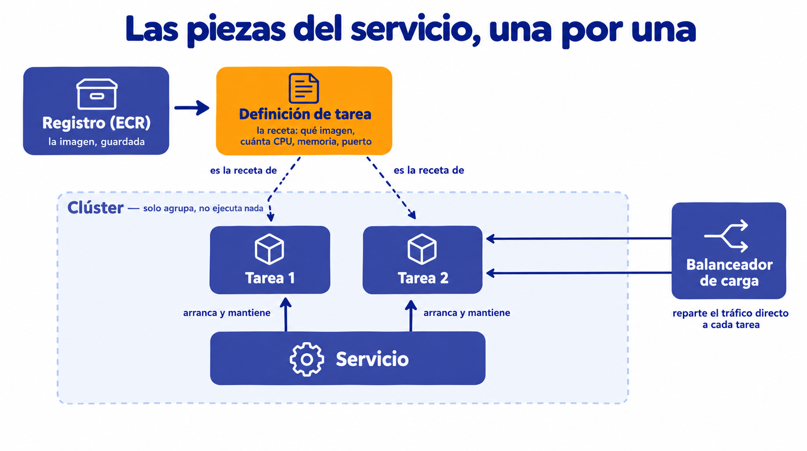
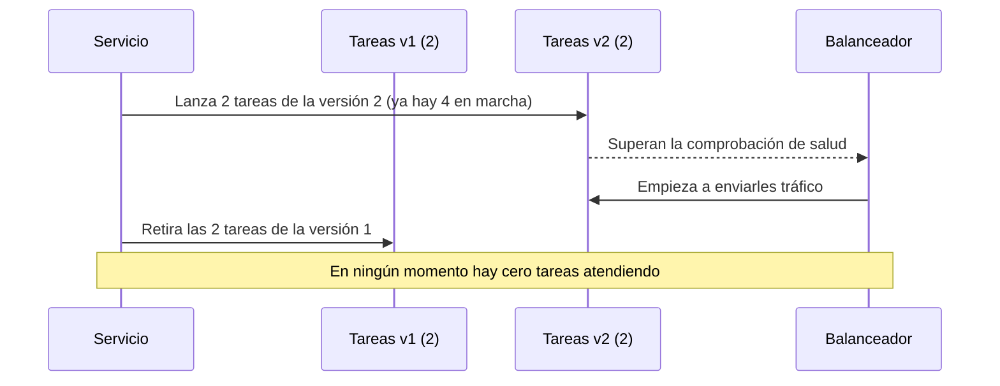
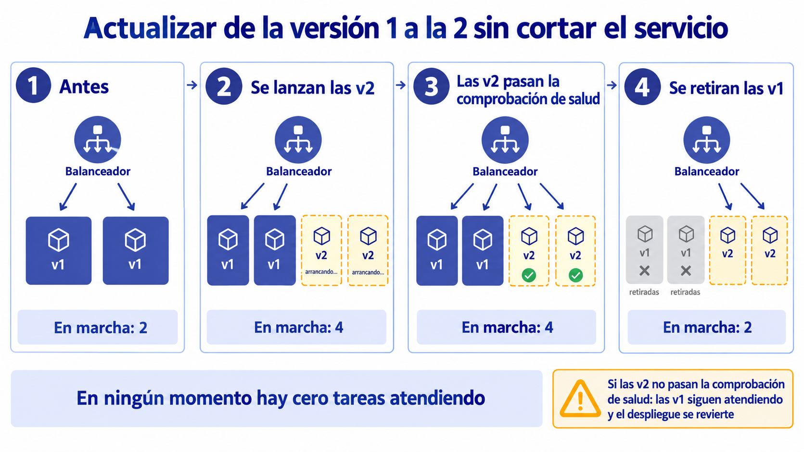
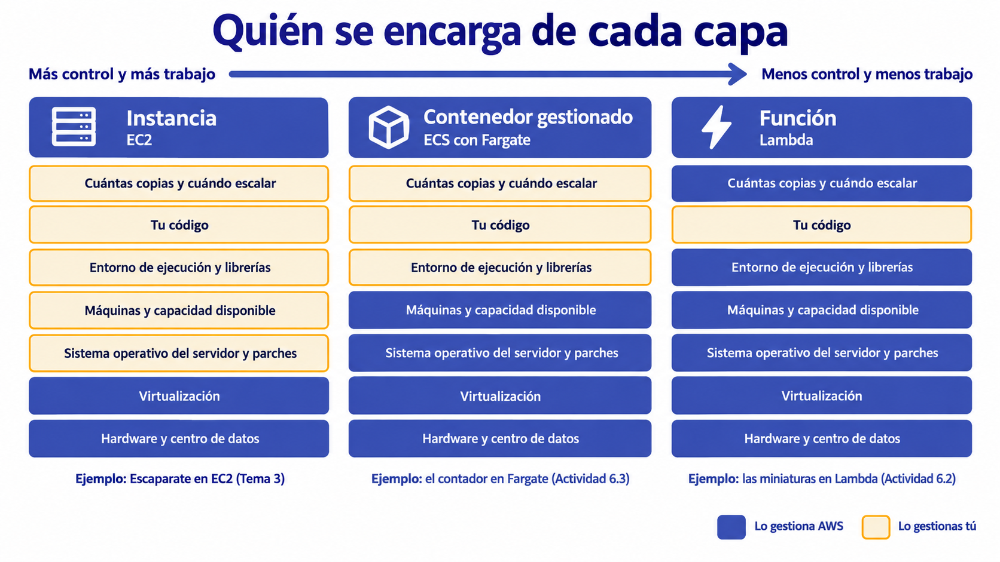

<a id="contenedores-gestionados"></a>

# 🧩 3. Contenedores gestionados

{ type=application/pdf style="width:100%;min-height:80vh" }

!!!info "Descarga de diapositivas"
    [Descarga las diapositivas](diapositivas/contenedores-gestionados.pdf){target="_blank" rel="noopener"}

---

Ya sabes ejecutar una aplicación como instancia (Tema 2) y como función (la sesión pasada). Hoy la ejecutas como **contenedor** sin montar ningún servidor que lo aloje: un servicio gestionado decide dónde vive, lo mantiene en marcha y lo sustituye si falla. Es el peldaño intermedio de la escalera: tú empaquetas la aplicación, y AWS se ocupa de las máquinas. El código de la aplicación de hoy ya viene con su `Dockerfile` (la receta para construir la imagen); este módulo no cubre cómo se escribe uno desde cero, solo cómo se construye a partir de una receta dada y se ejecuta de forma gestionada.

---

## 🧭 Qué es un contenedor y qué problema resuelve

Cuando montaste Escaparate en una instancia (Actividad 3.2), tuviste que instalar Java, configurar variables y arrancar la aplicación a mano. Si mañana necesitas otra instancia igual, lo repites, o recurres a una AMI (Tema 2). Un **contenedor** resuelve el mismo problema a otra escala: empaqueta la aplicación junto con todo lo que necesita para correr (el lenguaje, las librerías, la configuración base) en un paquete que se ejecuta igual en tu portátil, en una instancia o en un servicio gestionado.

La pieza que se construye una vez se llama **imagen**, y cada copia en ejecución es un **contenedor**. Es la misma relación que ya conoces entre una AMI y las instancias que lanzas a partir de ella.

| | Instancia (máquina virtual) | Contenedor |
|---|---|---|
| Qué lleva dentro | Un sistema operativo completo | Solo la aplicación y sus librerías |
| Tamaño típico | Varios GB | Decenas o cientos de MB |
| Arranque | Minutos | Segundos |
| Aislamiento | Muy fuerte: cada instancia tiene su propio sistema | Más ligero: los contenedores comparten el núcleo del sistema que los ejecuta |
| Se construye a partir de | Una AMI | Una imagen, descrita en un `Dockerfile` |

!!! example "Un contenedor de transporte"
    Un contenedor marítimo se llena en la fábrica y se mueve en barco, tren o camión sin abrirlo, porque todos tienen las mismas medidas. Con los contenedores de software ocurre igual: lo que has empaquetado se puede ejecutar en cualquier sitio que sepa manejar contenedores, sin tocar su interior.

---

## 🧩 Las piezas del servicio: registro, tarea, clúster y servicio

Para ejecutar una imagen de forma gestionada, AWS usa cuatro piezas. Cada una tiene un equivalente en lo que ya has hecho:

| Pieza (nombre en AWS) | Qué es | Lo que ya conoces |
|---|---|---|
| **Registro de imágenes** (ECR) | Donde se guardan las imágenes, listas para desplegar | Como las AMI guardadas en tu cuenta |
| **Definición de tarea** | La receta de cómo ejecutar el contenedor: qué imagen, cuánta CPU y memoria, qué puerto, qué variables | La plantilla de lanzamiento del Tema 2 |
| **Clúster** (ECS) | El espacio lógico donde viven tus servicios; por sí solo no ejecuta nada | Como una VPC: un contenedor lógico que agrupa recursos, pero que no hace nada por sí mismo |
| **Servicio** | Mantiene un número de tareas en marcha y repone las que fallan | El grupo de escalado automático del Tema 4 |

Una **tarea** es una copia en ejecución de la definición de tarea (uno o varios contenedores que viven juntos) — la misma relación que hay entre una plantilla de lanzamiento y las instancias que arrancas a partir de ella. El servicio no arranca contenedores sueltos: arranca tareas, siguiendo siempre la misma receta, y las repone si una falla.



Léelo en dos pasadas: primero la de arriba, del registro a la definición de tarea — de dónde sale la receta, con flechas discontinuas porque describen, no ejecutan. Después la de abajo, del servicio a cada tarea — quién la pone en marcha y la mantiene si falla (lo compruebas tú mismo en el Paso 4 de la actividad de hoy, deteniendo una tarea a mano).

Tres decisiones ocupan casi toda la definición de tarea, y son las que rellenarás en la 6.3. Aquí tienes un fragmento real, abreviado, con lo que significa cada línea:

```jsonc
{
  "cpu": "512",                  // la mitad de una vCPU (1024 = una vCPU entera)
  "memory": "1024",              // 1 GB de memoria para toda la tarea
  "containerDefinitions": [{
    "image": "…amazonaws.com/escaparate:1.0",   // qué imagen del registro se ejecuta
    "portMappings": [{"containerPort": 8080}],  // el puerto en el que escucha la aplicación
    "environment": [                            // configuración que entra como variable
      {"name": "APP_STORAGE_TYPE", "value": "s3"}
    ]
  }]
}
```

---

## 🚀 Ejecutar contenedores sin servidores que administrar

Un clúster no ejecuta las tareas por sí mismo: necesita algo donde ponerlas, y eso se elige al crear el clúster. Hay dos formas. La primera es sobre **instancias propias** (el tipo de lanzamiento EC2 de ECS): tú sigues eligiendo el tipo de instancia y el grupo de escalado que las repone, igual que en el Tema 4 — la única diferencia es que, en vez de una aplicación, cada instancia aloja una o varias tareas. La segunda es **Fargate**, la modalidad gestionada, y es la que usas en la actividad de hoy: en lugar de una instancia, le dices a AWS cuánta CPU y memoria necesita cada tarea, y AWS busca dónde ejecutarla, sin que exista ninguna instancia que tú puedas ver ni administrar. Es exactamente lo que ya viste en «Quién se encarga de cada capa» de la sesión anterior, aplicado a contenedores en vez de a funciones: no eliges tipo de instancia, no aplicas parches al sistema del servidor y no compras capacidad por adelantado.

| | Contenedores sobre instancias propias | Contenedores en Fargate |
|---|---|---|
| Eliges el tipo de instancia | Sí | No: declaras CPU y memoria de la tarea |
| Aplicas parches al sistema del servidor | Sí | No |
| Añades capacidad cuando faltan recursos | Tú | AWS |
| Pagas | Las instancias, estén llenas o vacías | Solo lo que piden las tareas mientras están en marcha |

Lo que desaparece de tu responsabilidad es el servidor. Lo que **sigue siendo tuyo** es el contenido de la imagen: si el sistema base o una librería tiene una vulnerabilidad, Fargate no la arregla, tienes que construir una imagen nueva.

**Red de la tarea.** Cada tarea de Fargate recibe su propia interfaz de red con su propia dirección IP, dentro de la subred que indiques, y el grupo de seguridad se aplica a la tarea, no a un servidor. El balanceador reparte el tráfico directamente entre las direcciones de las tareas, pero solo puede alcanzar las que están en zonas de disponibilidad donde él tiene subred: una tarea en otra zona queda como «no en uso» y no atiende a nadie.

!!! info "Cuánto cuesta una tarea de Fargate"
    En US East (N. Virginia) Fargate cobra 0,04048 $ por vCPU y hora, y 0,004445 $ por GB de memoria y hora, por segundo con un mínimo de un minuto. Una tarea de 0,5 vCPU y 1 GB cuesta 0,0247 $ la hora, unos **18,02 $ al mes** encendida siempre. Es más que una instancia `t3.small` (15,18 $), que ofrece más capacidad por el mismo precio. Con Fargate no ahorras dinero por defecto: pagas un poco más por unidad de capacidad a cambio de olvidarte de los servidores.

---

## 🔧 Escalado y actualización sin cortar el servicio

El servicio mantiene el **número deseado** de tareas. Si una tarea deja de responder al balanceador (su comprobación de salud falla), el servicio la retira y arranca otra; para el usuario no cambia nada. Para escalar basta con cambiar ese número, a mano o con una regla automática, igual que hacías con el grupo de escalado en la 4.1.

La actualización de versión usa el mismo mecanismo. Por defecto, el servicio permite hasta el doble de tareas durante el cambio: lanza las nuevas antes de retirar las viejas. Una tarea nueva no recibe tráfico hasta superar varias comprobaciones de salud seguidas del balanceador (con los valores por defecto, algo más de un minuto), y por eso una actualización lleva unos minutos aunque cada tarea arranque en menos de un minuto. Con dos tareas en la versión 1, el proceso es este:


```mermaid
sequenceDiagram
    participant S as Servicio
    participant V1 as Tareas v1 (2)
    participant V2 as Tareas v2 (2)
    participant B as Balanceador

    S->>V2: Lanza 2 tareas de la versión 2 (ya hay 4 en marcha)
    V2-->>B: Superan la comprobación de salud
    B->>V2: Empieza a enviarles tráfico
    S->>V1: Retira las 2 tareas de la versión 1
    Note over S,B: En ningún momento hay cero tareas atendiendo
```



Si las tareas nuevas no llegan a estar saludables, el servicio no retira las antiguas: la versión 1 sigue atendiendo, y con la opción de reversión automática (*circuit breaker*) el despliegue fallido se deshace solo. Es lo que hace que actualizar sea seguro en un servicio con usuarios.

!!! tip "Por qué esto es mucho más que una comodidad"
    El mismo principio de alta disponibilidad del Tema 4 (nunca depender de una sola pieza) se aplica ahora al propio proceso de desplegar una versión nueva. En la Actividad 6.3 pasas de la versión 1 a la 2 con la aplicación respondiendo todo el tiempo.

---

## 💾 Las tareas son desechables: dónde vive lo que importa

Una tarea puede reemplazarse en cualquier momento (por un fallo, una actualización o un cambio de escala), y lo que haya guardado en su disco desaparece con ella. Es el mismo problema que viste en la 4.1 con las imágenes de producto en cada instancia. Por eso una aplicación en contenedores guarda lo importante fuera:

| Qué | Dónde | En Escaparate |
|---|---|---|
| Datos de la aplicación | Una base de datos gestionada | RDS (Actividad 3.2) |
| Ficheros que suben los usuarios | Un almacén de objetos | S3 (Actividad 5.2), con `APP_STORAGE_TYPE=s3` |
| Configuración | Variables de entorno de la definición de tarea, no dentro de la imagen | `DB_HOST`, `APP_STORAGE_S3_BUCKET`... |
| Permisos para hablar con AWS | El rol de la tarea, no claves dentro de la imagen | El rol del Learner Lab, como en la 5.2 |

Así la misma imagen sirve para cualquier entorno: solo cambian las variables con las que se lanza.

---

## ⚖️ Comparación de las tres formas de ejecutar la misma aplicación

Has visto tres formas de ejecutar una aplicación: como instancia (Tema 2), como función (la sesión pasada) y ahora como contenedor gestionado. Ninguna sustituye del todo a las otras: cada una resuelve mejor un tipo de carga.



| | Instancia | Contenedor gestionado | Función |
|---|---|---|---|
| Qué gestionas tú | El sistema operativo entero | La imagen y la definición de tarea | Solo tu código |
| Arranque (orden de magnitud) | Uno o dos minutos | De decenas de segundos a un par de minutos | Cientos de milisegundos, con arranque en frío |
| Facturación | Por tiempo encendida | Por tarea y segundo en marcha | Por invocación y GB-segundo |
| Coste base de referencia | 15,18 $/mes (`t3.small`) | 18,02 $/mes (0,5 vCPU, 1 GB) | 0 $ sin tráfico |
| Encaja mejor con | Cargas estables y control fino | Aplicaciones completas y portátiles | Tareas puntuales por eventos |

Vas a construir tú mismo una tabla así, con datos medidos, en la Actividad 6.3: tiempo de despliegue, coste estimado, esfuerzo operativo y cuándo elegirías cada una, a partir de lo que has hecho en las tres sesiones de este tema.

---

## ✅ Ideas clave

??? tip "Abrir resumen"

    - Un contenedor empaqueta la aplicación con lo que necesita para correr y se ejecuta igual en cualquier sitio. La imagen es a un contenedor lo que una AMI a una instancia.
    - Un registro (ECR) guarda las imágenes; una definición de tarea es la receta (imagen, CPU, memoria, puerto, variables); un clúster es el espacio lógico; un servicio mantiene N tareas en marcha, como el grupo de escalado hacía con las instancias.
    - Con Fargate desaparece el servidor de tu responsabilidad (elegirlo, parchearlo, dimensionarlo), pero el contenido de la imagen sigue siendo tuyo. No es más barato por defecto: una tarea de 0,5 vCPU y 1 GB son unos 18 $ al mes.
    - Para actualizar, el servicio lanza las tareas de la versión nueva antes de retirar las antiguas, y si las nuevas no están saludables no retira nada.
    - Las tareas son desechables: los datos, los ficheros y los permisos viven fuera de la imagen (base de datos, S3, roles).
    - Instancia, contenedor gestionado y función no son sustitutos entre sí: la elección se apoya en datos de arranque, coste y esfuerzo, no en la moda.

Con esto ya tienes las piezas para la Actividad 6.3 — Tu imagen, sin servidores.
