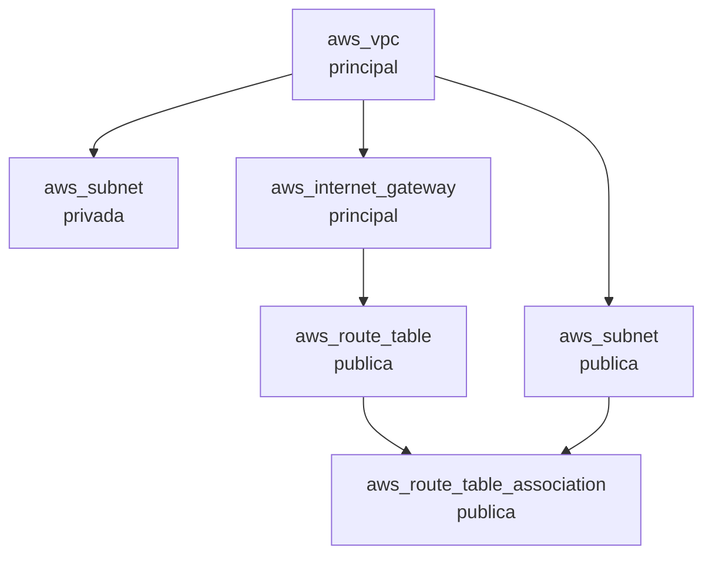
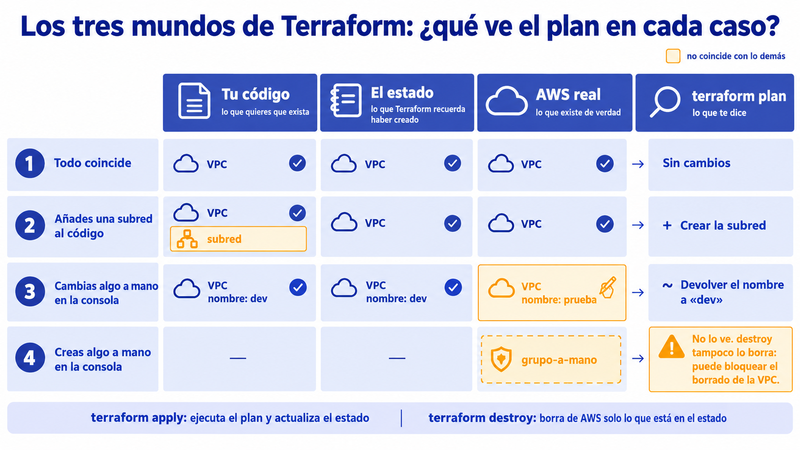

<a id="infraestructura-como-codigo"></a>

# 🧩 1. Infraestructura como código

{ type=application/pdf style="width:100%;min-height:80vh" }

!!!info "Descarga de diapositivas"
    [Descarga las diapositivas](diapositivas/infraestructura-como-codigo.pdf){target="_blank" rel="noopener"}

---

Desde el Tema 3 levantas la red del laboratorio con `terraform apply` y la deshaces con `terraform destroy`: una red entera —VPC, subredes, rutas y grupo de seguridad— aparece y desaparece con una sola orden, sin un solo clic. Hasta ahora solo lo has *ejecutado*, sin abrir nunca el fichero que lo describe. Hoy lo lees, lo modificas y lo escribes tú: eso es **infraestructura como código**, describir la infraestructura en ficheros de texto y dejar que una herramienta la cree, la modifique o la destruya exactamente como el texto dice.

---

## 🧭 Por qué en una empresa nadie monta producción a mano

Todo lo demás que has construido —el balanceador, el grupo de escalado, la base de datos— lo has montado a mano en la consola o por CLI. Era lo correcto para aprender, porque necesitabas entender cada pieza antes de automatizarla, pero no escala a un equipo real:

| Problema de montar a mano | Cómo lo resuelve el código |
|---|---|
| No es reproducible: cada persona lo hace un poco distinto | El mismo fichero produce siempre el mismo resultado |
| No se puede revisar antes de aplicar | Un cambio de infraestructura se revisa como cualquier cambio de código, antes de ejecutarlo de verdad |
| No queda historial de qué ha cambiado y por qué | El control de versiones registra cada cambio, con su autor y su fecha |
| Destruir "todo lo que creé" es propenso a olvidos | El código sabe exactamente qué existe, y lo destruye sin dejar residuos |

!!! example "Un olvido que ya has visto de cerca"
    Al destruir la red con `terraform destroy` (en la Actividad 3.1, y otra vez al cierre de la 5.3), Terraform borra en orden todo lo que él ha creado. Pero los grupos de seguridad que has creado a mano para la base de datos, el balanceador y las instancias no están en su lista: no los conoce. Si alguno sigue apuntando al grupo de seguridad de la red, el `destroy` se queda minutos en `Still destroying...` hasta que lo borras tú. Es lo que pasa cuando una parte de la infraestructura vive en código y otra a mano: el código solo responde de lo suyo.

---

## 🧩 Modelo declarativo: estado deseado, plan y aplicación

**Terraform** es un programa de HashiCorp que lee ficheros `.tf`, escritos en un lenguaje sencillo llamado HCL. No te pide que describas los pasos para llegar a un resultado —eso sería un modelo *imperativo*, como un script—, sino que describas **cómo quieres que quede el mundo**; es la herramienta la que calcula qué hay que crear, cambiar o destruir para llegar ahí.

| | Imperativo (un script) | Declarativo (Terraform) |
|---|---|---|
| Qué escribes | Los pasos: "crea la VPC, luego crea la subred..." | El resultado: "quiero una VPC con una subred pública" |
| Si lo ejecutas dos veces | Repite los pasos, sin mirar qué existe ya | Compara con lo que existe y solo hace lo que falta |
| Para cambiar algo | Escribes otro script con los pasos del cambio | Cambias la descripción y la herramienta calcula la diferencia |
| Ejemplo que ya conoces | El script `recrear-alb.sh` de la 5.1 | El módulo `red-base` del Tema 3 |

El trabajo con Terraform se reduce a cuatro órdenes, y la segunda es la que marca la diferencia frente a hacerlo a mano:

| Orden | Qué hace | Cuándo la usas |
|---|---|---|
| `terraform init` | Descarga el *proveedor* (el plugin que sabe hablar con AWS) y prepara la carpeta | Una vez por carpeta |
| `terraform plan` | Compara tu código con lo que existe y muestra qué va a crear, cambiar o destruir, **sin tocar nada** | Antes de cada cambio |
| `terraform apply` | Ejecuta ese plan de verdad, después de pedirte confirmación | Cuando el plan es el que esperabas |
| `terraform destroy` | Destruye todo lo que Terraform gestiona en esa carpeta | Cuando ya no necesitas la infraestructura, como en el cierre de la 3.1 |

El plan es como leer la lista completa de cambios de un contrato antes de firmarlo, en vez de firmar primero y descubrir después qué has aceptado. Para leerlo basta con cuatro símbolos:

| Símbolo | Significa | Ejemplo |
|---|---|---|
| `+` | Se crea un recurso nuevo | Añades una subred |
| `~` | Se modifica **en el sitio**, sin destruirlo | Cambias una etiqueta |
| `-` | Se destruye | Quitas un recurso del código |
| `-/+` | Se destruye y se **vuelve a crear** | Cambias el rango CIDR de una subred |

Así se ve en la salida real de un plan (abreviada) un cambio en el sitio y otro que destruye y vuelve a crear:

```text
  # aws_vpc.principal will be updated in-place
  ~ resource "aws_vpc" "principal" {
      ~ tags = {
          + "Curso" = "INU"
        }
    }

  # aws_subnet.privada must be replaced
-/+ resource "aws_subnet" "privada" {
      ~ cidr_block = "10.1.1.0/24" -> "10.2.1.0/24" # forces replacement
    }

Plan: 1 to add, 1 to change, 1 to destroy.
```

La última línea es el resumen que conviene leer siempre primero: cuántas operaciones de crear, cambiar y destruir hay. Aquí solo se tocan dos recursos, pero salen tres operaciones: la VPC (`~`) es 1 cambio, y la subred (`-/+`) cuenta dos veces, 1 destrucción de la subred vieja y 1 creación de la nueva. Ese `1 to destroy` es el que avisa de que algo se va a borrar aunque no veas ningún `-` suelto en el plan.

!!! warning "Aplicar sin haber leído el plan es la forma más rápida de romper algo en producción"
    Un plan que dice `-/+` sobre un recurso con datos —como una base de datos— significa que esos datos se pierden: el recurso se borra y se crea otro vacío. Leer el plan no es un trámite: es la comprobación que evita que un cambio pensado como pequeño se convierta en un incidente real.

---

## 🔧 Las piezas de un fichero de Terraform

Un módulo de Terraform es una carpeta con ficheros `.tf`. El de la Actividad 6.1 describe una red como la que diseñaste a mano en la 2.1, y está hecho con unas pocas piezas que se repiten en cualquier infraestructura:

| Pieza | Qué es | En el módulo de la 6.1 |
|---|---|---|
| Proveedor (`provider`) | El plugin que habla con AWS, y la región donde trabaja | `us-east-1` |
| Recurso (`resource`) | Una pieza concreta de infraestructura | Una VPC, dos subredes, una pasarela de internet, una tabla de rutas |
| Variable (`variable`) | Un valor que parametriza el código sin tocar el resto | El entorno (`dev` o `prod`), el rango de la VPC y tu `identificador`, que se añade al nombre de los recursos (como en `red-base`) |
| Salida (`output`) | Un valor que el código muestra al terminar de aplicarse | Los identificadores de la VPC y de las subredes |
| Fuente de datos (`data`) | Información que Terraform lee de AWS sin crearla | Las zonas de disponibilidad de la región |

Cada recurso de Terraform corresponde a algo que ya has creado en la consola. Esta es la red de la 2.1 vista como código:

| En la consola | En Terraform |
|---|---|
| VPC | `aws_vpc` |
| Subred | `aws_subnet` |
| Pasarela de internet | `aws_internet_gateway` |
| Tabla de rutas | `aws_route_table` |
| Asociar la tabla a una subred | `aws_route_table_association` |

Y así se escribe, con un fragmento del módulo de la actividad:

```hcl
# Una variable: un valor que puedes cambiar sin tocar el resto del código
variable "vpc_cidr" {
  type    = string
  default = "10.1.0.0/16"      # se usa si no indicas otro
}

# Tipo de recurso ("aws_vpc") y nombre propio dentro del código ("principal")
resource "aws_vpc" "principal" {
  cidr_block = var.vpc_cidr    # usa el valor de la variable
}

resource "aws_subnet" "publica" {
  # Referencia a la VPC de arriba: aquí nace la dependencia
  vpc_id     = aws_vpc.principal.id
  # 10.1.0.0/24: parte el /16 en trozos /24 y coge el número 0
  cidr_block = cidrsubnet(var.vpc_cidr, 8, 0)
}
```

`cidrsubnet` es una función de Terraform que reparte un rango como el de la 2.1: el `8` es cuántos bits añade a la máscara (de `/16` a `/24`) y el `0`, cuál de los trozos resultantes coge. Cada subred del módulo usa un número distinto, y por eso sus rangos no se solapan.

### Dependencias: el orden sale de las referencias

Terraform no crea los recursos en el orden en que aparecen en el fichero. Mira las **referencias**: como la subred escribe `aws_vpc.principal.id`, sabe que la VPC tiene que existir antes. Con todas las referencias del módulo dibuja un grafo, y crea de arriba abajo lo que ese grafo permite.



La flecha significa "tiene que existir antes que". Al destruir, el orden se invierte: primero la asociación, al final la VPC. Es la razón por la que `terraform destroy` funciona sin que tengas que pensar qué borrar primero, y también por la que se atasca si queda dentro de la VPC algo que Terraform no conoce.

---

## 🔁 Idempotencia y deriva

La **idempotencia** es la propiedad que hace que aplicar el mismo código dos veces seguidas no cambie nada la segunda vez, si nada ha cambiado en el código ni en la infraestructura real: el plan de la segunda aplicación dice simplemente "No changes". Piensa en el botón de un ascensor: pulsarlo una vez o diez seguidas no hace que lleguen diez ascensores. Terraform converge siempre al mismo estado, nunca lo duplica.

La otra cara es la **deriva**: alguien cambia a mano en la consola algo que gestiona Terraform. El siguiente `plan` lo detecta y propone devolverlo a lo que dice el código.

!!! example "El código manda"
    Cambias a mano el nombre de la VPC en la consola. Al ejecutar `terraform plan`, Terraform ve que el nombre real ya no coincide con el del código y muestra `~` sobre esa VPC: si aplicas, el nombre vuelve al que dice el fichero. Por eso en un equipo con infraestructura como código nadie retoca a mano lo que gestiona el código: el siguiente `apply` deshace el cambio.

---

## ⚙️ El fichero de estado y por qué en producción va remoto

Terraform trabaja siempre con tres cosas a la vez: tu **código** (lo que quieres que exista), el **estado** (lo que recuerda haber creado) y **AWS real** (lo que existe de verdad ahora mismo). El estado es un fichero, `terraform.tfstate`, que aparece junto a tus `.tf` después del primer `apply` —ya tienes uno en `recursos/tema3/red-base`—. Antes de calcular el plan, Terraform mira AWS para comprobar que lo que recuerda sigue siendo cierto, y compara el resultado con tu código.



Cada fila es una situación y la celda en ámbar es la que no coincide con las demás. Fíjate en la última: un recurso que solo existe en AWS real no está en el estado, así que Terraform no lo mira, no lo ve en el plan y no lo destruye.

| Situación | Consecuencia |
|---|---|
| Borras el fichero de estado con la infraestructura aún viva | Terraform olvida que existe: el siguiente `apply` intenta crearlo todo otra vez y lo que ya había queda huérfano, sin que nada lo gestione |
| Creas algo a mano dentro de lo que gestiona Terraform | No está en el estado: `plan` no lo ve y `destroy` no lo borra, y puede bloquear el borrado de lo que lo rodea |
| Dos personas aplican a la vez con estados distintos | Se pisan el trabajo, y cada estado cree que existe algo diferente |

!!! info "En este módulo, el estado vive en local"
    En una empresa, el fichero de estado se guarda en un almacenamiento remoto compartido (por ejemplo, un bucket S3 con bloqueo de escritura concurrente), para que todo el equipo trabaje sobre el mismo estado real. Aquí trabajas solo y en un laboratorio temporal, así que el fichero se queda en tu carpeta de CloudShell, junto al código: es una simplificación consciente, no la práctica recomendada para un equipo. Mientras exista infraestructura, no lo edites ni lo borres.

---

## ✅ Ideas clave

??? tip "Abrir resumen"

    - Montar infraestructura a mano no es reproducible, no se puede revisar antes de aplicar y hace fácil olvidar residuos al destruir; el código en repositorio resuelve las tres cosas.
    - El modelo declarativo describe el estado deseado, y Terraform calcula qué crear, cambiar o destruir para llegar a él. Las órdenes son `init`, `plan`, `apply` y `destroy`.
    - El plan muestra los cambios antes de aplicarlos: `~` modifica en el sitio, `-/+` destruye y vuelve a crear. Léelo siempre, sobre todo si toca un recurso con datos.
    - Proveedor, recursos, variables, salidas y fuentes de datos son las piezas de cualquier código de infraestructura; el orden de creación sale de las referencias entre recursos, y el de destrucción es el inverso.
    - Aplicar dos veces sin cambios no hace nada la segunda vez (idempotencia), y lo que alguien cambie a mano se detecta en el siguiente plan (deriva).
    - El estado registra qué ha creado Terraform: lo creado a mano fuera del código no aparece en él, y `destroy` no lo toca.

Con esto ya tienes las piezas para la Actividad 6.1 — Destruir y reconstruir.
