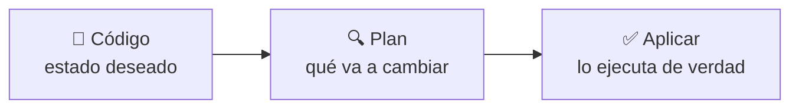
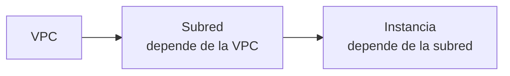

# 🧩 1. Infraestructura como código

---

Cada pieza de infraestructura que has construido hasta ahora ha salido de clics en la consola o de comandos sueltos por CLI — funciona, pero no queda ningún documento que describa "así tiene que ser esta infraestructura", solo el resultado de haberla montado una vez. Si mañana tuvieras que reconstruirla exactamente igual, tendrías que recordar cada paso de memoria. Hoy cambias esa forma de trabajar: describes la infraestructura en ficheros de texto, y dejas que una herramienta se encargue de crearla, modificarla o destruirla exactamente como el texto dice — ni un clic más.

---

## 🧭 Por qué en una empresa nadie monta producción a mano

Montar infraestructura a mano funciona para aprender —es justo lo que has hecho hasta ahora, y necesitabas entender cada pieza antes de automatizarla—, pero no escala a un equipo real, por varias razones a la vez:

| Problema de montar a mano | Cómo lo resuelve el código |
|---|---|
| No es reproducible: cada persona lo hace un poco distinto | El mismo fichero produce siempre el mismo resultado |
| No se puede revisar antes de aplicar | Un cambio de infraestructura se revisa como cualquier cambio de código, antes de ejecutarlo de verdad |
| No queda historial de qué cambió y por qué | El control de versiones registra cada cambio, con su autor y su fecha |
| Destruir "todo lo que creé" es propenso a olvidos | El código sabe exactamente qué existe, y lo destruye sin dejar residuos |

!!! example "El olvido que solo pasa a mano"
    Imagina que montaste una VPC, un balanceador, un grupo de escalado y una base de datos, todo a mano, hace tres semanas. Hoy te piden borrarlo todo. ¿Recuerdas los quince recursos exactos que creaste, en qué orden hay que borrarlos para que las dependencias no bloqueen el proceso, y si alguno quedó huérfano sin que lo notaras? Con el mismo despliegue hecho en código, una única orden de destrucción elimina exactamente lo que el código describe, ni más ni menos.

---

## 🧩 Modelo declarativo: estado deseado, plan y aplicación

Herramientas como **Terraform** no te piden que describas los pasos para llegar a un resultado —eso sería un modelo *imperativo*—, sino que describas directamente **cómo quieres que quede el mundo**, y es la herramienta la que calcula qué hay que crear, cambiar o destruir para llegar ahí.

El **plan** es el paso que marca la diferencia frente a hacerlo a mano: antes de tocar nada de verdad, la herramienta te dice exactamente qué va a crear, qué va a modificar y qué va a destruir, para que lo revises antes de confirmar — como leer la lista completa de cambios de un contrato antes de firmarlo, en vez de firmar primero y descubrir después qué has aceptado.

!!! warning "Aplicar sin haber leído el plan es la forma más rápida de romper algo en producción"
    Un plan que dice "destruir y volver a crear" en vez de "modificar" sobre un recurso con datos —como una base de datos— puede significar perder esos datos. Leer el plan no es un trámite: es la comprobación que evita que un cambio pensado como pequeño se convierta en un incidente real.

---

## 🔧 Recursos, variables, salidas, dependencias e idempotencia

Un fichero de Terraform se construye con unas pocas piezas que se repiten en cualquier infraestructura que declares:

| Pieza | Qué es | Ejemplo típico |
|---|---|---|
| Recurso | Una pieza concreta de infraestructura | Una subred, una instancia, un bucket |
| Variable | Un valor que parametriza el código, sin tocarlo | El rango CIDR, el tipo de instancia |
| Salida | Un valor que el código expone tras aplicarse | La URL del balanceador, el endpoint de la base de datos |
| Dependencia | Un recurso que necesita que otro exista antes | La subred necesita que la VPC exista primero |

La **idempotencia** es la propiedad que hace que aplicar el mismo código dos veces seguidas no cambie nada la segunda vez, si nada ha cambiado en el código ni en la infraestructura real — el plan de la segunda aplicación diría simplemente "no hay cambios". Piensa en el botón de un ascensor: pulsarlo una vez o pulsarlo diez veces seguidas no hace que lleguen diez ascensores, el resultado final es el mismo. Terraform funciona igual: aplicar el mismo código repetidas veces converge siempre al mismo estado, nunca lo duplica.

---

## ⚙️ El fichero de estado y por qué en producción va remoto

Terraform necesita saber qué existe ya, para poder calcular el plan correctamente — esa información vive en el **fichero de estado**. Si dos personas aplican cambios a la vez sin coordinar ese fichero, pueden pisarse el trabajo mutuamente o dejar el estado real desincronizado del que Terraform cree que existe.

!!! info "En este módulo, el estado vive en local"
    En una empresa, el fichero de estado se guarda en un almacenamiento remoto compartido (por ejemplo, un bucket S3 con bloqueo de escritura concurrente), para que todo el equipo trabaje sobre el mismo estado real. En este módulo, tus credenciales del Learner Lab caducan cada sesión, así que el estado se queda en tu propio repositorio local — es una simplificación consciente por las restricciones del laboratorio, no la práctica recomendada para un equipo real.

---

## ✅ Ideas clave

??? tip "Abrir resumen"

    - Montar infraestructura a mano no es reproducible, no se puede revisar antes de aplicar, y hace fácil olvidar residuos al destruir — el código en repositorio resuelve las tres cosas.
    - El modelo declarativo describe el estado deseado; la herramienta calcula qué crear, cambiar o destruir para llegar a él.
    - El plan muestra los cambios antes de aplicarlos de verdad — léelo siempre, sobre todo si toca un recurso con datos.
    - Recursos, variables, salidas y dependencias son las piezas básicas de cualquier código de infraestructura; la idempotencia garantiza que aplicar dos veces sin cambios no hace nada la segunda vez.
    - El fichero de estado registra qué existe ya — en una empresa va remoto y compartido; en este módulo se queda en local por las restricciones del Learner Lab.

Con esto ya tienes las piezas para la Actividad 6.1 — Destruir y reconstruir.
