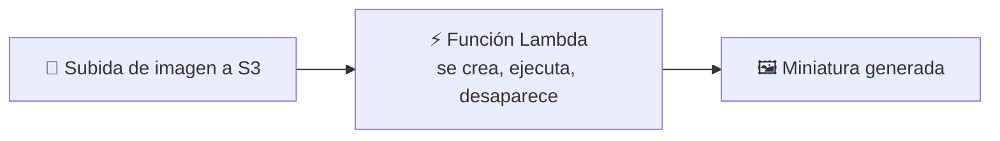
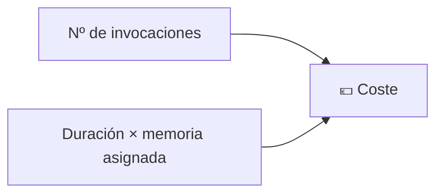
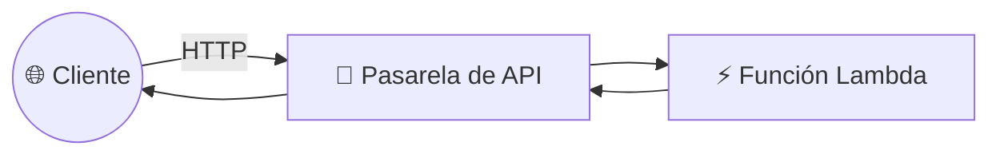
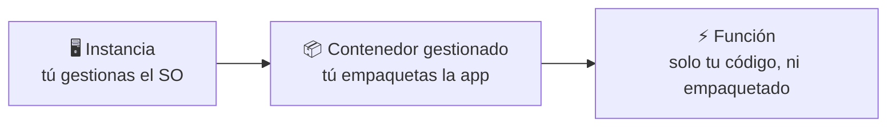

# 🧩 2. Serverless

---

Todo lo que has desplegado hasta ahora sigue teniendo, de fondo, una instancia encendida esperando peticiones — aunque no llegue ninguna. Hoy llega el modelo que rompe esa suposición: código que solo existe mientras se ejecuta, disparado por un evento concreto, sin ningún servidor que tú administres ni un solo segundo de más facturado esperando. Es el último peldaño de la escalera que empezaste a subir en la primera sesión.

---

## 🧭 Modelo de eventos y ejecución efímera

Una función serverless (con **AWS Lambda**) no está "esperando" en ningún sitio — no existe hasta que un **evento** la dispara: la subida de un fichero a S3, una petición HTTP, un mensaje en una cola. En cuanto termina de ejecutarse, deja de existir, hasta el próximo evento.

!!! example "La diferencia con una instancia, en una frase"
    Una instancia EC2 es como tener la cocina de un restaurante encendida todo el día, cocinero incluido, haya o no comensales. Una función Lambda es como un cocinero que aparece exactamente cuando llega un pedido, cocina ese plato, y se va — no cobras por el tiempo que la cocina está vacía.

---

## 🧩 Arranque en frío, límites de ejecución y memoria

Que una función no exista hasta que se dispara tiene una consecuencia directa: la primera vez (o tras un tiempo sin uso), hay que inicializar el entorno de ejecución antes de correr tu código — es el **arranque en frío** (*cold start*), y añade latencia a esa primera invocación concreta.

| Concepto | Qué significa | Por qué importa |
|---|---|---|
| Arranque en frío | Latencia extra en la primera invocación tras un periodo de inactividad | Puede hacer que la primera petición de un usuario sea notablemente más lenta |
| Límite de ejecución | Tiempo máximo que una función puede correr antes de ser cortada | Una función no sirve para tareas de larga duración, solo para trabajo acotado |
| Límite de memoria | Cuánta memoria le asignas, lo que también influye en su CPU disponible | Más memoria asignada acelera la ejecución, pero también sube el coste por invocación |

!!! tip "El arranque en frío no siempre importa igual"
    Una función que genera una miniatura de imagen en segundo plano, sin que ningún usuario espere la respuesta en directo, puede permitirse un arranque en frío ocasional sin que nadie lo note. Una función que responde directamente a una petición de un usuario en tiempo real es mucho más sensible a esa latencia — es una de las cosas que vas a comparar en la Actividad 6.2.

---

## 🔧 Facturación por invocación

La factura de una función serverless no depende de tenerla "encendida" —no existe ese concepto—, sino de cuántas veces se invoca y cuánto dura cada invocación, combinado con la memoria asignada.

!!! warning "Cero invocaciones, cero coste de cómputo — pero no cero coste siempre"
    Si nadie sube ninguna imagen en todo un fin de semana, tu función de miniaturas no factura nada de cómputo esos dos días — algo impensable con una instancia EC2 encendida sin descanso. Eso sí: otros recursos asociados (como el propio bucket S3 que dispara el evento) siguen facturando por su cuenta, con su propia unidad.

---

## ⚙️ Pasarela de API

Para que una función responda directamente a peticiones HTTP de un cliente —no solo a eventos internos como una subida a S3— necesita algo delante que traduzca esa petición HTTP en una invocación de la función: una **pasarela de API** (*API Gateway*).

Fíjate en el paralelismo con lo que ya conoces: la pasarela de API cumple, para una función, un papel parecido al que cumple el balanceador de carga para tus instancias — es la puerta de entrada que traduce una petición externa en una invocación concreta. Vas a montar exactamente esta combinación en la Actividad 6.2.

---

## 📊 El peldaño más extremo de la escalera de responsabilidad

Ya conoces la instancia (Tema 2), donde gestionas tú el sistema operativo entero. Serverless es el extremo opuesto: no gestionas ni sistema operativo ni empaquetado, solo tu código.

Entre los dos hay un peldaño intermedio, el **contenedor gestionado**, que verás en la próxima sesión. En cada peldaño delegas más responsabilidad operativa, a cambio de menos control — la misma idea de la primera sesión, ahora con nombres concretos. Ninguno de los tres es superior en abstracto: el criterio siempre es qué necesita de verdad la carga que estás ejecutando.

---

## 🌐 Cuándo compensa y cuándo no

| Situación | ¿Serverless encaja? |
|---|---|
| Tarea puntual disparada por un evento (subir una imagen, procesar un fichero) | Sí, es el caso ideal |
| Carga constante y predecible, muchas invocaciones por segundo sin pausa | A menudo no — puede salir más barato con instancias reservadas |
| Proceso de muy larga duración | No — choca con el límite de ejecución |
| Latencia crítica en la primera petición de cada usuario, sin margen para arranque en frío | Depende — hay técnicas para mitigarlo, pero añaden complejidad |

Vas a comparar, en la Actividad 6.2, la latencia y el coste reales de resolver la misma operación con una función frente a con tu instancia ya desplegada — y vas a decidir tú, con datos, en qué casos elegirías cada una.

---

## ✅ Ideas clave

??? tip "Abrir resumen"

    - Una función serverless no existe hasta que un evento la dispara, y desaparece al terminar — sin servidor que tú administres, sin coste mientras no se invoca.
    - El arranque en frío añade latencia a la primera invocación tras un periodo de inactividad; los límites de ejecución y memoria acotan qué tipo de tarea encaja.
    - Se factura por número de invocaciones y por duración × memoria asignada, no por tiempo "encendido".
    - Una pasarela de API traduce peticiones HTTP externas en invocaciones de una función, cumpliendo un papel parecido al de un balanceador de carga.
    - Instancia, contenedor gestionado y función son tres peldaños de la misma escalera de responsabilidad — el criterio de elección es qué necesita la carga, no cuál es "más moderna".

Con esto ya tienes las piezas para la Actividad 6.2 — Una función por cada imagen.
