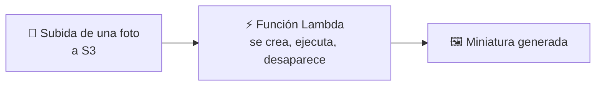
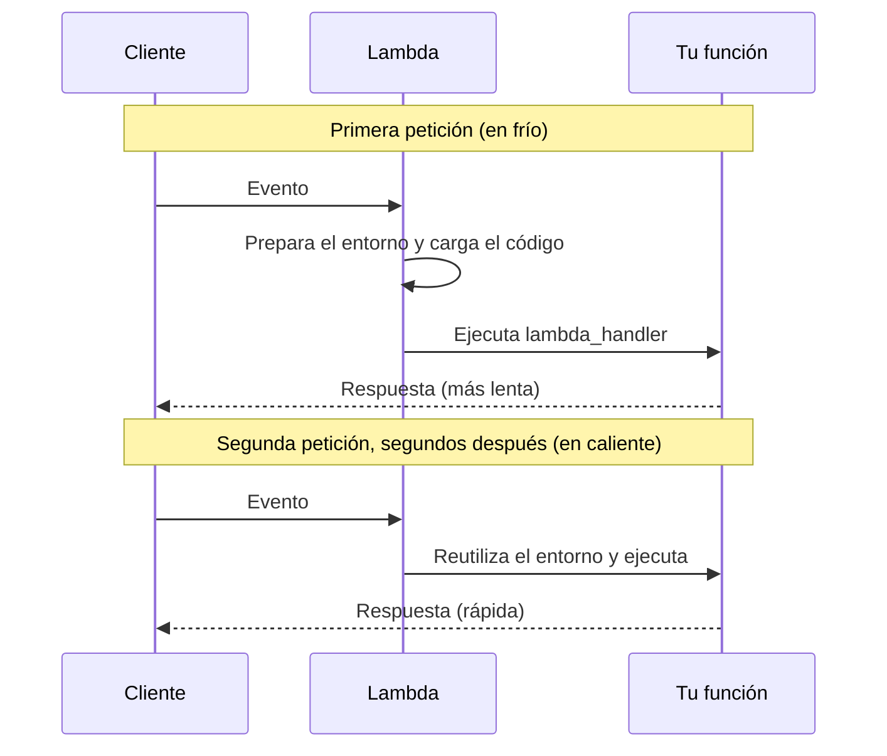
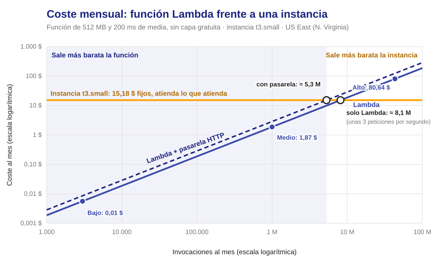
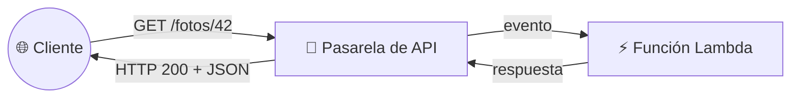
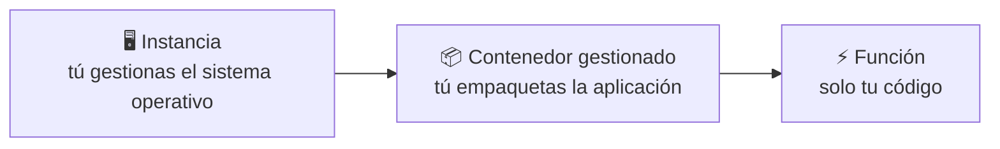
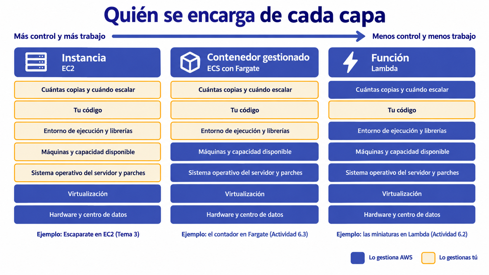

<a id="serverless"></a>

# 🧩 2. Serverless

{ type=application/pdf style="width:100%;min-height:80vh" }

!!!info "Descarga de diapositivas"
    [Descarga las diapositivas](diapositivas/serverless.pdf){target="_blank" rel="noopener"}

---

Todo lo que has desplegado hasta ahora tiene, de fondo, una instancia encendida esperando peticiones, aunque no llegue ninguna. En la 5.3 lo has visto en la factura: dos instancias `t3.small` cuestan lo mismo con mil visitas que con ninguna. Hoy llega el modelo que rompe esa suposición: código que solo existe mientras se ejecuta, lo dispara un evento concreto y no hay ningún servidor que administres. Es el peldaño más alto de la escalera de responsabilidad que empezaste a subir en la primera sesión.

---

## 🧭 Modelo de eventos y ejecución efímera

Una **función serverless** (en AWS, una función **Lambda**) es un trozo de código que AWS ejecuta por ti cuando ocurre algo. Ese algo es un **evento**: un aviso de que ha pasado un hecho concreto. No existe ningún servidor tuyo esperando; en cuanto la función termina, su entorno se apaga hasta el siguiente evento.



Lo que puede disparar una función es más amplio que las subidas a S3. Estos son los cuatro casos más habituales, con un ejemplo de Escaparate para cada uno:

| Quién dispara la función | Ejemplo en Escaparate |
|---|---|
| Un objeto nuevo en S3 | Se sube la foto de un producto y se genera su miniatura |
| Una petición HTTP (a través de una pasarela de API) | Una URL que devuelve los datos de una foto en formato JSON |
| Un reloj (una regla programada, cada cierto tiempo) | Cada noche, borrar los carritos abandonados hace más de una semana |
| Un mensaje en una cola | Cada pedido nuevo envía un correo de confirmación |

!!! example "La diferencia con una instancia, en una frase"
    Una instancia EC2 es como tener la cocina de un restaurante encendida todo el día, con el cocinero dentro, haya o no comensales. Una función Lambda es un cocinero que aparece cuando llega un pedido, cocina ese plato y se va: no pagas por el tiempo que la cocina está vacía.

---

## 🔬 Anatomía de una función Lambda

Antes de crear una, conviene saber qué tiene y qué le hace falta. Una función Lambda es, de hecho, un fichero de código con una función de entrada:

| Pieza | Qué es | En la Actividad 6.2 |
|---|---|---|
| Entorno de ejecución (*runtime*) | El lenguaje con el que está escrita: Python, Node.js, Java... | Python |
| Controlador (*handler*) | La función concreta por la que Lambda empieza a ejecutar tu código | `lambda_handler` |
| Evento | Los datos del aviso, en formato JSON (un texto estructurado en pares clave-valor) | Qué objeto se ha subido y a qué bucket |
| Rol de ejecución | Los permisos con los que corre la función (qué servicios puede tocar) | `LabRole`: el rol que ya ofrece el Learner Lab |
| Paquete de código | Tu código más las librerías que necesite, todo junto en un `.zip` | Tu código y la librería Pillow |

El esqueleto mínimo de una función que reacciona a S3 es este — no genera ninguna miniatura todavía, solo lee el evento y escribe una línea de log; sirve para ver la forma antes de meter la lógica real, que verás completa en la Actividad 6.2. Antes de leerlo, mira la forma que tiene el aviso que S3 le manda a Lambda —el `event`—, simplificado a lo esencial:

```json
{
  "Records": [
    {
      "s3": {
        "bucket": {"name": "escaparate-imagenes-abc123"},
        "object": {"key": "escaparate/camiseta.jpg"}
      }
    }
  ]
}
```

Es un diccionario de Python con una lista, `Records`, porque S3 puede avisar de varios objetos en un solo evento —por eso el código la recorre con un `for`—. Dentro de cada elemento de la lista, el bucket y la ruta del objeto están varios niveles abajo: `registro["s3"]["bucket"]["name"]` va bajando por ese mismo diccionario, nivel a nivel, hasta llegar al dato.

Con esa forma ya identificada, el código que la lee:

```python
def lambda_handler(event, context):
    # S3 puede avisar de varios objetos en un solo evento: se recorren todos
    for registro in event["Records"]:
        bucket = registro["s3"]["bucket"]["name"]   # bucket donde ha ocurrido
        clave = registro["s3"]["object"]["key"]     # ruta del objeto dentro del bucket
        print(f"Objeto nuevo: {bucket}/{clave}")    # lo que imprimas va a CloudWatch Logs
    return {"statusCode": 200}
```

`event` es siempre el primer parámetro del controlador, con esos datos del aviso. `context` es el segundo, obligatorio aunque no lo uses: trae metadatos internos de la propia invocación (cuánto tiempo le queda a la función antes de agotar su plazo, su identificador...), que este ejemplo no necesita consultar.

Lo que `print` escribe no se ve en pantalla, porque nadie está mirando: va a **CloudWatch Logs**, el mismo servicio de la 5.1. Es el primer sitio donde mirar cuando una función no hace lo esperado.

!!! tip "¿Y ese `return {\"statusCode\": 200}`, si nadie llama por HTTP?"
    Ese formato de respuesta solo lo necesita quien espera una contestación, como el cliente de una invocación síncrona a través de la pasarela. Aquí, disparada por S3, nadie lee lo que devuelve: Lambda solo necesita que la función termine sin lanzar ninguna excepción para darla por bien ejecutada. Si lanzara una excepción, sí importaría — es lo que dispara el reintento que ves más abajo, en la tabla de invocación asíncrona.

Dos cosas del paquete de código conviene tenerlas claras desde ahora. Lambda incluye por defecto la librería de AWS para Python (`boto3`), pero no librerías externas como Pillow, que procesa imágenes: hay que meterlas en el `.zip`. Además, Pillow contiene partes compiladas para un sistema operativo concreto, así que hay que empaquetarla en un Linux compatible con Lambda. Por eso la 6.2 usa CloudShell, que ya es Amazon Linux, y no tu ordenador.

!!! warning "La función que se dispara a sí misma"
    Si una función se activa cuando aparece un objeto nuevo en un bucket y escribe su resultado en ese mismo bucket, cada miniatura que genera es otro objeto nuevo que la vuelve a disparar, y así sin parar, facturando cada vuelta. Se evita filtrando por prefijo: la función solo se activa con lo que llega a `escaparate/`, y escribe sus resultados en `miniaturas/` y `metadatos/`. Es el filtro que configuras en el Paso 3 de la 6.2.

Otra diferencia que afecta al diseño es cómo se ha llamado a la función:

| | Invocación síncrona | Invocación asíncrona |
|---|---|---|
| Ejemplo | Una petición HTTP a través de la pasarela | La subida de una foto a S3 |
| Quién espera la respuesta | El cliente, con la conexión abierta | Nadie: S3 solo avisa y sigue |
| Si la función falla | El error vuelve al cliente | Lambda reintenta hasta dos veces más |

Por eso una función que se dispara desde S3 debe poder ejecutarse dos veces sobre la misma foto sin causar daño: generar la miniatura otra vez es inofensivo, cobrar un pedido dos veces no lo es.

---

## 🧩 Arranque en frío, límites de ejecución y memoria

Que la función no exista hasta que se dispara tiene una consecuencia: la primera vez (o tras un rato sin uso) Lambda tiene que preparar un entorno y cargar tu código antes de ejecutarlo. Es el **arranque en frío** (*cold start*), y solo lo sufre esa primera invocación. Las siguientes, si llegan enseguida, reutilizan el entorno ya preparado: son invocaciones «en caliente».



Cuánto dura el arranque en frío depende del lenguaje y del tamaño del paquete. Medido en el Learner Lab con Python y la librería Pillow, la inicialización tardó unos 0,5 segundos, y la primera petición a través de una pasarela de API salió en 0,84 segundos frente a unos 0,06 en las siguientes. Lo vas a medir tú en la Parte B de la 6.2. Además de la latencia, hay tres límites que definen qué tareas caben en una función:

| Concepto | Valor | Consecuencia |
|---|---|---|
| Tiempo máximo de ejecución | 15 minutos por invocación (se configura, 3 segundos por defecto) | No sirve para tareas largas, como convertir un vídeo de una hora |
| Memoria | De 128 MB a 10.240 MB | Tú eliges la cantidad, y la CPU disponible crece con ella |
| Tamaño del paquete | 50 MB en el `.zip` que subes, 250 MB descomprimido | Una librería enorme puede no caber |

!!! tip "Más memoria acelera, pero no siempre abarata"
    La memoria también reparte CPU. Si una función tarda la mitad al doblar la memoria, cuesta lo mismo (0,5 GB × 0,8 s = 1 GB × 0,4 s = 0,4 GB-segundo) y responde el doble de rápido. Pero solo pasa así cuando la función pasa casi todo el tiempo calculando. La función de miniaturas de la 6.2, que pasa buena parte del tiempo esperando a S3, tardó unos 120 ms en caliente con 128 MB y unos 90 ms con 512 MB: más rápida, pero también más cara por invocación (unos 0,015 frente a 0,044 GB-segundo). Por eso el ajuste de memoria es probar con datos, no adivinar.

!!! tip "El arranque en frío no importa igual en todos los casos"
    Una miniatura que se genera en segundo plano puede permitirse un arranque en frío ocasional, porque nadie está esperando delante de la pantalla. Una función que responde directamente a un usuario que espera la página sí lo nota. Es una de las cosas que comparas en la Actividad 6.2.

---

## 🔧 Facturación por invocación

La factura de una función no depende de tenerla «encendida», porque ese concepto no existe. Depende de cuántas veces se invoca y de cuánto ocupa cada invocación: se cobra por petición y por **GB-segundo**, que es la memoria asignada (en GB) multiplicada por los segundos que dura la ejecución. Los precios de US East (N. Virginia) para arquitectura x86 son:

| Concepto | Precio |
|---|---|
| Peticiones | 0,20 $ por cada millón |
| Cómputo | 0,0000166667 $ por GB-segundo |
| Capa gratuita mensual | 1 millón de peticiones y 400.000 GB-segundo |

Veámoslo con una función de Escaparate que tiene 512 MB y tarda de media 200 ms (0,1 GB-segundo por invocación), comparada con una instancia `t3.small` de la 5.3 (unos 15,18 $ al mes, encendida las 24 horas):

| Uso | Invocaciones al mes | Lambda (sin capa gratuita) | Lambda + pasarela HTTP | Instancia `t3.small` |
|---|---|---|---|---|
| Bajo: 100 al día | 3.000 | 0,01 $ | 0,01 $ | 15,18 $ |
| Medio | 1 millón | 1,87 $ | 2,87 $ | 15,18 $ |
| Alto: 1.000 por minuto sin parar | 43,2 millones | 80,64 $ | 123,84 $ | 15,18 $ (si una instancia aguanta la carga) |

El cruce está en torno a los 8 millones de invocaciones al mes con este perfil, unas 3 por segundo de forma sostenida; con la pasarela delante baja hasta unos 5 millones, unas 2 por segundo. Por debajo, serverless es mucho más barato. Por encima, una instancia encendida sale a cuenta, a cambio de administrarla tú (parches, capacidad, arranque).



!!! warning "Cero invocaciones, cero coste de cómputo, pero no cero coste"
    Si nadie sube ninguna foto en todo un fin de semana, tu función no factura nada de cómputo esos dos días, algo impensable con una instancia. Eso sí: el resto de recursos asociados, como el bucket de S3, sigue facturando con su propia unidad. Y una función que se dispara sin control (como la que se llama a sí misma) sí que llena la factura.

---

## ⚙️ Pasarela de API

Para que una función responda a una petición HTTP de un navegador o de una aplicación hace falta algo delante que la reciba y la convierta en un evento: una **pasarela de API** (*API Gateway*). La pasarela expone una URL pública, decide a qué función va cada ruta y devuelve la respuesta al cliente.



Cumple para una función un papel parecido al del balanceador de carga para tus instancias: es la puerta de entrada que traduce una petición externa en una ejecución concreta. Hay dos variantes principales:

| | API HTTP | API REST |
|---|---|---|
| Precio | 1,00 $ por millón de peticiones | 3,50 $ por millón |
| Qué ofrece | Lo básico: rutas, integración con la función | Lo básico, más tres funciones extra (detalladas abajo) |
| Cuándo | La opción por defecto para una mini API | Cuando necesitas alguna de esas funciones extra |

Las tres funciones extra de API REST, una por una:

- **Claves de acceso**: cada aplicación que llama a tu API lleva su propia clave. Así puedes dar (o cortar) una cuota de peticiones a cada cliente por separado, en vez de una cuota única compartida por todo el mundo.
- **Caché de respuestas**: si la misma petición llega dos veces seguidas, la pasarela devuelve la respuesta que ya tenía guardada, sin llegar a invocar la función de nuevo — más rápido para el cliente, y sin gastar otra invocación.
- **Transformación de peticiones**: cambia el formato de lo que entra o sale (por ejemplo, adapta el JSON que espera un cliente antiguo) sin tocar una línea del código de la función.

Para la mini API de la Actividad 6.2 no necesitas ninguna de las tres, así que usarás API HTTP.

Lambda también permite una URL directa a la función, sin pasarela. Es más simple, pero pierdes la posibilidad de definir rutas y de limitar el número de peticiones por segundo. En la 6.2 montarás la pasarela.

---

## 📊 El peldaño más extremo de la escalera de responsabilidad

Ya conoces la instancia (Tema 2), donde gestionas tú el sistema operativo entero. Serverless es el extremo opuesto: no gestionas ni sistema operativo ni servidor, solo tu código.





Entre los dos hay un peldaño intermedio, el **contenedor gestionado**, que verás en la próxima sesión. En cada peldaño delegas más trabajo de operación, a cambio de menos control. Ninguno es mejor en abstracto: el criterio es qué necesita la carga que quieres ejecutar.

---

## 🌐 Cuándo compensa y cuándo no

| Situación | ¿Serverless encaja? |
|---|---|
| Tarea puntual disparada por un evento (una foto, un fichero, un pedido) | Sí, es el caso ideal |
| Tráfico irregular: picos y horas sin ninguna petición | Sí, no pagas los huecos |
| Carga constante y alta, muchas invocaciones por segundo sin pausa | A menudo no: una instancia sale más barata (ver la tabla de costes) |
| Proceso de más de 15 minutos | No, choca con el límite de ejecución |
| Latencia crítica en la primera petición de cada usuario | Depende: hay técnicas para mitigar el arranque en frío, pero añaden coste y complejidad |
| Aplicación que guarda datos en el propio servidor entre peticiones | No, cada ejecución empieza de cero: el estado tiene que vivir fuera (S3, base de datos) |

En la Actividad 6.2 vas a medir la latencia y el coste reales de resolver la misma operación con una función y con una instancia, y vas a decidir tú, con esos datos, cuándo elegirías cada una.

---

## ✅ Ideas clave

??? tip "Abrir resumen"

    - Una función serverless no existe hasta que un evento la dispara, y desaparece al terminar: sin servidor que administres y sin coste de cómputo mientras nadie la invoca.
    - Una función Lambda tiene un controlador (el punto de entrada), un evento de entrada en JSON, un rol de ejecución con sus permisos y un paquete con el código y sus librerías.
    - Una función que escribe en el mismo bucket que la dispara puede llamarse a sí misma sin parar: se evita filtrando por prefijo.
    - El arranque en frío añade latencia a la primera invocación tras un periodo de inactividad; el límite de 15 minutos, la memoria y el tamaño del paquete acotan qué tareas caben.
    - Se factura por invocaciones y por GB-segundo (memoria × duración): con tráfico bajo o irregular sale mucho más barato que una instancia, y con carga alta y constante puede salir más caro.
    - Una pasarela de API convierte peticiones HTTP en invocaciones de la función, con un papel parecido al del balanceador de carga.
    - Instancia, contenedor gestionado y función son tres peldaños de la misma escalera: el criterio de elección es qué necesita la carga, no cuál es más moderna.

Con esto ya tienes las piezas para la Actividad 6.2 — Una función por cada imagen.
