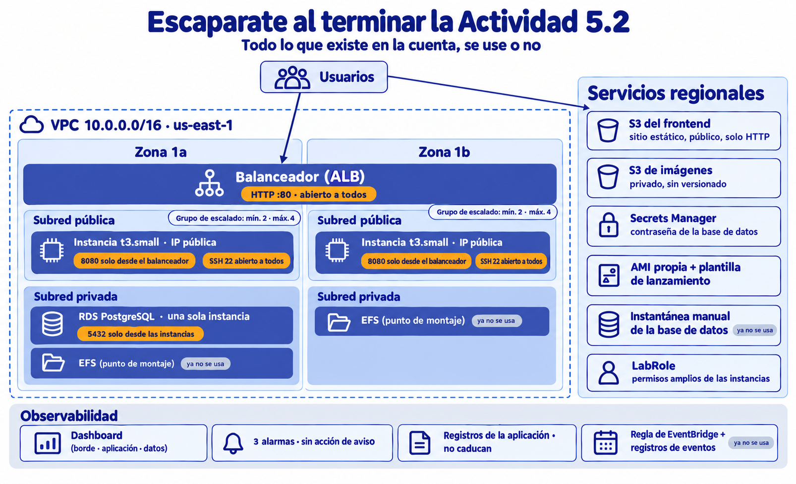

# 🧪 Actividad 7.1: Auditoría y mejora

!!! warning "Descarga la plantilla"
    📄 [Plantilla 7.1 — Auditoría y mejora](plantillas/Actividad_7_1_INU_Plantilla.docx){target="_blank" rel="noopener"}

## Contexto

A lo largo del módulo has construido Escaparate pieza a pieza: red, instancias, base de datos, balanceador, monitorización, permisos. Cada decisión tenía su sesión y su justificación, pero nadie ha mirado el conjunto entero con las mismas preguntas. Hoy lo haces: auditas la arquitectura de Escaparate con los seis pilares de Well-Architected, buscas dónde falla y decides qué merece la pena arreglar y qué no. Después haces lo mismo con la arquitectura de otra persona, que además trae un problema sin solución perfecta.

Esta actividad se hace entera sobre el papel. No abres AWS ni despliegas nada: el primer paso de cualquier auditoría, inventariar qué hay, ya viene hecho en una ficha, y tú te dedicas a lo que de verdad cuenta: encontrar los problemas, medir cuánto pesan y decidir qué se hace con ellos.

!!! info "Audita y propón como en una cuenta real, sin las restricciones del Learner Lab"
    La ficha describe lo que se pudo construir dentro del Learner Lab, que tiene límites: la región está fija, el rol de las instancias no se puede cambiar, no se pueden crear usuarios ni roles, CloudFront está bloqueado... Para esta actividad olvida esos límites: propón las mejoras como si trabajaras en una cuenta propia, donde puedes crear roles y usuarios, elegir la región que quieras y usar cualquier servicio. Por eso la ficha no incluye cosas que una cuenta real sí podría tener (datos copiados en otra región, una red de distribución de contenido, usuarios propios...): darte cuenta de lo que falta también forma parte de la auditoría. Eso sí, cada mejora sigue teniendo su coste y su esfuerzo, y eso es lo que decide qué se hace.

## Qué vas a practicar

- Leer la ficha de una arquitectura y sospechar dónde están sus problemas antes de analizarla.
- Revisar cada uno de los seis pilares y anotar los hallazgos con su impacto y su esfuerzo, sin dar por problema lo que es una decisión razonable.
- Priorizar con la matriz de impacto y esfuerzo, y dejar por escrito el riesgo que se acepta.
- Calcular la disponibilidad de un sistema, encontrar su eslabón más débil y razonar su RTO y su RPO.
- Interpretar recomendaciones automáticas y decidir cuáles se aplican, con un presupuesto limitado.
- Proponer mejoras como en una cuenta real, sin las restricciones del Learner Lab.

## Requisitos previos

Los apuntes de esta sesión — [«Well-Architected: los seis pilares»](well-architected.md). Para la Parte B, acceso a la [calculadora de precios de AWS](https://calculator.aws), que es una página pública: no hace falta iniciar sesión ni tener el Learner Lab encendido.

!!! tip "No necesitas abrir AWS"
    Ni la consola, ni CloudShell, ni nada encendido. Todo el material está en esta página y la plantilla es donde escribes tus respuestas.

!!! warning "Cómo hacer las capturas"
    Esta actividad apenas lleva capturas: casi todo lo que entregas es texto y tablas en la plantilla. La excepción es la estimación de la Parte B: en esa captura tiene que verse con claridad cada servicio con su coste, y tienes que haber puesto tu identificador como nombre de la estimación (se cambia arriba, donde pone «My Estimate»), para que no sea una captura genérica que podría ser de cualquier otro alumno.

---

## La arquitectura de Escaparate: la ficha

Es Escaparate tal como queda al terminar la Actividad 5.2, con todo encendido. Imagina que nadie ha limpiado nada por el camino: incluye **todo lo que se crea en las actividades hasta la 5.2, se esté usando o no**. Audítalo todo, también lo que parezca inofensivo. Alguna fila te avisa de que algo ya no se usa, pero no todo lo que sigue ahí sobra: decidir qué se borra y qué no es parte del trabajo. Si la tuya difiere en algún detalle, esta ficha manda: es la misma para todo el grupo.



| Componente | Configuración exacta | Zona(s) | Quién puede llegar a él |
|---|---|---|---|
| **Red** | VPC `10.0.0.0/16` con cuatro subredes: dos públicas (`10.0.0.0/24` y `10.0.2.0/24`) y dos privadas (`10.0.1.0/24` y `10.0.3.0/24`). Pasarela de internet, **sin pasarela NAT**. | `us-east-1a` y `us-east-1b` | Las públicas tienen ruta a internet; las privadas no tienen ruta de salida. |
| **Grupo de seguridad base** | Entrada: SSH (22) desde `0.0.0.0/0`, y todo el tráfico entre instancias del mismo grupo. Salida: libre. | Toda la VPC | Cualquier IP de internet, por SSH. |
| **Balanceador** | Application Load Balancer con acceso a internet, una sola escucha **HTTP** en el 80 (sin HTTPS), en las dos subredes públicas. Su grupo de seguridad: entrada 80 desde `0.0.0.0/0`, salida solo al 8080 de las instancias. | 1a y 1b | Cualquier IP de internet, por HTTP. |
| **Instancias de la aplicación** | Grupo de escalado de `t3.small`: mínimo 2, deseado 2, máximo 4, escala por CPU media al 50 %. Se lanzan **en las subredes públicas, con IP pública**, desde una AMI propia, con el grupo base y un segundo grupo (8080 solo desde el balanceador). Rol `LabRole`. Agente de CloudWatch instalado. | 1a y 1b | El 8080, solo el balanceador. El 22, cualquier IP (por el grupo base). |
| **Base de datos** | RDS PostgreSQL `db.t3.micro`, almacenamiento mínimo, **una sola instancia (sin Multi-AZ)**, en las subredes privadas, sin acceso público. Contraseña gestionada por Secrets Manager. Copias automáticas con 7 días de retención. | Una de las dos zonas | El 5432, solo las instancias del grupo base. |
| **Frontend** | Bucket S3 con alojamiento de sitio web estático y lectura pública mediante política de bucket. Solo HTTP. El backend tiene CORS limitado al origen de este bucket. | Regional | Cualquiera, por HTTP. |
| **Bucket de imágenes** | Bucket S3 donde se guardan las imágenes de producto desde la 5.2. Acceso público bloqueado, sin versionado, con el cifrado por defecto y sin reglas de ciclo de vida. | Regional | Solo el rol de las instancias. |
| **Sistema de ficheros EFS** | Creado en la 4.1 para compartir las imágenes de producto entre las instancias, con un punto de montaje en cada subred privada. Desde la 5.2 las imágenes van a S3 y **ya no se usa**, pero sigue existiendo. | 1a y 1b | Las instancias del grupo base, por el 2049. |
| **AMI y plantilla de lanzamiento** | La AMI propia con Escaparate instalado, creada en la 4.1, y la plantilla de lanzamiento que usa el grupo de escalado. | Regional | — |
| **Copia manual de la base de datos** | Una instantánea (*snapshot*) manual de la base de datos, hecha en la 3.2 para practicar. **No se ha vuelto a usar**, pero sigue existiendo. | Regional | — |
| **Observabilidad** | Dashboard con tres bloques (borde, aplicación, datos) y tres alarmas: CPU media del grupo por encima del 80 %, espacio libre de la RDS por debajo de 2 GiB y más de 5 errores 5xx del balanceador en un minuto. **Ninguna alarma tiene acción de aviso.** Grupo de registros de la aplicación sin retención configurada (no caduca nunca). Una regla de EventBridge que guarda en otro grupo de registros los eventos de las instancias, hecha en la 5.1 para una prueba: **nadie consulta esos eventos**. | Regional | Quien abra la consola. |
| **Regiones y copias** | Todo vive en una sola región (`us-east-1`). Las copias automáticas de la base de datos están en esa misma región, y el bucket de imágenes no tiene versionado ni réplica en otra. | Una región | — |
| **Entrega de contenido** | Sin red de distribución de contenido: el navegador descarga el frontend y las imágenes directamente de S3 y del balanceador, esté donde esté el visitante. | — | Cualquiera. |
| **Dominio y HTTPS** | Ninguno: se entra por el nombre DNS genérico del balanceador y por la URL del bucket. No hay certificado. | — | — |
| **Permisos** | Las instancias usan `LabRole`, el rol preasignado del Learner Lab, que según el simulador de la 5.2 permite muchas más acciones de las que Escaparate necesita. | — | Todo lo que corra en las instancias. |

---

## Parte A — Audita Escaparate (guiada)

### Paso 1 — Apunta tus sospechas antes de analizar nada

Lee la ficha entera una vez. Sin abrir los apuntes, escribe los **tres problemas que crees que más pesan** y el pilar al que pertenece cada uno. No hace falta acertar: esto sirve para que en el Paso 3 puedas comprobar qué has visto a simple vista y qué se te ha escapado.

**Comprueba**: que tienes tres sospechas escritas, cada una con su pilar, antes de seguir con el Paso 2.

### Paso 2 — Pasa los seis pilares por la ficha

Recorre los seis pilares, uno a uno, con la ficha delante. Para cada hallazgo apunta el pilar, qué pasa exactamente, **en qué fila de la ficha lo has visto**, su impacto (alto, medio o bajo) y el esfuerzo de corregirlo (alto, medio o bajo).

Necesitas al menos seis hallazgos, repartidos entre al menos cuatro pilares. Si un pilar no tiene hallazgos, apúntalo como «sin hallazgos» y escribe qué has comprobado para llegar a esa conclusión. Ojo con dos tentaciones: copiar hallazgos genéricos que valdrían para cualquier arquitectura (tienen que apoyarse en algo concreto de la ficha) e inventar un problema para rellenar un pilar.

| Pilar | Hallazgo | Fila de la ficha | Impacto | Esfuerzo |
|---|---|---|---|---|
| … | … | … | … | … |

**Comprueba**: que cada hallazgo cita una fila de la ficha y que los seis pilares aparecen, con hallazgos o con «sin hallazgos» y su comprobación.

!!! question "Reflexiona"
    Indica al menos una cosa de la ficha que a primera vista parece un problema y que has decidido **no** anotar como hallazgo, y explica por qué. Antes de descartarla, comprueba que de verdad tiene sentido para lo que esa pieza hace.

### Paso 3 — Contrasta, prioriza y acepta un riesgo

1. **Contrasta con el Paso 1**: ¿qué sospechas se han confirmado, cuáles no y qué hallazgos importantes no habías visto?
2. **Prioriza**: con la matriz de impacto y esfuerzo de los apuntes, elige tus tres hallazgos más urgentes, en orden, y para cada uno di qué cambiarías.
3. **Acepta un riesgo por escrito**: elige uno de tus hallazgos que decidirías no corregir, y deja escrito qué riesgo es, por qué no se corrige y hasta cuándo. Como aquí no hay restricciones del Learner Lab, «el laboratorio no me deja» no vale como motivo: el motivo tiene que ser que corregirlo cuesta más que el daño posible.

**Comprueba**: que tus tres prioridades salen de la matriz (no solo de la intuición) y que el riesgo aceptado tiene las tres partes: qué riesgo, por qué y hasta cuándo.

!!! question "Reflexiona"
    Toma tu hallazgo número uno y describe cómo lo corregirías. Después indica qué otro pilar empeora con esa corrección y cuánto: en coste, en complejidad de operación o en otra cosa. Si crees que no empeora ninguno, revísalo.

### Paso 4 — Calcula el eslabón más débil

Para servir una petición hacen falta tres piezas en serie: el balanceador, las instancias y la base de datos. Usa estas disponibilidades, que son inventadas y solo sirven para el cálculo:

| Pieza | Disponibilidad |
|---|---|
| Balanceador | 99,99 % |
| Cada instancia de aplicación (repartidas en dos zonas) | 99,5 % |
| Base de datos en una sola zona | 99,5 % |
| Base de datos Multi-AZ | 99,95 % |

Antes de calcular nada, contesta por escrito: para mejorar la disponibilidad total de la ficha, ¿qué compensaría más, pasar de 2 a 4 instancias o pasar la base de datos a Multi-AZ? Después calcula la disponibilidad total de la configuración de la ficha (2 instancias, base de datos en una zona), y la de cada una de las dos mejoras. Pasa cada resultado a horas de caída al año.

**Comprueba**: que tus tres cálculos usan las cifras de la tabla, que has convertido cada resultado a horas al año y que puedes decir cuál de las dos mejoras ha movido más el resultado.

!!! question "Reflexiona"
    Si la base de datos de la ficha hubiera caído hoy a las 10:00, ¿qué habría pasado exactamente? Fíjate en cómo está configurada (una sola instancia, con copias automáticas de 7 días) y estima cuánto tiempo habría estado el sistema sin responder (el RTO real) y cuántos datos recientes se habrían podido perder (el RPO real). ¿Cuál de las dos cifras te preocuparía más si Escaparate fuera la tienda de otra persona?

---

## Parte B — Audita la arquitectura de otra persona (reto)

Una clínica veterinaria de barrio, con seis personas trabajando, te pide que revises cómo ha desplegado su aplicación de citas e historiales clínicos. Esta es la ficha que ha enviado su responsable:

| Componente | Configuración | Quién puede llegar a él |
|---|---|---|
| **Servidor** | Una sola instancia `m5.2xlarge` (8 vCPU y 32 GB de RAM), encendida las 24 horas, con IP pública. En ella corren juntas la aplicación y su base de datos PostgreSQL. | Cualquier IP de internet. |
| **Almacenamiento** | Los historiales y las radiografías están en el disco de esa misma instancia (500 GB). Cada noche a las 02:00 un script copia los datos a un segundo disco conectado a la misma instancia. | Quien entre en la instancia. |
| **Administración** | Se entra por SSH, abierto a todo internet. Las seis personas comparten el mismo usuario y la misma contraseña. | Cualquier IP de internet. |
| **Acceso web** | La web solo funciona por HTTP. | Cualquier IP de internet. |
| **Vigilancia** | No hay ninguna alarma ni panel: se enteran de que algo ha fallado cuando un cliente llama para avisar. | — |

Requisitos que ha puesto el responsable: no se pueden perder más de 60 minutos de datos, la aplicación no puede estar caída más de 15 minutos durante el horario de consulta (lunes a sábado, de 9 a 20) y el presupuesto máximo es de 100 USD al mes. Las urgencias se atienden por teléfono, sin la aplicación.

Además, ha puesto encima de la mesa las dos recomendaciones automáticas que ha recibido en la consola, sin saber qué hacer con ellas:

!!! example "Recomendación de Compute Optimizer"
    La instancia lleva 14 días con una CPU media del 6 %. Recomendación: cambiar a `m5.large` (2 vCPU, 8 GB), con un ahorro estimado del 75 %.

!!! example "Recomendación de Trusted Advisor (costes)"
    La instancia no recibe tráfico entre las 21:00 y las 08:00 de cada día ni durante todo el domingo. Recomendación: apagarla en esos tramos, con un ahorro estimado del 54 %.

Un dato más que el responsable ha aportado al preguntarle: la memoria de la instancia está usada de media al 78 %, porque PostgreSQL guarda en ella los datos que consulta con más frecuencia.

Haz la auditoría completa. Necesitas una tabla de hallazgos priorizada por impacto y esfuerzo (con al menos seis hallazgos, de al menos cinco pilares distintos), y una decisión razonada, para cada una de las dos recomendaciones, de si se aplica tal cual, se aplica modificada o se descarta. Si descartas una, di por qué; si la modificas, di cómo y con qué precio. Con eso, propón un plan de mejora ordenado y estima su coste mensual con la calculadora de precios. Plantéalo como en una cuenta real, sin las restricciones del Learner Lab (puedes crear usuarios y roles, elegir región y usar cualquier servicio): el plan tiene que caber en el presupuesto, o explicar exactamente qué se queda fuera y por qué.

Los tres requisitos del responsable no caben del todo a la vez. No hay una única respuesta correcta, pero sí una obligación: elige qué requisito se cumple entero, cuál se cumple a medias y cuál se relaja, y deja por escrito el riesgo que se acepta y cómo lo explicarías al responsable de la clínica, que no sabe de arquitectura. Fíjate en que las dos recomendaciones no son independientes entre sí, y en cómo se relacionan con el script de copia nocturna.

**Comprueba**: que tus hallazgos se apoyan en datos de la ficha (no en generalidades), que has usado el dato de la memoria para juzgar la recomendación de Compute Optimizer y que el coste de tu plan sale de la calculadora, no de una estimación a ojo.

**Captura**: la calculadora con la estimación de tu plan de mejora, con tu identificador como nombre de la estimación. El resto (tabla de hallazgos, decisiones sobre las recomendaciones, requisitos priorizados y riesgo aceptado) lo escribes en la plantilla.

---

## Criterios de evaluación

**Parte A — hasta 5 puntos**

| Apartado | Puntos |
|---|---|
| Sospechas previas escritas antes de analizar y contrastadas después con los hallazgos | 1 |
| Tabla de hallazgos apoyada en la ficha (al menos 6, en al menos 4 pilares), con impacto y esfuerzo, con los pilares sin hallazgos comprobados y sin dar por problema lo que no lo es | 2 |
| Priorización con la matriz, efecto secundario de la corrección principal y riesgo aceptado por escrito | 1 |
| Cálculo de disponibilidad correcto, comparando las dos mejoras, y RTO y RPO razonados | 1 |

**Parte B — reto, hasta 5 puntos adicionales (máximo total: 10)**

| Apartado | Puntos |
|---|---|
| Tabla de hallazgos priorizada, apoyada en los datos de la ficha de la clínica | 1 |
| Decisión razonada sobre las dos recomendaciones, usando el dato de la memoria y su relación con la copia nocturna | 1 |
| Plan de mejora con el coste real de la calculadora | 2 |
| Requisitos que no caben a la vez priorizados, y riesgo aceptado por escrito y explicado al responsable | 1 |

---

## ✅ Cierre

Has recorrido dos arquitecturas con un método, en lugar de fiarte de tu intuición sobre qué mirar, y has comprobado que casi cada mejora cuesta algo en otro pilar. Es la última actividad del módulo: lo que te llevas es una forma de revisar cualquier arquitectura, propia o ajena, y de explicar por escrito qué se arregla, qué se deja y por qué.

!!! danger "Antes de salir del módulo: comprueba que la cuenta ha quedado vacía"
    La actividad de hoy no ha usado el Learner Lab, pero esta es la última sesión del módulo y ya nada de lo anterior se va a reutilizar. Si todavía tienes recursos con coste por hora de las sesiones anteriores, sobre todo del Tema 6 (instancia de comparación de la 6.2, servicio y balanceador de la 6.3), compruébalo desde CloudShell:

    ```bash
    aws ec2 describe-instances --filters Name=instance-state-name,Values=running --query "Reservations[].Instances[].InstanceId"
    aws rds describe-db-instances --query "DBInstances[].DBInstanceIdentifier"
    aws elbv2 describe-load-balancers --query "LoadBalancers[].LoadBalancerName"
    aws ecs list-clusters
    aws ec2 describe-nat-gateways --filter Name=state,Values=available --query "NatGateways[].NatGatewayId"
    aws ec2 describe-addresses --query "Addresses[].PublicIp"
    ```

    Todas las listas tienen que salir vacías. Si el clúster de ECS aparece, entra en él y comprueba que no queda ningún servicio con tareas en marcha antes de borrarlo. Los buckets de S3 y las funciones Lambda puedes dejarlos: no cuestan nada sin uso.
