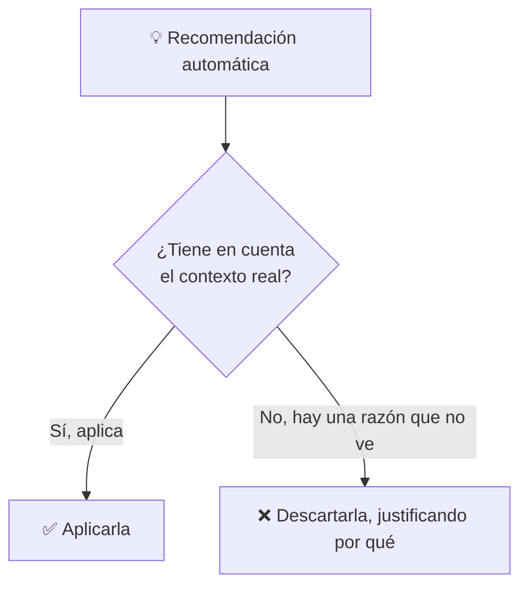
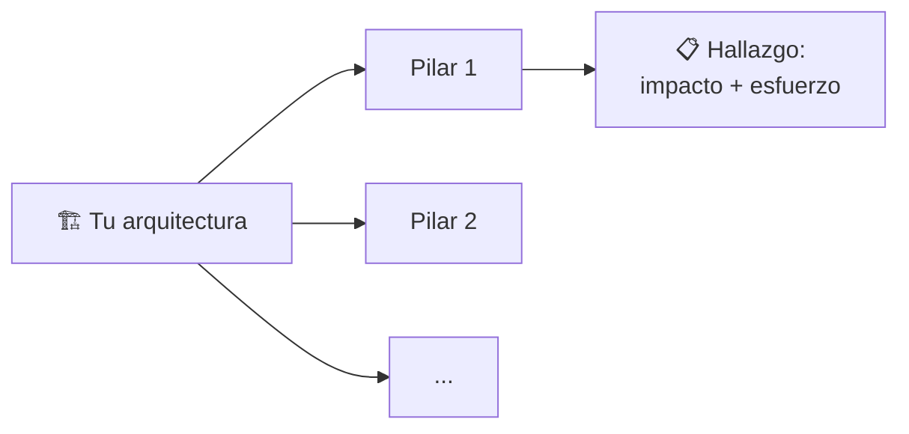

# 🧩 1. Well-Architected: los seis pilares

---

Dieciséis sesiones construyendo Escaparate, capa a capa, decisión a decisión — cada una con su propia lógica en el momento de tomarla. Hoy das un paso atrás y miras el conjunto con un marco de referencia real, el mismo que usa cualquier equipo de arquitectura en una empresa para revisar si una infraestructura está bien construida, no solo si funciona. No vas a añadir ningún servicio nuevo: vas a auditar todo lo que ya existe.

---

## 🧭 El marco Well-Architected y sus seis pilares

El marco **Well-Architected** de AWS organiza las buenas prácticas de arquitectura en seis pilares, y cada uno responde a una pregunta distinta sobre tu sistema:

| Pilar | Pregunta que responde | Ejemplo ya construido en Escaparate |
|---|---|---|
| Excelencia operativa | ¿Puedes operar y mejorar el sistema con confianza? | Los paneles y alarmas del Tema 5 |
| Seguridad | ¿Están protegidos los datos y los sistemas? | La subred privada de la base de datos, las políticas de mínimo privilegio |
| Fiabilidad | ¿Se recupera el sistema de fallos sin intervención? | El grupo de escalado automático del Tema 4 |
| Eficiencia del rendimiento | ¿Usas los recursos adecuados para la carga real? | La elección de familia de instancia del Tema 2 |
| Optimización de costes | ¿Gastas lo que necesitas, ni más ni menos? | Las clases de almacenamiento y modelos de compra del Tema 5 |
| Sostenibilidad | ¿Minimizas el impacto ambiental del sistema? | El propio escalado automático, que apaga capacidad que no hace falta |

!!! tip "No es una lista nueva de conceptos — es una forma de mirar los que ya tienes"
    Fíjate en la columna de la derecha: cada pilar ya tiene ejemplos concretos en lo que has construido este módulo. El marco no te pide aprender nada nuevo hoy — te pide mirar tu propia arquitectura con esas seis preguntas encima, una a una, sin saltarte ninguna.

---

## 🧩 RTO y RPO

Dos métricas del pilar de fiabilidad que conviene distinguir bien, porque responden a preguntas distintas sobre un mismo incidente:

| Métrica | Pregunta que responde | Ejemplo |
|---|---|---|
| **RTO** (*Recovery Time Objective*) | ¿Cuánto tiempo puede estar el sistema caído antes de que sea inaceptable? | "El catálogo no puede estar más de 10 minutos sin responder" |
| **RPO** (*Recovery Point Objective*) | ¿Cuántos datos recientes puedes permitirte perder? | "No podemos perder más de 5 minutos de pedidos" |

!!! example "El mismo incidente, dos preguntas distintas"
    Si la base de datos de Escaparate falla a las 10:00 y la conmutación por error de Multi-AZ (Tema 3) te devuelve el servicio a las 10:02, tu RTO real ha sido de dos minutos. Si la réplica a la que has conmutado tenía los datos hasta las 9:59, tu RPO real ha sido de un minuto — ninguna de las dos cifras te la da la otra, y las dos importan a la hora de decidir qué mecanismo de recuperación necesitas.

Cuanto más exigentes sean tu RTO y tu RPO, más inversión en redundancia necesitas — no son objetivos abstractos, son la vara de medir con la que decides si tu arquitectura actual es suficiente o se queda corta.

---

## 🔧 Interpretación de recomendaciones automáticas de optimización

AWS analiza el uso real de tus recursos y genera recomendaciones automáticas, a través de dos herramientas concretas: **Trusted Advisor** (revisa coste, rendimiento, seguridad y tolerancia a fallos de tu cuenta en conjunto) y **Compute Optimizer** (se centra en si el tamaño de tus instancias encaja con su uso real de CPU y memoria). Por ejemplo, pueden avisarte de que una instancia lleva semanas con un uso de CPU muy por debajo de su capacidad, y podría reducirse de tamaño sin impacto. Estas recomendaciones son un buen punto de partida, pero no una verdad absoluta a aplicar sin pensar.

!!! warning "Una recomendación puede ser técnicamente correcta y prácticamente errónea"
    Si una instancia muestra CPU baja durante el curso porque solo se usa en horario de clase, una recomendación automática de "reducir tamaño" podría no tener en cuenta que necesitas ese margen para los picos de las actividades de escalado del Tema 4. Interpretar una recomendación significa contrastarla con lo que tú sabes del sistema, no aplicarla automáticamente porque lo dice una herramienta.

---

## ⚙️ Auditar con los seis pilares, en la práctica

Auditar no es repasar cada pilar en abstracto — es recorrer tu propia arquitectura, pilar por pilar, y anotar hallazgos concretos con dos datos: qué **impacto** tiene si no se corrige, y qué **esfuerzo** cuesta corregirlo.

Un hallazgo de impacto alto y esfuerzo bajo es el que se corrige primero, casi siempre — es la relación que vas a usar para priorizar los tres hallazgos de tu auditoría en la Actividad 7.1, en vez de una lista sin orden.

---

## ✅ Ideas clave

??? tip "Abrir resumen"

    - Los seis pilares (excelencia operativa, seguridad, fiabilidad, eficiencia del rendimiento, optimización de costes, sostenibilidad) son una forma de auditar lo que ya tienes, no una lista de conceptos nuevos.
    - RTO mide cuánto tiempo caído es aceptable; RPO mide cuántos datos recientes puedes permitirte perder — son dos preguntas distintas sobre el mismo incidente.
    - Las recomendaciones automáticas de optimización son un punto de partida, no una verdad absoluta: hay que contrastarlas con el contexto real del sistema.
    - Un hallazgo de auditoría se prioriza por impacto (qué pasa si no se corrige) y esfuerzo (qué cuesta corregirlo), no por orden de aparición.

Con esto ya tienes las piezas para la Actividad 7.1 — Auditoría y mejora, la actividad final del módulo.
