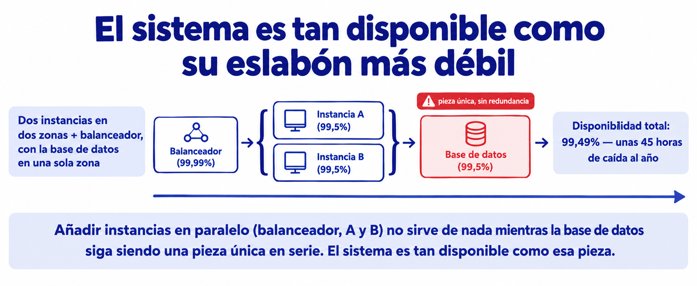
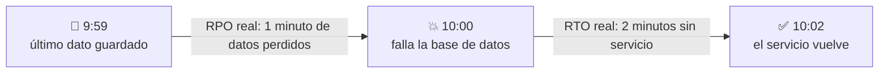
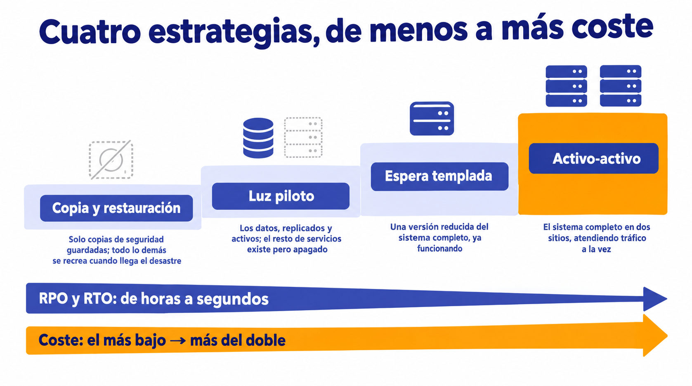
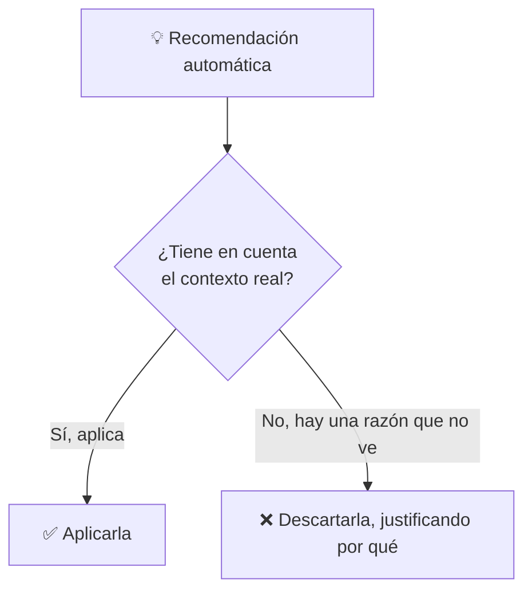
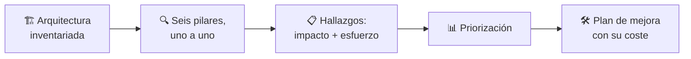

# 🧩 1. Well-Architected: los seis pilares

<!-- Diapositivas pendientes de añadir: aquí irán el embed del PDF y el aviso de descarga. -->

---

Cada sesión del módulo ha resuelto un problema concreto de Escaparate: dónde vive, quién puede llegar a él, qué pasa cuando algo falla, cuánto cuesta, cómo se reconstruye. Las decisiones se han tomado de una en una y nadie ha mirado el conjunto. Hoy lo haces: revisas la arquitectura que dejaste al cerrar el Tema 5 con el marco que usan los equipos de arquitectura para decidir si un sistema está bien construido, no solo si funciona. No añades ningún servicio ni despliegas nada —la arquitectura ya no está encendida, la borraste al cerrar la Actividad 5.3—, pero conservas todo lo necesario para revisarla sobre el papel: tu lista de componentes, tus capturas y tus cifras de coste.

---

## 🧭 Funcionar no es lo mismo que estar bien construido

Un catálogo puede cargar sus productos sin un solo error y, a la vez, tener la base de datos en una única zona de disponibilidad, un puerto de administración abierto a todo internet y alarmas que nadie recibe. Nada de eso se nota mientras todo va bien: se nota el día que algo falla. Una **auditoría de arquitectura** consiste en recorrer un sistema con una lista fija de preguntas, para no depender de que se te ocurra qué mirar.

La lista más usada es el marco **Well-Architected** de AWS: un conjunto de buenas prácticas recogido de las revisiones de miles de sistemas reales y organizado en seis **pilares** —seis ángulos desde los que se mira cualquier arquitectura—, cada uno con su pregunta:

| Pilar | Pregunta que responde | Ejemplo de algo que ya has practicado |
|---|---|---|
| Excelencia operativa | ¿Puedes ver lo que pasa y mejorar el sistema con confianza? | Dashboard y alarmas (Tema 5), infraestructura en código (Tema 6) |
| Seguridad | ¿Están protegidos los datos y los accesos? | Subredes privadas y grupos de seguridad (Temas 2 y 3), permisos de mínimo privilegio (Tema 5) |
| Fiabilidad | ¿Se recupera el sistema de un fallo sin intervención? | Grupo de escalado que repone instancias (Tema 4), Multi-AZ en la base de datos (Tema 3) |
| Eficiencia del rendimiento | ¿Usas los recursos adecuados para la carga real? | Tipo de instancia y escalado por CPU (Temas 2 y 4) |
| Optimización de costes | ¿Gastas lo que necesitas, ni más ni menos? | Estimación con la calculadora y modelos de compra (Tema 5) |
| Sostenibilidad | ¿Minimizas la energía y los recursos que consume lo que tienes encendido? | Capacidad que se apaga sola cuando no hace falta (Temas 4 y 6) |

En sostenibilidad, AWS se encarga de la eficiencia de sus centros de datos; a ti te toca no mantener encendida capacidad que nadie usa.

!!! tip "No es una lista de conceptos nuevos: es una forma de mirar cualquier arquitectura"
    Fíjate en la columna de la derecha: cada pilar corresponde a algo que ya has practicado, aunque nunca lo hayas visto reunido bajo estas seis preguntas. El marco no te pide aprender nada nuevo hoy, te pide mirar una arquitectura con las seis preguntas encima, una a una, sin saltarte ninguna.

---

## 🔍 Cómo se ve un hallazgo: un ejemplo completo

Un **hallazgo** es un problema concreto de una arquitectura, anotado con dos datos: qué **impacto** tiene si no se corrige y qué **esfuerzo** cuesta corregirlo. Para ver el método entero, una arquitectura inventada:

!!! example "El caso para ver el método completo: la aplicación de préstamos de una biblioteca de instituto"
    Corre en una sola instancia `t3.large` con IP pública, que ejecuta a la vez la aplicación y la base de datos PostgreSQL. La copia de seguridad es un fichero que alguien copia a mano a su portátil al final de cada mes. La contraseña de la base de datos está escrita en el fichero de configuración que se sube al repositorio. Y la única forma de enterarse de una caída es que un alumno avise al bibliotecario.

| Pilar | Hallazgo | Impacto | Esfuerzo |
|---|---|---|---|
| Fiabilidad | Una sola instancia con aplicación y base de datos: si falla, cae todo | Alto | Medio: pasar la base de datos a un servicio gestionado |
| Fiabilidad | Copia manual mensual: se pueden perder hasta 30 días de préstamos | Alto | Bajo: copias automáticas diarias |
| Seguridad | Contraseña de la base de datos dentro del repositorio | Alto | Bajo: moverla a un gestor de secretos y rotarla |
| Seguridad | Solo HTTP: las contraseñas de los alumnos viajan sin cifrar | Alto | Medio: certificado y HTTPS |
| Excelencia operativa | Nadie recibe un aviso cuando la aplicación deja de responder | Medio | Bajo: una alarma con notificación |
| Optimización de costes | Instancia grande encendida 24 horas para una biblioteca que abre 8 | Bajo | Bajo: tamaño menor y apagado nocturno |

No todos los pilares tienen un hallazgo. Si tras revisar uno no encuentras nada, se anota como «sin hallazgos» junto con lo que has comprobado; no se inventa un problema para rellenar la casilla.

---

## ⚖️ Los pilares tiran en direcciones distintas

Casi ninguna mejora es gratis: lo que mejora un pilar suele empeorar otro. Por eso una auditoría no termina en «corrige todo», termina en decidir qué pilar se prioriza en cada caso.

| Mejora | Qué pilar mejora | Qué pilar empeora, y por qué |
|---|---|---|
| Activar Multi-AZ en la base de datos | Fiabilidad | Costes: se paga una segunda instancia completa funcionando siempre |
| Cambiar a una instancia más grande | Rendimiento | Costes y sostenibilidad: más capacidad encendida de la que se usa |
| Reducir los permisos de un rol al mínimo | Seguridad | Excelencia operativa: cada acción nueva que falte por permisos hay que detectarla y añadirla |
| Poner una caché delante de las imágenes | Rendimiento y costes | Excelencia operativa: hay una pieza más que operar, y una imagen puede verse desactualizada mientras dura su TTL |
| Apagar las instancias fuera de horario | Costes y sostenibilidad | Fiabilidad: el sistema no responde mientras está apagado |

La misma mejora puede ser correcta en un caso y un error en otro: apagar las instancias por la noche tiene sentido en un entorno de pruebas y ninguno en una tienda que vende a cualquier hora.

---

## 📏 Disponibilidad: los nueves y el eslabón más débil

La **disponibilidad** es el porcentaje del tiempo en que un sistema responde. Se habla de «nueves» porque cada nueve más reduce mucho la caída permitida:

| Disponibilidad | Caída máxima al año |
|---|---|
| 99 % | 3,65 días |
| 99,9 % | 8,76 horas |
| 99,99 % | 52,6 minutos |
| 99,999 % | 5,26 minutos |

Cada servicio de AWS publica su propio compromiso de disponibilidad, el **SLA** (*Service Level Agreement*): si AWS no lo cumple, devuelve una parte del importe. La disponibilidad de un sistema completo se calcula combinando las de sus piezas:

- **En serie** (para responder hacen falta todas las piezas): se multiplican. Dos piezas de 99,9 % dan 99,8 %.
- **En paralelo** (basta con que funcione una): el sistema solo cae si caen todas a la vez, es decir, se multiplican las probabilidades de fallo. Dos piezas de 99,5 % en paralelo caen solo con una probabilidad de 0,005 × 0,005.

Con la biblioteca del ejemplo anterior, y con cifras inventadas solo para el cálculo:

| Configuración | Cálculo | Disponibilidad | Caída al año |
|---|---|---|---|
| Una instancia con aplicación y base de datos (99,5 %) | 0,995 | 99,5 % | unas 44 horas |
| Dos instancias en dos zonas tras un balanceador (99,99 %) | (1 − 0,005²) × 0,9999 | 99,9875 % | unos 66 minutos |
| Lo anterior, pero con la base de datos aparte, en una sola zona (99,5 %) | 0,999875 × 0,995 | 99,49 % | unas 45 horas |

La última fila es la que importa: añadir instancias no ha servido de nada mientras la base de datos siga siendo una sola pieza. El sistema es tan disponible como su eslabón más débil.

!!! warning "La redundancia no funciona tan bien como dice la fórmula"
    El cálculo en paralelo supone que las dos copias fallan de forma independiente y que el cambio de una a otra es instantáneo. En la práctica el cambio tarda (es tu RTO, en la sección siguiente) y hay fallos que afectan a las dos copias a la vez: un error de configuración, un despliegue defectuoso o la caída de una región entera. Por eso la fórmula da un techo, no una garantía.

---

## 🛟 RTO, RPO y recuperación ante desastres

Dos métricas del pilar de fiabilidad que conviene distinguir bien, porque responden a preguntas distintas sobre un mismo incidente:

| Métrica | Pregunta que responde | Ejemplo |
|---|---|---|
| **RTO** (*Recovery Time Objective*) | ¿Cuánto tiempo puede estar el sistema caído antes de que sea inaceptable? | «El catálogo no puede estar más de 10 minutos sin responder» |
| **RPO** (*Recovery Point Objective*) | ¿Cuántos datos recientes puedes permitirte perder? | «No podemos perder más de 5 minutos de pedidos» |

```mermaid
flowchart LR
    A["💾 9:59<br/>último dato guardado"] -->|"RPO real: 1 minuto de datos perdidos"| B["💥 10:00<br/>falla la base de datos"]
    B -->|"RTO real: 2 minutos sin servicio"| C["✅ 10:02<br/>el servicio vuelve"]
```

!!! example "El mismo incidente, dos preguntas distintas"
    Si la base de datos de una aplicación falla a las 10:00 y la conmutación por error de Multi-AZ (Tema 3) devuelve el servicio a las 10:02, el RTO real ha sido de dos minutos. Si la copia a la que se ha conmutado tenía los datos hasta las 9:59, el RPO real ha sido de un minuto. Ninguna de las dos cifras te la da la otra, y las dos importan a la hora de decidir qué mecanismo de recuperación necesitas.

El RTO y el RPO no los fija quien construye el sistema, los fija el negocio: es el dueño de una tienda quien sabe cuánto le cuesta una hora sin vender o un día de pedidos perdidos. Cuanto más exigentes son, más redundancia hay que pagar. AWS describe cuatro estrategias de recuperación ante desastres, de menos a más coste, y cada una fija un orden de magnitud distinto de RTO y RPO:

| Estrategia | Qué mantienes preparado en el sitio de recuperación | RPO y RTO aproximados | Coste |
|---|---|---|---|
| Copia y restauración (*backup and restore*) | Solo copias de seguridad; todo lo demás se recrea cuando llega el desastre | Horas | El más bajo |
| Luz piloto (*pilot light*) | Los datos replicados y activos; el resto de servicios existe pero apagado | Decenas de minutos | Bajo |
| Espera templada (*warm standby*) | Una versión reducida del sistema completo, ya funcionando | Minutos | Medio |
| Activo-activo (*multi-site*) | El sistema completo en dos sitios, atendiendo tráfico a la vez | Segundos o casi cero | El más alto, más del doble |

Estas estrategias valen tanto para proteger frente a la caída de una zona como frente a la de una región entera. Multi-AZ, que ya conoces, es una forma de recuperación dentro de la misma región; una segunda región sería lo único que protegería frente a su caída. Tu Learner Lab tiene la región fija, así que esa estrategia no puedes desplegarla: la razonas sobre el papel.

---

## 🔧 Interpretación de recomendaciones automáticas de optimización

AWS analiza el uso real de tus recursos y genera recomendaciones a través de dos herramientas. **Trusted Advisor** revisa tu cuenta en conjunto y agrupa sus comprobaciones en categorías muy parecidas a los pilares: coste, rendimiento, seguridad, tolerancia a fallos. **Compute Optimizer** se centra en si el tamaño de tus instancias encaja con su uso de CPU, memoria y red, y necesita días de métricas para opinar. Por ejemplo, pueden avisarte de que una instancia lleva semanas con la CPU muy por debajo de su capacidad y podría reducirse de tamaño.

```mermaid
flowchart TD
    Rec["💡 Recomendación automática"] --> P{"¿Tiene en cuenta<br/>el contexto real?"}
    P -->|Sí, aplica| Aplicar["✅ Aplicarla"]
    P -->|No, hay una razón que no ve| Descartar["❌ Descartarla, justificando por qué"]
```

Estas recomendaciones son un buen punto de partida, no una verdad absoluta. Cada una mira un solo pilar y solo ve lo que se mide: no sabe qué aplicación corre dentro ni qué garantía te han pedido.

!!! warning "Una recomendación puede ser técnicamente correcta y prácticamente errónea"
    Una aplicación Java puede mostrar la CPU al 10 % durante semanas y, aun así, necesitar la memoria de la instancia que tiene: una recomendación de «reducir tamaño» basada solo en la CPU la dejaría sin memoria. Otras veces dos recomendaciones se contradicen, porque una de costes propone quitar justo la redundancia que una de fiabilidad acaba de pedir. Interpretar una recomendación significa contrastarla con lo que sabes del sistema, no aplicarla porque lo dice una herramienta.

---

## ⚙️ Cómo se audita, en la práctica

Auditar no es repasar cada pilar en abstracto: es recorrer una arquitectura concreta con un método fijo, de cuatro pasos:

1. **Inventariar**: listar cada componente con su configuración real, en qué zona vive y quién puede llegar a él.
2. **Preguntar por pilar**: aplicar a ese inventario las seis preguntas, una a una, y anotar cada hallazgo con su impacto y su esfuerzo.
3. **Priorizar**: ordenar los hallazgos con la matriz de abajo.
4. **Proponer**: para los primeros de la lista, decir qué se cambia y cuánto cuesta cambiarlo.

```mermaid
flowchart LR
    Arq["🏗️ Arquitectura<br/>inventariada"] --> Pilares["🔍 Seis pilares,<br/>uno a uno"]
    Pilares --> Hallazgos["📋 Hallazgos:<br/>impacto + esfuerzo"]
    Hallazgos --> Prioridad["📊 Priorización"]
    Prioridad --> Plan["🛠️ Plan de mejora<br/>con su coste"]
```

La priorización cruza los dos datos del hallazgo:

| | Esfuerzo bajo | Esfuerzo alto |
|---|---|---|
| **Impacto alto** | Se corrige primero | Se planifica |
| **Impacto bajo** | Se corrige si sobra tiempo | Se descarta o se acepta |

!!! tip "Aceptar el riesgo, por escrito, también es una respuesta válida"
    Un hallazgo no siempre se corrige. A veces se **acepta el riesgo**: se deja como está, pero por escrito, con qué riesgo es, por qué no se corrige y hasta cuándo. Es la respuesta correcta cuando corregirlo cuesta más que el daño posible, o cuando no depende de ti, como los permisos del rol de un laboratorio que no puedes modificar.

AWS ofrece una herramienta gratuita, **AWS Well-Architected Tool**, que hace estas mismas preguntas en un cuestionario y devuelve una lista de riesgos. Hoy no la usas: haces la revisión a mano para ver qué hay dentro de ese cuestionario.

---

## ✅ Ideas clave

??? tip "Abrir resumen"

    - Los seis pilares (excelencia operativa, seguridad, fiabilidad, eficiencia del rendimiento, optimización de costes, sostenibilidad) son seis preguntas para revisar lo que ya tienes, no conceptos nuevos.
    - Un hallazgo se anota con su impacto y su esfuerzo. Si un pilar no tiene hallazgos, se anota qué se ha comprobado; no se inventa uno.
    - Mejorar un pilar suele costar en otro: auditar es decidir qué se prioriza en cada caso, no corregirlo todo.
    - Las piezas en serie multiplican su disponibilidad y las piezas en paralelo solo caen si caen todas: un sistema es tan disponible como su eslabón más débil.
    - El RTO mide cuánto tiempo caído es aceptable y el RPO cuántos datos recientes puedes perder; los fija el negocio, y de ellos depende la estrategia de recuperación que compensa pagar.
    - Las recomendaciones automáticas son un punto de partida: se contrastan con el contexto real del sistema, y a veces la respuesta correcta es descartarlas justificando por qué.
    - Se prioriza por impacto y esfuerzo, y un hallazgo que no se corrige se documenta como riesgo aceptado.

Con esto ya tienes las piezas para la Actividad 7.1 — Auditoría y mejora, la actividad final del módulo.
